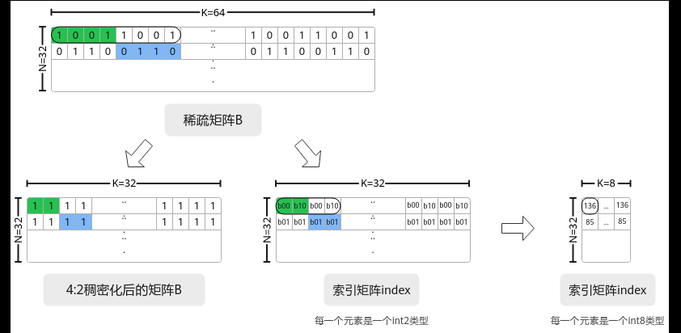

# 4:2稀疏矩阵乘

> **Section**: 3.3.3.3.8  
> **PDF Pages**: 481–482  

---

<!-- page 481 -->

```cpp
using C_TYPE = AscendC::MatmulType<AscendC::TPosition::GM, CubeFormat::ND, float>;
 using BIAS_TYPE = AscendC::MatmulType<AscendC::TPosition::GM, CubeFormat::ND, float>;
 AscendC::Matmul<A_TYPE, B_TYPE, C_TYPE, BIAS_TYPE> mm;
```

## 3.3.3.3.8 4:2 稀疏矩阵乘

功能介绍

4:2稀疏矩阵乘，又称Sparse Matmul。该场景下输入的原始左矩阵A、右矩阵B为稀疏矩阵，稀疏矩阵B中每4个元素中至少有2个为零元素；在进行Matmul计算前，用户需要自行对B矩阵进行4：2稠密化，即基于原始稀疏矩阵B在每4个元素中过滤掉2个零元素，使B矩阵稠密化为稠密矩阵；Sparse Matmul场景调用Matmul API完成A矩阵与4:2稠密化后的B矩阵的矩阵乘计算。Sparse Matmul可以跳过稀疏矩阵B中的零元素，仅对非零元素进行数据搬运存储和计算，从而减少矩阵乘计算时的内存占用和计算量，提升性能。

实现流程

步骤1数据预处理

在计算前的数据准备阶段，用户自行对原始为稀疏矩阵的B矩阵完成稠密化，稠密过程请参考稠密算法说明。稠密化过程结束后，得到4:2稠密化后的右矩阵B和索引矩阵index，稠密化后的右矩阵B和索引矩阵index将作为Sparse Matmul场景的计算输入。

图3-37对原始稀疏矩阵B 进行4:2 稠密化过程示意图



稠密化过程对于稀疏矩阵B的每4个元素，在索引矩阵index中生成2个2位索引，每个索引分别指向对应非零元素的相对位置，具体规则可参考稠密算法说明。稠密化过程生成的索引矩阵的数据类型为int2，索引矩阵在加载入Matmul前，需要拼成int8的数据类型。索引矩阵在一个int8的地址中的排布是逆序排布的，例如：索引矩阵1 2 0 1 0 21 0，在地址中的排布为1 0 2 1 0 1 2 0，其中1 0 2 1（对应索引矩阵前四位1 2 0 1）为一个int8，0 1 2 0（对应索引矩阵后四位0 2 1 0）为一个int8。

步骤2使能Sparse Matmul场景

在Host侧，获取Tiling前需要通过SetSparse接口设置使能Sparse Matmul场景。auto ascendcPlatform = platform_ascendc::PlatformAscendC(context->GetPlatformInfo());matmul_tiling::MatmulApiTiling tiling(ascendcPlatform); tiling.SetAType(matmul_tiling::TPosition::GM, matmul_tiling::CubeFormat::ND,

<!-- page 482 -->

matmul_tiling::DataType::DT_INT8); tiling.SetBType(matmul_tiling::TPosition::GM, matmul_tiling::CubeFormat::ND, matmul_tiling::DataType::DT_INT8);  tiling.SetCType(matmul_tiling::TPosition::GM, matmul_tiling::CubeFormat::ND, matmul_tiling::DataType::DT_INT32);tiling.SetBiasType(matmul_tiling::TPosition::GM, matmul_tiling::CubeFormat::ND, matmul_tiling::DataType::DT_INT32);  // 设置使能Sparse Matmul场景tiling.SetSparse(true);... // 其他实现内容optiling::TCubeTiling tilingData;   int ret = tiling.GetTiling(tilingData);

步骤3创建Matmul对象

在Kernel侧创建Matmul对象时，通过MatmulType定义A、C、Bias的参数类型信息，包括：内存逻辑位置、数据格式、数据类型。通过SparseMatmulType类型定义B矩阵的参数类型，包括：B矩阵的内存逻辑位置、索引矩阵的内存逻辑位置、数据格式、数据类型等。#include "lib/matmul_intf.h"

using A_TYPE = AscendC::MatmulType<AscendC::TPosition::GM, CubeFormat::ND, ATYPE, false>;// 使用SparseMatmulType定义B矩阵的参数类型信息using B_TYPE = AscendC::SparseMatmulType<AscendC::TPosition::GM, AscendC::TPosition::GM, CubeFormat::ND, BType, true>;using C_TYPE = AscendC::MatmulType<AscendC::TPosition::GM, CubeFormat::ND, CType>;using BIAS_TYPE =  AscendC::MatmulType<AscendC::TPosition::GM, CubeFormat::ND, BiasType>;AscendC::Matmul<A_TYPE, B_TYPE, C_TYPE, BIAS_TYPE, CFG_MDL> mm;

步骤4设置索引矩阵

通过SetSparseIndex接口传入稠密化过程中生成的索引矩阵。mm.SetTensorA(gm_a);    // 设置左矩阵Amm.SetTensorB(gm_b);    // 设置右矩阵Bmm.SetSparseIndex(gm_index); // 传入稠密化过程中生成的索引矩阵mm.SetBias(gm_bias);    // 设置Bias

步骤5完成矩阵乘操作

在Kernel侧，基于步骤4加载的索引矩阵，完成矩阵乘操作。Matmul API内部完成对A矩阵的稠密化，即根据索引矩阵从A矩阵的每4个元素中，选择2个对应位置元素参与计算。// 调用Iterate和GetTensorC或IterateAll接口完成矩阵乘计算while (mm.Iterate()) {       mm.GetTensorC(gm_c); }// mm.IterateAll(gm_c);mm.End();

**----结束**

参数说明

表3-8 SparseMatmulType 类型参数说明

参数说明

POSITION内存逻辑位置。

B矩阵仅支持设置为TPosition::GM。

INDEX_POSITION

索引矩阵内存逻辑位置。

仅支持设置为TPosition::GM。
