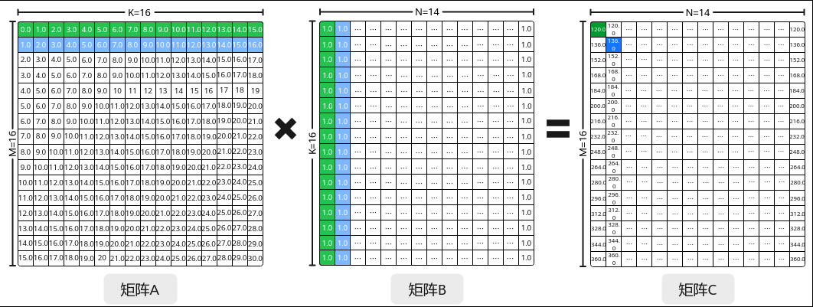
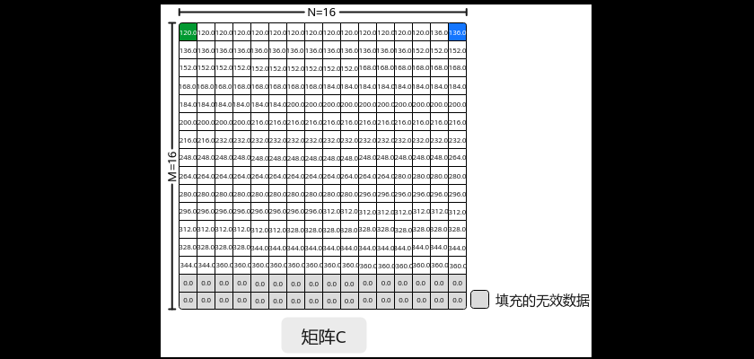
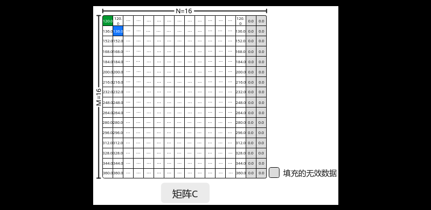

# 矩阵乘输出的N方向对齐

> **Section**: 3.3.3.3.10  
> **PDF Pages**: 484–485  

---

<!-- page 484 -->

使用场景

用户需要自定义数据搬入到TSCM及自定义管理的场景，即需要自定义实现数据搬入功能，如非连续搬入或对搬入数据进行预处理等。用户通过自定义管理TSCM可灵活配置MTE2流水，实现跨Matmul对象的全局DoubleBuffer，MTE2相关内容见搬运单元。

约束说明

设置为TSCM输入的矩阵必须在TSCM中全载，全载即全部的矩阵数据同时搬入及保持在TSCM中。

调用示例

完整的算子样例请参考自定义数据来源为GM的TSCM输入的Matmul算子样例、BatchMatmul自定义TSCM输入的算子样例。

TQue<TPosition::A1, 1> scm; // 队列逻辑位置A1，队列深度为1pipe->InitBuffer(scm, 1, tiling.M * tiling.Ka * sizeof(A_T)); // A_TYPE的TPosition为TSCM， B_TYPE的TPosition为GMMatmul<A_TYPE, B_TYPE, C_TYPE, BIAS_TYPE> mm1;REGIST_MATMUL_OBJ(&pipe, GetSysWorkSpacePtr(), mm1);mm1.Init(&tiling);// 自定义A矩阵GM到TSCM的搬运auto scmTensor = scm.AllocTensor<A_T>();DataCopy(scmTensor, gm_a, tiling.M * tiling.Ka);scm.EnQue(scmTensor);LocalTensor<A_T> scmLocal = scm.DeQue<A_T>();// A矩阵设置为TSCM输入，B矩阵为GM输入mm1.SetTensorA(scmLocal);mm1.SetTensorB(gm_b);mm1.SetBias(gm_bias);mm1.IterateAll(gm_c);scm.FreeTensor(scmLocal);

## 3.3.3.3.10 矩阵乘输出的N 方向对齐

功能介绍

矩阵乘输出的N方向对齐，即矩阵乘结果C矩阵按ND_ALIGN格式输出。在Matmul矩阵乘法中，常用的矩阵数据格式有ND、NZ，相关介绍可参考数据格式章节。ND_ALIGN是矩阵的另一种数据格式，该格式一般用于N方向非32字节对齐的矩阵乘计算中，配置结果C矩阵为ND_ALIGN格式后，将按照N方向32字节对齐的补齐规则输出C矩阵，详细内容请见ND_ALIGN。

以M=16，K=16，N=14，A、B矩阵数据类型为half的Matmul为具体示例，说明ND_ALIGN输出功能。当配置C矩阵为ND格式并输出到Global Memory时，按照原始N方向大小非32字节对齐输出如图3-38所示。当配置C矩阵为ND格式时，按照N方向32字节对齐输出如图3-39所示，C矩阵的N方向最后两列由下一行的实际数据进行填充补齐，以实现N方向对齐到32字节并输出。当配置C矩阵为ND_ALIGN格式时，Matmul API会在C矩阵的N方向上通过添加无效数据来填充最后两列，以确保N方向对齐至32字节并输出，如图3-40所示。

<!-- page 485 -->

图3-38 ND 格式C 矩阵N 方向非32 字节对齐示意图

图3-39 ND 格式C 矩阵N 方向32 字节对齐示意图

图3-40 ND_ALIGN 格式C 矩阵N 方向32 字节对齐示意图

使用场景

Matmul计算中N方向非32字节对齐，输出C矩阵的N方向要求32字节对齐的场景。
