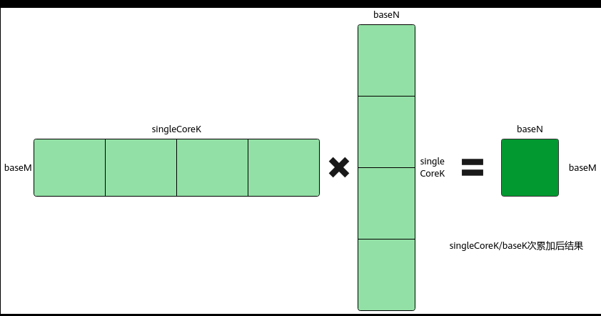
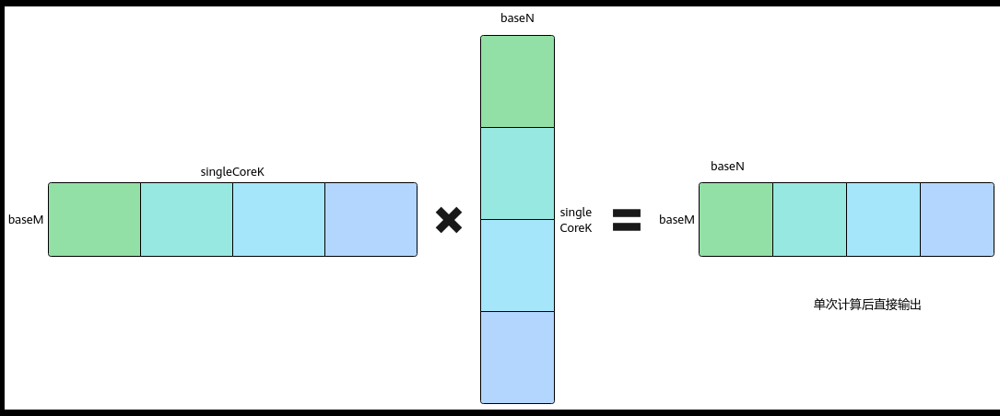

# 单次矩阵乘局部输出

> **Section**: 3.3.3.3.11  
> **PDF Pages**: 486–487  

---

<!-- page 486 -->

约束说明

若配置C矩阵为ND_ALIGN格式输出，则为C矩阵申请的Buffer空间为N向上32字节对齐后的空间大小。

调用示例

完整的算子样例请参考matmul_nd_align算子样例。

●Tiling实现

调用SetCType接口，设置C矩阵的数据格式为CubeFormat::ND_ALIGN，其它Tiling实现与基础场景相同。

auto ascendcPlatform = platform_ascendc::PlatformAscendC(context->GetPlatformInfo());matmul_tiling::MatmulApiTiling tiling(ascendcPlatform); tiling.SetAType(matmul_tiling::TPosition::GM, matmul_tiling::CubeFormat::ND, matmul_tiling::DataType::DT_FLOAT16); tiling.SetBType(matmul_tiling::TPosition::GM, matmul_tiling::CubeFormat::ND, matmul_tiling::DataType::DT_FLOAT16);  // 设置C矩阵，buffer位置为GM，数据格式为ND_ALIGNtiling.SetCType(matmul_tiling::TPosition::GM, matmul_tiling::CubeFormat::ND_ALIGN, matmul_tiling::DataType::DT_FLOAT);tiling.SetBiasType(AscendC::TPosition::GM, matmul_tiling::CubeFormat::ND, matmul_tiling::DataType::DT_FLOAT);... // 其他实现内容optiling::TCubeTiling tilingData;   int ret = tiling.GetTiling(tilingData);

●Kernel实现

相较于基础场景，ND_ALIGN输出功能要求在创建Matmul对象时，设置模板参数cType的数据格式为CubeFormat::ND_ALIGN。

```cpp
#include "lib/matmul_intf.h"
```

typedef AscendC::MatmulType<AscendC::TPosition::GM, CubeFormat::ND, half> aType; typedef AscendC::MatmulType<AscendC::TPosition::GM, CubeFormat::ND, half> bType; // 设置模板参数cType的数据格式为ND_ALIGNtypedef AscendC::MatmulType<AscendC::TPosition::GM, CubeFormat::ND_ALIGN, float> cType; typedef AscendC::MatmulType<AscendC::TPosition::GM, CubeFormat::ND, float> biasType; AscendC::Matmul<aType, bType, cType, biasType> mm;

## 3.3.3.3.11 单次矩阵乘局部输出

功能介绍

单次矩阵乘局部输出，又称Partial Output。如基础知识中所述，一次Iterate计算过程中，会按K方向进行一次或多次基本块计算，其中的一次基本块计算为baseM*baseK和baseK*baseN大小的输入数据进行计算得到baseM*baseN大小的结果；每次基本块计算的结果进行累加后，便得到baseM*singleCoreK和singleCoreK*baseN大小的输入数据计算得到的结果baseM*baseN，并将其作为一次Iterate的最终结果输出。

开启Partial Output功能后，调用Iterate接口不会进行K轴累加，只进行单次基本块计算。用户可以通过GetTensorC接口获取对应的单片数据，最后自行进行K轴上的累加。

<!-- page 487 -->

图3-41未开启Partial Output 功能计算示意图



图3-42开启Partial Output 功能计算示意图



使用场景

矩阵乘计算结果不需要累加，只需要输出baseM*baseK和baseK*baseN的计算结果baseM*baseN。例如需要先获取单次基本块计算的数据进行反量化，再累加得到最终结果。

约束说明

●该功能仅支持MDL模板。

●获取矩阵乘计算结果时，仅支持调用Iterate和GetTensorC接口的连续写模式，不支持非连续写模式以及IterateAll接口获取计算结果，连续写模式的介绍请参考GetTensorC。

●该功能不支持带有Bias矩阵的Matmul计算，即不支持输入Bias矩阵。

调用示例

完整的算子样例请参考开启Partial Output功能的算子样例。
