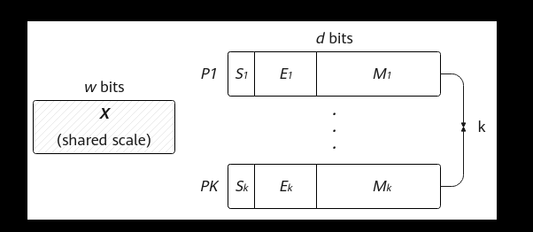
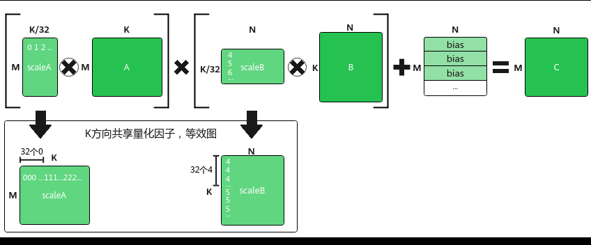
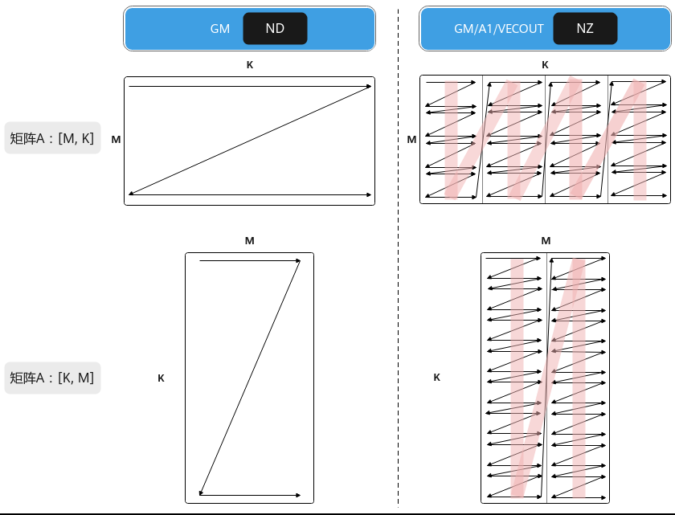
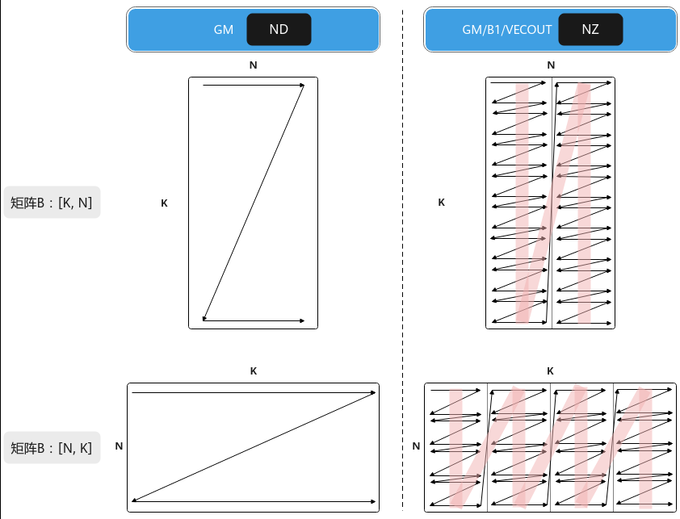
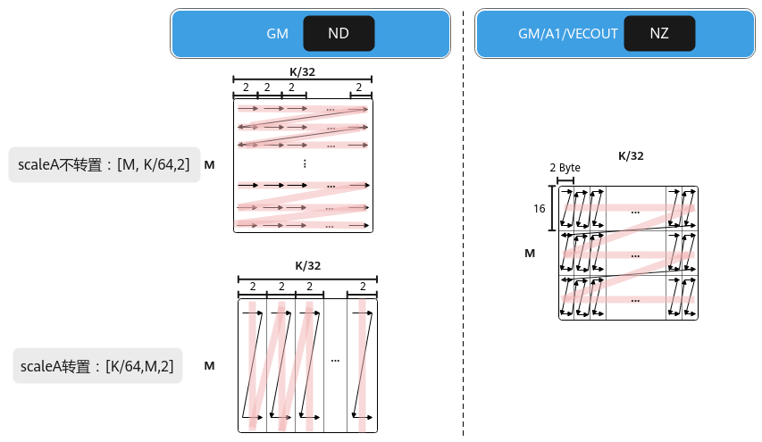
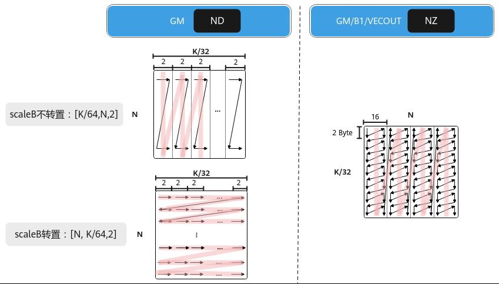

# MxMatmul场景

> **Section**: 3.3.3.3.13  
> **PDF Pages**: 489–497  

---

<!-- page 489 -->

```cpp
mm.SetBias(gm_bias);mm.IterateAll(gm_c);
```

## 3.3.3.3.13 MxMatmul 场景

背景介绍

浮点数在科学计算、图像处理、神经网络等领域应用广泛。以AI训练为例，现有的浮点数格式或数值范围不足，或精度不高，这影响了模型的收敛速度和性能。如果要同时满足数值范围和精度的要求，将会导致内存占用过大，从而增加数据存储和传输的成本。基于此种情况，业内提出了一种新的浮点数格式——微缩放（Microscaling，MX）格式。MX格式的浮点数可以支持更低比特位宽的AI训练和推理，并且占用的内存更少。符合MX标准的数据格式在使用8位或更低比特位的情况下，能够实现稳健的AI训练和推理模型精度。

MX格式是一种块数据格式，若干个数据可以组成一个块（或者一个组），数据以块为单位。MX格式的数据由三部分构成：

●共享缩放因子X，位宽为w bits；

●私有元素Pi，位宽为d bits；

●块大小k，表示多少个低比特数据形成一个块；

所有k个元素Pi有相同的位宽和数据类型，并且共享一个缩放因子X，每个包含k个元素的块可以使用（w+k*d）位进行编码。元素的数据类型和缩放因子可以独立选择。

下图为MX格式的浮点数的数据结构，S、E和M分别用于表示浮点数的符号、指数和尾数字段的值。其中，共享缩放因子X是一个用于整个数据块的缩放比例因子，它决定了数据块中所有元素的动态范围。通过引入共享缩放因子，MX格式的数据能够在保持低位宽的同时，灵活地表示不同范围的数据。块大小k指的是组成一个数据块（或组）的低比特数据的数量。私有元素Pi是指数据块中的每个低比特数据元素。这些元素经过缩放因子X的调整后，共同表示了一个高精度的浮点数或整数。

图3-43 MX 格式组成示意图



MX格式的数据类型包含多种，例如MXFP8、MXFP4、MXFP16、MXINT4等。下表列举了MxMatmul场景（全称Microscaling Matmul）支持的数据类型。

<!-- page 490 -->

表3-9 MxMatmul 支持MX 格式的数据类型

块大小(k)共享缩放因子数据类型

数据类型私有元素数据类型

私有元素位宽（d）

共享缩放因子位宽(w)

MXFP8fp8_e5m2_t

832fp8_e8m0_t

8

MXFP8fp8_e4m3fn_t

832fp8_e8m0_t

8

MXFP4fp4x2_e1m2_t

432fp8_e8m0_t

8

MXFP4fp4x2_e2m1_t

432fp8_e8m0_t

8

功能介绍

MxMatmul（全称Microscaling Matmul）为带有量化系数的矩阵乘法，即左矩阵和右矩阵均有对应的量化系数矩阵，左量化系数矩阵scaleA和右量化系数矩阵scaleB。MxMatmul场景中，左量化系数矩阵与左矩阵乘积，右量化系数矩阵与右矩阵乘积，对两个乘积的结果做矩阵乘法。

MxMatmul的计算公式为：C = (scaleA ⊗ A) * (scaleB ⊗ B) + Bias，“⊗”表示广播乘法，左/右矩阵与左/右量化系数矩阵做乘积时，K方向上每32个元素共享一个量化因子，如图3-44所示。

●A、scaleA、B、scaleB为源操作数。A为左矩阵，形状为[M, K]；scaleA为左量化系数矩阵，形状为[M, K/32]；B为右矩阵，形状为[K, N]；scaleB为右量化系数矩阵，形状为[K/32, N]。

●C为目的操作数，存放矩阵乘结果的矩阵，形状为[M, N]。

●Bias为矩阵乘偏置，形状为[1, N]。对(scaleA ⊗ A) * (scaleB ⊗ B)结果矩阵的每一行都采用该Bias进行偏置。

图3-44 MxMatmul 矩阵乘示意图



矩阵A、scaleA、B、scaleB在不同位置中的排布格式分别如下图所示。

<!-- page 491 -->

图3-45 A 矩阵在不同位置的排布格式



图3-46 B 矩阵在不同位置的排布格式



<!-- page 492 -->

图3-47 scaleA 矩阵在不同位置的排布格式



图3-48 scaleB 矩阵在不同位置的排布格式



使用场景

矩阵计算之前，需要对A、B矩阵进行量化操作的场景。当前该场景下，Matmul输入输出矩阵支持的数据类型如下表所示。

<!-- page 493 -->

表3-10 MxMatmul 支持的量化场景

**Bias矩阵C矩阵支持平台**

**A矩阵B矩阵ScaleA矩阵/ScaleB矩阵**

fp4x2_e1m2_t/fp4x2_e2m1_t

fp4x2_e1m2_t

fp8_e8m0_t

float/half/bfloat16_t

float/half/bfloat16_t

Atlas 350加速卡

fp4x2_e2m1_t/fp4x2_e1m2_t

fp4x2_e2m1_t

fp8_e8m0_t

float/half/bfloat16_t

float/half/bfloat16_t

Atlas 350加速卡

fp8_e4m3fn_t/fp8_e5m2_t

fp8_e4m3fn_t

fp8_e8m0_t

float/half/bfloat16_t

float/half/bfloat16_t

Atlas 350加速卡

fp8_e5m2_t

fp8_e4m3fn_t/fp8_e5m2_t

fp8_e8m0_t

float/half/bfloat16_t

float/half/bfloat16_t

Atlas 350加速卡

实现流程

Host侧自动获取Tiling参数的关键步骤介绍如下：

步骤1创建Tiling对象。

```cpp
auto ascendcPlatform = platform_ascendc::PlatformAscendC(context->GetPlatformInfo());matmul_tiling::MatmulApiTiling cubeTiling(ascendcPlatform);
```

传入硬件平台信息创建PlatformAscendC对象，然后创建Tiling对象，硬件平台信息可以通过GetPlatformInfo获取。

步骤2设置A、B、C、Bias的内存逻辑位置、格式、数据类型以及是否转置的信息，设置

**scaleA、scaleB的内存逻辑位置、格式以及是否转置的信息。**

调用SetScaleAType、SetScaleBType接口，设置scaleA、scaleB的内存逻辑位置、格式以及是否转置。cubeTiling.SetAType(AscendC::TPosition::GM, CubeFormat::ND, matmul_tiling::DataType::DT_FLOAT8_E5M2, false);cubeTiling.SetBType(AscendC::TPosition::GM, CubeFormat::ND, matmul_tiling::DataType::DT_FLOAT8_E5M2, true);cubeTiling.SetScaleAType(AscendC::TPosition::GM, CubeFormat::ND, false);cubeTiling.SetScaleBType(AscendC::TPosition::GM, CubeFormat::ND, true);cubeTiling.SetCType(AscendC::TPosition::GM, CubeFormat::ND, matmul_tiling::DataType::DT_FLOAT);cubeTiling.SetBiasType(AscendC::TPosition::GM, CubeFormat::ND, matmul_tiling::DataType::DT_FLOAT);

步骤3使能MxMatmul场景。

调用SetMadType接口，设置Tiling计算逻辑为MxMatmul场景。cubetiling.SetMadType(MatrixMadType::MXMODE);

步骤4设置矩阵shape信息。

cubeTiling.SetShape(M, N, K);cubeTiling.SetOrgShape(M, N, K); // 设置原始完整的形状M、N、K

步骤5设置可用空间大小信息。

设置Matmul计算时可用的L1 Buffer/L0C Buffer/Unified Buffer空间大小，-1表示AI处理器对应Buffer的大小。

<!-- page 494 -->

```cpp
cubeTiling.SetBufferSpace(-1, -1, -1);
```

步骤6按需设置其他参数，比如设置bias参与计算。

```cpp
cubeTiling.EnableBias(true);
```

步骤7获取Tiling参数。

```cpp
MatmulCustomTilingData tiling;if (cubeTiling.GetTiling(tiling.cubeTilingData) == -1){     return ge::GRAPH_FAILED;  }
```

步骤8Tiling参数的序列化保存等其他操作。

**----结束**

Kernel侧的关键步骤介绍如下：

步骤1创建Matmul对象。

// MxMatmul场景通过MatmulTypeWithScale定义A、scaleA、B、scaleB的参数类型信息typedef AscendC::MatmulTypeWithScale<AscendC::TPosition::GM, AscendC::TPosition::GM, CubeFormat::ND, fp8_e5m2_t, isTransposeA> aType; typedef AscendC::MatmulTypeWithScale<AscendC::TPosition::GM, AscendC::TPosition::GM, CubeFormat::ND, fp8_e5m2_t, isTransposeB> bType;typedef AscendC::MatmulType<AscendC::TPosition::GM, CubeFormat::ND, float> cType; typedef AscendC::MatmulType<AscendC::TPosition::GM, CubeFormat::ND, float> biasType; // 定义matmul对象时，传入MatmulWithScalePolicy表明使能MxMatmul模板策略AscendC::Matmul<aType, bType, cType, biasType, CFG_MDL, MatmulCallBackFunc<nullptr, nullptr, nullptr>, AscendC::Impl::Detail::MatmulWithScalePolicy> mm;

创建对象时需要传入A、scaleA、B、scaleB、C、Bias的参数类型信息， A、scaleA、B、scaleB类型信息通过MatmulTypeWithScale来定义，C、Bias类型信息通过MatmulType来定义，包括：内存逻辑位置、数据格式、数据类型、转置信息。同时，通过模板参数MatmulPolicy传入MatmulWithScalePolicy表明使能MxMatmul场景。

```cpp
template <TPosition POSITION, TPosition SCALE_POSITION, CubeFormat FORMAT, typename TYPE, bool ISTRANS = false, TPosition SRCPOS = TPosition::GM, CubeFormat SCALE_FORMAT = FORMAT, bool SCALE_ISTRANS = ISTRANS, TPosition SCALE_SRCPOS = SRCPOS>struct MatmulTypeWithScale: public MatmulType<POSITION, FORMAT, TYPE, ISTRANS> {    constexpr static TPosition scalePosition = SCALE_POSITION;
    constexpr static CubeFormat scaleFormat = SCALE_FORMAT;
    constexpr static bool isScaleTrans = SCALE_ISTRANS;
    constexpr static TPosition srcScalePos = SCALE_SRCPOS;};
```

步骤2初始化操作。

REGIST_MATMUL_OBJ(&pipe, GetSysWorkSpacePtr(), mm, &tiling); // 初始化

步骤3设置左矩阵A、右矩阵B、左量化系数矩阵scaleA、右量化系数矩阵scaleB、Bias。

通过SetTensorScaleA、SetTensorScaleB设置左量化系数矩阵scaleA、右量化系数矩阵scaleB。mm.SetTensorA(gm_a, isTransposeA);    // 设置左矩阵Amm.SetTensorB(gm_b, isTransposeB);    // 设置右矩阵Bmm.SetTensorScaleA(gm_scaleA, isTransposeScaleA);    // 设置左量化系数矩阵scaleAmm.SetTensorScaleB(gm_scaleB, isTransposeScaleB);    // 设置右量化系数矩阵scaleBmm.SetBias(gm_bias);    // 设置Bias

步骤4完成矩阵乘操作。

●调用Iterate完成单次迭代计算，叠加while循环完成单核全量数据的计算。Iterate方式，可以自行控制迭代次数，完成所需数据量的计算，方式比较灵活。while (mm.Iterate()) {       mm.GetTensorC(gm_c); }

<!-- page 495 -->

●调用IterateAll完成单核上所有数据的计算。IterateAll方式，无需循环迭代，使用比较简单。mm.IterateAll(gm_c);

步骤5结束矩阵乘操作。

```cpp
mm.End();
```

**----结束**

更多完整的算子样例请参考Scale的K方向为偶数的MxMatmul样例、Scale的K方向为奇数的MxMatmul样例、mx_ub_tscm_nz样例、matmul_mx_typepara样例。

参数说明

表3-11 MatmulTypeWithScale 参数说明

参数说明

POSITION左右矩阵的内存逻辑位置。

针对Atlas 350 加速卡：

A矩阵可设置为TPosition::GM，TPosition::VECOUT，TPosition::TSCM

B矩阵可设置为TPosition::GM，TPosition::VECOUT，TPosition::TSCM

注意：A、B矩阵设置为TPosition::TSCM时，对应的Format仅支持CubeFormat::NZ。

SCALE_POSITION

量化系数矩阵的内存逻辑位置。

针对Atlas 350 加速卡：

scaleA矩阵可设置为TPosition::GM，TPosition::VECOUT，TPosition::TSCM

scaleB矩阵可设置为TPosition::GM，TPosition::VECOUT，TPosition::TSCM

注意：scaleA、scaleB矩阵设置为TPosition::TSCM时，对应的SCALE_FORMAT仅支持CubeFormat::NZ。

FORMAT数据的物理排布格式，详细介绍请参考数据格式。

针对Atlas 350 加速卡：

A矩阵可设置为CubeFormat::ND，CubeFormat::NZ，CubeFormat::VECTOR

B矩阵可设置为CubeFormat::ND，CubeFormat::NZ

注意：NZ排布格式，A/B的排布格式请参考数据格式。

<!-- page 496 -->

参数说明

TYPE数据类型。

针对Atlas 350 加速卡：

A矩阵可设置为fp4x2_e1m2_t、fp4x2_e2m1_t、fp8_e4m3fn_t、fp8_e5m2_t

B矩阵可设置为fp4x2_e1m2_t、fp4x2_e2m1_t、fp8_e4m3fn_t、fp8_e5m2_t

注意：具体数据类型组合关系请参考MxMatmul支持数据类型。

ISTRANS是否开启使能A、B矩阵转置的功能。默认值为false。参数支持的取值如下：

true：开启使能矩阵转置的功能，开启后，分别通过 SetTensorA和SetTensorB中的isTransposeA、isTransposeB参数设置A、B矩阵是否转置。若设置A、B矩阵转置，Matmul会认为A矩阵形状为[K,M]，B矩阵形状为[N, K]。

false：不开启使能矩阵转置的功能，通过 SetTensorA和SetTensorB不能设置A、B矩阵的转置情况。Matmul会认为A矩阵形状为[M, K]，B矩阵形状为[K, N]。

SRCPOSA/B矩阵的POSITION参数配置为TPosition::TSCM时，要设置TSCM中矩阵数据的来源的内存逻辑位置，默认为TPosition::GM。

针对Atlas 350 加速卡：

A矩阵可设置为TPosition::GM，TPosition::VECOUT

B矩阵可设置为TPosition::GM，TPosition::VECOUT

SCALE_FORMAT

量化系数矩阵的物理排布格式，详细介绍请参考数据格式。默认值为FORMAT。

针对Atlas 350 加速卡：

scaleA矩阵可设置为CubeFormat::ND，CubeFormat::NZ，CubeFormat::VECTOR

scaleB矩阵可设置为CubeFormat::ND，CubeFormat::NZ

注意：

NZ排布格式请参考NZ。MxMatmul场景，scaleA、scaleB的数据类型为fp8_e8m0_t，分形大小H0=16，W0=2。

在Scale矩阵为ND格式的场景中，当通过SetTensorScaleA接口设置scaleA矩阵转置时，scaleA内存排布格式必须按照(K/64, M，2)排布，通过SetTensorScaleB接口设置scaleB矩阵不转置时，scaleB内存排布格式必须按照(K/64，N， 2)排布，详细介绍请参考数据格式。

<!-- page 497 -->

参数说明

SCALE_ISTRANS

是否开启使能scaleA、scaleB矩阵转置的功能。默认值为ISTRANS。参数支持的取值如下：

true：开启使能矩阵转置的功能。开启后，分别通过SetTensorScaleA和SetTensorScaleB中的isTransposeScaleA、isTransposeScaleB参数设置scaleA、scaleB矩阵是否转置。在Scale矩阵为ND格式的场景中，若设置scaleA、scaleB矩阵转置，Matmul会认为scaleA矩阵形状为[Ceil(K/64), M, 2]，scaleB矩阵形状为[N,Ceil(K/64), 2]。

false：不开启使能矩阵转置的功能。通过SetTensorScaleA和SetTensorScaleB不能设置scaleA、scaleB矩阵的转置情况。Matmul会认为scaleA矩阵形状为[M, Ceil(K/64), 2]，scaleB矩阵形状为[Ceil(K/64), N, 2]。

使用该参数的完整样例请参考scaleA转置scaleB不转置的的MxMatmul样例、scaleA不转置scaleB转置的的MxMatmul样例。

SCALE_SRCPOS

scaleA、scaleB矩阵的SCALE_POSITION参数设置为TPosition::TSCM时，需要通过本参数设置TSCM中矩阵数据来源的内存逻辑位置，默认值为SRCPOS。

针对Atlas 350 加速卡：

scaleA矩阵可设置为TPosition::GM，TPosition::VECOUT

scaleB矩阵可设置为TPosition::GM，TPosition::VECOUT

约束说明

●MxMatmul场景仅支持Norm模板和MDL模板。

●在MxMatmul场景中，如果A与B矩阵的位置同时为GM，对singleKIn没有特殊限制，在这种情况下，若scaleA和scaleB的K方向大小（即Ceil(singleKIn, 32)）为奇数，用户需自行在scaleA和scaleB的K方向补0至偶数。例如，当singleKIn为30时，Ceil(singleKIn, 32)为1，用户需要自行在scaleA和scaleB的K方向补0，使K方向为偶数。对于其它A、B矩阵逻辑位置的组合情况，即A与B矩阵的位置不同时为GM，singleKIn以32个元素向上对齐后的数值必须是32的偶数倍。

●在MxMatmul场景中，当输入数据类型为fp4x2_e2m1_t/fp4x2_e1m2_t时，内轴必须为偶数。

●在MxMatmul场景中，通过将A矩阵和scaleA矩阵的数据格式设置为VECTOR，来开启GEMV模式。在此模式下，A和scaleA矩阵仅支持内存逻辑位置为GM，并且均不支持转置。

●A矩阵、B矩阵为UB输入时，矩阵的内轴需要向上32字节对齐，例如，A矩阵的形状为(M, K)时，将K对齐到32字节；A矩阵的形状为(K, M)时，将M对齐到32字节。

●scaleA矩阵、scaleB矩阵为UB输入时，矩阵的内轴需要向上32字节对齐，例如，scaleA矩阵的形状为(M, K/32)时，将K/32对齐到32字节；scaleA矩阵的形状为(K/32, M)时，将M对齐到32字节。

●当scaleA和scaleB矩阵以ND格式输入时，高阶API在内部实现格式转换时，需要占用UB临时空间。开发者需使用SetLocalWorkspace接口配置临时空间，临时空间大小（单位字节）的计算公式如下。int32_t scaleATmpBuf = 0;int32_t scaleBTmpBuf = 0;
