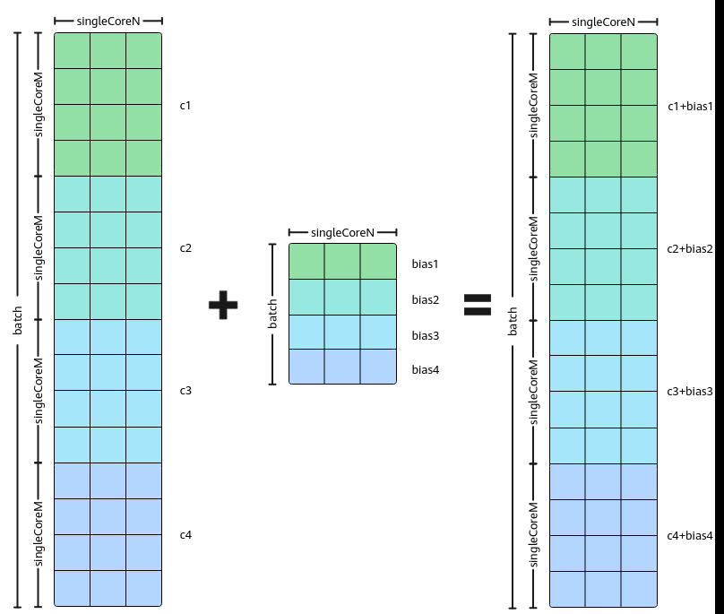
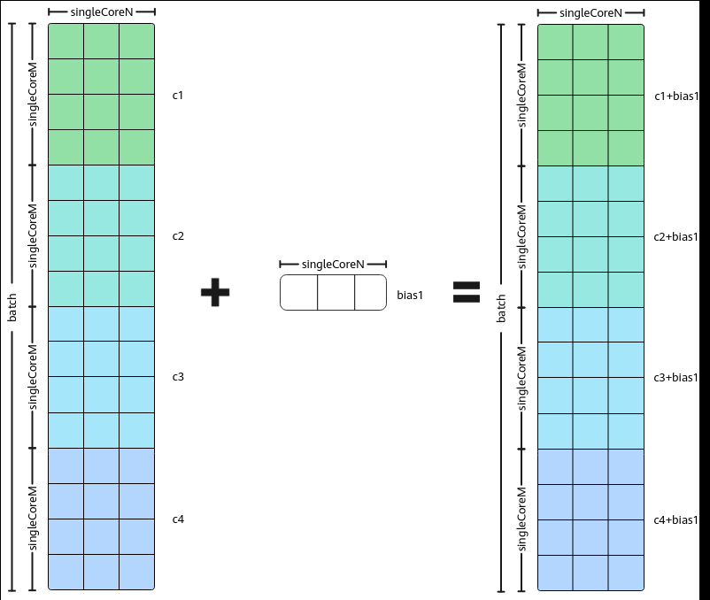

# Batch Matmul复用Bias矩阵

> **Section**: 3.3.3.3.15  
> **PDF Pages**: 501–502  

---

<!-- page 501 -->

–初始化操作。REGIST_MATMUL_OBJ(&pipe, GetSysWorkSpacePtr(), mm, &tiling); // 初始化matmul对象–设置左矩阵A、右矩阵B、Bias。mm.SetTensorA(gm_a);    // 设置左矩阵Amm.SetTensorB(gm_b);    // 设置右矩阵Bmm.SetBias(gm_bias);    // 设置Bias–完成矩阵乘操作。左矩阵每次计算batchA个MK数据，右矩阵每次计算batchB个KN数据。mm.IterateBatch(gm_c, batchA, batchB, false);–结束矩阵乘操作。mm.End();

## 3.3.3.3.15 Batch Matmul 复用Bias 矩阵

功能介绍

在Batch Matmul场景中，Matmul API可以一次性计算出多个大小为singleCoreM *singleCoreN的C矩阵。当Batch Matmul场景有Bias输入时，默认的Bias输入矩阵包含Batch轴，即Bias的大小为Batch * N。通过开启Bias复用功能，当每个Batch计算使用的Bias数据相同时，只需输入一个不带Batch轴的Bias矩阵。Batch Matmul的Bias矩阵复用功能默认不启用，用户需要设置MatmulConfig中的isBiasBatch参数为false来开启此功能。

图3-50带有Batch 轴的Bias 计算示意图

如上图所示，Batch Matmul中未复用Bias矩阵的场景，每计算出一个singleCoreM *singleCoreN大小的C矩阵，都会与1 * singleCoreN大小的Bias矩阵相加。若不同Batch

<!-- page 502 -->

的计算使用的Bias数据相同，则多Batch计算可以复用同一个Bias矩阵，如下图所示，此场景中调用SetBias接口时，只需设置一个1 * singleCoreN大小的Bias矩阵。

图3-51复用Bias 计算示意图

使用场景

Batch Matmul中每个Batch的Matmul计算可以使用相同的Bias矩阵。

约束说明

A、B、C矩阵的Layout类型都为NORMAL时，不支持batchMode参数设为SINGLE_LARGE_THAN_L1，即Bias复用场景下，单Batch的A、B矩阵数据总和不得超过L1 Buffer的大小。

调用示例

完整的算子样例请参考BatchMatmul复用Bias算子样例。

// 自定义MatmulConfig参数，将其中的isBiasBatch参数设置为false，使能BatchMatmul的Bias复用功能。constexpr MatmulConfigMode configMode = MatmulConfigMode::CONFIG_NORM;constexpr MatmulBatchParams batchParams = {  false, BatchMode::BATCH_LESS_THAN_L1, false /* isBiasBatch */};constexpr MatmulConfig CFG_MM = GetMMConfig<configMode>(batchParams);AscendC::Matmul<A_TYPE, B_TYPE, C_TYPE, BIAS_TYPE, CFG_MM> mm;

REGIST_MATMUL_OBJ(&pipe, GetSysWorkSpacePtr(), mm, &tiling); // 初始化matmul对象
