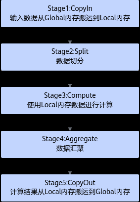
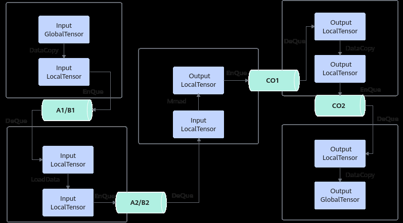
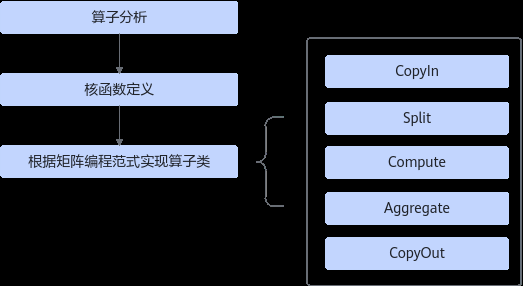
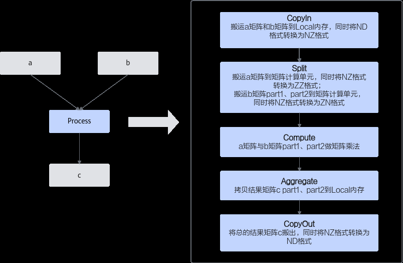
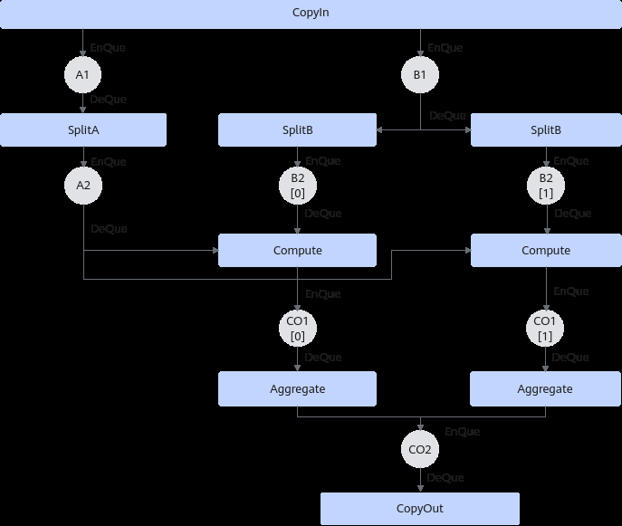
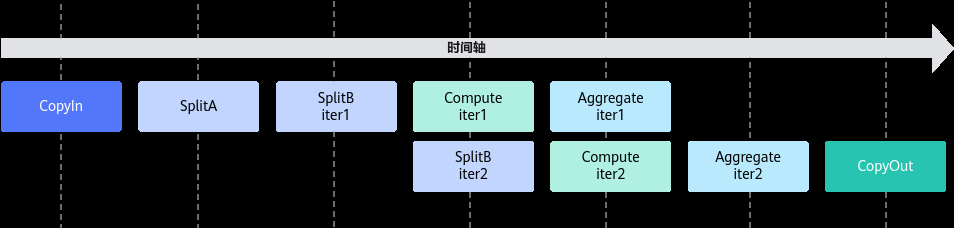
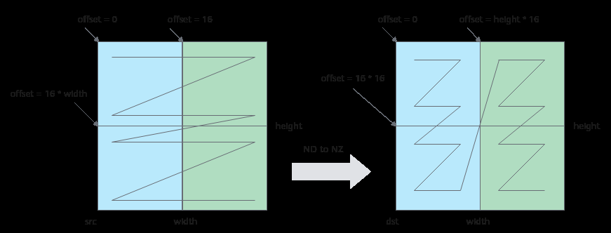
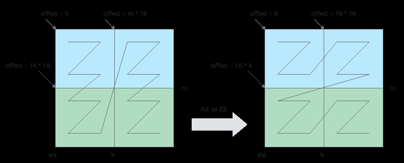
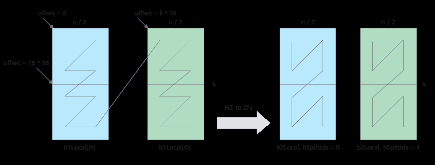

# 耦合模式

> **Section**: 3.3.4.1  
> **PDF Pages**: 503–516  

---

<!-- page 503 -->

mm.SetTensorA(gm_a);    // 设置左矩阵Amm.SetTensorB(gm_b);    // 设置右矩阵Bmm.SetBias(gm_bias);    // 设置Bias，矩阵大小为1 * singleCoreNmm.IterateBatch(gm_c, batchA, batchB, false);mm.End();

## 3.3.4 矩阵编程（基础API）

## 3.3.4.1 耦合模式

说明

本节内容为针对耦合模式，使用基础API进行矩阵乘法的编程指导。

如下章节内容暂不支持Atlas 350 加速卡。

编程范式

Cube编程范式把算子的实现流程分为5个基本任务：CopyIn，Split，Compute，Aggregate，CopyOut。CopyIn负责搬入操作，Split负责数据切分操作，Compute负责矩阵指令计算操作，Aggregate负责数据汇聚操作，CopyOut负责搬出操作。

图3-52矩阵编程基本任务设计



具体任务之间的交互流程和流程图如下。

步骤1Stage1：CopyIn任务。

1.使用6.2.3.1.1 DataCopy接口将GlobalTensor数据拷贝到LocalTensor。

<!-- page 504 -->

2.使用 EnQue将LocalTensor放入A1/B1的Queue中。

步骤2Stage2：Split任务。

1.使用 DeQue从A1/B1中取出LocalTensor。

2.使用LoadData接口将LocalTensor从A1/B1中搬运到A2/B2。

3.使用 EnQue将计算结果LocalTensor放入到A2/B2的Queue中。

步骤3Stage3：Compute任务。

1.使用 DeQue从A2/B2中取出LocalTensor。

2.使用 Mmad接口完成矩阵计算。

3.使用 EnQue将计算结果LocalTensor放入到CO1的Queue中。

步骤4Stage4：Aggregate任务。

1.使用 DeQue从CO1中取出LocalTensor。

2.使用Ascend C接口拷贝结果矩阵到CO2。

3.使用 EnQue将计算结果LocalTensor放入到CO2的Queue中。

步骤5Stage5：CopyOut任务。

1.使用 DeQue接口从CO2的Queue中取出LocalTensor。

2.使用6.2.3.1.1 DataCopy接口将LocalTensor拷贝到GlobalTensor上。

**----结束**

图3-53矩阵编程Queue 队列



开发流程

基于Ascend C方式实现矩阵算子的流程如下图所示。

<!-- page 505 -->

图3-54矩阵算子实现流程



●算子分析：分析算子的数学表达式、输入、输出以及计算逻辑的实现，明确需要调用的Ascend C接口。

●核函数定义：定义Ascend C算子入口函数。

●根据矩阵编程范式实现算子类：完成核函数的内部实现，调用私有成员函数CopyIn、SplitA、SplitB、Compute、Aggregate、CopyOut完成矩阵算子的五级流水操作。

下文将以Matmul算子为例对上述步骤进行详细介绍，Matmul算子的代码框架如下，完整代码请参见Mmad样例。

```cpp
#include "kernel_operator.h"
```

// 根据编程范式实现算子类class KernelMatmul {public:    __aicore__ inline void Init(GM_ADDR a, GM_ADDR b, GM_ADDR c)    {        // ...    }    __aicore__ inline void Process()    {        CopyIn();        SplitA();        AscendC::LocalTensor<half> b1Local = inQueueB1.DeQue<half>();        AscendC::LocalTensor<half> a2Local = inQueueA2.DeQue<half>();        AscendC::LocalTensor<float> c2Local = outQueueCO2.AllocTensor<float>();        // split matrix b into 2 parts, [32, 16] and [32, 16]        for (int i = 0; i < 2; ++i) {            SplitB(b1Local, i);            Compute(a2Local);            Aggregate(c2Local, i);        }        inQueueB1.FreeTensor(b1Local);        inQueueA2.FreeTensor(a2Local);        outQueueCO2.EnQue<float>(c2Local);        CopyOut();    }private:    __aicore__ inline void CopyIn()    {        // ...

<!-- page 506 -->

```cpp
}    __aicore__ inline void SplitA()    {        // ...    }    __aicore__ inline void SplitB(const LocalTensor<half>& b1Local, const int bSplitIdx)    {        // ...    }    __aicore__ inline void Compute(const LocalTensor<half>& a2Local)    {        // ...    }    __aicore__ inline void Aggregate(const LocalTensor<float>& c2Local, const int bSplitIdx)    {        // ...    }    __aicore__ inline void CopyOut()    {        // ...    }private:    // ...
};
```

//核函数定义extern "C" __global__ __aicore__ void matmul_custom(GM_ADDR a, GM_ADDR b, GM_ADDR c){    KernelMatmul op;    op.Init(a, b, c);    op.Process();}

算子分析

在开发算子代码之前需要分析算子的数学表达式、输入、输出以及计算逻辑的实现，明确需要调用的Ascend C接口。

步骤1明确算子的数学表达式及计算逻辑。

Matmul算子完成矩阵乘操作，其数学表达式如下，形状为[m, k]的矩阵a和形状为[k,n]的矩阵b相乘，得到形状为[m, n]的矩阵c。为了方便，令m=k=n=32。c = a * b

注意需要处理的数据过大时，需要对数据进行切分并分块搬运到A2、B2，分别计算后再进行汇聚。下文的计算逻辑为了展示Split和Aggregate阶段的样例，请您根据实际需要处理的数据大小决定是否需要切分和汇聚。

计算逻辑如下：

1.分别搬运输入数据矩阵a、b至Local Memory A1、B1。

2.将a矩阵从A1搬运至A2。为实现部分并行，将b矩阵切分为part1和part2，形状均为[k, n / 2]，切分后再分块搬运至B2。

3.a矩阵和b矩阵part1、part2分别做矩阵乘运算，获得矩阵c的part1和part2，形状均为[m, n / 2]。计算结果在CO1存储。

4.将矩阵c的part1和part2分别拷贝到CO2进行合并。

5.将合并后的输出数据从CO2搬出。

步骤2明确输入和输出。

●Matmul算子有两个输入：a与b，输出为c。

<!-- page 507 -->

●本样例中算子输入支持的数据类型为half（float16），算子输出的数据类型为float32。

●矩阵a、b、c的形状均为[32, 32]。

●算子输入输出支持的数据格式为：ND。

步骤3确定核函数名称和参数。

●您可以自定义核函数名称，本样例中核函数命名为matmul_custom。

●根据对算子输入输出的分析，确定核函数有3个参数a，b，c；a，b为输入在Global Memory上的内存地址，c为输出在Global Memory上的内存地址。

步骤4约束分析。

由于硬件架构对矩阵乘计算的输入输出有格式约束，需要在算子实现中增加格式转换的流程。

●搬运矩阵a、b至A1、B1时，将ND格式的矩阵a、b转换为NZ格式。

●从A1搬运矩阵a至A2时，将NZ格式的a矩阵转换为ZZ格式；从B1搬运矩阵b到B2时将NZ格式的b矩阵转换为ZN格式。

●将计算结果从CO2搬出时，将NZ格式的c矩阵转换为ND格式。

●数据排布格式的相关介绍详见数据排布格式。

步骤5确定算子实现所需接口。

●实现外部存储和内部存储间的数据搬运，查看Ascend C API参考中的数据搬移接口，具体参考6.2.3.1.1 DataCopy。

●实现矩阵数据格式转换，查看Ascend C API参考中的数据转换接口，具体参考LoadData。

●矩阵计算过程涉及矩阵乘法，查看Ascend C API参考中的矩阵计算接口，具体参考 Mmad。

●计算中使用到的Tensor数据结构，使用Queue队列进行管理，会使用到 EnQue、DeQue等接口。

**----结束**

通过以上分析，得到Ascend C Matmul算子的计算流程图和设计规格如下：

<!-- page 508 -->

图3-55 Matmul 算子的计算流程图



表3-12 Ascend C Matmul 算子设计规格

Matmul

算子类型（OpType）

算子输入nameshapedata typeformat

a(m, k) =(32, 32)

halfND

b(k, n) =(32, 32)

halfND

算子输出c(m, n) =(32, 32)

float32ND

核函数名称matmul_custom

DataCopy：数据搬移接口

使用的主要接口

LoadData：矩阵数据格式转换接口

Mmad：矩阵乘计算接口

EnQue、DeQue等接口：Queue队列管理接口

matmul_custom.cpp

算子实现文件名称

核函数定义

根据2.2.3.2 核函数中介绍的规则进行核函数的定义。

<!-- page 509 -->

步骤1函数原型定义。

本样例中，函数名为matmul_custom（核函数名称可自定义）；根据算子分析中对算子输入输出的分析，确定有3个参数a，b，c，其中a，b都为输入内存，c为输出内存。根据2.2.3.2 核函数中核函数的规则介绍，函数原型定义如下所示：使用__global__函数类型限定符来标识它是一个核函数，可以被<<<>>>调用；使用__aicore__函数类型限定符来标识该核函数在设备端aicore上执行；为方便起见，统一使用GM_ADDR宏修饰入参，GM_ADDR宏定义请参考2.2.3.2 核函数。

```cpp
extern "C" __global__ __aicore__ void matmul_custom(GM_ADDR a, GM_ADDR b, GM_ADDR c){}
```

步骤2调用算子类的Init和Process函数。

算子类的Init函数，完成内存初始化相关工作，Process函数完成算子实现的核心逻辑，具体介绍参见算子类实现。extern "C" __global__ __aicore__ void matmul_custom(GM_ADDR a, GM_ADDR b, GM_ADDR c){    KernelMatmul op;    op.Init(a, b, c);    op.Process();}

步骤3对核函数进行封装，得到matmul_custom_do函数，便于主程序调用。#ifndefASCENDC_CPU_DEBUG表示该封装函数仅在编译运行NPU侧的算子时会用到，编译运行CPU侧的算子时，可以直接调用matmul_custom函数。根据核函数定义和调用章节，调用核函数时，除了需要传入参数a，b，c，还需要传入numBlocks（核函数执行的核数），l2ctrl（保留参数，设置为nullptr），stream（应用程序中维护异步操作执行顺序的stream）来规定核函数的执行配置。

```cpp
#ifndef ASCENDC_CPU_DEBUG// call of kernel functionvoid matmul_custom_do(uint32_t numBlocks, void* l2ctrl, void* stream, uint8_t* a, uint8_t* b, uint8_t* c){    matmul_custom<<<numBlocks, l2ctrl, stream>>>(a, b, c);}#endif
```

**----结束**

算子类实现

根据上一章节介绍，核函数中会调用算子类的Init和Process函数，本章具体讲解基于编程范式实现算子类。矩阵编程范式请参考编程范式。

算子类中主要包含对外开放的初始化Init函数和核心处理函数Process以及一些实现中会用到的私有成员。KernelMatmul算子类的定义如下：class KernelMatmul {public:    __aicore__ inline KernelMatmul(){}    // 初始化函数，完成内存初始化相关操作    __aicore__ inline void Init(GM_ADDR a, GM_ADDR b, GM_ADDR c){}    // 核心处理函数，实现算子逻辑    // 调用私有成员函数CopyIn、SplitA、SplitB、Compute、Aggregate、CopyOut完成矩阵算子的五级流水操作    __aicore__ inline void Process(){}

private:    __aicore__ inline void CopyND2NZ(const LocalTensor<half>& dst, const GlobalTensor<half>& src, const uint16_t height, const uint16_t width){}    // 搬进函数，完成编程范式中的CopyIn阶段的处理，由Process函数调用    __aicore__ inline void CopyIn(){}    // 搬进函数，完成编程范式中的Split阶段的处理，由Process函数调用    __aicore__ inline void SplitA(){}

<!-- page 510 -->

// 搬进函数，完成编程范式中的Split阶段的处理，由Process函数循环调用两次，分别搬运b矩阵的两个part    __aicore__ inline void SplitB(const LocalTensor<half>& b1Local, const int bSplitIdx){}    // 计算函数，完成编程范式中的Compute阶段的处理，由Process函数循环调用两次，分别计算出矩阵c的两个part    __aicore__ inline void Compute(const LocalTensor<half>& a2Local){}    // 搬出函数，完成编程范式中的Aggregate阶段的处理，由Process函数循环调用两次，分别搬出矩阵c的两个part    __aicore__ inline void Aggregate(const LocalTensor<float>& c2Local, const int bSplitIdx){}    // 搬出函数，完成编程范式中的CopyOut阶段的处理，由Process函数调用    __aicore__ inline void CopyOut(){}

private:    AscendC::TPipe pipe;  // Pipe内存管理对象，管理Queue队列的内存    AscendC::TQue<AscendC::TPosition::A1, 1> inQueueA1;  // 输入数据的队列，TPosition为A1    AscendC::TQue<AscendC::TPosition::A2, 1> inQueueA2;  // 输入数据的队列，TPosition为A2    AscendC::TQue<AscendC::TPosition::B1, 1> inQueueB1;  // 输入数据的队列，TPosition为B1    AscendC::TQue<AscendC::TPosition::B2, 2> inQueueB2;  // 输入数据的队列，TPosition为B2    AscendC::TQue<AscendC::TPosition::CO1, 2> outQueueCO1;  // 输出数据的队列，TPosition为CO1    AscendC::TQue<AscendC::TPosition::CO2, 1> outQueueCO2;  // 输出数据的队列，TPosition为CO2    // 管理输入输出Global Memory内存地址的对象，其中aGM，bGM为输入，cGM为输出    AscendC::GlobalTensor<half> aGM, bGM;    AscendC::GlobalTensor<float> cGM;

```cpp
uint16_t m = 32;
    uint16_t n = 32;
    uint16_t k = 32;
    uint16_t aSize, bSize, cSize, mBlocks, nBlocks, kBlocks;};
```

**KernelMatmul构造函数实现**

构造函数中对私有成员变量进行初始化，具体代码如下：

```cpp
__aicore__ inline KernelMatmul(){    aSize = m * k;
    bSize = k * n;
    cSize = m * n;
    mBlocks = m / 16;
    nBlocks = n / 16;
    kBlocks = k / 16;}
```

矩阵a的形状为[m, k]，矩阵b的形状为[k, n]，矩阵c的形状为[m,n]，此样例中m、n、k均设置为32。

aSize、bSize、cSize分别为矩阵a、b、c的数值个数。

mBlocks、 nBlocks、 kBlocks为m、n、k所占分形数量，half类型一个分形Shape为16 * 16，blocks计算公式为：

●mBlocks = m / 16

●nBlocks = n / 16

●kBlocks = k / 16

分形具体介绍可参考2.9.2.2 数据排布格式。

**Init函数实现**

Init函数主要完成以下内容：

●设置输入输出Global Tensor的Global Memory内存地址。

以设置输入a在Global Memory上的内存偏移地址为例：aGM.SetGlobalBuffer((__gm__ half*)a);

<!-- page 511 -->

注意，因为本样例中Init函数的入参统一设置为uint8_t*，这里需要强转成具体的数据类型(__gm__ half*)，再进行偏移。

●通过Pipe内存管理对象为输入输出Queue分配内存。

比如，为输入数据队列inQueueB2分配内存，可以通过如下代码段实现：

```cpp
pipe.InitBuffer(inQueueB2, 2, bSize * sizeof(half) / 2);
```

此样例中将b矩阵切分为两个part，为inQueueB2分配内存时需要申请两块内存空间，每一块的大小为b矩阵大小的一半，outQueueCO1的内存初始化同理。

具体的初始化函数代码如下：

```cpp
__aicore__ inline void Init(GM_ADDR a, GM_ADDR b, GM_ADDR c){    aGM.SetGlobalBuffer((__gm__ half*)a);
    bGM.SetGlobalBuffer((__gm__ half*)b);
    cGM.SetGlobalBuffer((__gm__ float*)c);
    pipe.InitBuffer(inQueueA1, 1, aSize * sizeof(half));
    pipe.InitBuffer(inQueueA2, 1, aSize * sizeof(half));
    pipe.InitBuffer(inQueueB1, 1, bSize * sizeof(half));
    pipe.InitBuffer(inQueueB2, 2, bSize * sizeof(half) / 2);
    pipe.InitBuffer(outQueueCO1, 2, cSize * sizeof(float) / 2);
    pipe.InitBuffer(outQueueCO2, 1, cSize * sizeof(float));}
```

**Process函数实现**

基于矩阵编程范式，将核函数的实现分为5个基本阶段：CopyIn，Split，Compute，Aggregate，CopyOut。Split，Compute，Aggregate阶段需要区分a、b矩阵。Process函数中通过如下方式调用这几个函数。

```cpp
__aicore__ inline void Process(){    CopyIn();
    SplitA();
    AscendC::LocalTensor<half> b1Local = inQueueB1.DeQue<half>();
    AscendC::LocalTensor<half> a2Local = inQueueA2.DeQue<half>();
    AscendC::LocalTensor<float> c2Local = outQueueCO2.AllocTensor<float>();    // split matrix b into 2 parts, [32, 16] and [32, 16]    for (int i = 0;
 i < 2; ++i) {        SplitB(b1Local, i);
        Compute(a2Local);
        Aggregate(c2Local, i);    }    inQueueB1.FreeTensor(b1Local);
    inQueueA2.FreeTensor(a2Local);
    outQueueCO2.EnQue<float>(c2Local);
    CopyOut();}
```

两次循环内，SplitB需要从inQueueB1中分别搬运两个part的b矩阵，Compute需要分别计算a矩阵和两个part b矩阵的乘法，Aggregate要分别搬运两个part的c矩阵，具体五个阶段数据流通示意图如下：

<!-- page 512 -->

图3-56数据流通示意图



切分b矩阵，可以实现一部分的并行，本样例的流水并行示意图如下：

图3-57并行示意图



步骤1Stage1：CopyIn函数实现。

1.使用 AllocTensor从A1，B1的Queue中申请a1Local和b1Local。

2.使用6.2.3.1.1 DataCopy接口将矩阵a、b搬运到Local Memory，同时将其数据格式从ND转换为NZ。

一次DataCopy指令搬运height*16个数，循环执行width/16次。DataCopy的参数设置如下：

–blockCount设置为height，共搬运height次。

–blockLen设置为1，一次搬运16个类型为half的数。

–srcStride设置为width/16 - 1，源矩阵每搬运一个block需要跳跃一行。

<!-- page 513 -->

–dstStride设置为0，目的矩阵每个block在内存中连续存储。

–每次循环迭代，源矩阵首地址移动16个数，目的矩阵首地址移动16*height个数。

格式转换示意图如下，第一次循环搬运蓝色部分，第二次循环搬运绿色部分；图中width为32，占两个分形，height为32，占两个分形，一共搬运4个16*16分形。

图3-58 ND to NZ 转换示意图



注意：上述ND到NZ的格式转换仅作为举例说明，开发者可根据实际情况选择合适的转换方式。

3.使用 EnQue将a1Local、b1Local分别放入A1、B1的Queue中。

具体代码如下：

```cpp
__aicore__ inline void CopyND2NZ(const LocalTensor<half>& dst, const GlobalTensor<half>& src, const uint16_t height, const uint16_t width){    for (int i = 0;
 i < width / 16; ++i) {        int srcOffset = i * 16;
        int dstOffset = i * 16 * height;
        AscendC::DataCopy(dst[dstOffset], src[srcOffset], { height, 1, uint16_t(width / 16 - 1), 0 });    }}__aicore__ inline void CopyIn(){    AscendC::LocalTensor<half> a1Local = inQueueA1.AllocTensor<half>();
    AscendC::LocalTensor<half> b1Local = inQueueB1.AllocTensor<half>();
    CopyND2NZ(a1Local, aGM, m, k);
    CopyND2NZ(b1Local, bGM, k, n);
    inQueueA1.EnQue(a1Local);
    inQueueB1.EnQue(b1Local);}
```

步骤2Stage2：SplitA函数实现。

1.使用 DeQue从A1的Queue中取出a1Local。

2.使用 AllocTensor从A2的Queue中申请a2Local。

3.使用 LoadData将矩阵a搬运到A2，同时将a矩阵从NZ格式转换为ZZ格式。

搬运及格式转换示意图如下：图中k为32，占kBlocks（k/16=2）个分形，m为32，占mBlocks（m/16=2）个分形，一共搬运4个16*16分形。本示例中，调用一次LoadData接口完成两个16*16分形的搬运，循环调用两次LoadData。第一次循环搬运蓝色部分两个分形，第二次循环搬运绿色部分两个分形。

单次循环中LoadData（本样例中要完成2个分形的搬运，蓝色部分或者绿色部分）的参数设置如下：

<!-- page 514 -->

–repeatTimes表示数据处理的迭代次数，因为LoadData每个迭代处理一个分形，所以也可以理解为待搬运分形的个数。本样例中即为k轴方向的分形个数，设置为kBlocks，表示搬运kBlocks个分形。

–srcStride表示，相邻迭代间源操作数分形首地址之间的间隔，以搬运蓝色部分分形为例：下图中左侧源操作数矩阵，第一个蓝色分形和第二个蓝色分形起始地址之间的间隔为mBlocks个分形，此处设置为mBlocks。

–dstGap使用默认值，目的矩阵两个分形连续存储。

–ifTranspose设置为false，每块分形搬运前搬运后都为Z格式，不使能转置。

–每次循环迭代源矩阵首地址偏移16*16，目的矩阵首地址偏移16*k。

图3-59 NZ to ZZ 格式转换示意图



4.使用 EnQue将计算结果a2Local放入到A2的Queue中。

具体代码如下：

```cpp
__aicore__ inline void SplitA()    {        int srcOffset = 0;
        int dstOffset = 0;
        AscendC::LocalTensor<half> a1Local = inQueueA1.DeQue<half>();
        AscendC::LocalTensor<half> a2Local = inQueueA2.AllocTensor<half>();
// transform nz to zz        for (int i = 0;
 i < mBlocks; ++i) {            AscendC::LoadData2DParams loadDataParams;
            loadDataParams.repeatTimes = kBlocks;
            loadDataParams.srcStride = mBlocks;
            loadDataParams.ifTranspose = false;
AscendC::LoadData(a2Local[dstOffset], a1Local[srcOffset], loadDataParams);
srcOffset += 16 * 16;
            dstOffset += k * 16;        }
inQueueA2.EnQue<half>(a2Local);
        inQueueA1.FreeTensor(a1Local);    }
```

步骤3Stage2：SplitB函数实现。

1.SplitB需要传入两个参数：使用 DeQue从B1的Queue中取出的b1Local和循环迭代变量index。

2.使用 AllocTensor从B2的Queue中申请b2Local。

3.使用 LoadData将b矩阵搬运到B2，同时从NZ格式转换为ZN格式。

<!-- page 515 -->

搬运及格式转换示意图如下：图中k为32，占kBlocks（k/16=2）个分形，n为32，占nBlocks（n/16=2）个分形，一共搬运4个16*16分形。本示例中，调用一次LoadData接口完成两个16*16分形的搬运，循环调用两次LoadData。第一次循环搬运蓝色部分两个分形，第二次循环搬运绿色部分两个分形。

单次循环中LoadData（本样例中要完成2个分形的搬运，蓝色部分或者绿色部分）的参数设置如下：

–repeatTimes表示数据处理的迭代次数，因为LoadData每个迭代处理一个分形，所以也可以理解为待搬运分形的个数。本样例中即为k轴方向的分形个数，设置为kBlocks，表示搬运kBlocks个分形。

–srcStride相邻迭代间源操作数分形首地址之间的间隔，以搬运蓝色部分分形为例：下图中左侧源操作数矩阵，第一个蓝色分形和第二个蓝色分形起始地址之间的间隔为1个分形，此处设置为1，源矩阵两个分形连续存储。

–dstGap使用默认值0，目的矩阵两个分形连续存储。

–ifTranspose设置为true，每块分形搬运前为Z格式，搬运后需要为N格式，需要使能转置。

–每次循环迭代，源矩阵首地址需要偏移k*n/2。

图3-60 NZ to ZN 格式转换示意图



4.使用 EnQue将计算结果b2Local放入到B2的Queue中。

具体代码如下：

```cpp
__aicore__ inline void SplitB(const AscendC::LocalTensor<half>& b1Local, const int bSplitIdx)    {        AscendC::LocalTensor<half> b2Local = inQueueB2.AllocTensor<half>();
// transform nz to zn        AscendC::LoadData2DParams loadDataParams;
        loadDataParams.repeatTimes = kBlocks;
        loadDataParams.srcStride = 1;
        loadDataParams.ifTranspose = true;
AscendC::LoadData(b2Local, b1Local[bSplitIdx * bSize / 2], loadDataParams);
inQueueB2.EnQue<half>(b2Local);    }
```

步骤4Stage3：Compute函数实现，完成核心的矩阵计算功能。

1.Compute函数需要传入参数a2Local，a2Local从A2的Queue中使用 DeQue取出。

2.使用 AllocTensor从CO1的Queue中申请c1Local。

3.使用 DeQue从B2中取出b2Local。

<!-- page 516 -->

4.使用 Mmad完成矩阵乘计算。

5.使用 EnQue将计算结果c1Local放入到CO1的Queue中。

具体代码如下：

```cpp
__aicore__ inline void Compute(const AscendC::LocalTensor<half>& a2Local)    {        AscendC::LocalTensor<half> b2Local = inQueueB2.DeQue<half>();
        AscendC::LocalTensor<float> c1Local = outQueueCO1.AllocTensor<float>();
AscendC::MmadParams mmadParams;
        mmadParams.m = m;
        mmadParams.n = n / 2;
        mmadParams.k = k;
        AscendC::Mmad(c1Local, a2Local, b2Local, mmadParams);
outQueueCO1.EnQue<float>(c1Local);
        inQueueB2.FreeTensor(b2Local);    }
```

步骤5Stage4：Aggregate函数实现，完成数据汇聚操作。

1.Aggregate需要传入两个参数：使用 AllocTensor从CO2的Queue中申请的c2Local和循环迭代变量index。

2.使用 DeQue从CO1中取出c1Local。

3.使用6.2.3.1.1 DataCopy将结果矩阵从CO1搬运到CO2。

DataCopy参数设置如下：

–blockCount设置为1，blockLen设置为2，连续搬运两个分形，无需格式转换。

–blockMode设置为BlockMode::BLOCK_MODE_MATRIX，表示需要按分形搬运。

–c2Local首地址偏移量设置为index * cSize / 2。

具体代码如下：

```cpp
__aicore__ inline void Aggregate(const AscendC::LocalTensor<float>& c2Local, const int bSplitIdx)    {        AscendC::LocalTensor<float> c1Local = outQueueCO1.DeQue<float>();
AscendC::DataCopyParams dataCopyParams;
        dataCopyParams.blockCount = 1;
        dataCopyParams.blockLen = 2;
        AscendC::DataCopyEnhancedParams enhancedParams;
        enhancedParams.blockMode = AscendC::BlockMode::BLOCK_MODE_MATRIX;
        AscendC::DataCopy(c2Local[bSplitIdx * cSize / 2], c1Local, dataCopyParams, enhancedParams);
outQueueCO1.FreeTensor(c1Local);    }
```

步骤6Stage5：CopyOut函数实现。

1.使用 DeQue从CO2中取出c2Local。

2.使用6.2.3.1.1 DataCopy将结果矩阵从CO2搬运到Global Memory，同时需要将格式从NZ转换为ND。

每次循环移动一个分形，搬运m*16个数。DataCopy参数说明如下：

–blockCount设置为m，共搬运m次。

–blockLen设置为2，DataCopy指令一次搬运2个block，每个block16个数。

–srcStride设置为0，每两次搬运间没有间隙。
