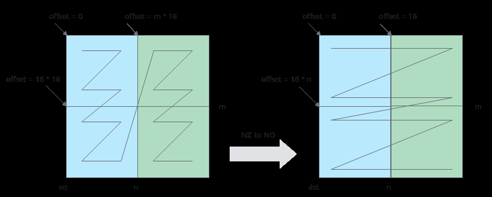

# 分离模式

> **Section**: 3.3.4.2  
> **PDF Pages**: 517–518  

---

<!-- page 517 -->

–dstStride设置为(nBlocks - 1) * 2，每两次搬运间隔2个block。

–每次循环迭代，目的矩阵偏移16，源矩阵偏移m*16。

格式转换示意图如下，第一次循环搬运蓝色部分数据，第二次循环搬运绿色部分数据。

图3-61 NZ to ND 格式转换示意图



具体代码如下：

```cpp
__aicore__ inline void CopyOut()    {        AscendC::LocalTensor<float> c2Local = outQueueCO2.DeQue<float>();
// transform nz to nd        for (int i = 0;
 i < nBlocks; ++i) {            AscendC::DataCopy(cGM[i * 16], c2Local[i * m * 16], { m, 2, 0, uint16_t((nBlocks - 1) * 2) });        }
outQueueCO2.FreeTensor(c2Local);    }
```

**----结束**

## 3.3.4.2 分离模式

说明

本节内容为针对分离模式，使用基础API进行矩阵乘法的编程指导。

如下章节内容暂不支持Atlas 350 加速卡。

针对分离模式，使用基础API进行矩阵乘法算子实现的编程范式和3.3.4.1 耦合模式一致，由于硬件架构不同，具体实现有一些差异，本节仅提供差异点说明。完整代码请参见Mmad样例。

●CopyIn阶段差异

–耦合模式

在CopyIn阶段，即从GM->A1/B1（L1 Buffer）的阶段，耦合模式下可以使用DataCopy接口直接将数据从GM搬入L1 Buffer，也可以将数据从GM搬入UB，再搬入L1 Buffer。若需要ND2NZ的格式转换，需要开发者自行完成；或使用DataCopy接口提供的随路格式转换功能，但该功能会使用UB临时空间。

如下示例，直接使用了GM->A1/B1的数据搬运指令，自行完成ND2NZ的格式转换。

<!-- page 518 -->

```cpp
__aicore__ inline void CopyND2NZ(const AscendC::LocalTensor<half>& dst, const AscendC::GlobalTensor<half>& src,        const uint16_t height, const uint16_t width)    {        for (int i = 0;
 i < width / 16; ++i) {            int srcOffset = i * 16;
            int dstOffset = i * 16 * height;
            AscendC::DataCopy(dst[dstOffset], src[srcOffset], { height, 1, uint16_t(width / 16 - 1), 0 });        }    }    __aicore__ inline void CopyIn()    {        AscendC::LocalTensor<half> a1Local = inQueueA1.AllocTensor<half>();
        AscendC::LocalTensor<half> b1Local = inQueueB1.AllocTensor<half>();
CopyND2NZ(a1Local, aGM, m, k);
        CopyND2NZ(b1Local, bGM, k, n);
inQueueA1.EnQue(a1Local);
        inQueueB1.EnQue(b1Local);    }
```

–分离模式

分离模式下数据无法经过VECIN/VECCALC/VECOUT (UB) 直接搬运到A1/B1(L1 Buffer) ，但是使用DataCopy接口提供的随路格式转换功能一条指令即可完成格式转换，无需UB作为临时空间。

示例如下：

```cpp
__aicore__ inline void CopyIn()    {        AscendC::LocalTensor<half> a1Local = inQueueA1.AllocTensor<half>();
        AscendC::LocalTensor<half> b1Local = inQueueB1.AllocTensor<half>();
AscendC::Nd2NzParams nd2nzA1Params;
        nd2nzA1Params.ndNum = 1;
        nd2nzA1Params.nValue = m;
        nd2nzA1Params.dValue = k;
        nd2nzA1Params.srcNdMatrixStride = 0;
        nd2nzA1Params.srcDValue = k;
        nd2nzA1Params.dstNzC0Stride = CeilCubeBlock(m) * CUBE_BLOCK;
        nd2nzA1Params.dstNzNStride = 1;
        nd2nzA1Params.dstNzMatrixStride = 0;
        AscendC::DataCopy(a1Local, aGM, nd2nzA1Params);
AscendC::Nd2NzParams nd2nzB1Params;
        nd2nzB1Params.ndNum = 1;
        nd2nzB1Params.nValue = k;
        nd2nzB1Params.dValue = n;
        nd2nzB1Params.srcNdMatrixStride = 0;
        nd2nzB1Params.srcDValue = n;
        nd2nzB1Params.dstNzC0Stride = CeilCubeBlock(k) * CUBE_BLOCK;
        nd2nzB1Params.dstNzNStride = 1;
        nd2nzB1Params.dstNzMatrixStride = 0;
        AscendC::DataCopy(b1Local, bGM, nd2nzB1Params);
inQueueA1.EnQue(a1Local);
        inQueueB1.EnQue(b1Local);    }
```

●Aggregate及CopyOut阶段差异

–耦合模式

耦合模式中，完成矩阵乘计算后数据存放于CO1（L0C Buffer），最终搬入GM需要通过CO2（UB），且NZ2ND的格式转换需要在CO1->CO2->GM阶段中手动完成。如下样例，在Aggregate阶段将NZ格式数据从CO1搬入CO2中，在CO2->GM的阶段使用for循环调用DataCopy完成了格式转换。
