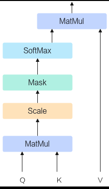
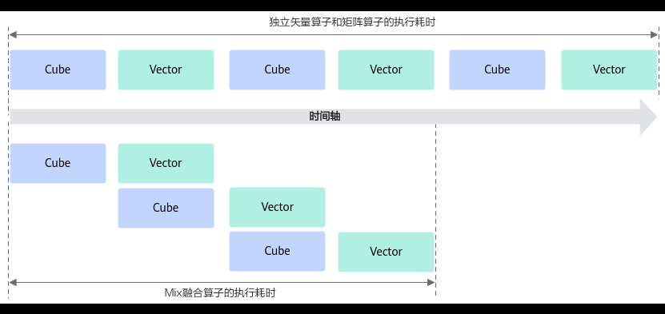
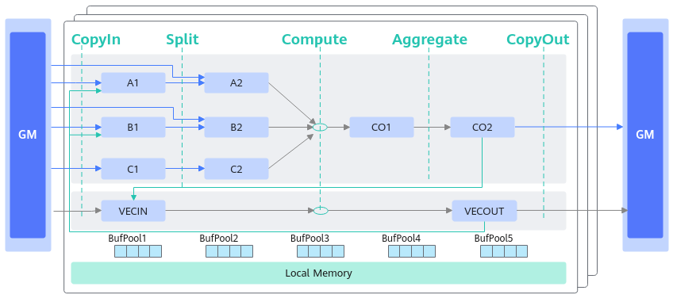
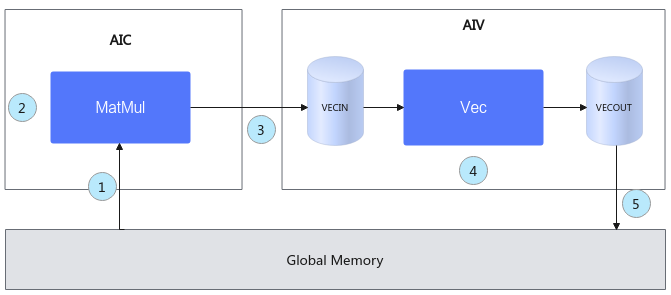

# 基础知识

> **Section**: 3.3.5.1.1  
> **PDF Pages**: 519–522  

---

<!-- page 519 -->

```cpp
__aicore__ inline void Aggregate(const AscendC::LocalTensor<float>& c2Local, const int bSplitIdx)    {        AscendC::LocalTensor<float> c1Local = outQueueCO1.DeQue<float>();
AscendC::DataCopyParams dataCopyParams;
        dataCopyParams.blockCount = 1;
        dataCopyParams.blockLen = 2;
        AscendC::DataCopyEnhancedParams enhancedParams;
        enhancedParams.blockMode = AscendC::BlockMode::BLOCK_MODE_MATRIX;
        AscendC::DataCopy(c2Local[bSplitIdx * cSize / 2], c1Local, dataCopyParams, enhancedParams);
outQueueCO1.FreeTensor(c1Local);    }    __aicore__ inline void CopyOut()    {        AscendC::LocalTensor<float> c2Local = outQueueCO2.DeQue<float>();
// transform nz to nd        for (int i = 0;
 i < nBlocks; ++i) {            AscendC::DataCopy(cGM[i * 16], c2Local[i * m * 16], { m, 2, 0, uint16_t((nBlocks - 1) * 2) });        }
```

outQueueCO2.FreeTensor(c2Local);    }–分离模式

分离模式下，矩阵乘的计算结果从CO1（L0C Buffer）可以通过Fixpipe通路直接写入GM，而且Fixpipe提供了随路NZ2ND的功能，方便用户做格式转换。样例如下，样例中省去了Aggregate阶段，直接CopyOut。

```cpp
__aicore__ inline void CopyOut()    {        AscendC::LocalTensor<float> c1Local = outQueueCO1.DeQue<float>();
        AscendC::FixpipeParamsV220 fixpipeParams;
        fixpipeParams.nSize = n;
        fixpipeParams.mSize = m;
        fixpipeParams.srcStride = m;
        fixpipeParams.dstStride = n;
fixpipeParams.ndNum = 1;
        fixpipeParams.srcNdStride = 0;
        fixpipeParams.dstNdStride = 0;
        AscendC::Fixpipe(cGM, c1Local, fixpipeParams);
        outQueueCO1.FreeTensor(c1Local);    }
```

## 3.3.5 融合算子编程

## 3.3.5.1 CV 融合

## 3.3.5.1.1 基础知识

说明

学习融合算子编程之前，请确保已经掌握矩阵编程相关知识。

## CV 融合算子

融合算子由多个独立的小算子融合而成，其功能与多个小算子的功能等价，性能方面通常优于独立的小算子。用户可以根据实际业务场景诉求，按照具体算法自由融合向

<!-- page 520 -->

量（Vector）、矩阵（Cube）算子以达到性能上的收益。融合了Cube计算、Vector计算的算子统称为CV融合算子。

比如对于LLM大模型中最核心的一个融合算子Flash Attention，其核心实现如下图。图中的Matmul算子（Cube）、Scale算子（Vector）、Mask算子（Vector）、SoftMax算子（Vector）融合为一个大的算子Flash Attention。

图3-62 Flash Attention 核心实现



使用场景和优势

针对有数据依赖的矢量算子和矩阵算子，可以通过融合算子编程的方式，将矢量算子和矩阵算子进行融合，通过一个算子Kernel函数来承载，由此来获得性能上的收益。下图展示了独立矢量算子和矩阵算子、Mix融合算子的执行耗时对比，由此可以看出为什么开发Mix融合算子会带来性能上的收益。

<!-- page 521 -->

图3-63独立矢量算子和矩阵算子、Mix 融合算子的执行耗时对比



●独立的矢量算子和矩阵算子实现：矩阵计算后的结果需要搬运到Global Memory上，然后由Global Memory搬运到Local Memory，再进行矢量算子的计算，计算和搬运都是串行执行，另外多个算子的调度执行，会增加算子的调度耗时。

●融合算子的实现方法：可以对数据进行切片，再通过流水的设计，使得矢量计算单元和矩阵计算单元实现并行计算；另外相比于不融合的单算子，减少了算子的调度耗时。

除了有效提升算子性能，充分发挥AI处理器的算力，融合算子还有如下优势：

●减少计算量：融合算子可以将多个算子合并为一个，简化计算过程，减少计算量，提高计算效率。

●减少内存占用：融合算子可以将多个算子的中间结果合并为一个，从而减少内存占用，提高内存利用率。

●优化数据流：融合算子可以优化数据流，减少数据在不同算子之间的传输，从而提高数据处理效率。

●简化代码实现：融合算子可以简化代码实现，减少代码量，提高代码可读性和可维护性。

总之，融合算子是一种优化计算的有效手段，可以提高计算效率和内存利用率，优化数据流，简化代码实现。

编程范式

Ascend C提供融合算子的编程范式，方便开发者基于该范式表达融合算子的数据流，快速实现自定义的融合算子。

融合算子数据流指融合算子的输入输出在各存储位置间的流向。以一个典型的Cube和Vector融合算子为例，逻辑位置间的数据流向如下图所示：

●Cube的输出可以作为Vector的输入：CO2->VECIN

●Vector的输出可以作为Cube的输入：VECOUT->A1->A2、VECOUT->B1->B2

<!-- page 522 -->



基于Matmul高阶API的融合算子编程范式，对上述数据流简化表达如下：

图3-64融合算子编程范式



1.初始化一个Matmul对象。

2.进行Matmul内部的计算。

3.将Matmul的计算结果搬运到Vector核上。

4.进行Vector矢量计算。

5.将输出结果搬运到Global Memory上。

整个过程的示例代码如下（伪代码）。完整样例请参考MatmulLeakyRelu。

template<typename aType, typename bType, typename cType, typename biasType>__aicore__ inline void MatmulLeakyKernel<aType, bType, cType, biasType>::Process(){    uint32_t computeRound = 0;    matmulObj.SetTensorA(aGlobal);    matmulObj.SetTensorB(bGlobal);    matmulObj.SetBias(biasGlobal);    while (matmulObj.template Iterate<true>()) { // 步骤2：进行Matmul内部的计算。// 步骤3：将Matmul的计算结果搬运到Vector核上。        reluOutLocal = reluOutQueue_.AllocTensor<cType>();        matmulObj.template GetTensorC<true>(reluOutLocal, false, true);   // 步骤4：进行Vector矢量计算。
