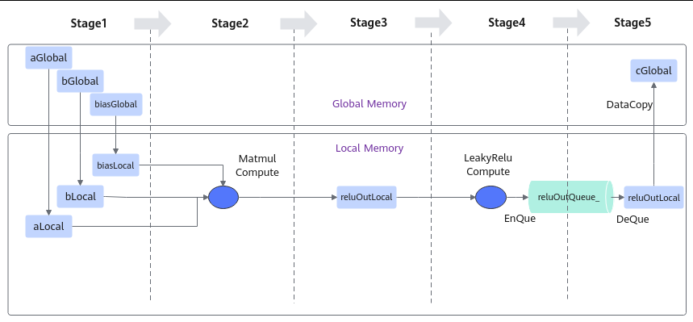
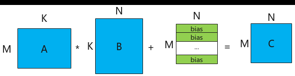
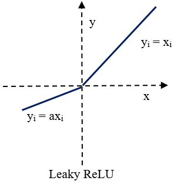
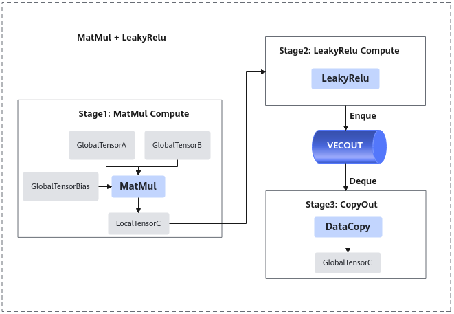
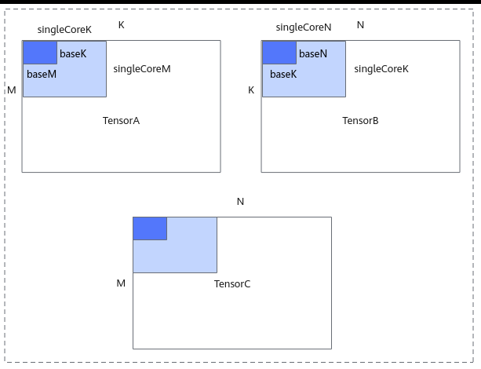
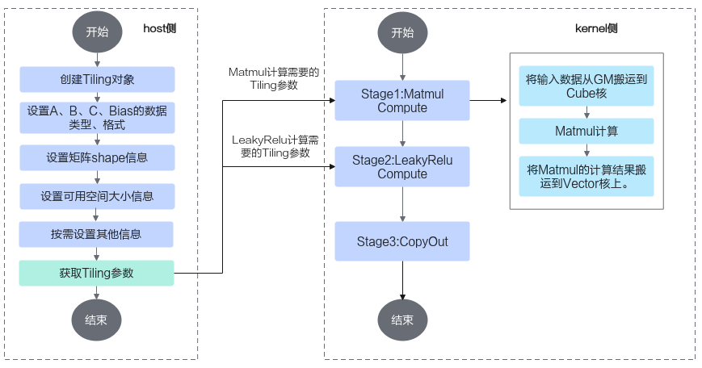

# 算子实现

> **Section**: 3.3.5.1.2  
> **PDF Pages**: 523–529  

---

<!-- page 523 -->

AscendC::LeakyRelu(reluOutLocal, reluOutLocal, (cType)alpha, tiling.baseM * tiling.baseN);        reluOutQueue_.EnQue(reluOutLocal);// 步骤5：将输出结果搬运到Global Memory上        reluOutQueue_.DeQue<cType>();        ...        AscendC::DataCopy(cGlobal[startOffset], reluOutLocal, copyParam);        reluOutQueue_.FreeTensor(reluOutLocal);        computeRound++;    }    matmulObj.End();}

// kernel入口函数，__mix__(1, 2)表示：mix场景，AIC:AIV=1:2。__global__ __mix__(1, 2) void matmul_leakyrelu_custom(GM_ADDR a, GM_ADDR b, GM_ADDR bias, GM_ADDR c,                                                      __kfc_workspace__ GM_ADDR workspace, AscendC::tiling::TCubeTiling tiling){    AscendC::TPipe pipe;    MatmulLeakyKernel<half, half, float, float> matmulLeakyKernel;    matmulLeakyKernel.Init(a, b, bias, c, workspace, tiling, &pipe);    // 步骤1：初始化Matmul对象。    REGIST_MATMUL_OBJ(&pipe, GetSysWorkSpacePtr(), matmulLeakyKernel.matmulObj, &matmulLeakyKernel.tiling);    matmulLeakyKernel.Process(&pipe);}

## 3.3.5.1.2 算子实现

下文将以Matmul+LeakyRelu融合算子的实现为例，介绍Mix融合算子的设计和实现流程。该样例仅支持在Atlas A2 训练系列产品/Atlas A2 推理系列产品上运行。

算子的设计过程分为算子分析、数据流分析、Tiling策略设计三部分。

算子分析

算子分析是指明确算子的数学表达式、输入、输出，核函数的名称等信息。

步骤1明确算子的数学表达式及计算逻辑。该算子的计算逻辑为，先进行一个矩阵乘操作，然后将矩阵乘的结果与一个alpha参数进行LeakyRelu操作。数学表达式如下：

```cpp
c = LeakyRelu(a * b + bias, alpha);
```

步骤2明确输入和输出。

●Matmul+LeakyRelu算子输入为a、b、bias，输出为c。alpha作为激活函数LeakyRelu的系数，为固定值，可以在算子实现中直接使用常数值参与计算。

●本样例中算子输入a、b支持的数据类型为half（float16），算子输入bias支持的数据类型为float32，算子输出c的数据类型为float32。

●输入矩阵a的形状为[M，K]，输入矩阵b的形状为[K, N]，输出矩阵c的形状为[M，N]，输入bias的形状为[1, N]。

●算子输入输出支持的数据格式为：ND。

步骤3确定核函数名称和参数。

●您可以自定义核函数名称，本样例中核函数命名为matmul_leakyrelu_custom。

●根据对算子输入输出的分析，确定核函数的参数a，b，bias，c；a，b, bias为输入在Global Memory上的内存地址，c为输出在Global Memory上的内存地址。

**----结束**

通过以上分析，得到Ascend C Matmul+LeakyRelu算子的设计规格如下：

<!-- page 524 -->

●算子类型（OpType）：MATMUL_LEAKYRELU

●算子输入输出：

表3-13 MATMUL_LEAKYRELU 算子输入输出规格

**nameshapedata typeformat**

a（输入）[M, K]halfND

b（输入）[K, N]halfND

bias（输入）[1, N]float32ND

z（输出）[M, N]float32ND

●核函数名称：matmul_leakyrelu_custom

数据流分析

进行算子的数据流分析：数据流向为在Cube核上完成Matmul计算后将数据搬运至Vector核进行LeakyRelu计算。根据上述数据流并结合融合算子的编程范式，规划并行的流水任务。如下图所示：



步骤1将输入数据从Global Memory搬运到Cube核。

步骤2进行Matmul内部的计算，计算公式和计算示意图如下：

注：bias的shape为[1, N]，对A*B结果矩阵的每一行都采用该bias进行偏置。

图3-65 Matmul 矩阵乘示意图



<!-- page 525 -->

步骤3将Matmul的计算结果搬运到Vector核。

步骤4进行Vector矢量计算，该样例中进行LeakyReLU计算。

Leaky ReLU（带泄露线性整流函数）激活函数，是人工神经网络中一种常用的激活函数，其数学表达式和函数图像如下所示：




步骤5将输出结果搬运到Global Memory。

**----结束**

前三步的内容都封装在Matmul高阶API内，本样例中可以简化为3个stage。如下图所示：

<!-- page 526 -->



根据上述分析，明确实现过程中会使用到Matmul高阶API接口，LeakyRelu Vector计算接口、6.2.3.1.1 DataCopy、 EnQue、 DeQue接口。

## Tiling 策略设计

Tiling策略的设计主要包括多核切分和核内切分策略。

●多核切分: 根据当前核数，对输入shape的M, K, N进行多核切分，得到单核内shape大小singleCoreM, singleCoreK, singleCoreN。

●核内切分: 根据Local Memory的大小约束，对单核内的shape大小进一步切分，得到A、B、C矩阵参与一次矩阵乘指令的shape大小baseM, baseN, baseK。切分时需要注意：GetTensorC的结果如果放在LocalMemory（UB）上，需要注意，baseM * baseN的大小不能超出UB的限制。

切分策略示意图如下，更多切分策略相关原理请参考数据分块（Tiling）。

<!-- page 527 -->



算子实现

在矩阵编程章节，我们得知Ascend C提供一组Matmul高阶API，封装了常用的切分和数据搬运、计算的算法逻辑，方便用户快速实现Matmul矩阵乘法的运算操作。融合算子中矩阵编程部分的实现与之类似，开发者在host侧通过调用API自动获取Tiling参数，该参数传递到kernel侧后，在初始化操作时传入，通过几个简单的API即可完成矩阵乘操作。再结合上文的融合算子的编程范式，融合算子实现的步骤如下。完整样例请参考MatmulLeakyRelu。



<!-- page 528 -->

kernel侧实现的代码框架如下，在完成Matmul对象的初始化、左矩阵A、右矩阵B、Bias的设置后，通过单次Iterate叠加while循环的方式完成后续的Matmul计算、LeakyRelu计算、CopyOut流程。

template<typename aType, typename bType, typename cType, typename biasType>__aicore__ inline void MatmulLeakyKernel<aType, bType, cType, biasType>::Process(){    uint32_t computeRound = 0;    // 设置Matmul的输入（包括左矩阵、右矩阵、bias）    matmulObj.SetTensorA(aGlobal);    matmulObj.SetTensorB(bGlobal);    matmulObj.SetBias(biasGlobal);    // 调用matmul iterate获取一块[baseM, baseN]的计算结果    while (matmulObj.template Iterate<true>())    {        MatmulCompute();        LeakyReluCompute();        CopyOut(computeRound);        computeRound++;    }    matmulObj.End();}// kernel入口函数，mix场景，AIC:AIV=1:2__global__ __mix__(1, 2) void matmul_leakyrelu_custom(GM_ADDR a, GM_ADDR b, GM_ADDR bias, GM_ADDR c,                                                      __kfc_workspace__ GM_ADDR workspace, AscendC::tiling::TCubeTiling tiling){    AscendC::TPipe pipe;    MatmulLeakyKernel<half, half, float, float> matmulLeakyKernel;    matmulLeakyKernel.Init(a, b, bias, c, workspace, tiling, &pipe);    // Matmul对象初始化    REGIST_MATMUL_OBJ(&pipe, GetSysWorkSpacePtr(), matmulLeakyKernel.matmulObj, &matmulLeakyKernel.tiling);    matmulLeakyKernel.Process(&pipe);}

Matmul计算、LeakyRelu计算、CopyOut的具体实现代码如下：

步骤1Matmul计算：

1.在Cube核上，进行Matmul内部的计算。

2.将Matmul的计算结果搬运到Vector核。template<typename aType, typename bType, typename cType, typename biasType>__aicore__ inline void MatmulLeakyKernel<aType, bType, cType, biasType>::Process(){    uint32_t computeRound = 0;    // ...    // 调用matmul iterate获取一块[baseM, baseN]的计算结果    while (matmulObj.template Iterate<true>())    {        MatmulCompute();        // ...        computeRound++;

```cpp
}    matmulObj.End();}
```

template<typename aType, typename bType, typename cType, typename biasType>__aicore__ inline void MatmulLeakyKernel<aType, bType, cType, biasType>::MatmulCompute(){    reluOutLocal = reluOutQueue_.AllocTensor<cType>();    // 调用GetTensorC将Matmul的计算结果搬运到Vector核。    matmulObj.template GetTensorC<true>(reluOutLocal, false, true);}

步骤2LeakyRelu计算。

// 调用LeakyRule接口进行计算template<typename aType, typename bType, typename cType, typename biasType>

<!-- page 529 -->

```cpp
__aicore__ inline void MatmulLeakyKernel<aType, bType, cType, biasType>::LeakyReluCompute(){    AscendC::LeakyRelu(reluOutLocal, reluOutLocal, (cType)alpha, tiling.baseM * tiling.baseN);
    reluOutQueue_.EnQue(reluOutLocal);}
```

步骤3CopyOut，将输出结果搬运到Global Memory。

// 将结果搬出到GMtemplate<typename aType, typename bType, typename cType, typename biasType>__aicore__ inline void MatmulLeakyKernel<aType, bType, cType, biasType>::CopyOut(uint32_t count){    reluOutQueue_.DeQue<cType>();    const uint32_t roundM = tiling.singleCoreM / tiling.baseM;    const uint32_t roundN = tiling.singleCoreN / tiling.baseN;    uint32_t startOffset = (count % roundM * tiling.baseM * tiling.N + count / roundM * tiling.baseN);    AscendC::DataCopyParams copyParam = {(uint16_t)tiling.baseM,        (uint16_t)(tiling.baseN * sizeof(cType) / DEFAULT_C0_SIZE), 0,        (uint16_t)((tiling.N - tiling.baseN) * sizeof(cType) / DEFAULT_C0_SIZE)};    AscendC::DataCopy(cGlobal[startOffset], reluOutLocal, copyParam);    reluOutQueue_.FreeTensor(reluOutLocal);}

**----结束**

host侧实现GenerateTiling函数，在该函数中自动获取Tiling参数，关键步骤介绍如下：

步骤1创建Tiling对象。

```cpp
auto ascendcPlatform = platform_ascendc::PlatformAscendC(context->GetPlatformInfo());matmul_tiling::MultiCoreMatmulTiling cubeTiling(ascendcPlatform);
```

创建对象时需要传入硬件平台信息，硬件平台信息可以通过GetPlatformInfo获取。

步骤2设置A、B、Bias的数据类型和格式。

设置示例如下，其中TPosition::LCM是Unified Buffer上的逻辑位置，等同于TPosition::VECCALC，关于TPosition的详细内容请参考TPosition。cubeTiling.SetAType(matmul_tiling::TPosition::GM, matmul_tiling::CubeFormat::ND, matmul_tiling::DataType::DT_FLOAT16);cubeTiling.SetBType(matmul_tiling::TPosition::GM, matmul_tiling::CubeFormat::ND, matmul_tiling::DataType::DT_FLOAT16);cubeTiling.SetCType(matmul_tiling::TPosition::LCM, matmul_tiling::CubeFormat::ND, matmul_tiling::DataType::DT_FLOAT);cubeTiling.SetBiasType(matmul_tiling::TPosition::GM, matmul_tiling::CubeFormat::ND, matmul_tiling::DataType::DT_FLOAT);

步骤3设置矩阵shape信息。

```cpp
cubeTiling.SetShape(M, N, K);cubeTiling.SetOrgShape(M, N, K);
```

步骤4设置可用空间大小信息。

设置Matmul计算时可用的L1 Buffer/L0C Buffer/Unified Buffer空间大小，-1表示AI处理器对应Buffer的大小。cubeTiling.SetBufferSpace(-1, -1, -1);

步骤5按需设置其他参数，比如设置bias参与计算。

```cpp
cubeTiling.SetBias(true);
```

步骤6获取Tiling参数。

```cpp
MatmulLeakyreluCustomTilingData tiling;if (cubeTiling.GetTiling(tiling.cubeTilingData) == -1){    return ge::GRAPH_FAILED;}
```

步骤7Tiling参数的序列化保存等其他操作。

**----结束**
