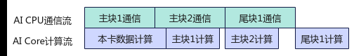
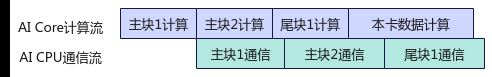
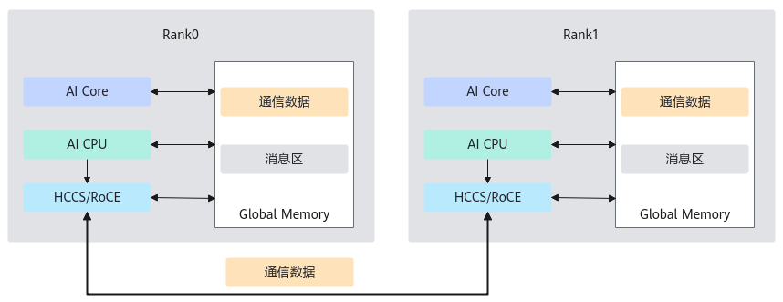
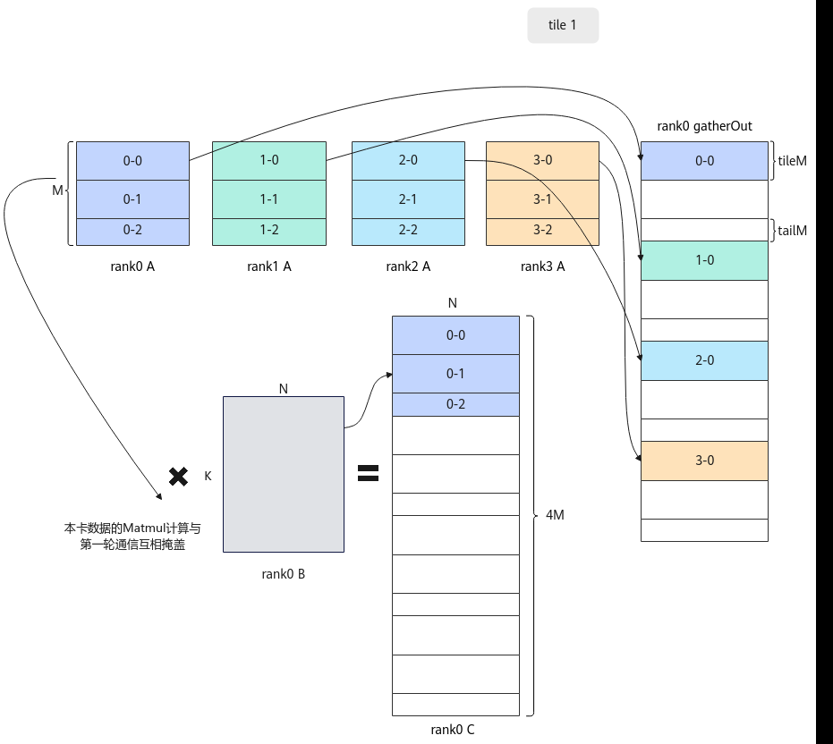
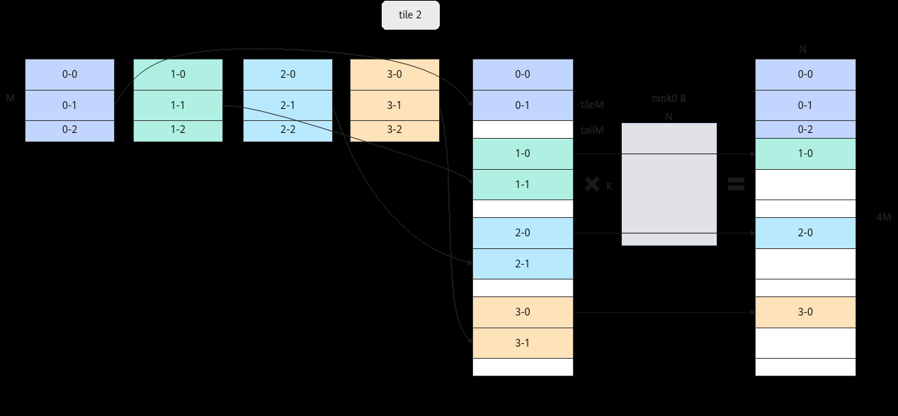
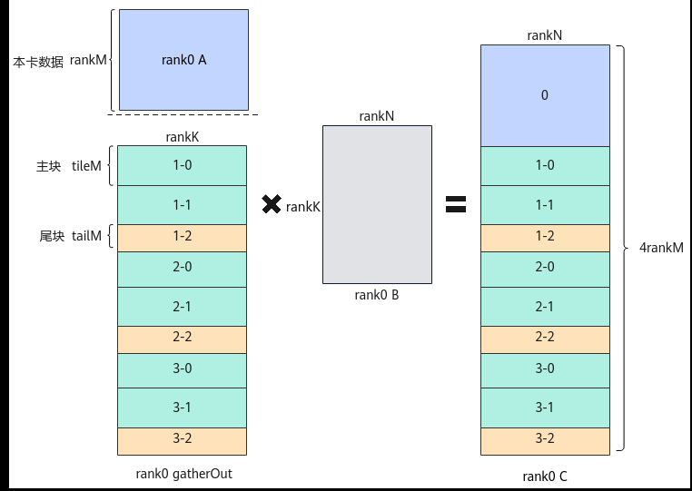
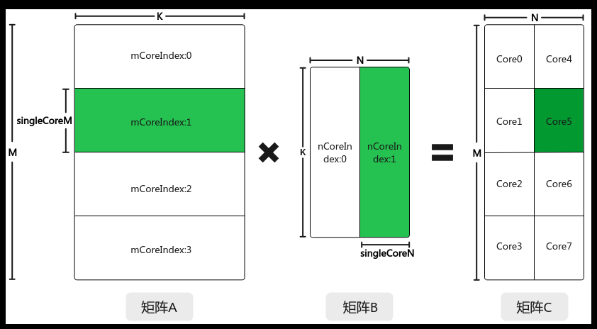

# 算子实现

> **Section**: 3.3.5.2.2  
> **PDF Pages**: 533–548  

---

<!-- page 533 -->

## 3.3.5.2.2 算子实现

在通算融合类算子的实现中，通信操作使用Hccl高阶API，矩阵乘计算操作使用Matmul高阶API。关于更多集合通信的内容和相关概念请参考《HCCL集合通信库》。通算融合算子的开发过程与一般算子相同，但请注意，当前通算融合算子暂不支持Kernel直调和入图（GE图）开发，仅支持单算子API调用。

下文将以AllGatherMatmulCustom算子（简称AllGatherMatmul）的实现为例，从算子分析、数据流分析、创建算子工程、原型定义、Tiling实现、Kernel实现、编译与运行等方面介绍通算融合算子的设计和实现流程。本样例中算子的完整代码请参见AllGatherMatmul样例。该样例仅支持在Atlas A2 训练系列产品/Atlas A2 推理系列产品上运行。

算子分析

算子分析是指明确算子的数学表达式、输入、输出，核函数的名称等信息。

步骤1明确算子的数学表达式及通信计算逻辑。

AllGatherMatmul算子实现了AllGather通信和Matmul矩阵乘法的融合。算子逻辑为：对输入的通信矩阵a做AllGather通信得到Matmul计算的左矩阵，即通信结果gather_out，将gather_out和右矩阵b做Matmul运算得到输出c。对应的数学表达式为：gather_out = AllGather(a)c = gather_out ∗ b

步骤2明确输入、输出和属性。

●a、b为源操作数，a为通信的输入矩阵，形状为[M, K]；b为Matmul的右矩阵，形状为[K, N]。在样例中，M、K、N分别固定为512、5120、640。

●gather_out为目的操作数，存放AllGather通信结果，形状为[M * rankDim, K]，其中，rankDim为通信域内的卡数，在样例中固定为8。

●c为目的操作数，存放Matmul运算结果，形状为[M * rankDim, N]。

●算子输入输出的数据类型为float16，format为：ND。

●group为算子属性，表示通信域名称，明确算子运行时所在的通信域。

步骤3确定核函数名称和参数。

●本样例中核函数命名为all_gather_matmul_custom。

●根据对算子输入输出的分析，确定核函数的参数aGM，bGM，cGM，gatherOutGM；aGM，bGM为输入在Global Memory上的内存地址，cGM，gatherOutGM为输出在Global Memory上的内存地址。注意，核函数的参数和单算子API调用的输入输出在命名上存在区别，原因是核函数的参数是输入输出在Global Memory上的内存地址，而单算子API调用时输入输出的类型是aclTensor，两者并不完全一致。

步骤4确定算子实现所需接口。

●算子涉及AllGather通信，查看Ascend C API参考中的通信相关接口，需要使用Hccl高阶API来实现AllGather通信。

●算子涉及Matmul左右矩阵在外部存储和内部存储间的数据搬运，查看Ascend CAPI参考中的数据搬运接口，需要使用DataCopy来实现数据搬运。

●计算过程涉及矩阵计算操作，查看Ascend C API参考中的矩阵计算相关接口，需要使用Matmul高阶API实现矩阵乘计算。

**----结束**

<!-- page 534 -->

表3-14 AllGatherMatmulCustom 算子规格

AllGatherMatmulCustom

算子类型（OpType）

算子输入输出nameshapedata typeformat

a[512,5120]

float16ND

b[5120,640]

float16ND

c[4096,640]

float16ND

gather_out[4096,5120]

float16ND

算子属性group（char*），Host侧标识通信域的字符串，表示通信域名称。

核函数名称all_gather_matmul_custom

数据流分析

AllGatherMatmul算子的数据在卡间进行AllGather通信，在卡内进行Matmul计算，通信和计算按照数据切分后的主块、尾块分多次进行，流水互相掩盖。分析过程中，假定通信矩阵的切分策略为按M轴进行切分，切分后主块数（tileCnt）为2，尾块数（tailCnt）为1，则可得到通信计算掩盖示意图如下。

图3-71 AllGatherMatmul 通信计算掩盖示意图



AllGather的功能为将通信域内所有卡的输入按照卡id重新排序，然后拼接起来，再将结果发送到所有卡。因此，AllGather的结果中包含本卡数据，即本卡输入的通信矩阵a，算子无需等待这部分数据的通信完成，也无需对数据进行切分，可直接基于完整的通信矩阵a进行Matmul计算。AllGatherMatmul算子首先做本卡数据的Matmul计算，这样做的好处在于主块1的通信能与Matmul计算互相掩盖，同时，主块1、主块2、尾块1的计算无需再包括对本卡数据的Matmul计算，可以减少后续主尾块的计算量，增加通信计算的掩盖率，从而提高性能。注意，不是所有的通算融合算子都适合首先进行本卡数据的Matmul计算。因为AllGatherMatmul算子的通信在计算之前，所以先进行本卡数据的Matmul计算，可以实现本卡数据计算和第一次通信之间的互相掩盖。如果是计算在通信前的算子，如MatmulAllReduce，建议将本卡数据的计算放在最后，与最后一次通信互相掩盖，如下图所示。

<!-- page 535 -->

图3-72 MatmulAllReduce 通信计算掩盖示意图



AllGatherMatmul算子逻辑分析：

步骤1AI Core将要执行的通信信息写入Global Memory中的消息区，实现任务下发。消息区是特定地址的Global Memory，AI Core和AI CPU通过向其写入和轮询读取来实现消息在两者间的传递，这些操作统一封装于Hccl高阶API中。

图3-73通算融合算子通信流程示意图



步骤2AI CPU从消息区读取到所有通信任务信息，开始基于HCCS（华为缓存一致性系统，用于CPU/NPU之间的高速互联）或RoCE（承载在融合以太网上的RDMA技术，即跨越以太网的RDMA通信方式）等链路执行第一轮AllGather集合通信任务。与此同时，AICore开始对本卡数据进行Matmul计算。

下图是通信卡数为4时，第一轮通信与本卡计算的示意图。tile 1表示图示为第一轮通信和与其相互掩盖的矩阵乘计算的处理流程。图中切分后的小矩阵中形如X-Y的数字表示它所在的数据块对应于第X张卡第Y块数据。

<!-- page 536 -->

图3-74 AllGatherMatmul 第一轮通信与rank0 上的本卡数据矩阵乘示意图



步骤3AI CPU完成第一轮通信任务后，向消息区写入第一轮通信任务已完成的消息，并开始执行第二轮通信任务。同时，AI Core在完成本卡数据的Matmul计算后，通过轮询消息区等到第一轮通信任务已完成的消息，开始进行第一轮通信结果即主块1的Matmul计算。

下图是通信卡数为4时，第二轮通信与rank0计算的示意图。tile 2表示图示为第二轮通信和与其相互掩盖的矩阵乘计算的处理流程。

<!-- page 537 -->

图3-75 AllGatherMatmul 第二轮通信与rank0 上主块1 的矩阵乘示意图



步骤4类似步骤3，逐步完成剩余所有数据块的通信和计算。

**----结束**

创建算子工程

创建通算融合算子的算子工程与一般算子相同，具体请参考2.10.2.2 创建算子工程章节。本样例基于如下原型定义json文件，使用自定义算子工程生成工具msOpGen，为AllGatherMatmul算子创建算子工程。

```cpp
[    {        "op": "AllGatherMatmulCustom",        "input_desc": [            {                "name": "a",                "param_type": "required",                "format": [                    "ND"                ],                "type": [                    "float16"                ]            },            {                "name": "b",                "param_type": "required",                "format": [                    "ND"                ],                "type": [                    "float16"                ]            }        ],        "output_desc":[            {                "name": "c",                "param_type": "required",                "format": [                    "ND"                ],                "type": [                    "float16"                ]
```

<!-- page 538 -->

```cpp
},            {                "name": "gather_out",                "param_type": "required",                "format": [                    "ND"                ],                "type": [                    "float16"                ]            }        ],        "attr": [            {                "name": "group",                "type": "string",                "default_value":"",                "param_type":"required"            }        ]    }]
```

算子原型定义

相比于一般算子，通算融合算子在实现算子原型定义时，有如下约束：

●必须定义一个表示算子通信域名称的属性。通信域是集合通信执行的上下文，管理对应的通信实体（例如一个NPU就是一个通信实体）和通信所需的资源。

●必须通过原型注册中的MC2接口注册该算子为通算融合算子，并通过HcclGroup接口配置该算子的通信域名称。

AllGatherMatmul算子使用"group"属性表示该算子的通信域名称，其在算子原型中定义如下：

this->Attr("group").AttrType(REQUIRED).String(); // "group"为通算融合算子的属性，表示通信域名称，原型定义中的String类型对应单算子API中的char*类型...this->MC2().HcclGroup("group"); // 将"group"属性配置为该算子的通信域名称

AllGatherMatmul算子的完整原型定义如下：

```cpp
namespace ops {class AllGatherMatmulCustom : public OpDef {public:    explicit AllGatherMatmulCustom(const char *name) : OpDef(name)    {        this->Input("a")            .ParamType(REQUIRED)            .DataType({ge::DT_FLOAT16})            .Format({ge::FORMAT_ND})            .UnknownShapeFormat({ge::FORMAT_ND});
        this->Input("b")            .ParamType(REQUIRED)            .DataType({ge::DT_FLOAT16})            .Format({ge::FORMAT_ND})            .UnknownShapeFormat({ge::FORMAT_ND})            .IgnoreContiguous();
        this->Output("c")            .ParamType(REQUIRED)            .DataType({ge::DT_FLOAT16})            .Format({ge::FORMAT_ND})            .UnknownShapeFormat({ge::FORMAT_ND});
        this->Output("gather_out")            .ParamType(REQUIRED)            .DataType({ge::DT_FLOAT16})            .Format({ge::FORMAT_ND})
```

<!-- page 539 -->

```cpp
.UnknownShapeFormat({ge::FORMAT_ND});
this->Attr("group").AttrType(REQUIRED).String();
```

this->AICore().SetTiling(AllGatherMatmulCustomTilingFunc); // 注册AllGatherMatmulCustomTilingFunc为Tiling入口函数        this->AICore().AddConfig("ascendxxx"); // ascendxxx请修改为对应的AI处理器型号。        this->MC2().HcclGroup("group");    }};OP_ADD(AllGatherMatmulCustom);}

## Tiling 实现

通算融合算子Tiling策略的设计主要包括通信切分策略、Matmul多核切分和核内切分策略。

●通信切分策略：每轮通信数据块的大小，对通算融合算子的性能有较大影响。样例中按照主块M轴长度448对通信矩阵A的M轴进行切分。具体场景中如何确定切分策略请参考MC²算子性能调优案例。

●Matmul多核切分和核内切分:

–多核切分: 根据当前核数，对输入shape的M、K、N进行多核切分，得到单核内shape大小singleCoreM、singleCoreK、singleCoreN。

–核内切分: 根据Local Memory的大小约束，对单核内的shape大小进一步切分，得到A、B、C矩阵参与一次矩阵乘指令的shape大小baseM、baseN、baseK。

如上所述，通信矩阵被切分为主块、尾块，主块、尾块的通信结果以及本卡数据需要分别进行Matmul计算。如下图，主块、尾块和本卡数据在M轴的长度分别为tileM、tailM和rankM，即Matmul计算时的左矩阵存在三种不同的形状，因此需要分别以通信矩阵主块、尾块和本卡数据块的大小为矩阵乘原始的输入形状，调用Matmul高阶API提供的Tiling接口，得到对应这三种形状的多核切分和核内切分策略。这里，singleCoreM、baseM等概念和相关原理的介绍请参考3.3.3.1 基础知识。

<!-- page 540 -->

图3-76 AllGatherMatmul 算子在rank0 的矩阵乘示意图



下面给出Tiling实现的关键步骤：

步骤1定义AllGatherMatmul算子的Tiling结构体。

通信和Matmul融合得到的通算融合算子的Tiling结构体一般包括如下三个部分：

●Hccl高阶API的Tiling结构体。定义Mc2InitTiling和Mc2CcTiling参数。Mc2InitTiling参数用于初始化通信任务配置，必须定义为算子Tiling结构体的第一个参数。Mc2CcTiling为具体每个通信任务的参数配置，由于AllGatherMatmul算子中只有AllGather一个通信任务，因此仅需定义一个Mc2CcTiling参数。

●Matmul高阶API的Tiling结构体TCubeTiling。一般而言，主块、尾块和本卡数据的shape是不同的，由于TCubeTiling只能存储对一个输入形状进行Tiling计算得到的结果，因此需要分别定义主块、尾块和本卡数据块的Tiling结构体，来存放它们的多核切分和核内切分策略。

●AllGatherMatmul算子额外需要的自定义结构体AllGatherMatmulTiling。

AllGatherMatmul算子的完整Tiling结构体定义如下：struct AllGatherMatmulTiling {    uint32_t rankM;           // A矩阵M轴的长度    uint32_t rankN;           // B矩阵N轴的长度    uint32_t rankK;           // A、B矩阵K轴的长度    uint32_t tileNum;         // 主块个数    uint32_t tailM;           // 尾块的M轴长度    uint32_t tailNum;         // 尾块个数（0或1）};

```cpp
class AllGatherMatmulCustomTilingData {public:    Mc2InitTiling mc2InitTiling;
    Mc2CcTiling mc2CcTiling;
    TCubeTiling localTiling;
    TCubeTiling tileTiling;
    TCubeTiling tailTiling;
    AllGatherMatmulTiling cfg;};
```

<!-- page 541 -->

步骤2获取AllGatherMatmul算子的Tiling结构体对象指针。

```cpp
AllGatherMatmulCustomTilingData *tiling = context->GetTilingData<AllGatherMatmulCustomTilingData>();
```

context为TilingContext的对象指针，该指针由框架自动从注册的Tiling入口函数AllGatherMatmulCustomTilingFunc传入，用于保存算子Tiling计算的上下文。在AllGatherMatmul算子的Tiling实现中，通过该上下文context获取计算Tiling所需要的输入输出shape、输入属性等参数，然后将Tiling结果（例如TilingKey、TilingData）保存至上下文中，供后续算子执行时使用。

步骤3设置算子自定义的Tiling结构体参数。

tiling->cfg.tileNum = rankM / TILE_M; // TILE_M在样例中为常量448，表示通信数据块切分后的主块在M轴的长度tiling->cfg.tailM = rankM % TILE_M;tiling->cfg.tailNum = (rankM % TILE_M == 0) ? 0 : 1;tiling->cfg.rankM = rankM;tiling->cfg.rankN = rankN;tiling->cfg.rankK = rankK;

步骤4设置Matmul高阶API Tiling结构体。

通过matmul_tiling::MultiCoreMatmulTiling获取TCubeTiling结构体，首先创建多核Tiling对象mmTiling，然后设置A、B、C的参数类型信息，M、N、K形状信息等，最后调用GetTiling接口，获取Tiling信息，具体方法可详见Matmul Tiling类。AllGatherMatmul算子中将上述逻辑封装为matmulTilingFunc函数，再分别根据主块、尾块和本卡数据的形状大小，调用matmulTilingFunc函数，得到对应的TCubeTiling参数。// 封装设置TCubeTiling结构体的函数为matmulTilingFuncauto matmulTilingFunc = [&](int64_t m, int64_t n, int64_t k, TCubeTiling &cubeTiling) -> bool {    matmul_tiling::MultiCoreMatmulTiling mmTiling;    mmTiling.SetAType(matmul_tiling::TPosition::GM, matmul_tiling::CubeFormat::ND, matmul_tiling::DataType::DT_FLOAT16);    mmTiling.SetBType(matmul_tiling::TPosition::GM, matmul_tiling::CubeFormat::ND, matmul_tiling::DataType::DT_FLOAT16);    mmTiling.SetCType(matmul_tiling::TPosition::GM, matmul_tiling::CubeFormat::ND, matmul_tiling::DataType::DT_FLOAT16);    mmTiling.SetBias(false);    mmTiling.SetDim(aicCoreNum);    mmTiling.SetShape(m, n, k);    mmTiling.SetOrgShape(m, n, k);    mmTiling.SetBufferSpace(L1_BUFFER_SIZE);    if (mmTiling.GetTiling(cubeTiling) != 0) {        return false;    }    return true;};// 设置本卡数据的Matmul TCubeTiling结构体if (!matmulTilingFunc(rankM, rankN, rankK, tiling->localTiling)) {    ERROR_LOG("Get local matmul tiling failed");    return ge::GRAPH_FAILED;}// 设置主块的Matmul TCubeTiling结构体if (!matmulTilingFunc(TILE_M, rankN, rankK, tiling->tileTiling)) {    ERROR_LOG("Get tile matmul tiling failed");    return ge::GRAPH_FAILED;}// 设置尾块的Matmul TCubeTiling结构体if (!matmulTilingFunc(rankM % TILE_M, rankN, rankK, tiling->tailTiling)) {    ERROR_LOG("Get tail matmul tiling failed");    return ge::GRAPH_FAILED;}

步骤5设置Hccl高阶API Tiling结构体。

根据通信任务类型、算法配置等，创建一个Mc2CcTilingConfig类对象，通过向GetTiling方法传入算子Tiling结构体中mc2InitTiling和mc2CcTiling成员的引用，完成

<!-- page 542 -->

需要传递给Kernel侧的Mc2InitTiling参数和Mc2CcTiling参数的获取。Hccl高阶APITiling结构体的具体使用方法详见Hccl Tiling使用说明。uint32_t opType = HCCL_CMD_ALLGATHER; // 设置通信任务类型std::string algConfig = "AllGather=level0:doublering"; // 设置通信算法，该参数为预留字段，配置后不生效uint32_t reduceType = HCCL_REDUCE_SUM; // 设置Reduce操作类型，仅对有归约操作的通信任务有效，作为AllGather通信，可以直接配置默认值HCCL_REDUCE_SUMAscendC::Mc2CcTilingConfig mc2CcTilingConfig(group, opType, algConfig, reduceType);mc2CcTilingConfig.GetTiling(tiling->mc2InitTiling);mc2CcTilingConfig.SetSkipLocalRankCopy(0); // 输出gatherOut需带有本卡的A矩阵，因此设置为0mc2CcTilingConfig.GetTiling(tiling->mc2CcTiling);

**----结束**

## Kernel 实现

在AllGatherMatmul算子的Kernel实现中，需要对本卡数据、通信主块、通信尾块共三种形状的左矩阵进行Matmul运算，为避免重复代码，有必要抽象出一个通用的适用于不同输入形状的Matmul计算函数。设计该Matmul计算函数前，需要考虑Matmul计算需要的基本信息，罗列如下：

●输入A、B矩阵和输出C矩阵的地址。

●TCubeTiling结构体：包含矩阵A、B、C的形状、数据类型等信息，以及A、B矩阵进行Matmul运算时在核间和核内的切分策略。

除了上述Matmul运算所需的信息外，为了快速实现Matmul矩阵乘法，可以使用Matmul高阶API中的Matmul对象来执行计算。如果Matmul对象在Matmul计算函数中定义，每次调用该函数时都会实例化Matmul对象并释放资源，这将导致较大的运行时开销。因此，将该对象也作为Matmul计算函数的参数，以实现对象的复用。

综上所述，在Kernel实现中定义的适用于不同输入形状的Matmul计算函数如下。其中Matmul计算函数函数名定义为MatmulKernel，入参aGM、bGM、cGM表示需要运算的原始输入输出矩阵的地址，入参tiling表示TCubeTiling结构体，入参mm对应Matmul高阶API的实现类。MATMUL_TYPE是特化了MatmulType模板的类型别名。

```cpp
using MATMUL_TYPE = MatmulType<AscendC::TPosition::GM, CubeFormat::ND, half>;
__aicore__ inline void MatmulKernel(GM_ADDR aGM, GM_ADDR bGM, GM_ADDR cGM, TCubeTiling &tiling,                                    Matmul<MATMUL_TYPE, MATMUL_TYPE, MATMUL_TYPE> &mm)
```

MatmulKernel函数的实现步骤如下。

步骤1TCubeTiling结构体存储了Matmul计算所需的核数，在无需计算的核上直接返回，结束计算。

```cpp
if (GetBlockIdx() >= tiling.usedCoreNum) {    return;}
```

步骤2Matmul高阶API要求使用GlobalTensor作为输入输出矩阵，因此，根据函数输入的A、B、C矩阵在Global Memory的地址，分别定义aGlobal、bGlobal、cGlobal三个GlobalTensor。

```cpp
GlobalTensor<half> aGlobal, bGlobal, cGlobal;aGlobal.SetGlobalBuffer(reinterpret_cast<__gm__ half *>(aGM), tiling.M * tiling.Ka);bGlobal.SetGlobalBuffer(reinterpret_cast<__gm__ half *>(bGM), tiling.Ka * tiling.N);cGlobal.SetGlobalBuffer(reinterpret_cast<__gm__ half *>(cGM), tiling.M * tiling.N);
```

步骤3为了实现多核并行，提升计算效率，将矩阵数据进行切分，切分后的数据分配到不同的核上进行处理。这里采用了不切分K轴、仅切分M、N轴的切分策略，示意图如下。在这种场景下，每个核需要计算待处理的矩阵数据相对于原始矩阵的偏移量，并将偏移后的矩阵作为传入A、B、C矩阵时的入参。同时，为支持分核后的尾块数据的处

<!-- page 543 -->

理，每个核需要计算实际处理的singleCoreM、singleCoreN大小，并在下一步中通过调用Matmul高阶API进行设置。

图3-77 Matmul 计算分核示意图



int mSingleBlocks = (tiling.M + tiling.singleCoreM - 1) / tiling.singleCoreM;int mCoreIndex = GetBlockIdx() % mSingleBlocks;int nCoreIndex = GetBlockIdx() / mSingleBlocks;// 计算当前核需要处理的矩阵数据相对于原始矩阵的偏移int offsetA = mCoreIndex * tiling.Ka * tiling.singleCoreM;int offsetB = nCoreIndex * tiling.singleCoreN;int offsetC = mCoreIndex * tiling.N * tiling.singleCoreM + nCoreIndex * tiling.singleCoreN;// 计算当前核的singleCoreM/singleCoreN，作为后续SetTail接口的入参int tailM = Std::min(tiling.M - mCoreIndex * tiling.singleCoreM, tiling.singleCoreM);int tailN = Std::min(tiling.N - nCoreIndex * tiling.singleCoreN, tiling.singleCoreN);

步骤4调用Matmul高阶API设置Matmul计算的原始完整的形状、当前核处理的输入输出矩阵的地址和计算的实际singleCoreM、singleCoreN的大小，并完成矩阵乘运算。

```cpp
mm.SetOrgShape(tiling.M, tiling.N, tiling.Ka, tiling.Kb);mm.SetTensorA(aGlobal[offsetA]);mm.SetTensorB(bGlobal[offsetB]);mm.SetTail(tailM, tailN);mm.IterateAll(cGlobal[offsetC]);
```

**----结束**

AllGatherMatmul算子的核函数定义如下，aGM、bGM、cGM、gatherOutGM参数含义如算子分析中所述，workspaceGM和tilingGM分别表示wrokspace空间和tiling数据在Global Memory的地址。

```cpp
extern "C" __global__ __aicore__ void all_gather_matmul_custom(GM_ADDR aGM, GM_ADDR bGM, GM_ADDR cGM, GM_ADDR gatherOutGM, GM_ADDR workspaceGM, GM_ADDR tilingGM)
```

下面介绍AllGatherMatmul算子主流程实现的具体步骤。

步骤1Matmul计算依赖AIC核，因此控制算子逻辑仅运行于AIC中。通过ASCEND_IS_AIV宏，判断如果当前核为AIV核，直接返回，结束当前核的运行。

```cpp
if ASCEND_IS_AIV {    return;}
```

<!-- page 544 -->

步骤2注册算子Tiling结构体、获取Tiling，并初始化TPipe。

```cpp
REGISTER_TILING_DEFAULT(AllGatherMatmulCustomTilingData);GET_TILING_DATA(tilingData, tilingGM);TPipe pipe;
```

步骤3定义并赋值后续计算所需变量。

auto &&localTiling = tilingData.localTiling;auto &&tileTiling = tilingData.tileTiling;auto &&tailTiling = tilingData.tailTiling;const auto tileNum = tilingData.cfg.tileNum;                          // 主块数量const auto tailNum = tilingData.cfg.tailNum;                          // 尾块数量const auto aTileEleCnt = tileTiling.M * tileTiling.Ka;                // 通信矩阵主块元素数const auto aTileSize = tileTiling.M * tileTiling.Ka * sizeof(half);   // 通信矩阵主块字节数const auto cTileSize = tileTiling.M * tileTiling.N * sizeof(half);    // 通信矩阵主块对应在输出矩阵的字节数const auto aTailEleCnt = tailTiling.M * tailTiling.Ka;                // 通信矩阵尾块元素数const auto aRankEleCnt = localTiling.M * localTiling.Ka;              // 通信矩阵元素数const auto aRankSize = localTiling.M * localTiling.Ka * sizeof(half); // 通信矩阵字节数const auto cRankSize = localTiling.M * localTiling.N * sizeof(half);  // 通信矩阵对应在输出矩阵的字节数

步骤4初始化hccl对象并下发AllGather通信任务。

```cpp
Hccl hccl;GM_ADDR contextGM = GetHcclContext<HCCL_GROUP_ID_0>();hccl.InitV2(contextGM, &tilingData);hccl.SetCcTilingV2(offsetof(AllGatherMatmulCustomTilingData, mc2CcTiling));auto handleId = hccl.AllGather<true>(aGM, gatherOutGM, aTileEleCnt, HcclDataType::HCCL_DATA_TYPE_FP16, aRankEleCnt, tileNum);auto tailHandleId = hccl.AllGather<true>(aGM + tileNum * aTileSize, gatherOutGM + tileNum * aTileSize, aTailEleCnt,                                         HcclDataType::HCCL_DATA_TYPE_FP16, aRankEleCnt, tailNum);
```

步骤5初始化Matmul对象，对本卡数据进行Matmul计算。

```cpp
Matmul<MATMUL_TYPE, MATMUL_TYPE, MATMUL_TYPE> mm;REGIST_MATMUL_OBJ(GetTPipePtr(), GetSysWorkSpacePtr(), mm);mm.Init(&localTiling);MatmulKernel(aGM, bGM, cGM + hccl.GetRankId() * cRankSize, localTiling, mm);
```

步骤6逐轮等待主块的通信完成，并对其进行Matmul计算。

```cpp
auto aAddr = gatherOutGM;auto cAddr = cGM;mm.Init(&tileTiling);for (uint32_t i = 0;
 i < tileNum;
 i++) {    hccl.Wait(handleId);
    for (uint32_t rankId = 0;
 rankId < hccl.GetRankDim();
 rankId++) {        if (rankId == hccl.GetRankId())            continue;
        MatmulKernel(aAddr + rankId * aRankSize, bGM, cAddr + rankId * cRankSize, tileTiling, mm);    }    aAddr += aTileSize;
    cAddr += cTileSize;}
```

步骤7等待尾块的通信完成，并对其进行Matmul计算。

```cpp
aAddr = gatherOutGM + tileNum * aTileSize;cAddr = cGM + tileNum * cTileSize;if (tailNum > 0) {    mm.Init(&tailTiling);
    hccl.Wait(tailHandleId);
    for (uint32_t rankId = 0;
 rankId < hccl.GetRankDim();
 rankId++) {        if (rankId == hccl.GetRankId())            continue;
        MatmulKernel(aAddr + rankId * aRankSize, bGM, cAddr + rankId * cRankSize, tailTiling, mm);    }}
```

步骤8释放资源。

<!-- page 545 -->

```cpp
mm.End();hccl.Finalize();
```

**----结束**

整合前述代码，完整Kernel代码如下。

```cpp
#define ASCENDC_CUBE_ONLY#include "kernel_operator.h"#include "lib/matmul_intf.h"#include "all_gather_matmul_custom_tiling.h"using namespace AscendC;using MATMUL_TYPE = MatmulType<AscendC::TPosition::GM, CubeFormat::ND, half>;
__aicore__ inline void MatmulKernel(GM_ADDR aGM, GM_ADDR bGM, GM_ADDR cGM, TCubeTiling &tiling,                                    Matmul<MATMUL_TYPE, MATMUL_TYPE, MATMUL_TYPE> &mm){    if (GetBlockIdx() >= tiling.usedCoreNum) {        return;    }
GlobalTensor<half> aGlobal, bGlobal, cGlobal;
    aGlobal.SetGlobalBuffer(reinterpret_cast<__gm__ half *>(aGM), tiling.M * tiling.Ka);
    bGlobal.SetGlobalBuffer(reinterpret_cast<__gm__ half *>(bGM), tiling.Ka * tiling.N);
    cGlobal.SetGlobalBuffer(reinterpret_cast<__gm__ half *>(cGM), tiling.M * tiling.N);
int mSingleBlocks = (tiling.M + tiling.singleCoreM - 1) / tiling.singleCoreM;
    int mCoreIndx = GetBlockIdx() % mSingleBlocks;
    int nCoreIndx = GetBlockIdx() / mSingleBlocks;
    int offsetA = mCoreIndx * tiling.Ka * tiling.singleCoreM;
    int offsetB = nCoreIndx * tiling.singleCoreN;
    int offsetC = mCoreIndx * tiling.N * tiling.singleCoreM + nCoreIndx * tiling.singleCoreN;
    int tailM = Std::min(tiling.M - mCoreIndx * tiling.singleCoreM, tiling.singleCoreM);
    int tailN = Std::min(tiling.N - nCoreIndx * tiling.singleCoreN, tiling.singleCoreN);
mm.SetOrgShape(tiling.M, tiling.N, tiling.Ka, tiling.Kb);
    mm.SetTensorA(aGlobal[offsetA]);
    mm.SetTensorB(bGlobal[offsetB]);
    mm.SetTail(tailM, tailN);
    mm.IterateAll(cGlobal[offsetC]);}extern "C" __global__ __aicore__ void all_gather_matmul_custom(GM_ADDR aGM, GM_ADDR bGM, GM_ADDR cGM,                                                               GM_ADDR gatherOutGM, GM_ADDR workspaceGM,                                                               GM_ADDR tilingGM){    if ASCEND_IS_AIV {        return;    }    REGISTER_TILING_DEFAULT(AllGatherMatmulCustomTilingData);
    GET_TILING_DATA(tilingData, tilingGM);
    TPipe pipe;
```

auto &&localTiling = tilingData.localTiling;    auto &&tileTiling = tilingData.tileTiling;    auto &&tailTiling = tilingData.tailTiling;    const auto tileNum = tilingData.cfg.tileNum;                          // 主块数量    const auto tailNum = tilingData.cfg.tailNum;                          // 尾块数量    const auto aTileEleCnt = tileTiling.M * tileTiling.Ka;                // 通信矩阵主块元素数    const auto aTileSize = tileTiling.M * tileTiling.Ka * sizeof(half);   // 通信矩阵主块字节数    const auto cTileSize = tileTiling.M * tileTiling.N * sizeof(half);    // 输出矩阵主块字节数    const auto aTailEleCnt = tailTiling.M * tailTiling.Ka;                // 通信矩阵尾块元素数    const auto aRankEleCnt = localTiling.M * localTiling.Ka;              // 单卡通信矩阵元素数    const auto aRankSize = localTiling.M * localTiling.Ka * sizeof(half); // 单卡通信矩阵字节数    const auto cRankSize = localTiling.M * localTiling.N * sizeof(half);  // 单卡输出矩阵字节数

```cpp
Hccl hccl;
    GM_ADDR contextGM = GetHcclContext<HCCL_GROUP_ID_0>();
    hccl.InitV2(contextGM, &tilingData);
    hccl.SetCcTilingV2(offsetof(AllGatherMatmulCustomTilingData, mc2CcTiling));
```

<!-- page 546 -->

```cpp
auto handleId = hccl.AllGather<true>(aGM, gatherOutGM, aTileEleCnt, HcclDataType::HCCL_DATA_TYPE_FP16, aRankEleCnt, tileNum);
    auto tailHandleId = hccl.AllGather<true>(aGM + tileNum * aTileSize, gatherOutGM + tileNum * aTileSize, aTailEleCnt,                                             HcclDataType::HCCL_DATA_TYPE_FP16, aRankEleCnt, tailNum);
Matmul<MATMUL_TYPE, MATMUL_TYPE, MATMUL_TYPE> mm;
    REGIST_MATMUL_OBJ(GetTPipePtr(), GetSysWorkSpacePtr(), mm);
    mm.Init(&localTiling);
    MatmulKernel(aGM, bGM, cGM + hccl.GetRankId() * cRankSize, localTiling, mm);
auto aAddr = gatherOutGM;
    auto cAddr = cGM;
    mm.Init(&tileTiling);
    for (uint32_t i = 0;
 i < tileNum;
 i++) {        hccl.Wait(handleId);
        for (uint32_t rankId = 0;
 rankId < hccl.GetRankDim();
 rankId++) {            if (rankId == hccl.GetRankId())                continue;
            MatmulKernel(aAddr + rankId * aRankSize, bGM, cAddr + rankId * cRankSize, tileTiling, mm);        }        aAddr += aTileSize;
        cAddr += cTileSize;    }
aAddr = gatherOutGM + tileNum * aTileSize;
    cAddr = cGM + tileNum * cTileSize;
    if (tailNum > 0) {        mm.Init(&tailTiling);
        hccl.Wait(tailHandleId);
        for (uint32_t rankId = 0;
 rankId < hccl.GetRankDim();
 rankId++) {            if (rankId == hccl.GetRankId())                continue;
            MatmulKernel(aAddr + rankId * aRankSize, bGM, cAddr + rankId * cRankSize, tailTiling, mm);        }    }
mm.End();
    hccl.Finalize();}
```

编译和运行

下面从编译、安装、运行三个步骤对AllGatherMatmul样例作简要介绍。

步骤1编译

参考AllGatherMatmul样例中生成自定义算子工程、编译算子的命令，运行install.sh脚本完成编译。

样例目录结构如下，AllGatherMatmulCustom目录为必要的算子实现，install.sh脚本使用msOpGen在21_all_gather_matmul_custom目录下创建一个CustomOp目录，并将算子实现文件复制到对应目录下，再调用msOpGen生成的编译入口脚本build.sh编译算子。

├── 21_all_gather_matmul_custom│   ├── AclNNInvocation                  // 通过aclnn调用的方式调用AllGatherMatmulCustom算子│   ├── AllGatherMatmulCustom            // AllGatherMatmulCustom算子工程│   ├── all_gather_matmul_custom.json    // AllGatherMatmulCustom算子的原型定义json文件│   ├── all_gather_matmul_demo_def.h     // AllGatherMatmulCustom算子参数配置│   └── install.sh                       // 脚本，调用msOpGen生成自定义算子工程，并编译

msOpGen生成的CustomOp目录结构如下。

├── CustomOp                 // msOpGen生成的AllGatherMatmul自定义算子工程│   ├── cmake │   ├── op_host             // host侧实现文件

<!-- page 547 -->

│   ├── op_kernel           // kernel侧实现文件│   ├── scripts             // 自定义算子工程打包相关脚本所在目录│   ├── build.sh            // 编译入口脚本│   ├── CMakeLists.txt      // 算子工程的CMakeLists.txt │   └── CMakePresets.json   // 编译配置项

步骤2安装

部署自定义算子包前，请确保环境中存在自定义算子包默认部署路径的环境变量ASCEND_OPP_PATH。

# 查看环境变量输出echo $ASCEND_OPP_PATH

# 若无输出，则需设置环境变量，ASCEND_INSTALL_PATH为CANN软件包安装路径source [ASCEND_INSTALL_PATH]/set_env.bash # 例如 source /usr/local/Ascend/cann/set_env.sh

然后执行如下命令，切换目录为编译出的自定义算子安装包所在目录，并安装自定义算子包。

```cpp
cd CustomOp/build_out./custom_opp_<target os>_<target architecture>.run
```

命令执行成功后，自定义算子包中的相关文件将部署至环境变量ASCEND_OPP_PATH指向的的vendors/customize目录中。

步骤3运行

切换目录为AclNNInvocation目录，执行run.sh脚本运行单算子样例。cd ../../AclNNInvocationbash run.sh

样例中的AclNNInvocation目录提供了完整的单算子API调用的示例代码。完成前两个步骤自定义算子的编译部署后，会自动生成单算子API，该API可以直接在应用程序中调用。算子API的形式一般为“两段式接口”，形如：

// 获取算子使用的workspace空间大小aclnnStatus aclnnAllGatherMatmulCustomGetWorkspaceSize(     const aclTensor *a,     const aclTensor *b,     char *group,     const aclTensor *cOut,     const aclTensor *gatherOutOut,     uint64_t *workspaceSize,     aclOpExecutor **executor);// 执行算子aclnnStatus aclnnAllGatherMatmulCustom(     void *workspace,     uint64_t workspaceSize,     aclOpExecutor *executor,     const aclrtStream stream);

其中aclnnAllGatherMatmulCustomGetWorkspaceSize为第一段接口，主要用于计算本次API调用计算过程中需要的workspace内存大小。按照该workspaceSize大小申请Device侧内存，然后调用第二段接口aclnnAllGatherMatmulCustom执行计算。详细内容请参考单算子API调用章节。

在通算融合场景，单算子API调用的程序中需要调用《HCCL集合通信库》>接口参考中的接口创建通信域，并在多线程上执行AllGatherMatmul算子。以下给出main函数和线程调用函数中关键步骤的代码示例，仅供参考。int main(int argc, char **argv){    // 1.AscendCL初始化    if (aclInit(NULL) != ACL_SUCCESS) {        ERROR_LOG("aclInit failed");

<!-- page 548 -->

return FAILED;    }    // 2.通信域创建    HcclComm comms[RANK_DIM]; // RANK_DIM为卡数，示例中为8    int32_t devices[RANK_DIM];    for (int32_t i = 0; i < RANK_DIM; i++) {        devices[i] = i;    }    if (HcclCommInitAll(RANK_DIM, devices, comms) != HCCL_SUCCESS) {        ERROR_LOG("Hccl comm init failed.");        (void)aclFinalize();        return FAILED;    }    // 3.创建多线程以在通信域的所有卡上都调用AllGatherMatmul算子    std::vector<std::unique_ptr<std::thread>> threads(RANK_DIM);    for (uint32_t rankId = 0; rankId < RANK_DIM; rankId++) {        threads[rankId].reset(new(std::nothrow) std::thread(&RunOp, rankId, std::ref(comms[rankId])));    }    for (uint32_t rankId = 0; rankId < RANK_DIM; rankId++) {        threads[rankId]->join();    }     // 4.AscendCL去初始化    (void)aclFinalize();    return SUCCESS;}

在main函数中，通过HcclCommInitAll接口在当前进程统一创建了RANK_DIM张卡的通信域，一张卡对应后续创建的一个线程。每个线程都调用RunOp函数，该函数负责卡上运行时资源申请和单算子API的二阶段接口调用。RunOp函数的代码示例如下。bool RunOp(uint32_t rankId, HcclComm &comm){    // 1.申请当前线程的context、stream等资源    aclrtContext context;    aclrtCreateContext(&context, rankId);    aclrtStream stream;    aclrtCreateStream(&stream);    aclrtSetCurrentContext(context);

// 2.获取当前线程对应卡的通信域名称    char group[128] = {0};    HcclGetCommName(comm, group);

// 3.申请device侧内存存放算子的输入输出    // ......

// 4.计算workspace大小并申请内存    size_t workspaceSize = 0;    aclOpExecutor *handle = nullptr;    auto ret = aclnnAllGatherMatmulCustomGetWorkspaceSize(a, b, group, c, gatherOut, &workspaceSize, &handle);    void *workspace = nullptr;    if (workspaceSize != 0) {        aclrtMalloc(&workspace, workspaceSize);    }

// 5.执行算子    ret = aclnnAllGatherMatmulCustom(workspace, workspaceSize, handle, stream);

// 6.同步等待    ret = aclrtSynchronizeStreamWithTimeout(stream, 10000);  // 10000ms 流同步超时

// 7.释放算子输入、输出和workspace等device侧内存    // ......

// 8.释放通信域、context、stream等资源    (void)HcclCommDestroy(comm);    (void)aclrtDestroyStream(stream);    (void)aclrtDestroyContext(context);    (void)aclrtResetDevice(rankId);
