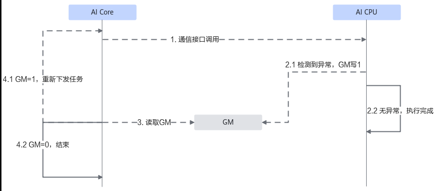

# 特性场景

> **Section**: 3.3.5.2.3  
> **PDF Pages**: 549–549  

---

<!-- page 549 -->

```cpp
return true;}
```

**----结束**

## 3.3.5.2.3 特性场景

重执行

为避免执行通信任务的环境中硬件闪断导致发生通信中断，通算融合算子可通过配置编译宏与环境变量，开启重执行能力。通算融合算子开启重执行后，AI CPU在检测到环境异常时，通过下图示意的机制，通知AI Core重新下发通信任务，避免由于硬件闪断造成的通信中断，提升通信稳定性。

当前，该能力的支持情况如下：

Atlas 350 加速卡不支持通算融合算子的重执行。

Atlas A2 训练系列产品/Atlas A2 推理系列产品不支持通算融合算子的重执行。

Atlas A3 训练系列产品/Atlas A3 推理系列产品支持通算融合算子的重执行。

图3-78通信任务重执行机制



开启重执行的条件如下：

●通算融合算子的输出内存地址和输入内存地址不相同。

●通算融合算子仅存在Server间通信（Server为计算节点，通常是8卡或16卡的昇腾NPU设备组成的服务器形态的统称）。

●算子编译时，配置编译宏AICORE_EXCEPTION_RESTART，如下所示。具体的编译宏配置阶段和方式请参考支持自定义编译选项。add_ops_compile_options(ALL OPTIONS -DAICORE_EXCEPTION_RESTART)

●配置HCCL重执行环境变量HCCL_OP_RETRY_ENABLE，开启重执行的检测和上报能力，该环境变量的说明请参考《环境变量参考》“集合通信 > 可靠性相关 >HCCL_OP_RETRY_ENABLE”。请在算子执行前设置该环境变量，具体配置如下：# server间L1需配置为1, 不支持跨超节点，L2配置为0。export HCCL_OP_RETRY_ENABLE="L1:1, L2:0"

注意，开启重执行后，若AI Core第一次下发通信任务后通信中断，默认只重执行一次。若需修改重执行次数或重传间隔时间，请参考《环境变量参考》“集合通信 > 可靠性相关 > HCCL_OP_RETRY_PARAMS”。
