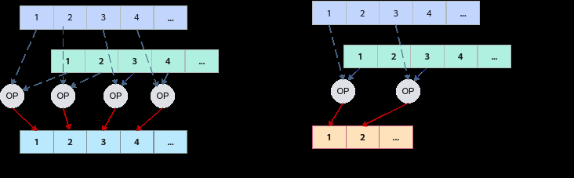
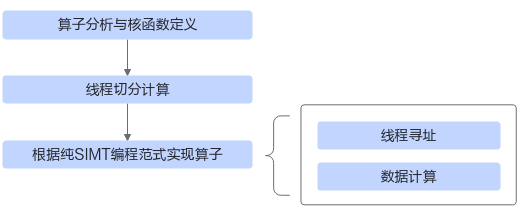

# 基础知识

> **Section**: 3.4.1  
> **PDF Pages**: 550–553  

---

<!-- page 550 -->

## 3.4 SIMT 算子实现

## 3.4.1 基础知识

说明

纯SIMT编程场景当前不支持使用SIMT API，敬请期待后续版本的正式发布。

本节内容为使用SIMT API进行SIMT编程的指导。

与SIMD编程不同，在SIMT编程中Global Memory上的数据可以被直接读取和使用。SIMT编程常通过组织线程的层次结构来实现数据切分，使用threadIdx等SIMT BuiltIn关键字计算线程应处理的数据索引，完成对应数据的计算，从而将函数的实现简化为标量计算。

SIMT是Ascend C单指令多线程的编程抽象，允许一条指令对数据进行独立寻址，更加灵活，如下图所示，对于离散访问的算子，适合使用SIMT编程实现，例如Scatter类与Gather类算子。此外，线程可以独立执行，每个线程具有较高的灵活性，能够执行不同的逻辑分支以完成复杂的逻辑实现。



## 3.4.2 算子实现

本章节将以Gather类算子为例，介绍SIMT算子实现的基本流程，如下图所示：



●算子分析与核函数定义：明确算子的输入和输出，分析最大线程数的设置方案。明确算子核函数名、输入输出参数，确定动态参数空间大小，配置最大线程数。

●Host侧线程切分计算：根据输入数据的shape信息，计算和设置gridDim、blockDim等参数。

<!-- page 551 -->

●Kernel侧算子实现：实现单线程内的计算逻辑。

下文将对上述步骤进行详细介绍。完整的算子实现请参考pure_simt_gather算子实现样例。

算子分析与核函数定义

算子分析具体步骤如下：

步骤1明确算子的功能和计算逻辑。

gather算子的功能为从输入张量中获取指定索引行的数据，即从形状为M * N的二维向量input中获取指定索引的m行数据，这m行的行索引由输入index指定。算子输出output第i行数据的计算公式为：

```cpp
output[i] = input[index[i]]
```

步骤2明确算子的输入和输出。

●gather算子有两个输入：input与index；输出为output。

●本样例中算子输入input的数据类型支持float、half、int32_t，index的数据类型为uint32_t，算子输出的数据类型与输入的数据类型相同。

●每个线程处理一行数据，需要传入每行数据的长度in_width以及需要处理的总行数index_total_length，以确保尾部线程不会进行无效操作。

●在算子实现中，无需使用大量临时变量，为了提高性能，可以在默认最大线程数（1024）的基础上适当增大核函数的最大线程数。

步骤3明确函数名称和参数。

●自定义核函数名称，本样例中核函数命名为gather_custom。

●通过分析算子的输入和输出，使用模板参数来支持不同的输入输出数据类型。

模板参数名模板参数类型参数定义

type_datatypename输入输出的数据类型

type_idxtypenameindex的数据类型

函数入参定义如下：

参数名参数类型参数定义

inputtype_data*输入数据在Global Memory上的内存地址

indextype_idx*索引数据在Global Memory上的内存地址

gather_outputtype_data*输出数据在Global Memory上的内存地址

in_widthuint32_t输入数据第二维的长度（列宽）

index_total_length

uint32_tindex数据的总长度

步骤4明确SIMT核函数gridDim、blockDim等动态参数设置方案。

<!-- page 552 -->

●本样例采用均匀切分方案，根据可用核数和最大线程数的限制，计算和调整gridDim（启用的线程块的个数）、blockDim（一个线程块启用的的线程个数），同时保证gridDim不超过65535、blockDim不超过最大线程数2048。

●本算子实现逻辑中无需使用动态UB空间。

**----结束**

通过以上分析，得到SIMT Gather算子的设计规格如下：

●算子类型（OpType）：Gather

●算子输入输出：

表3-15 Gather 算子输入输出规格

**nameshapedata typeformat**

input（输入）(M, N)float/half/int32_tND

index（输入）(m), m < Muint32_tND

output（输出）(m, N)float/half/int32_tND

●核函数名称：gather_custom

核函数定义如下：

```cpp
constexpr uint32_t MAX_THREAD_COUNT = 2048;
template <typename type_data, typename type_idx>__global__ __launch_bounds__(MAX_THREAD_COUNT) void gather_custom(    type_data* input,    type_idx* index,    type_data* gather_output,    uint32_t in_width,    uint32_t index_total_length)
```

说明

在定义核函数时，使用__launch_bounds__(MAX_THREAD_COUNT)来指定最大线程数。最大线程数的设置范围为1到2048。设置的最大线程数越大，支持启用的线程越多，性能越好，但每个线程可使用的内部寄存器数量会减少。若未设置，最大线程数默认值为1024。在上述分析中已明确计算不需要过多寄存器，因此设置最大线程数为2048。在实际的算子开发过程中，应根据具体的算子实现来调整该值。

## Host 侧线程切分计算

本样例以简单的均匀切分方案介绍如何实现动态切分参数的计算。

步骤1设置初始gridDim。

考虑到如果gridDim设置得比实际AIV核数少，会导致空闲核浪费，因此将初始gridDim设置为当前芯片的实际AIV核数量。AIV数量的获取方法如下所示：uint32_t real_core_num = 0;const auto& platformInfoMgr = platform_ascendc::PlatformAscendCManager::GetInstance();real_core_num = platformInfoMgr->GetCoreNumAiv();block_num = real_core_num; // block_num为初始gridDim

步骤2计算blockDim。

<!-- page 553 -->

根据输入index的长度index_total_length、初始gridDim计算一个线程块启用的的线程个数blockDim。

// thread_num_per_block为blockDim值thread_num_per_block = (index_total_length + block_num - 1) / block_num;

步骤3调整blockDim。

若blockDim超出最大线程数限制，调整blockDim值为最大线程数值。

```cpp
if (thread_num_per_block > MAX_THREAD_COUNT) {    thread_num_per_block = MAX_THREAD_COUNT;}
```

步骤4调整gridDim。

重新计算gridDim，确保gridDim * blockDim > index_total_length，即确保所有启用的线程能够处理完指定行数的数据。

```cpp
block_num = (index_total_length + thread_num_per_block - 1) / thread_num_per_block;
```

**----结束**

完整的切分计算代码如下：

```cpp
constexpr uint32_t MAX_THREAD_COUNT = 2048;constexpr uint32_t MAX_BLOCK_COUNT = 65535;
bool block_split(uint32_t index_total_length, uint32_t &block_num, uint32_t &thread_num_per_block) {    uint32_t real_core_num = 0;
    const auto& platformInfoMgr = platform_ascendc::PlatformAscendCManager::GetInstance();
    if (platformInfoMgr == nullptr) {        std::cout << "[ERROR] Get platform info failed, please check device status."<< std::endl;
        return false;    }    real_core_num = platformInfoMgr->GetCoreNumAiv();
    block_num = real_core_num;
    thread_num_per_block = (index_total_length + block_num -1) / block_num;
    if (thread_num_per_block > MAX_THREAD_COUNT) {        thread_num_per_block = MAX_THREAD_COUNT;
        block_num = (index_total_length + thread_num_per_block - 1) / thread_num_per_block;
        if (block_num > MAX_BLOCK_COUNT) {        std::cout << "[ERROR] index_total_length: "<< index_total_length << " can not be bigger than "            << MAX_THREAD_COUNT * MAX_BLOCK_COUNT<< "."<< std::endl;
        return false;        }    }    return true;}
```

## Kernel 侧算子实现

步骤1根据均匀切分算法，获取当前线程的位置偏移量。

在本算子中，仅使用gridDim、blockDim等线程维度的第一维，因此计算偏移量时只需考虑x维信息。如下代码所示，threadIdx表示线程在其所在线程块内的索引，blockDim表示一个线程块中设置的线程数，而blockIdx表示线程块的索引。

// 计算线程索引int32_t out_row = blockIdx.x * blockDim.x + threadIdx.x;

步骤2根据线程索引，获取当前线程需要处理数据的行索引，计算对应的输入、输出位置偏移量，实现整行数据的获取采集。

```cpp
uint32_t in_row = index[out_row];int input_idx = in_row * in_width;int output_idx = out_row * in_width;
```
