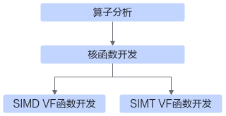
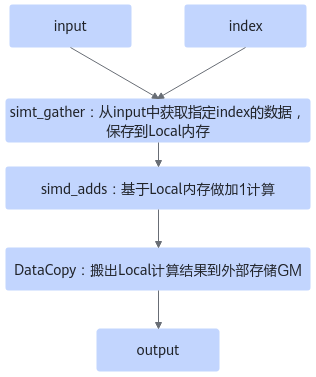

# 基础知识

> **Section**: 3.5.1  
> **PDF Pages**: 555–560  

---

<!-- page 555 -->

## 3.5.1 基础知识

本节内容为使用Reg矢量计算API和SIMT API进行SIMD与SIMT混合编程的指导。

在Vector Core中，SIMT单元和SIMD单元共享片上存储，因此可以利用片上存储Unified Buffer完成SIMD与SIMT混合编程，具体硬件架构的介绍请参考2.6.2.4 NPU架构版本351x。在进行后续内容的学习前，请先了解SIMD与SIMT混合编程的编程模型：2.2.3.4 SIMD与SIMT混合编程。

**SIMD编程提供了基于寄存器（Regbase）开发的Reg矢量计算API，Reg矢量计算API可以直接操作Vector Core中的SIMD寄存器，API单次处理的数据量上限等于寄存器的大小，通过GetVecLen接口获取该值。在算子实现中，需要多次调用Reg矢量计算API完成对单核数据的处理。**

与SIMD编程不同的是，在SIMT编程中Global Memory上的数据可以被直接读取和使用。SIMT编程常通过组织线程的层次结构来实现数据的切分，使用threadIdx等SIMTBuiltIn关键字计算线程应处理的数据索引，完成索引对应数据的计算，从而将函数实现简化为标量计算。

## 3.5.2 算子实现

说明

本样例的目的是通过一个简单的算子实现展示SIMD与SIMT混合编程方式，不是该算子功能的最佳实践。

基于SIMD与SIMT混合编程方式实现矢量算子核函数的流程如下图所示。

图3-79 SIMD 与SIMT 混合核函数实现流程



●算子分析：分析算子的输入、输出、数学表达式和计算逻辑。

●核函数开发：定义并实现Ascend C算子入口函数。

●SIMD VF函数开发：定义并实现SIMD VF入口函数。

●SIMT VF函数开发：定义并实现SIMT VF入口函数。

以下内容以从长度为10万的一维向量中提取指定索引的8192个数据，并对提取的数据分别执行加1运算的gather & adds算子为例，对上述步骤进行详细说明。本样例中介绍的算子完整代码请参见SIMD与SIMT混合编程实现gather&adds算子样例。

算子分析

算子分析具体步骤如下：

<!-- page 556 -->

步骤1明确算子的输入和输出。

●gather & adds算子有两个输入input与index，input是原始数据，index是要获取的数据在input中的索引；输出为output。

●本样例中算子的输入input支持的数据类型为float，输入index支持的数据类型为uint32_t，输出output的数据类型与输入input的数据类型相同。

●算子输入input支持的shape为[100000]；输入index支持的shape为[8192]，且index数据取值在[0, 100000)范围内；输出output的shape与输入index的shape相同。

●算子输入支持的format为：ND。

步骤2明确算子的数学表达式及计算逻辑。

gather & adds算子输出output中第i个数据为：

```cpp
output[i] = input[index[i]] + 1
```

计算逻辑如下：

●使用SIMT编程方式从输入input（Global Memory）中获取指定索引的数据，存储到Unified Buffer上。

●使用SIMD编程方式在片上存储（Unified Buffer）做数据加1运算。

●将Unified Buffer上的计算结果搬出到外部存储（Global Memory）上。

图3-80算子计算逻辑



说明

simd_adds中加1运算实际可以在simt_gather函数中快速实现，本样例的目的是通过一个简单的算子实现展示SIMD与SIMT混合编程方式，不是该算子功能的最佳实践。

<!-- page 557 -->

步骤3确定核函数名称和参数。

●本样例中核函数命名为gather_and_adds_kernel。

●根据对算子输入输出的分析，确定核函数有5个参数input，index，output，input_total_length，index_total_length；input，index为输入在Global Memory上的内存地址，output为输出在Global Memory上的内存地址，input_total_length是input的数据长度，index_total_length是index的数据长度，也是output的数据长度。

步骤4明确分核策略、SIMT线程配置和SIMD Reg矢量计算API循环调用次数。

本例中算子输入index的形状为8192，可设置核数为8，每个核处理数据量为1024。

对于SIMT实现，可设置线程数为1024，每个线程处理1个数据，单个核只需调用1次simt_gather函数即可完成gather运算。

对于SIMD Reg矢量计算实现，单核处理数据量为1024，Reg矢量计算API单次处理的数据长度one_repeat_size为GetVecLen/sizeof(float)，API的循环调用次数repeat_times为1024/one_repeat_size。

步骤5确定SIMT VF函数名称和参数。

●本样例中SIMT VF函数命名为simt_gather。

●根据SIMT线程配置策略，确定SIMT VF函数有6个参数input，index，gather_output，input_total_length，index_total_length，output_total_length；input，index为输入在Global Memory上的内存地址，gather_output为输出在Unified Buffer上的内存地址，input_total_length是input的数据长度，index_total_length是index的数据长度，output_total_length是单核上gather_output的数据长度。

步骤6确定SIMD VF函数名称和参数

●本样例中SIMD VF函数命名为simd_adds。

●根据上述SIMD策略，确定SIMD VF函数有5个参数output，input，count，one_repeat_size，repeat_times；output为输出在Unified Buffer上的内存地址，input为输入在Unified Buffer上的内存地址，count是单核处理的数据总量，one_repeat_size是单次循环处理的数据量，repeat_times是Reg矢量计算API循环调用次数。

**----结束**

通过以上分析，得到Ascend C gather & adds算子的设计规格如下：

●算子类型（OpType）：Gather_Adds

●算子输入输出：

表3-16 gather & adds 算子输入输出规格

**nameshapedata typeformat**

input（输入）100000floatND

index（输入）8192uint32_tND

output（输出）8192floatND

<!-- page 558 -->

●核数：8

●SIMT线程数：1024

●核函数名称：gather_and_adds_kernel

●SIMT VF函数名称：simt_gather

●SIMD VF函数名称：simd_adds

●算子实现文件名称：gather_and_adds.asc

核函数定义与实现

根据核函数中介绍的规则进行核函数的定义。

步骤1函数原型定义

本样例中，函数名为gather_and_adds_kernel（核函数名称可自定义），根据上述分析，函数原型定义如下：

```cpp
__global__ __aicore__ void gather_and_adds_kernel(__gm__ float* input, __gm__ uint32_t* index, __gm__ float* output, uint32_t input_total_length, uint32_t index_total_length){}
```

步骤2启动SIMT VF函数simt_gather，从input中获取指定索引的数据。

1.计算单核应处理的数据量。数据总量为index_total_length，除以核数即可得到单核应处理的数据量。uint32_t index_total_length_per_block = index_total_length / AscendC::GetBlockNum();

2.使用Alloc接口申请Unified Buffer内存空间，并将该Tensor作为simt_gather函数的输出。

3.使用asc_vf_call接口启动SIMT_VF函数simt_gather。第一个参数为dim3结构，代表线程的三维层次结构，本例中初始化为dim3(1024)，使用一维定义方式，线程总数为1024。

```cpp
constexpr uint32_t THREAD_COUNT = 1024;
```

__global__ __aicore__ void gather_and_adds_kernel(__gm__ float* input, __gm__ uint32_t* index, __gm__ float* output, uint32_t input_total_length, uint32_t index_total_length){    // 设置kernel type为AIV_ONLY    KERNEL_TASK_TYPE_DEFAULT(KERNEL_TYPE_AIV_ONLY);    // 定义UB内存分配对象    AscendC::LocalMemAllocator<AscendC::Hardware::UB> ub_allocator;

// 计算单核应处理的数据量    uint32_t index_total_length_per_block = index_total_length / AscendC::GetBlockNum();    // 申请UB内存作为simt_gather的输出    AscendC::LocalTensor<float> gather_output = ub_allocator.Alloc<float>(index_total_length_per_block);    // 1. 调用simt函数获取指定索引的1024个数据    asc_vf_call<simt_gather>(dim3(THREAD_COUNT), input, index,                             (__ubuf__ float *)gather_output.GetPhyAddr(),                             input_total_length,                             index_total_length,                             index_total_length_per_block);

// 2. 调用SIMD函数完成加1操作    ...

// 3. 将数据搬运到GM    ...}

<!-- page 559 -->

步骤3启动SIMD VF函数simd_adds，对Unified Buffer上的数据做加1计算。

1.使用Alloc接口申请Unified Buffer内存空间，并将该Tensor作为simt_adds函数的输出。

2.使用GetVecLen接口除以单个数据长度，计算Reg矢量计算API单次处理的数据量one_repeat_size。使用单核应处理的数据量index_total_length_per_block除以单次处理数据量one_repeat_size，计算Reg矢量计算API循环调用次数。

3.使用asc_vf_call接口启动SIMD VF函数simd_adds。

__global__ __aicore__ void gather_and_adds_kernel(__gm__ float *input, __gm__ uint32_t *index, __gm__ float *output, uint32_t input_total_length, uint32_t index_total_length){    // 1. 调用simt函数获取指定索引的1024个数据    ...

// 申请UB作为simd_adds的输出    AscendC::LocalTensor<float> adds_output = ub_allocator.Alloc<float>(index_total_length_per_block);    // 计算Reg矢量计算API单次调用处理的数据量    constexpr uint32_t one_repeat_size = AscendC::GetVecLen() / sizeof(float);    // 计算Reg矢量计算API循环调用次数    uint16_t repeat_times = (index_total_length_per_block + one_repeat_size - 1) / one_repeat_size;    // 2. 调用SIMD函数完成加1操作    asc_vf_call<simd_adds>((__ubuf__ float *)adds_output.GetPhyAddr(),        (__ubuf__ float *)gather_output.GetPhyAddr(), index_total_length_per_block, one_repeat_size, repeat_times);

// 依赖PIPE_V和PIPE_MTE3流水同步    AscendC::SetFlag<AscendC::HardEvent::V_MTE3>(0);    AscendC::WaitFlag<AscendC::HardEvent::V_MTE3>(0);

// 3. 将数据搬运到GM    ...}

步骤4使用DataCopy接口将结果数据搬运到Global Memory。

__global__ __aicore__ void gather_and_adds_kernel(__gm__ float* input, __gm__ uint32_t* index, __gm__ float* output, uint32_t input_total_length, uint32_t index_total_length){    // 1. 调用simt函数获取指定索引的1024个数据    ...

// 2. 调用SIMD函数完成加1操作    ...

// 3. 将数据搬运到GM    // 定义GlobalTensor对象，用于数据搬运    AscendC::GlobalTensor<float> output_global_tensor;    // 根据核偏移初始化GlobalTensor地址    output_global_tensor.SetGlobalBuffer(output + index_total_length_per_block * AscendC::GetBlockIdx());    // 调用数据搬运接口将数据搬运到GM    AscendC::DataCopy(output_global_tensor, adds_output, index_total_length_per_block);}

**----结束**

## SIMT VF 函数定义与实现

步骤1定义函数原型。

根据上述对SIMT VF函数的参数分析，定义SIMT VF函数原型。使用__simt_vf__函数类型限定符标识SIMT VF核函数入口，使其可以被asc_vf_call调用。

<!-- page 560 -->

说明

在SIMT 编程中，__launch_bounds__(thread_num)是可选配置，用于在编译期指定核函数启动的最大线程数（如果不配置，thread_num默认为1024），使用时请注意：thread_num >= x * y* z （即：asc_vf_call的第一个参数：dim3{x, y, z}）, 线程数thread_num的取值范围为1到2048。最大线程数决定了每个线程可分配的寄存器数量，具体对应关系请见表2-23，寄存器用于存储线程中的局部变量，若局部变量的个数超出寄存器个数，容易出现栈溢出等问题。

```cpp
constexpr uint32_t THREAD_COUNT = 1024;
__simt_vf__ __launch_bounds__(THREAD_COUNT) inline void simt_gather(    __gm__ float* input,    __gm__ uint32_t* index,    __ubuf__ float* gather_output,    uint32_t input_total_length,    uint32_t index_total_length,    uint32_t output_total_length){}
```

步骤2实现函数。

simt_gather函数实现从输入input（Global Memory）中获取指定索引的数据。基于上述数据切分策略，首先计算线程应处理数据的索引，然后通过赋值操作将数据存储到Unified Buffer上。

本例中核数设置为8，线程的层次结构为{1024, 1, 1}，数据总量为8192（8 *1024）。每个线程只需处理一个数据，应处理数据在index中的索引计算逻辑为：当前核id*每核线程数+当前线程的id，代码如下：int idx = blockIdx.x * blockDim.x + threadIdx.x;

**blockIdx用于获取当前核id。blockDim用于获取线程三维层次结构{x, y, z}，本例中为{1024, 1, 1}，其中第2，3维度均为1，使用一维层次结构，因此线程数可写作blockDim.x。threadIdx用于获取三维线程索引{x, y, z}，本例中仅使用第1维x，可通过threadIdx.x获取当前线程的id。**

__simt_vf__ __launch_bounds__(THREAD_COUNT) inline void simt_gather(    __gm__ float* input,    __gm__ uint32_t* index,    __ubuf__ float* gather_output,    uint32_t input_total_length,    uint32_t index_total_length,    uint32_t output_total_length){    // 异常判断，防止越界    if (threadIdx.x >= output_total_length) {        return;    }

// 计算线程应处理的数据在输入index的索引    int idx = blockIdx.x * blockDim.x + threadIdx.x;    // 异常判断，防止越界    if (idx >= index_total_length) {        return;    }

// 读取线程应获取的数据在输入input中的索引    uint32_t gather_idx = index[idx];    // 异常判断，防止越界    if (gather_idx >= input_total_length) {        return;    }

// 将input中索引为gather_idx的数据存到UB上
