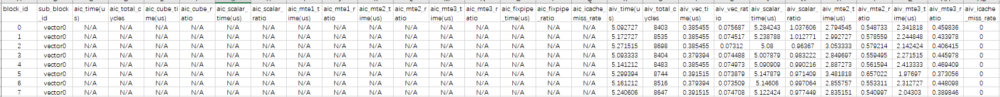
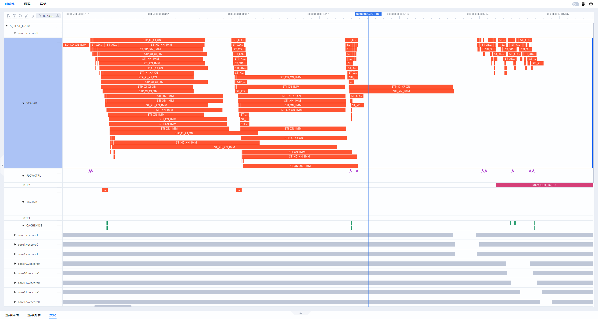

# 算子调试

> **Section**: 3.6.3  
> **PDF Pages**: 564–565  

---

<!-- page 564 -->

【正例】

// 输入参数仅进行读操作inputQueryGMTensor.SetGlobalBuffer(query);

// 输出参数attention指针本身是只读，但其指向的内存可以读写outputAttentionGMTensor.SetGlobalBuffer(attention);...DataCopy(outputAttentionGMTensor, outputAttentionLocalTensor, count);

## 3.6.3 算子调试

从异构计算章节可以了解到Ascend C算子主要包括Tiling和Kernel实现两部分组成。

Tiling实现运行在Host侧CPU上，一般使用传统的调测手段（比如gdb工具）即可完成调试。

Kernel实现运行在Device侧NPU上，Ascend C提供了多种调试方式，包括孪生调试、上板调试等，具体的调试方法请参考算子调试。

## 3.7 性能分析

## 3.7.1 获取性能数据

在进行性能优化之前，需要拿到准确的性能数据，了解性能现状，并根据性能现状分析下一步的优化方向。Ascend C提供了多种性能测试方法，包括上板Profiling、单算子性能仿真流水图等手段。

上板Profiling

如下命令行是一个算子上板性能数据采集的示例，可以根据自身的需要灵活组合配置参数。示例中--output为可选参数，用于指定收集到的性能数据的存放路径；$HOME/projects/MyApp/out/main为算子可执行文件。

```cpp
msprof op --output=$HOME/projects/output $HOME/projects/MyApp/out/main
```

如下示例则展示了部分性能数据文件的样例：

图3-82 PipeUtilization.csv（计算单元和搬运单元耗时占比）文件示例



详细的字段说明和性能分析工具的具体使用方法请参考《算子开发工具》。

算子仿真流水图

算子调优工具msProf支持仿真环境下的性能数据采集和自动解析。使用msProf工具获取仿真流水图的具体方式请参考《算子开发工具》。

支持以下两种可视化呈现方式：

●Chrome浏览器

<!-- page 565 -->

在Chrome浏览器中输入“chrome://tracing”地址，并将通过msprof opsimulator生成指令流水图文件（trace.json）拖到空白处打开，键盘上输入快捷键（W：放大，S：缩小，A：左移，D：右移）可进行查看。


●指令流水图支持MindStudio Insight可视化呈现，MindStudio Insight工具以时序图方式为用户提供指令在昇腾AI处理器上的运行情况，用户可通过分析时序图中的指令详情、指令执行时间、指令关联代码的调用栈及指令/流水间同步连线等信息，识别微观指令的时序优化点。

图3-83时间线界面



说明

本文部分样例中展示的算子仿真流水图和上述两种可视化呈现方式不一致，但是其中的关键字段含义是对应的，开发者可以参考《算子开发工具》查看具体字段的含义。
