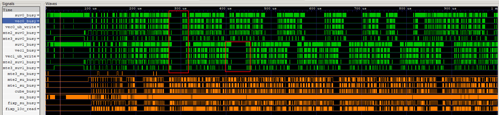

# 优化建议总览表

> **Section**: 3.8.1  
> **PDF Pages**: 568–568  

---

<!-- page 568 -->

图3-87仿真流水图示例

上图示例中为某款AI处理器上获取的数据，可以看到Vector核的相关流水（vec0的MTE2、MTE3，vec1的MTE2、MTE3等）有规律性的断流现象。可以结合算子逻辑分析，是否存在数据依赖等因素导致断流。那么下一步的主要优化方向为流水优化，其次结合Tiling优化和内存优化等手段进一步提升Vector流水利用率。

●方法四：通过上板Profiling查看头开销

头开销是算子执行计算前产生的时延，包含核启动、核取址TLB MISS、同地址访问（由于硬件限制，多核同时访问相同内存地址冲突带来额外的时延）以及变量资源初始化带来的时延。以Atlas A2 训练系列产品/Atlas A2 推理系列产品为例，满核头开销约为20~21微秒。对于推理领域等本身延迟为微秒级别的算子，头开销是一个值得优化的对象。

通过上板Profiling数据（空Kernel时的TaskDuration数据）可以看到每个核的启动开销耗时，继而通过使用恰当的核数和算子Kernel Type等方法来不断的实践，尝试找到最优的配置，具体优化方向可以参考3.8.3 头尾开销优化。

## 3.8 SIMD 算子性能优化

## 3.8.1 优化建议总览表

表3-17性能优化建议总览表

分类分类描述优化建议

**Tiling策略**

提供Tiling相关的优化建议，便于开发者选择合适的Tiling切分策略。

核间负载均衡

设置合适的核数和算子Kernel类型

头尾开销优化

提供降低算子头尾开销（算子执行计算前后产生的时延）的优化建议。

限制TilingData结构大小

避免TPipe在对象内创建和初始化

核函数内删除Workspace相关冗余操作

设置DCI编译选项来减少算子尾开销

使能DoubleBuffer

流水编排

通过任务并行化、异步调度等方法，提升硬件资源利用率，实现更高的吞吐率。

使能Iterate或IterateAll异步接口避免AIC/AIV同步依赖
