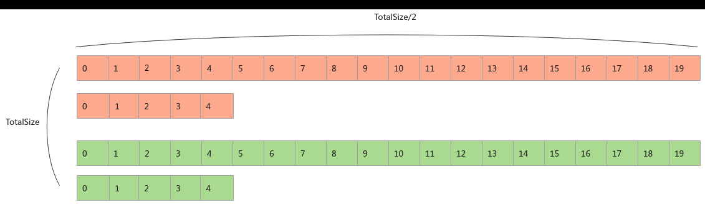
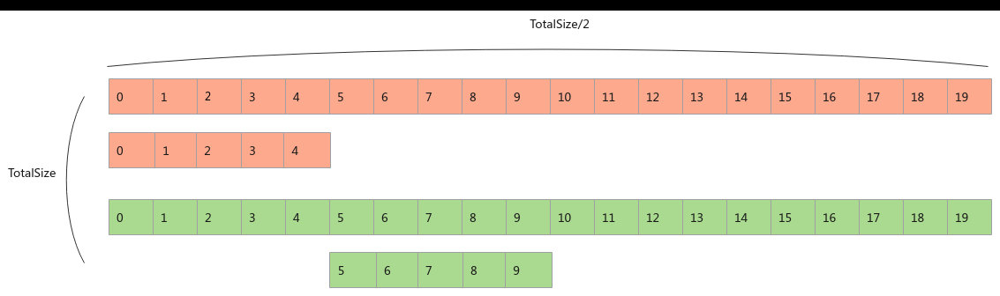

# 设置合适的核数和算子Kernel类型

> **Section**: 3.8.3.1  
> **PDF Pages**: 570–570  

---

<!-- page 570 -->

处理，由于AI处理器的核数为20，因此每次计算时，1到5核的每个核需要多算一份数据，导致发生拖尾的情况。

【反例】

图3-88计算拖尾示意图

【正例】

针对上述切分策略，调整拖尾核的位置后可以达到全局负载最优，如图2所示。完成所有计算时，1到10核多一次数据块的计算，可以实现全局负载最优。

图3-89核间负载均衡示意图

## 3.8.3 头尾开销优化

## 3.8.3.1 设置合适的核数和算子Kernel 类型

在算子执行过程中，可能会因为以下几个原因产生额外的启动开销或者头开销：

1.核启动：每个核在启动时需要进行初始化操作，加载必要的配置和资源。

2.核取址TLB MISS：当核在访问内存时，如果Translation Lookaside Buffer（TLB）中没有对应的页表项，就需要从内存中加载页表项，这会导致额外的延迟。

3.同地址访问冲突：由于硬件限制，多个核同时访问相同的内存地址时可能会发生冲突，导致额外的时延。

4.变量资源初始化：在算子执行前，需要初始化一些变量和资源，这也可能带来额外的性能开销。

头开销会随着使用的核数增加而增加。下图展示了这部分头开销随启动核数的变化情况。
