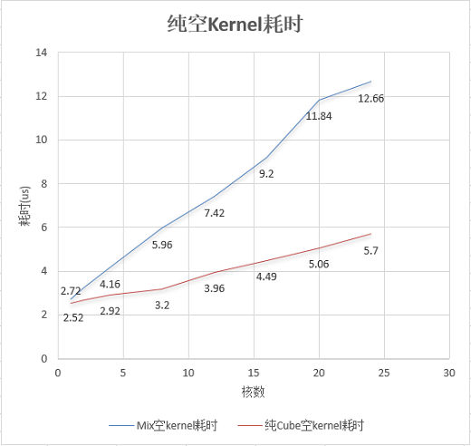

# 限制TilingData结构大小

> **Section**: 3.8.3.2  
> **PDF Pages**: 571–572  

---

<!-- page 571 -->

图3-90头开销随启动核数的变化



对于整体耗时在微秒级别且单核计算量耗时较少的算子，可以通过减少启动核数并增加单核计算量的方式来获得性能提升。这种优化方式的本质是在头开销耗时和单核计算量耗时之间进行权衡。为了达到最佳性能，开发者需要通过实践尝试，找到最合适的核数设置。

●对于自定义算子工程，可以在TilingFunc（算子工程提供的在Host侧计算Tiling的默认函数）中通过SetBlockDim接口来设置算子使用的核数，具体设置方法请参考SetBlockDim；对于Kernel直调工程，可以在<<<>>>调用时指定算子使用的核数。

●此外，算子的Kernel类型也会影响算子启动的核数。以纯Vector算子为例，如果以混合启动的方式执行该算子，调度器会同时启动Vector核和Cube核。然而，此时Cube核并没有实际的计算指令，但仍会产生核启动和核初始化的头开销。因此，建议设置合适的Kernel类型以最小化头开销。

通常，算子工程会通过算子使用的指令自动识别算子类型，但该功能无法区分AIC和AIV的配比，默认按照AIV:AIC为1:2的配比下发任务。此外，自动识别功能可能失效，因为其依赖于编译优化的结果。所以推荐用户手动设置算子的Kernel类型。具体设置方法请参考设置Kernel类型。

## 3.8.3.2 限制TilingData 结构大小

【优先级】中

<!-- page 572 -->

【描述】TilingData结构是Tiling切分信息的载体，当Host侧按照Tiling切分策略计算完Tiling后，算子会以入参的方式将Tiling切分信息从Host侧传递到Device侧，此时Tiling信息存放在GM上。调用GET_TILING_DATA宏后，会将Tiling信息从GM拷贝到AI处理器的栈空间上，期间会有拷贝开销，由于GM访问效率较低，同时考虑到栈空间限制，需要限制TilingData结构大小。拷贝耗时为us级别，在小shape的场景下，进行此类优化收益会更加明显。

限制TilingData结构大小，可以从以下方面考虑：

●减少不必要的TilingData结构变量；

●根据Tiling的数据范围选择合适的变量类型；

●合理排布TilingData结构；

●TilingData整体结构要求8字节补齐。

【反例】

●如下的示例中存在TilingData结构变量冗余的情况：NumBlocks信息已经通过SetBlockDim接口进行设置，可以在Kernel侧调用GetBlockNum接口获取，无需通过TilingData结构传递。

●此外，变量的数据类型也不合理：formerNum和tailNum分别为计算整块数据的核数和计算尾块数据的核数，不会超过NUM_BLOCKS的值，使用uint8_t类型即可；formerLength等变量根据其计算逻辑，不会超出uint32_t的范围，使用uint32_t类型即可。

// Tiling结构体定义BEGIN_TILING_DATA_DEF(TilingDataUnalign)  TILING_DATA_FIELD_DEF(uint64_t, numBlocks);  TILING_DATA_FIELD_DEF(uint64_t, formerNum);  TILING_DATA_FIELD_DEF(uint64_t, tailNum);  TILING_DATA_FIELD_DEF(uint64_t, formerLength);  TILING_DATA_FIELD_DEF(uint64_t, tailLength);  TILING_DATA_FIELD_DEF(uint64_t, alignNum);END_TILING_DATA_DEF;// Host侧Tiling函数计算Tiling结构信息constexpr uint32_t NUM_BLOCKS = 8;constexpr uint32_t SIZE_OF_HALF = 2;constexpr uint32_t BLOCK_SIZE = 32;constexpr uint32_t ALIGN_NUM = BLOCK_SIZE / SIZE_OF_HALF;static ge::graphStatus TilingFunc(gert::TilingContext *context){    TilingDataUnalign tiling;    uint32_t totalLength = context->GetInputTensor(0)->GetShapeSize();    // NumBlocks信息已经通过SetBlockDim接口进行设置    context->SetBlockDim(NUM_BLOCKS);    uint32_t totalLengthAligned = ((totalLength + ALIGN_NUM - 1) / ALIGN_NUM) * ALIGN_NUM;    // formerNum、tailNum保证不超过0-NUM_BLOCKS数据范围    uint32_t formerNum = (totalLengthAligned / ALIGN_NUM) % NUM_BLOCKS;    uint32_t tailNum = NUM_BLOCKS - formerNum;    // formerLength等变量根据其计算逻辑，不会超出uint32_t的范围    uint32_t formerLength = ((totalLengthAligned / NUM_BLOCKS + ALIGN_NUM - 1) / ALIGN_NUM) * ALIGN_NUM;    uint32_t tailLength = (totalLengthAligned / NUM_BLOCKS / ALIGN_NUM) * ALIGN_NUM;    ...}

【正例】

Tiling变量无冗余，变量数据类型最小化。

```cpp
BEGIN_TILING_DATA_DEF(TilingDataUnalign)  TILING_DATA_FIELD_DEF(uint8_t, formerNum);
  TILING_DATA_FIELD_DEF(uint8_t, tailNum);
   TILING_DATA_FIELD_DEF(uint32_t, formerLength);
```
