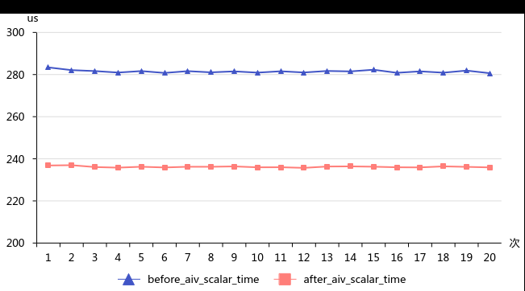
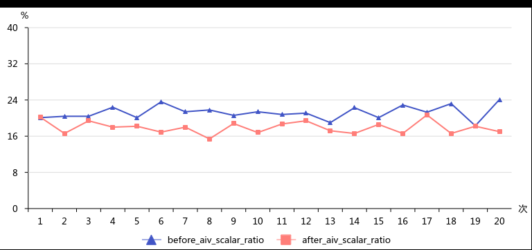

# 核函数内删除Workspace相关冗余操作

> **Section**: 3.8.3.4  
> **PDF Pages**: 575–575  

---

<!-- page 575 -->

图3-91 aiv_scalar_time 优化前后对比

图3-92 aiv_scalar_ratio 优化前后对比

通过性能数据对比可以看出，Scalar优化效果显著，平均时间从281us减少到236us，下降17%；平均scalar_time时延占比从21%下降到17%。因此在Scalar bound（达到上限）的场景下可以使用此优化措施。

## 3.8.3.4 核函数内删除Workspace 相关冗余操作

【优先级】中

【描述】在Ascend C算子工程中，编写核函数时传入的参数workspace已经直接赋值为用户Workspace，因此无需再通过SetSysWorkspace和GetUserWorkspace来设置和获取Workspace。减少这些冗余判断后，编译器可以在不使用该参数的情况下进一步优化未用到的workspace变量。

【反例】

fast_gelu函数的参数workspace等价于用户workspace，且不为空，仍然对workspace进行判空，并且设置SetSysWorkspace和GetUserWorkspace来获取用户Workspace。
