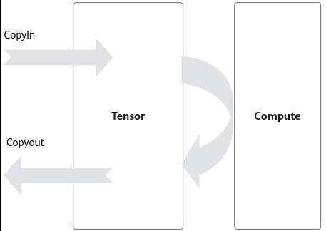
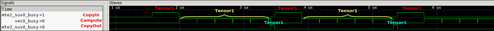
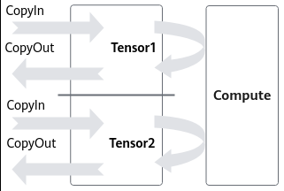
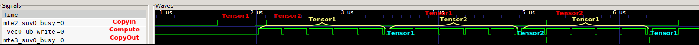

# 使能DoubleBuffer

> **Section**: 3.8.4.1  
> **PDF Pages**: 577–579  

---

<!-- page 577 -->

【描述】算子执行结束时，需要将DCache置为无效，防止后续算子继续使用DCache中的数据而受到影响。可以通过在编译选项中添加--cce-no-dcache-flush=true，用于在算子尾部增加DCI（DataCacheInvalid）指令来使DCache失效。如果不开启该选项，则会默认增加DCCI（DataCacheCleanAndInvalid）指令来使DCache失效。

插入DCI指令相比于插入DCCI指令，其减少了数据从DCache同步到GM（Clean）的过程，性能上会有一定优势。插入DCCI是一种额外的容错保证，如果开发者使用了*__gm__的方式改写GM内存，或者调用GlobalTensor.SetValue函数时，没有正确的调用DataCacheCleanAndInvalid接口来保证Cache一致性，编译框架自动插入DCCI恰好可以保证算子精度正常。

所以在如下场景，可以通过开启该编译选项来降低算子尾部开销：

●算子使用* __gm__的方式改写GM内存，或者调用GlobalTensor.SetValue函数时，正确的使用DataCacheCleanAndInvalid接口，手动将数据从DCache中回刷到GM上，保证Cache的一致性。不依赖编译框架自动插入DCCI指令来保证一致性。

●算子不包含使用* __gm__的方式改写GM内存，或者调用GlobalTensor.SetValue函数的代码。

## 3.8.4 流水编排

## 3.8.4.1 使能DoubleBuffer

【优先级】中

【描述】执行于AI Core上的指令队列主要包括如下几类，Vector指令队列（V）、Cube指令队列（M）、Scalar指令队列（S）和搬运指令队列（MTE1/MTE2/MTE3）。不同指令队列间的相互独立性和可并行执行特性，是DoubleBuffer优化机制的基石。

以纯Vector计算为例，矢量计算前后的CopyIn、CopyOut过程使用搬运指令队列（MTE2/MTE3），Compute过程使用Vector指令队列（V），不同指令队列可并行执行，意味着CopyIn、CopyOut过程和Compute过程是可以并行的。如图3-93所示，考虑一个完整的数据搬运和计算过程，CopyIn过程将数据从Global Memory搬运到LocalMemory，Vector计算单元完成Compute计算后，经过CopyOut过程将计算结果搬回Global Memory。

<!-- page 578 -->

图3-93数据搬运与Vector 计算过程



图3-94未使能DoubleBuffer 的流水图



在此过程中，数据搬运与Vector计算串行执行，Vector计算单元不可避免存在资源闲置问题，假设CopyIn、Compute、CopyOut三阶段分别耗时相同均为t，则Vector的利用率仅为1/3，等待时间过长，Vector利用率严重不足。

为减少Vector等待时间，使能DoubleBuffer机制将待处理的数据一分为二，例如Tensor1、Tensor2。如图3-95所示，当Vector单元对Tensor1中数据进行Compute计算时，Tensor2数据流可以执行CopyIn的过程；而当Vector切换到计算Tensor2时，Tensor1数据流可以执行CopyOut的过程。由此，数据的进出搬运和Vector计算实现并行执行，Vector闲置问题得以有效缓解。

总体来说，DoubleBuffer是基于MTE指令队列与Vector指令队列的独立性和可并行性，通过将数据搬运与Vector计算并行执行以隐藏大部分的数据搬运时间，并降低Vector指令的等待时间，最终提高Vector单元的利用效率。通过为队列申请内存时设置内存块的个数为2，使能DoubleBuffer，实现数据并行，简单代码示例如下：

```cpp
pipe.InitBuffer(inQueueX, 2, 256);
```

<!-- page 579 -->

图3-95 DoubleBuffer 机制



图3-96使能DoubleBuffer 的流水图



需要注意：

多数情况下，采用DoubleBuffer能有效提升Vector的利用率，缩减算子执行时间。然而，DoubleBuffer机制缓解Vector闲置问题，并不代表它总能带来明显的整体性能提升。例如：

●当数据搬运时间较短，而Vector计算时间较长时，由于数据搬运在整个计算过程中的时间占比较低，DoubleBuffer机制带来的性能收益会偏小。

●当原始数据较小且Vector可一次性完成所有数据量的计算时，强行使用DoubleBuffer会降低Vector计算资源的利用率，最终效果可能适得其反。

因此，DoubleBuffer的使用需综合考虑Vector算力、数据量大小、搬运与计算时间占比等多种因素。

【反例】

__aicore__ inline void Init(__gm__ uint8_t* src0Gm, __gm__ uint8_t* src1Gm, __gm__ uint8_t* dstGm){    src0Global.SetGlobalBuffer((__gm__ half*)src0Gm);    src1Global.SetGlobalBuffer((__gm__ half*)src1Gm);    dstGlobal.SetGlobalBuffer((__gm__ half*)dstGm);    // 不使能DoubleBuffer,占用的物理空间是1 * sizeSrc0 * sizeof(half)    // 3个InitBuffer执行后总空间为1 * (sizeSrc0 * sizeof(half) + sizeSrc1 * sizeof(half) + sizeDst0 * sizeof(half))     pipe.InitBuffer(inQueueSrc0, 1, sizeSrc0 * sizeof(half));    pipe.InitBuffer(inQueueSrc1, 1, sizeSrc1 * sizeof(half));    pipe.InitBuffer(outQueueDst, 1, sizeDst0 * sizeof(half));    }__aicore__ inline void Process(){    // 需要round*2次循环才能处理完数据    for (uint32_t index = 0; index < round * 2; ++index) {        CopyIn(index);        Compute();        CopyOut(index);    }}

【正例】
