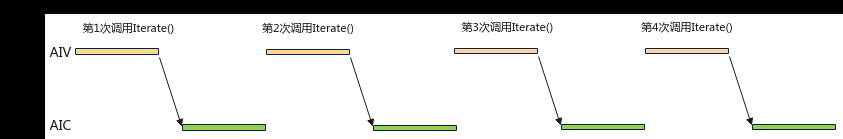
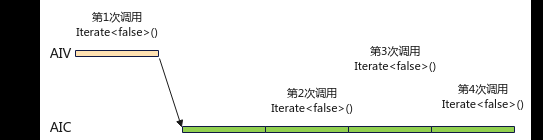

# 使能Iterate或IterateAll异步接口避免AIC/AIV同步依赖

> **Section**: 3.8.4.2  
> **PDF Pages**: 580–580  

---

<!-- page 580 -->

__aicore__ inline void Init(__gm__ uint8_t* src0Gm, __gm__ uint8_t* src1Gm, __gm__ uint8_t* dstGm){    src0Global.SetGlobalBuffer((__gm__ half*)src0Gm);    src1Global.SetGlobalBuffer((__gm__ half*)src1Gm);    dstGlobal.SetGlobalBuffer((__gm__ half*)dstGm);    // InitBuffer中使用2表示使能DoubleBuffer,占用的物理空间是2 * sizeSrc0 * sizeof(half)    // 3个InitBuffer执行后总空间为2 * (sizeSrc0 * sizeof(half) + sizeSrc1 * sizeof(half) + sizeDst0 * sizeof(half))     pipe.InitBuffer(inQueueSrc0, 2, sizeSrc0 * sizeof(half));    pipe.InitBuffer(inQueueSrc1, 2, sizeSrc1 * sizeof(half));    pipe.InitBuffer(outQueueDst, 2, sizeDst0 * sizeof(half));    }__aicore__ inline void Process(){    // 开启DoubleBuffer的前提是循环次数 >= 2    for (uint32_t index = 0; index < round; ++index) {        CopyIn(index);        Compute();        CopyOut(index);    }}

## 3.8.4.2 使能Iterate 或IterateAll 异步接口避免AIC/AIV 同步依赖

【优先级】高

【描述】在MIX场景，即AIC（AI Cube核）和AIV（AI Vector核）混合编程中，调用Matmul Iterate或者IterateAll时，AIV发送消息到AIC启动Matmul计算。若通过Iterate<true>同步方式，如图1 同步方式消息发送示意图，每次调用都会触发一次消息发送，而通过Iterate<false>异步方式，如图2 异步方式消息发送示意图，仅第一次需要发送消息，后续无需发送消息，从而减少Cube与Vector核间交互，减少核间通信开销。因此，MIX场景推荐使用Iterate<false>或者IterateAll<false>异步接口（注意：使用异步接口时需要设置Workspace）。

图3-97同步方式消息发送示意图



图3-98异步方式消息发送示意图



【反例】

MIX场景使用Iterate接口的同步方式。

```cpp
TQueBind<TPosition::CO2, TPosition::VECIN>  qVecIn;TQueBind<TPosition::VECIN, TPosition::VECOUT>  qVecOut;mm.SetTensorA(gmA);
```
