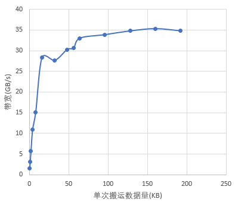
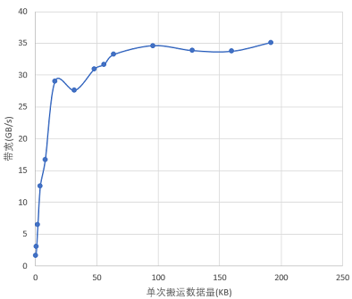
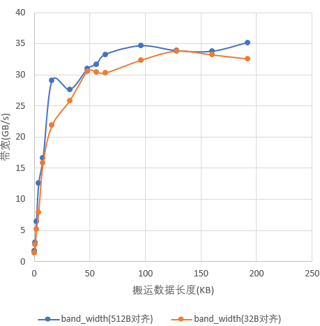

# GM地址尽量512B对齐

> **Section**: 3.8.5.2  
> **PDF Pages**: 582–583  

---

<!-- page 582 -->

图3-99 UB->GM 方向不同单次搬运数据量下实际占用带宽的变化

图3-100 GM->UB 方向不同单次搬运数据量下实际占用带宽的变化

## 3.8.5.2 GM 地址尽量512B 对齐

【优先级】高

【描述】由于AI处理器内部设计约束，从GM向Local Memory搬运数据时，保证GM地址512B对齐可以最有效的发挥出带宽的效率。如下图示例，展示了在512B对齐以及32B对齐情况下单核的带宽效率：搬运同等数据量，带宽差距最大的情况，32B对齐场景只能达到512B对齐场景的70%。

<!-- page 583 -->

说明

●本性能优化手段仅针对Atlas A2 训练系列产品/Atlas A2 推理系列产品生效。

●测试数据与处理器型号相关，且实际测试时可能会存在略微抖动，具体带宽数值并不一定和下文的测试数据严格一致。

图3-101 GM->UB 方向512B 对齐和32B 对齐实测带宽的差异对比

