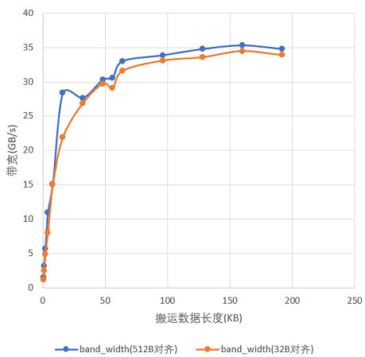

# 高效的使用搬运API

> **Section**: 3.8.5.3  
> **PDF Pages**: 584–584  

---

<!-- page 584 -->

图3-102 UB->GM 方向512B 对齐和32B 对齐实测带宽的差异对比

## 3.8.5.3 高效的使用搬运API

【优先级】高

【描述】在使用搬运API时，应该尽可能地通过配置搬运控制参数实现连续搬运或者固定间隔搬运，避免使用for循环，二者效率差距极大。如下图示例，图片的每一行为16KB，需要从每一行中搬运前2KB，针对这种场景，使用for循环遍历每行，每次仅能搬运2KB。若直接配置DataCopyParams参数（包含srcStride/dstStride/blockLen/blockCount），则可以达到一次搬完的效果，每次搬运32KB；参考3.8.5.1 尽量一次搬运较大的数据块章节介绍的搬运数据量和实际带宽的关系，建议一次搬完。
