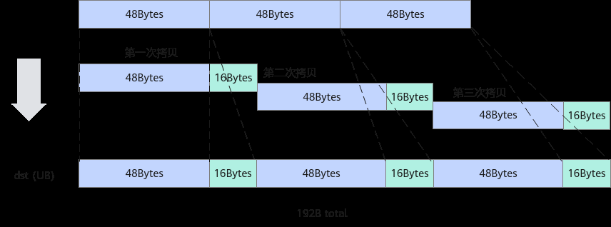

# 非对齐场景减少无效数据的搬运

> **Section**: 3.8.5.4  
> **PDF Pages**: 585–586  

---

<!-- page 585 -->

图3-103待搬运数据排布


【反例】// 搬运数据存在间隔，从GM上每行16KB中搬运2KB数据, 共16行LocalTensor<float> tensorIn;GlobalTensor<float> tensorGM;...constexpr int32_t copyWidth = 2 * 1024 / sizeof(float);constexpr int32_t imgWidth = 16 * 1024 / sizeof(float);constexpr int32_t imgHeight = 16;// 使用for循环，每次只能搬运2K，重复16次for (int i = 0; i < imgHeight; i++) {    DataCopy(tensorIn[i * copyWidth], tensorGM[i * imgWidth], copyWidth);}

【正例】

LocalTensor<float> tensorIn;GlobalTensor<float> tensorGM;...constexpr int32_t copyWidth = 2 * 1024 / sizeof(float);constexpr int32_t imgWidth = 16 * 1024 / sizeof(float);constexpr int32_t imgHeight = 16;// 通过DataCopy包含DataCopyParams的接口一次搬完DataCopyParams copyParams;copyParams.blockCount = imgHeight;copyParams.blockLen = copyWidth / 8; // 搬运的单位为DataBlock(32Byte)，每个DataBlock内有8个floatcopyParams.srcStride = (imgWidth  - copyWidth) / 8; // 表示两次搬运src之间的间隔，单位为DataBlockcopyParams.dstStride = 0; // 连续写，两次搬运之间dst的间隔为0，单位为DataBlockDataCopy(tensorGM, tensorIn, copyParams);

## 3.8.5.4 非对齐场景减少无效数据的搬运

【优先级】中

说明

该性能优化建议适用于如下型号：

●Atlas 350 加速卡

【描述】在非对齐数据搬运场景中，Atlas 350 加速卡在基础API层面提供了DataCopyPad接口，该接口支持Normal、Compact（紧凑）两种搬运模式。搬运多块

<!-- page 586 -->

非32B对齐数据块的场景下，使用Compact模式在可以减少搬运的无效数据量，节省带宽。

假设需要搬运三个数据块，每块数据块大小为48B，数据类型为float类型。除了这三个48字节的数据块之外，其他所有数据均为无效数据。

【反例】使用DataCopyPad接口进行Normal模式搬运数据__aicore__ inline void CopyIn(){    AscendC::LocalTensor<T> xLocal = inQueueX.AllocTensor<T>();    AscendC::Duplicate<T>(xLocal, 0, count);    AscendC::DataCopyParams dataCopyParams;    dataCopyParams.blockCount = 3;    dataCopyParams.blockLen = 48;    dataCopyParams.srcStride = 0;    dataCopyParams.dstStride = 0;    AscendC::DataCopyPadParams dataCopyPadParams;    dataCopyPadParams.isPad = 1;    dataCopyPadParams.leftPadding = 0;    dataCopyPadParams.rightPadding = 4;    dataCopyPadParams.paddingValue = 0;    AscendC::DataCopyPad<T, AscendC::PaddingMode::Normal>(xLocal, xGm, dataCopyParams, dataCopyPadParams);    inQueueX.EnQue<T>(xLocal);}

搬运后UB内数据如下：

```cpp
[1., 1., 1., 1., 1., 1., 1., 1., 1., 1., 1., 1., 0., 0., 0., 0.,  1., 1., 1., 1., 1., 1., 1., 1., 1., 1., 1., 1., 0., 0., 0., 0., 1., 1., 1., 1., 1., 1., 1., 1., 1., 1., 1., 1., 0., 0., 0., 0.....]
```

图3-104 Normal 模式搬运



如图所示，由于每块数据块为48B，非32B对齐，因此搬运每块数据块时需要插入16B大小的padding数据使得数据32B对齐，最终搬运192B大小的数据到UB，其中包含48B的无效数据。

【正例】改用Compact模式搬运进行优化__aicore__ inline void CopyIn(){    AscendC::LocalTensor<T> xLocal = inQueueX.AllocTensor<T>();    AscendC::Duplicate<T>(xLocal, 0, count);    AscendC::DataCopyParams dataCopyParams;    dataCopyParams.blockCount = 3;    dataCopyParams.blockLen = 48;    dataCopyParams.srcStride = 0;    dataCopyParams.dstStride = 0;    AscendC::DataCopyPadParams dataCopyPadParams;    dataCopyPadParams.isPad = 1;    dataCopyPadParams.leftPadding = 0;    dataCopyPadParams.rightPadding = 4;    dataCopyPadParams.paddingValue = 0;
