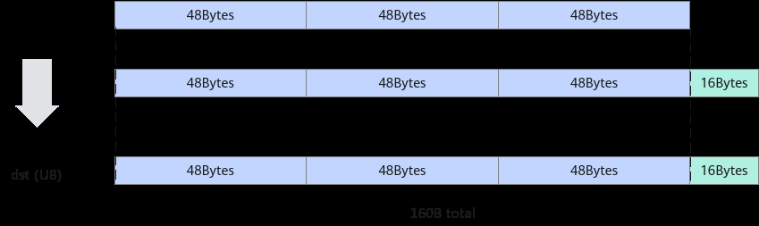
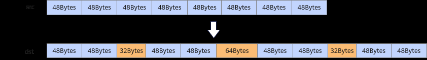
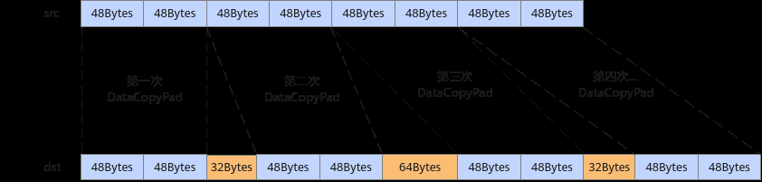
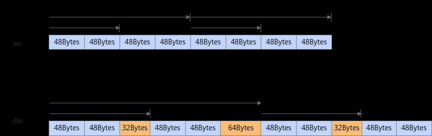
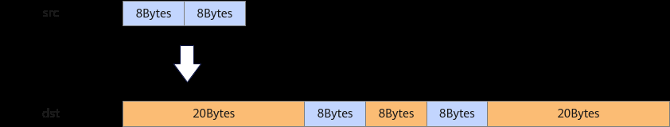
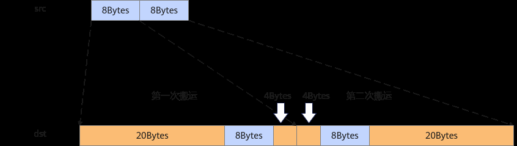

# 非连续搬运场景减少搬运次数

> **Section**: 3.8.5.5  
> **PDF Pages**: 587–589  

---

<!-- page 587 -->

```cpp
AscendC::DataCopyPad<T, AscendC::PaddingMode::Compact>(xLocal, xGm, dataCopyParams, dataCopyPadParams);
    inQueueX.EnQue<T>(xLocal);}
```

搬运后UB内数据如下：

```cpp
[1., 1., 1., 1., 1., 1., 1., 1., 1., 1., 1., 1., 1., 1., 1., 1., 1., 1., 1., 1., 1., 1., 1., 1., 1., 1., 1., 1., 1., 1., 1., 1., 1., 1., 1., 1., 0., 0., 0., 0....]
```

图3-105 Compact 模式搬运



根据Compact模式搬运的示意图，最终搬运了160B大小的数据，其中包含16B的无效数据。

【总结】通过比较可以发现，搬运多块非32B对齐数据块的场景下，使用Compact模式在可以减少搬运的无效数据量，节省带宽。

## 3.8.5.5 非连续搬运场景减少搬运次数

【优先级】中

说明

该性能优化建议适用于如下产品型号：

●Atlas 350 加速卡

在非连续搬运场景可以使用DataCopyPad接口的Loop模式和DataCopy的多维数据搬运接口来减少搬运次数，优化搬运性能。

使用Loop 模式减少非连续搬运的次数

【描述】DataCopyPad接口在Normal/Compact模式基础上，可以使用Loop模式搬运二维数据，假设我们希望以下图的方式搬运8个48B大小的数据块：



【反例】调用多次搬运接口进行搬运（以DataCopyPad为例）

```cpp
__aicore__ inline void CopyIn3(){    AscendC::LocalTensor<T> xLocal = inQueueX.AllocTensor<T>();
    AscendC::Duplicate<T>(xLocal, 0, count);
    AscendC::DataCopyParams dataCopyParams;
    dataCopyParams.blockCount = 2;
```

<!-- page 588 -->

```cpp
dataCopyParams.blockLen = 48;
    dataCopyParams.srcStride = 0;
    dataCopyParams.dstStride = 0;
    AscendC::DataCopyPadParams dataCopyPadParams;
    dataCopyPadParams.isPad = 0;
    dataCopyPadParams.leftPadding = 0;
    dataCopyPadParams.rightPadding = 0;
    dataCopyPadParams.paddingValue = 0;
    AscendC::DataCopyPad<T, AscendC::PaddingMode::Compact>(xLocal, xGm, dataCopyParams, dataCopyPadParams);
    AscendC::DataCopyPad<T, AscendC::PaddingMode::Compact>(xLocal[32], xGm[24], dataCopyParams, dataCopyPadParams);
    AscendC::DataCopyPad<T, AscendC::PaddingMode::Compact>(xLocal[72], xGm[48], dataCopyParams, dataCopyPadParams);
    AscendC::DataCopyPad<T, AscendC::PaddingMode::Compact>(xLocal[104], xGm[72], dataCopyParams, dataCopyPadParams);
    inQueueX.EnQue<T>(xLocal);}
```

图3-106使用多次DataCopyPad 接口进行搬运



【正例】使用Loop模式进行搬运

```cpp
__aicore__ inline void CopyIn3(){    AscendC::LoopModeParams loopModeParams;
    loopModeParams.loop1Size = 2;
    loopModeParams.loop2Size = 2;
    loopModeParams.loop1SrcStride = 96;
    loopModeParams.loop1DstStride = 128;
    loopModeParams.loop2SrcStride = 192;
    loopModeParams.loop2DstStride = 288;
    AscendC::LocalTensor<T> xLocal = inQueueX.AllocTensor<T>();
    AscendC::Duplicate<T>(xLocal, 0, count);
    AscendC::DataCopyParams dataCopyParams;
    dataCopyParams.blockCount = 2;
    dataCopyParams.blockLen = 48;
    dataCopyParams.srcStride = 0;
    dataCopyParams.dstStride = 0;
    AscendC::DataCopyPadParams dataCopyPadParams;
    dataCopyPadParams.isPad = 0;
    dataCopyPadParams.leftPadding = 0;
    dataCopyPadParams.rightPadding = 0;
    dataCopyPadParams.paddingValue = 0;
    AscendC::SetLoopModePara(loopModeParams, AscendC::DataCopyMVType::OUT_TO_UB);
    AscendC::DataCopyPad<T, AscendC::PaddingMode::Compact>(xLocal, xGm, dataCopyParams, dataCopyPadParams);
    AscendC::ResetLoopModePara(AscendC::DataCopyMVType::OUT_TO_UB);
    inQueueX.EnQue<T>(xLocal);}
```

<!-- page 589 -->

图3-107使用Loop 模式进行搬运



【总结】当数据块之间需要插入不同大小Padding时，使用Loop模式搬运代替多次的DataCopyPad能够减少搬运指令的使用，提升性能。

使用多维数据搬运减少非连续搬运次数

【描述】假设我们希望以下图的方式搬运2个8B大小的数据块：

图3-108搬运前后数据



【反例】使用多次DataCopyPad进行搬运

图3-109使用多次DataCopyPad 进行搬运



```cpp
__aicore__ inline void CopyIn5(){    AscendC::LocalTensor<T> xLocal = inQueueX.AllocTensor<T>();
    AscendC::Duplicate<T>(xLocal, 0, count);
    AscendC::DataCopyParams dataCopyParams;
    dataCopyParams.blockCount = 1;
    dataCopyParams.blockLen = 8;
    dataCopyParams.srcStride = 0;
    dataCopyParams.dstStride = 0;
    AscendC::DataCopyPadParams dataCopyPadParams;
    dataCopyPadParams.isPad = 1;
    dataCopyPadParams.leftPadding = 5;
    dataCopyPadParams.rightPadding = 1;
    dataCopyPadParams.paddingValue = 0;
```
