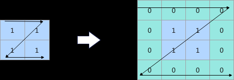
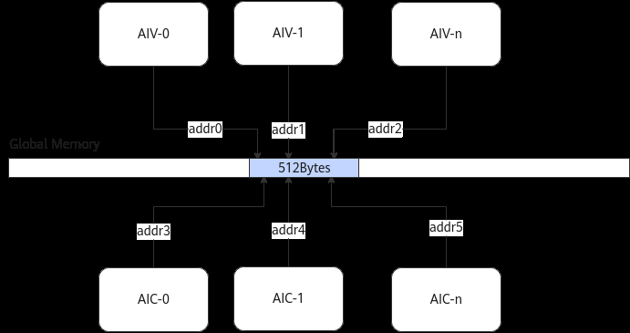
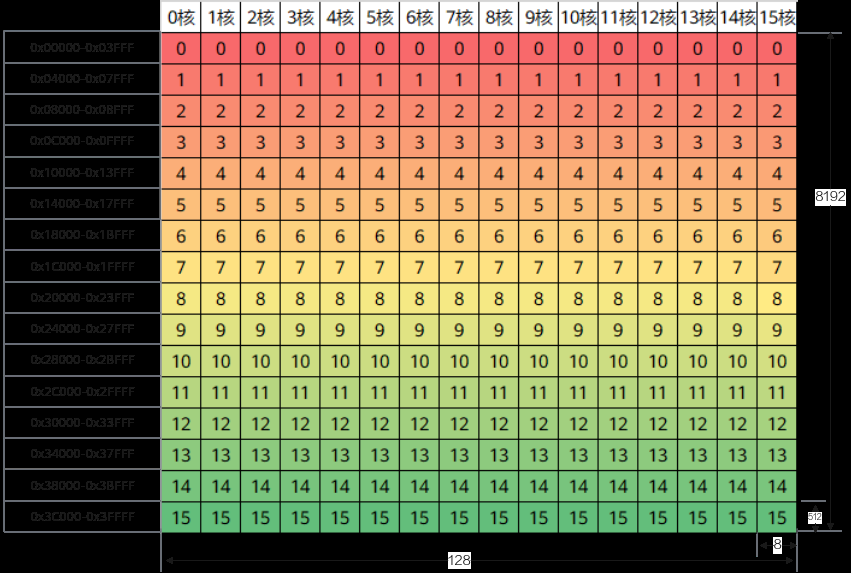
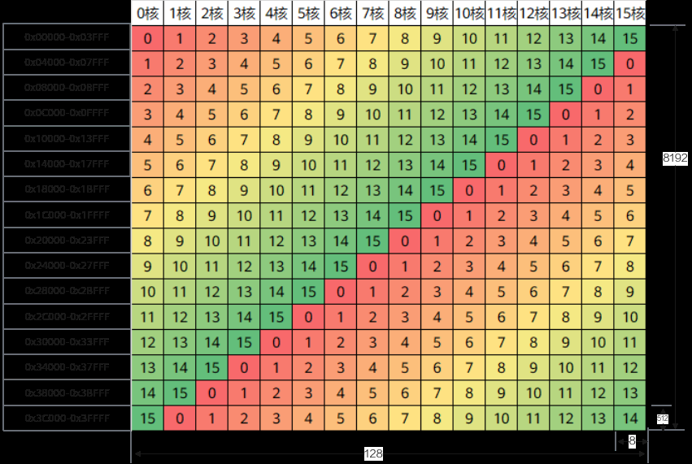
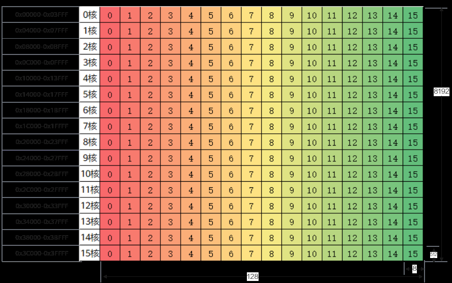

# 避免同地址访问

> **Section**: 3.8.5.6  
> **PDF Pages**: 590–593  

---

<!-- page 590 -->

// 第一次搬运    AscendC::DataCopyPad<T, AscendC::PaddingMode::Normal>(xLocal, xGm, dataCopyParams, dataCopyPadParams);    dataCopyPadParams.isPad = 1;    dataCopyPadParams.leftPadding = 1;    dataCopyPadParams.rightPadding = 5;    dataCopyPadParams.paddingValue = 0;    // 第二次搬运    AscendC::DataCopyPad<T, AscendC::PaddingMode::Normal>(xLocal[8], xGm[2], dataCopyParams, dataCopyPadParams);    inQueueX.EnQue<T>(xLocal);}

【正例】使用多维数据搬运

DataCopy接口在Atlas 350 加速卡上支持多维数据的搬运，具体可参考多维数据搬运（ISASI）。以2D场景的搬运为例，代码如下：

```cpp
__aicore__ inline void CopyIn6(){    AscendC::LocalTensor<T> xLocal = inQueueX.AllocTensor<T>();
    AscendC::Duplicate<T>(xLocal, 0, count);
    AscendC::NdDmaLoopInfo<2> loopInfo{{1, 2}, {1, 4}, {2, 2}, {1, 1}, {1, 1}};
    AscendC::NdDmaParams<T, 2> params = {loopInfo, 0};
    AscendC::NdDmaDci();
    static constexpr AscendC::NdDmaConfig config = {false};
    AscendC::DataCopy<T, 2, config>(xLocal, xGm, params);
    inQueueX.EnQue<T>(xLocal);}
```

图3-110搬运前后数据



【总结】使用多维数据搬运在部分场景下能够减少搬运指令的条数，从而提升性能。

## 3.8.5.6 避免同地址访问

【优先级】高

说明

该性能优化指导适用于如下产品型号：

●Atlas A3 训练系列产品/Atlas A3 推理系列产品

●Atlas A2 训练系列产品/Atlas A2 推理系列产品

【描述】MTE2、MTE3、Scalar等单元访问Global Memory数据时，其地址请求会按照512字节粒度对齐后进行处理。当同时访问Global Memory的数据，且地址处于连续的512字节范围内时，由于数据一致性的原因，多个请求会被串行处理，进而影响数据搬运效率。

<!-- page 591 -->

当前算子执行机制保证用户Kernel入参（包括Workspace/Tiling）的地址512字节对齐，因此开发者只需要根据地址的偏移量即可判断两个地址是否会落入连续的512字节范围内。

如下图所示，AI Core内的各个核对Global Memory的数据同时发出读写请求，尽管addr0~addr5是多个不同的地址，但因为落在连续的512字节范围内，被视为同一个地址请求，此时这几个数据请求会被串行处理，数据访问效率会降低。同地址访问的影响受同时访问的核数影响，同地址访问的核数越多时，串行导致的性能劣化越严重。



避免同地址访问的方法主要有以下两种：调整数据访问顺序和修改切分策略。下文介绍配套的样例请参考避免同地址访问样例。

调整数据访问顺序

以一个形状为 (8192, 128) 的float类型输入进行Adds计算为例。

为了体现同地址冲突的影响，上述场景设计中每一行的数据大小为512字节（128个float），每个核每一轮计算处理512 * 8字节的数据，并进行全核同步（实际场景中并不需要），每一轮计算都需要等待所有核完成当前数据块的计算后，再进行下一轮。

实现方案

原始实现优化实现

使用16个核参与计算，按列方向进行切分，每个核总计算数据量为8192 * 8；单核执行循环16次，每次计算的数据量为512 * 8；每个核的循环顺序如下图所示，列方向0~15表示每个核的数据块执行顺序。

使用16个核参与计算，按列方向进行切分，每个核总计算数据量为8192 *8；单核执行循环16次，每次计算的数据量为512 * 8；每个核的循环顺序如下图所示，列方向0~15表示每个核的数据块执行顺序。

实现方法

由于多个核同时访问同一行数据（512字节），导致同地址冲突的发生。

由于每个核每一轮处理的地址在不同行，不会同时访问连续的512字节，所以不会导致同地址访问冲突。

<!-- page 592 -->

实现方案

原始实现优化实现

示意图





```cpp
for (int32_t i = 0;
 i < tiling->loopOneCore;
 i++) {    AscendC::SyncAll();
    CopyIn(i);
    Compute();
    AscendC::SyncAll();
    CopyOut(i);}
for (int32_t i = 0;
 i < tiling->loopOneCore;
 i++) {    int32_t newProgress = (i + AscendC::GetBlockIdx()) % tiling->loopOneCore;
    AscendC::SyncAll();
    CopyIn(newProgress);
    Compute();
    AscendC::SyncAll();
    CopyOut(newProgress);}
```

示例代码

修改切分策略

仍以一个形状为 (8192, 128) 的float类型输入进行Adds计算为例。

为了体现同地址冲突的影响，上述场景设计中每一行的数据大小为512字节（128个float），每个核每一轮计算处理512 * 8字节的数据，并进行全核同步（实际场景中并不需要），每一轮计算都需要等待所有核完成当前数据块的计算后，再进行下一轮。

<!-- page 593 -->

原始实现优化实现

实现方案

使用16个核参与计算，按列方向进行切分，每个核总计算数据量为8192 *8；单核执行循环16次，每次计算的数据量为512 * 8；每个核的循环顺序如下图所示，列方向0~15表示每个核的数据块执行顺序。

使用16个核参与计算，按行方向进行切分，每个核总计算数据量为512 *128；单核执行循环16次，每次计算的数据量为512 * 8；每个核的循环顺序如下图所示（行方向），均为从块0~块15。

实现方法

由于多个核同时访问同一行数据（512字节），导致同地址冲突的发生。

由于每个核每一轮处理的地址在不同行，不会同时访问连续的512字节，所以不会导致同地址访问冲突。

示意图




