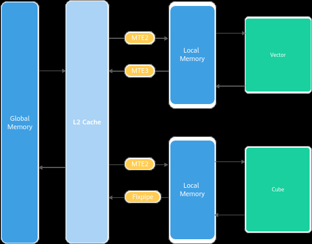
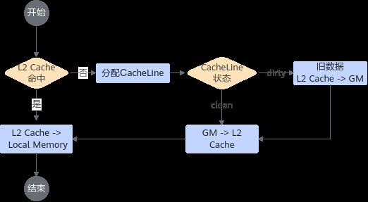
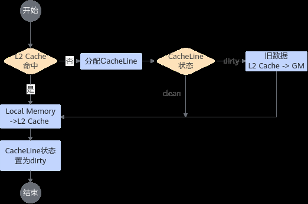

# 设置合理的L2 CacheMode

> **Section**: 3.8.5.7  
> **PDF Pages**: 594–596  

---

<!-- page 594 -->

原始实现优化实现

实现方案

```cpp
__aicore__ inline void Init(GM_ADDR x, GM_ADDR z, AddsCustomTilingData* tilingPtr){    tiling = tilingPtr;
    xGm.SetGlobalBuffer((__gm__ float *)x + AscendC::GetBlockIdx() * tiling->tileN);
    zGm.SetGlobalBuffer((__gm__ float *)z + AscendC::GetBlockIdx() * tiling->tileN);   // we disable the L2 cache mode to highlight the influence of the gm address conflict    xGm.SetL2CacheHint(AscendC::CacheMode::CACHE_MODE_DISABLE);zGm.SetL2CacheHint(AscendC::CacheMode::CACHE_MODE_DISABLE);
    pipe.InitBuffer(inQueueX, BUFFER_NUM, tiling->tileM * tiling->tileN * sizeof(float));
    pipe.InitBuffer(outQueueZ, BUFFER_NUM, tiling->tileM * tiling->tileN * sizeof(float));}
__aicore__ inline void Init(GM_ADDR x, GM_ADDR z, AddsCustomTilingData* tilingPtr){    tiling = tilingPtr;    // change the tile method from column split to row split    xGm.SetGlobalBuffer((__gm__ float *)x + AscendC::GetBlockIdx() * tiling->tileM * tiling->n);
    zGm.SetGlobalBuffer((__gm__ float *)z + AscendC::GetBlockIdx() * tiling->tileM * tiling->n);    // we disable the L2 cache mode to highlight the influence of the gm address conflictxGm.SetL2CacheHint(AscendC::CacheMode::CACHE_MODE_DISABLE);zGm.SetL2CacheHint(AscendC::CacheMode::CACHE_MODE_DISABLE);
    pipe.InitBuffer(inQueueX, BUFFER_NUM, tiling->tileM * tiling->tileN * sizeof(float));
    pipe.InitBuffer(outQueueZ, BUFFER_NUM, tiling->tileM * tiling->tileN * sizeof(float));}
```

示例代码

说明

你可以通过执行如下命令行，通过算子调优（msProf）工具获取上述示例的性能数据并进行对比。

```cpp
msprof op --launch-count=3 --output=./prof ./execute_adds_op
```

重点关注PipeUtilization.csv中的aiv_mte2_time(us)和aiv_mte3_time(us)搬运指令耗时。

## 3.8.5.7 设置合理的L2 CacheMode

【优先级】高

说明

该性能优化指导适用于如下产品型号：

●Atlas A3 训练系列产品/Atlas A3 推理系列产品

●Atlas A2 训练系列产品/Atlas A2 推理系列产品

【描述】L2 Cache常用于缓存频繁访问的数据，其物理位置如下图所示：

<!-- page 595 -->



L2 Cache的带宽相比GM的带宽有数倍的提升，因此当数据命中L2 Cache时，数据的搬运耗时会优化数倍。通常情况下，L2 Cache命中率越高，算子的性能越好，在实际访问中需要通过设置合理的L2 CacheMode来保证重复读取的数据尽量缓存在L2Cache上。

## L2 Cache 访问的原理及CacheMode 介绍

数据通过MTE2搬运单元搬入时，L2 Cache访问的典型流程如下：



数据通过MTE3或者Fixpipe搬运单元搬出时，L2 Cache访问的典型流程如下：

<!-- page 596 -->



从上面的流程可以看出，当数据访问总量超出L2 Cache容量时，AI Core会对L2 Cache进行数据替换。由于Cache一致性的要求，替换过程中旧数据需要先写回GM（此过程中会占用GM带宽），旧数据写回后，新的数据才能进入L2 Cache。

开发者可以针对访问的数据设置其CacheMode，对于只访问一次的Global Memory数据设置其访问状态为不进入L2 Cache，这样可以更加高效的利用L2 Cache缓存需要重复读取的数据，避免一次性访问的数据替换有效数据。

设置L2 CacheMode 的方法

Ascend C基于GlobalTensor提供了SetL2CacheHint接口，用户可以根据需要指定CacheMode。

考虑如下场景，构造两个Tensor的计算，x的输入Shape为(5120, 5120)，y的输入Shape为(5120, 15360)，z的输出Shape为(5120, 15360)，由于两个Tensor的Shape不相等，x分别与y的3个数据块依次相加。该方案主要为了演示CacheMode的功能，示例代码中故意使用重复搬运x的实现方式，真实设计中并不需要采用这个方案。下文完整样例请参考设置合理L2 CacheMode样例。


