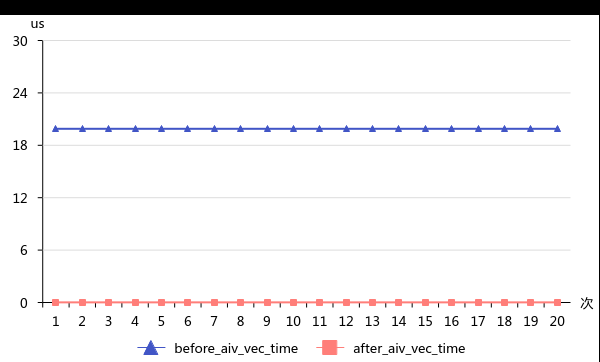

# 通过缩减Tensor ShapeInfo维度，优化栈空间

> **Section**: 3.8.5.10  
> **PDF Pages**: 600–600  

---

<!-- page 600 -->

图3-111 aiv_vec_time 优化前后对比



如上图所示，将反例中DataCopy指令替换为TQueBind之后有明显优化。由于省略了数据从VECIN拷贝到VECOUT的步骤，aiv_vec_time几乎缩减为0。

## 3.8.5.10 通过缩减Tensor ShapeInfo 维度，优化栈空间

【优先级】中

【描述】GlobalTensor和LocalTensor中通过ShapeInfo类型的成员变量来保存shape信息，SetShapeInfo/GetShapeInfo可以设置或者获取ShapeInfo，在算子实现内部用于shape信息保存和传递。默认情况下支持的最大维度为8。在不使用上述ShapeInfo功能的情况下，不需要这些信息，可以通过K_MAX_SHAPE_DIM宏将其设置为0。经实测减小K_MAX_SHAPE_DIM值，可缩减栈空间，减少scalar指令和cache miss几率，提升算子性能。

```cpp
...#ifndef K_MAX_SHAPE_DIM#define K_MAX_SHAPE_DIM 8#endif...struct ShapeInfo {public:    ...    uint32_t shape[K_MAX_SHAPE_DIM];
    uint32_t originalShape[K_MAX_SHAPE_DIM];};
template <typename T> class GlobalTensor {....private:    ShapeInfo shapeInfo_;}template <typename T> class LocalTensor {....private:    ShapeInfo shapeInfo_;}...
```
