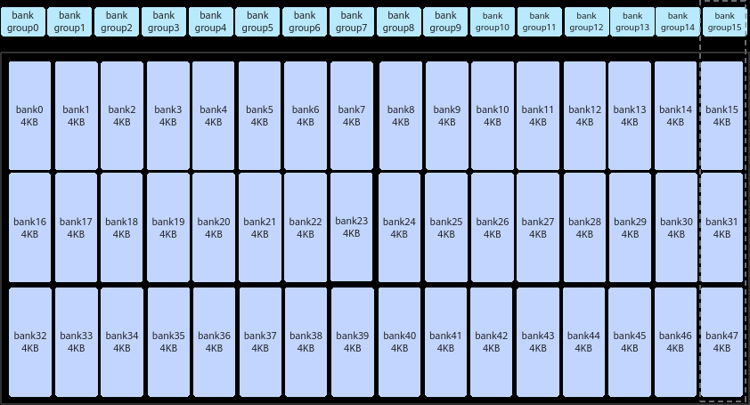
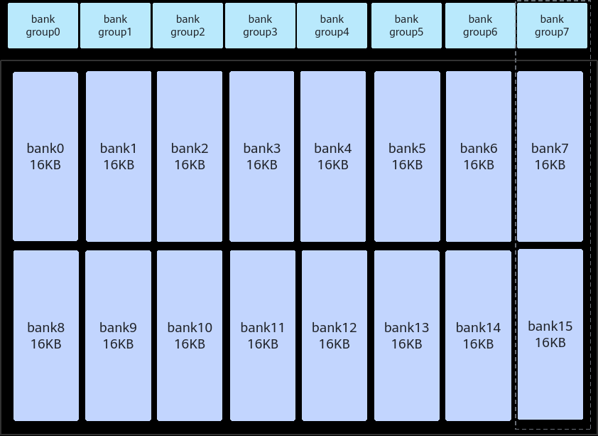

# 概述

> **Section**: 3.8.5.11.1  
> **PDF Pages**: 601–602  

---

<!-- page 601 -->

【反例】

算子无需使用ShapeInfo，但未对ShapeInfo大小进行限制（使用默认值8），导致浪费K_MAX_SHAPE_DIM * sizeof(uint32_t) * 2 * 4字节的栈空间。2表示有shape和originalShape两个数组，4表示该样例中使用了GlobalTensor和LocalTensor共4个Tensor。...#include "kernel_operator.h" ...extern "C" __global__ __aicore__ void add_custom(GM_ADDR x, GM_ADDR y, GM_ADDR z, GM_ADDR workspace, GM_ADDR tiling){    ...    GlobalTensor<T> dataIn;    GlobalTensor<T> dataOut;    LocalTensor<T> vecIn;    LocalTensor<T> vecOut;    ...}...

【正例】

算子无需使用ShapeInfo，设置#define K_MAX_SHAPE_DIM 0，有效缩减了K_MAX_SHAPE_DIM * sizeof(uint32_t) * 2 * 4大小的栈空间。#define K_MAX_SHAPE_DIM 0...#include "kernel_operator.h" //需注意定义K_MAX_SHAPE_DIM宏的位置须在包含Ascend C相关头文件之前...extern "C" __global__ __aicore__ void add_custom(GM_ADDR x, GM_ADDR x, GM_ADDR z, GM_ADDR workspace, GM_ADDR tiling){    ...    GlobalTensor<T> dataIn;    GlobalTensor<T> dataOut;    LocalTensor<T> vecIn;    LocalTensor<T> vecOut;    ...}...

## 3.8.5.11 避免Unified Buffer 的bank 冲突

## 3.8.5.11.1 概述

【优先级】高

【概述】

为了提高数据访问的效率和吞吐量，Unified Buffer采用了大小相等的内存模块（bank）结构设计。当多条读写指令同时访问Unified Buffer时，由于硬件资源的限制，这些指令不能同时执行，从而引发bank冲突。在这种情况下，指令需要排队等待资源，无法在一个指令周期内完成。

●针对NPU架构版本220x

<!-- page 602 -->

UB总大小为192KB，包含16个bank group，每个bank group包含3个bank。每个bank大小为4KB，由128行组成，每行长度为32B。

–读写冲突：读操作和写操作同时尝试访问同一个bank。

–写写冲突：多个写操作同时尝试访问同一个bank group。

–读读冲突：多个读操作同时尝试访问同一个bank group。

●针对Atlas 350 加速卡

UB总大小为256KB，包含8个bank group，每个bank group包含2个bank。每个bank大小为16KB，由512行组成，每行长度为32B。

–读写冲突：读操作和写操作同时尝试访问同一个bank。

–写写冲突：多个写操作同时尝试访问同一个bank group。

–读读冲突：两个读操作同时尝试访问同一个bank，或者两个以上读操作同时尝试访问同一个bank group。
