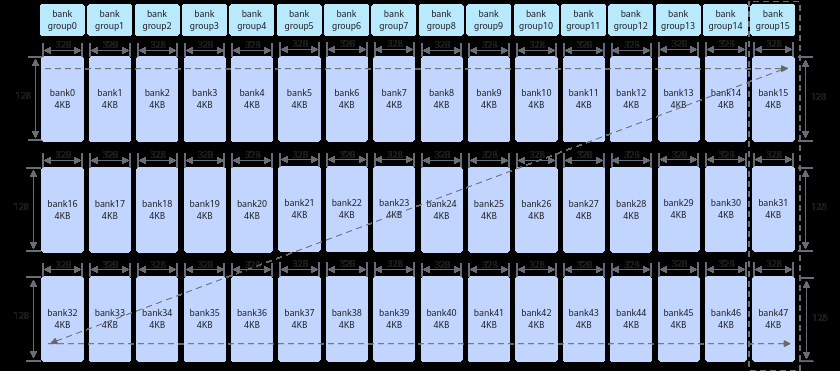
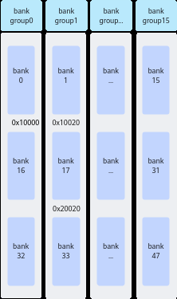
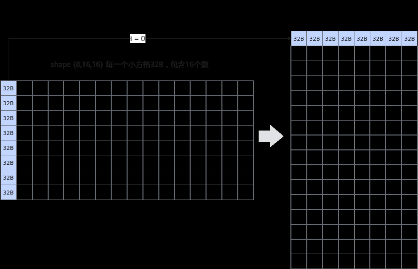
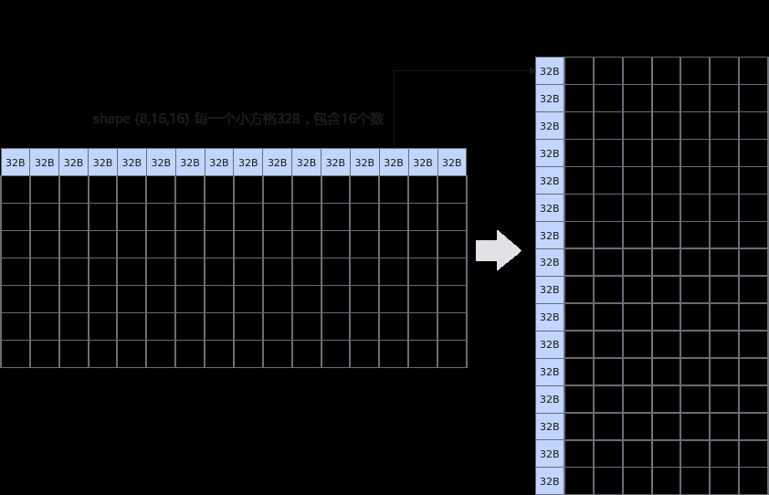

# 避免bank冲突（NPU架构版本220x）

> **Section**: 3.8.5.11.2  
> **PDF Pages**: 603–607  

---

<!-- page 603 -->

可以看出bank冲突的场景与Unified Buffer的规格密切相关，规格的变化通常会导致bank冲突场景的变化。

●由于Atlas 350 加速卡的bank group上有两组读口和写口，因此两次读操作访问同一个bank group的不同bank时，不会引起冲突。

●假设读指令操作的地址为0x0000（bank0），写指令操作的地址为0x10000 ，在NPU架构版本220x中，地址0x10000（bank16）不会发生读写冲突，而在Atlas350 加速卡中，这个地址0x10000（bank0）会引发读写冲突。

下文介绍不同硬件架构下如何避免bank冲突。

## 3.8.5.11.2 避免bank 冲突（NPU 架构版本220x）

【优先级】高

说明

该性能优化建议适用于如下产品型号：

●Atlas A3 训练系列产品/Atlas A3 推理系列产品

●Atlas A2 训练系列产品/Atlas A2 推理系列产品

【描述】为了提高数据访问的效率和吞吐量，Unified Buffer采用了bank（大小相等的内存模块）结构设计。Unified Buffer总大小为192K，划分为48个bank。每个bank由128行组成，每行长度为32B。这48个bank进一步组织为16个bank group，每个bankgroup包含3个bank，例如bank15、bank31和bank47组成一个bank group。

图3-112 bank 结构示意图（图中箭头方向表示内存排布的顺序）



每个bank可以独立地进行数据的读写操作，允许多个数据请求同时进行。然而，当多个读写操作试图同时访问同一个bank或bank group时，由于硬件资源的限制，这些操作必须排队等待，会导致bank冲突，引起性能下降。

具体来说，Vector计算单元每拍（一个指令周期）能够从每个bank group中读取或写入一行数据。如果同一个API中的多个操作试图同时访问同一个bank或bank group，Vector计算单元无法在同一个周期内处理所有请求，导致这些请求排队等待。这种排队增加了数据访问的延迟，降低了系统的整体性能。

## bank 冲突的典型场景

bank冲突主要可以分为以下三种场景：

<!-- page 604 -->

●读写冲突：读操作和写操作同时尝试访问同一个bank。

●写写冲突：多个写操作同时尝试访问同一个bank group。

●读读冲突：多个读操作同时尝试访问同一个bank group。

下文给出了一些具体的示例，假设，0x10000地址在bank16上，0x10020在bank17上，0x20020在bank33上，如下图所示：

图3-113地址分配示意图



●读写冲突示例

Vector指令的源操作数src和目的操作数dst同时读写到同一个bank时造成读写冲突，具体分析如下：

表3-18读写冲突示例

**src地址**

**dst地址**

**bankbank group结论**

序号

0x10020

0x10000

bank_id0 !=bank_id1

bank_group_id0 !=bank_group_id1

src地址和dst地址分别属于bank16和bank17，故无冲突。

示例1

<!-- page 605 -->

**src地址**

**dst地址**

**bankbank group结论**

序号

0x10020

0x10E20

bank_id0 ==bank_id1

bank_group_id0 ==bank_group_id1

src地址和dst地址的地址都在bank17，故存在冲突。

示例2

●写写冲突示例

Vector指令目的操作数dst对应的8个DataBlock（block0-block7）同时写到一个bank group时造成写写冲突，具体分析如下：

表3-19写写冲突示例

**blk_stride**

**block0_addr**

**block1_addr**

**block2_addr**

**...结论**

**dst地址**

序号

0x1FE00

160x1FE00

0x20000

0x20200

...8个DataBlock均在一个bankgroup下，故全部冲突，8拍完成一个Repeat的写入。

示例1

0x1FE00

80x1FE00

0x1FF00

0x20000

...block0和block2在一个bankgroup，存在冲突，4拍完成一个Repeat的写入。

示例2

●读读冲突

–Vector指令多个源操作数同时读到同一个bank group时造成读读冲突，具体分析如下：

表3-20双src 场景读读冲突示例

**src0地址**

**src1地址**

**bankbank group结论**

序号

0x10020

0x20020

bank_id0 != bank_id1

bank_group_id0 ==bank_group_id1

示例1

存在冲突。

0x10020

0x10000

bank_id0 != bank_id1

bank_group_id0 !=bank_group_id1

示例2

无冲突。

–Vector指令某一个源操作数对应的8个DataBlock（block0-block7）读到同一个bank group时造成读读冲突，具体分析如下：

<!-- page 606 -->

表3-21单src 场景读读冲突示例

**block0_addr**

**block1_addr**

**block2_addr**

**...结论**

**src地址**

**blk_stride**

序号

0x1FE00

...8个DataBlock均在一个bank group下，故全部冲突，8拍完成一个Repeat的读操作。

160x1FE00

0x20000

0x20200

示例1

0x1FE00

...block0和block2在同一个bank group下，存在冲突，4拍完成一个Repeat。

80x1FE00

0x1FF00

0x20000

示例2

说明

通过msProf工具可以进行资源冲突占比的相关性能数据采集。

工具的具体使用方法和资源冲突占比文件性能数据文件说明请参考《算子开发工具》。

如何避免bank 冲突

避免bank冲突的方法有两种：优化计算逻辑和优化地址分配。

●优化计算逻辑

对一个shape为(8, 16, 16)的输入做(1, 0, 2)的transpose操作，输出shape为(16,8, 16)。通过将计算逻辑由“跳读，连续写”修改为“连续读，跳写”可避免冲突问题。实现方案对比如下：

实现方案

原始实现优化实现

实现方法

跳读，连续写

连续读，跳写

同一Repeat内输入的8个DataBlock都在同一个bankgroup而发生读读冲突。

同一个Repeat内输入的8个DataBlock不在同一个bank group内，避免了读读冲突。

<!-- page 607 -->

原始实现优化实现

实现方案

示意图





```cpp
uint64_t mask = 128;UnaryRepeatParams params;params.dstBlkStride  = 1;params.srcBlkStride = 16;for(uint32_t i=0;
 i<16;
 i++)   {    AscendC::Adds(dstLocal[i * 128], srcLocal[i * 16], 0, mask, 1, params);}
uint64_t mask = 128;UnaryRepeatParams params;params.dstBlkStride  = 8;params.srcBlkStride = 1;for(uint32_t i=0;
 i<8;
 i++)   {    AscendC::Adds(dstLocal[i * 16], srcLocal[i * 256], 0, mask, 2, params);}
```

示例代码

●优化地址分配

实现连续4096个float元素的加法z = x + y，通过在内存分配时适当扩大内存，保证在一个Repeat内，x和y不会同时出现在同一个bank group内，x/y和z不会同时出现同一个bank内。完整样例可参考避免bank冲突样例。

实现方案对比如下：
