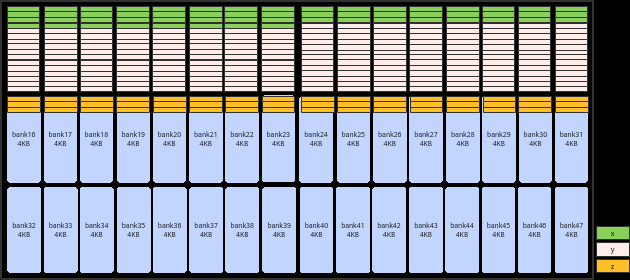
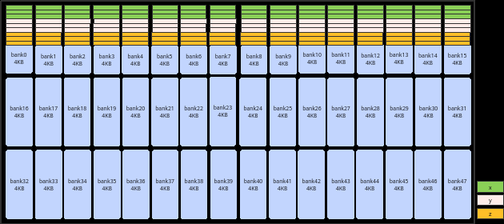
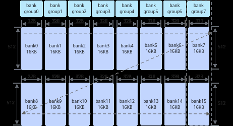
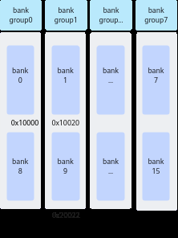
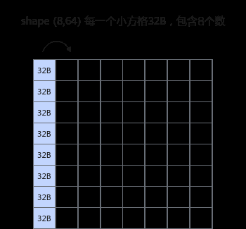
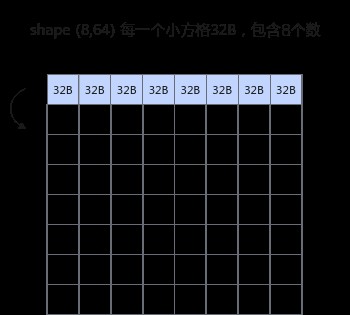

# 避免bank冲突（Atlas 350 加速卡）

> **Section**: 3.8.5.11.3  
> **PDF Pages**: 608–612  

---

<!-- page 608 -->

原始实现优化实现

实现方案

优化地址，使用InitBuffer分配内存时适当扩大内存申请，各个Tensor的地址分别为：

不做地址优化，直接使用InitBuffer分配内存，各个Tensor的地址分别为：

实现方法

x：起始地址0x0，tensor长度为4096 * sizeof(float)字节

x：起始地址0x0，tensor长度为(4096 *sizeof(float) + 256)字节

y：起始地址0x4000，tensor长度为4096 * sizeof(float)字节

y：起始地址0x4100，tensor长度为(64* 1024 - (4096 * sizeof(float) + 256))字节

z：起始地址0x8000，tensor长度为4096 * sizeof(float)字节

z：起始地址0x10000，tensor长度为4096 * sizeof(float) 字节

在一个Repeat内，x和y同时读同一个bank group，x/y和z同时读写同一个bank。

x多申请256字节，避免一个Repeat内xy同时读同一个bank group；y多申请空间，确保z不会和x/y落入同一个bank

示意图





```cpp
pipe.InitBuffer(inQueueX, 1, 4096 * sizeof(float));pipe.InitBuffer(inQueueY, 1, 4096 * sizeof(float));pipe.InitBuffer(outQueueZ, 1, 4096 * sizeof(float));
```

pipe.InitBuffer(inQueueX, 1, 4096 * sizeof(float) + 256); // 多申请256字节pipe.InitBuffer(inQueueY, 1, 64 * 1024 - (4096 * sizeof(float) + 256)); //多申请空间，确保z不会和x/y落入同一个bank， 64 * 1024是16个bank的空间，4096 * sizeof(float) + 256是x所占的空间pipe.InitBuffer(outQueueZ, 1, 4096 * sizeof(float));

示例代码

## 3.8.5.11.3 避免bank 冲突（Atlas 350 加速卡）

为了提高数据访问的效率和吞吐量，Unified Buffer采用了bank（大小相等的内存模块）结构设计。Unified Buffer总大小为256K，划分为16个bank。每个bank由512行组成，每行长度为32B。这16个bank进一步组织为8个bank group，每个bank group包含2个bank，例如bank7和bank15组成一个bank group。

<!-- page 609 -->

图3-114 bank 结构示意图（图中箭头方向表示内存排布的顺序）



每个bank可以独立地进行数据的读写操作，允许多个数据请求同时进行。然而，当多个读写操作试图同时访问同一个bank，由于硬件资源的限制，这些操作必须排队等待，会导致bank冲突，引起性能下降。

具体来说，Vector计算单元每拍（一个指令周期）能够从每个bank group中读取或写入一行数据。当多个读写操作试图同时访问同一个bank，Vector计算单元无法在同一个周期内处理所有请求，导致这些请求排队等待。这种排队增加了数据访问的延迟，降低了系统的整体性能。

## bank 冲突的典型场景

bank冲突主要可以分为以下三种场景：

●读写冲突：读操作和写操作同时尝试访问同一个bank。

●写写冲突：多个写操作同时尝试访问同一个bank group。

●读读冲突：两个读操作同时尝试访问同一个bank，或者两个以上读操作同时尝试访问同一个bank group。

下文给出了一些具体的示例，假设，0x10000地址在bank0上，0x10020在bank1上，如下图所示：

<!-- page 610 -->

图3-115地址分配示意图



●读写冲突示例

Vector指令的源操作数src和目的操作数dst同时读写到同一个bank时造成读写冲突，具体分析如下：

表3-22读写冲突示例

**src地址**

**dst地址**

**bankbank group结论**

序号

0x10020

0x10000

bank_id0 !=bank_id1

bank_group_id0 !=bank_group_id1

src地址和dst地址分别属于bank0和bank1，故无冲突。

示例1

0x10020

0x10120

bank_id0 ==bank_id1

bank_group_id0 ==bank_group_id1

src地址和dst地址的地址都在bank0，故存在冲突。

示例2

●写写冲突示例

Vector指令目的操作数dst对应的8个DataBlock（block0-block7）同时写到一个bank group时造成写写冲突，具体分析如下：

<!-- page 611 -->

表3-23写写冲突示例

**blk_stride**

**block0_addr**

**block1_addr**

**block2_addr**

**...结论**

**dst地址**

序号

0x10000

80x10000

0x10100

0x10200

...8个DataBlock均在一个bankgroup下，故全部冲突，8拍完成一个Repeat的写入。

示例1

●读读冲突

–Vector指令两个源操作数同时读到同一个bank时造成读读冲突，具体分析如下：

表3-24双src 场景读读冲突示例

**src0地址**

**src1地址**

**bankbank group结论**

序号

0x10000

bank_group_id0 ==bank_group_id1

0x10100

bank_id0==bank_id1

示例1

存在冲突。

0x10000

0x10020

bank_id0 != bank_id1

bank_group_id0 !=bank_group_id1

示例2

无冲突。

–Vector指令某一个源操作数对应的8个DataBlock(block0-block7）读到同一个bank时造成读读冲突，具体分析如下：

表3-25单src 场景读读冲突示例

**src地址**

**blk_stride**

**block0_addr**

**block1_addr**

**block2_addr**

**...结论**

序号

0x10000

80x10000

0x10100

0x10200

...8个DataBlock均在一个bank下，故全部冲突，8拍完成一个Repeat的读操作。

示例1

如何避免bank 冲突

避免bank冲突的方法有两种：优化计算逻辑和优化地址分配。

●优化计算逻辑

对一个数据类型为float，shape为(16, 64)的输入每个元素加1。通过将计算逻辑由逐列计算改为逐行计算可避免同一Repeat下的冲突问题，实现方案对比如下：

<!-- page 612 -->

原始实现优化实现

实现方案

逐列计算，同一Repeat内输入的8个DataBlock都在同一个bank而发生读读冲突。

逐行计算，同一个Repeat内输入的8个DataBlock不在同一个bank内，避免了同一Repeat内的读读冲突。

实现方法

示意图





```cpp
uint64_t mask = 64;AscendC::UnaryRepeatParams params;params.dstBlkStride = 8;params.srcBlkStride = 8;for(uint16_t i = 0;
 i < 8; ++i){    AscendC::Adds(dst[i * 8], src[i * 8], 1, mask, 1, params);}
uint64_t mask = 64;AscendC::UnaryRepeatParams params;params.dstBlkStride = 1;params.srcBlkStride = 1;for(uint16_t i = 0;
 i < 8; ++i){    AscendC::Adds(dst[i * 64], src[i * 64], 1, mask, 1, params);}
```

示例代码

●优化地址分配

实现连续4096个float元素的加法z = x + y，通过在内存分配时适当扩大内存，保证在一个Repeat内，x/y和z不会同时出现同一个bank内。

实现方案对比如下：
