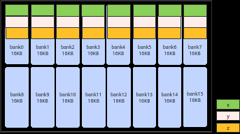
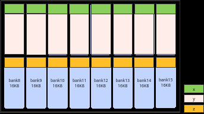
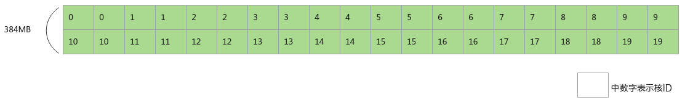
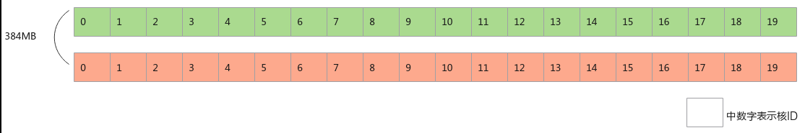

# L2 Cache切分

> **Section**: 3.8.5.12  
> **PDF Pages**: 613–615  

---

<!-- page 613 -->

原始实现优化实现

实现方案

优化地址，使用InitBuffer分配内存时适当扩大内存申请，各个Tensor的地址分别为：

不做地址优化，直接使用InitBuffer分配内存，各个Tensor的地址分别为：

实现方法

x：起始地址0x00000，tensor长度为4096 * sizeof(float)字节

x：起始地址0x00000，tensor长度为4096 * sizeof(float) 字节

y：起始地址0x04000，tensor长度为4096 * sizeof(float)字节

y：起始地址0x04000，tensor长度为(8* 16 * 1024 - (4096 * sizeof(float) )字节

z：起始地址0x08000，tensor长度为4096 * sizeof(float)字节

z：起始地址0x20000，tensor长度为4096 * sizeof(float) 字节

在一个Repeat内，x和y同时读同一个bank group，x/y和z同时读写同一个bank。

y多申请空间，确保z不会和x/y落入同一个bank。

示意图





```cpp
pipe.InitBuffer(inQueueX, 1, 4096 * sizeof(float));pipe.InitBuffer(inQueueY, 1, 4096 * sizeof(float));pipe.InitBuffer(outQueueZ, 1, 4096 * sizeof(float));
constexpr int32_t TOTAL_LENGTH = 1024 * 4;constexpr int32_t BUFFER_NUM = 1;constexpr int32_t BANKGROUP_SIZE  =  1024 * 128; ...pipe.InitBuffer(inQueueX, BUFFER_NUM, TOTAL_LENGTH * sizeof(float));pipe.InitBuffer(inQueueY, BUFFER_NUM, BANKGROUP_SIZE - TOTAL_LENGTH * sizeof(float));pipe.InitBuffer(outQueueZ, BUFFER_NUM, TOTAL_LENGTH * sizeof(float));
```

示例代码

## 3.8.5.12 L2 Cache 切分

【优先级】：高

【描述】假设，AI处理器的L2 Cache大小为192MB，L2 Cache读写混合带宽约为7TB/s，而GM的带宽约为1.6TB/s，两者之间存在较大差距。搬入或搬出相同数据量的情况下，访问L2 Cache读写数据比GM更快。若数据无法命中L2 Cache，即需要访问的数据不在L2 Cache内，导致需要去GM上读写，带宽利用效率较低，最终算子搬入或搬出数据变为算子整个运行过程的性能瓶颈。切分策略建议：当输入和输出数据的数据量超过L2 Cache大小时，Tiling中使能L2 Cache切分策略。

【反例】

<!-- page 614 -->

假设输入数据大小为InputTotalSize，L2 Cache大小为L2CacheSize，InputTotalSize =L2CacheSize * 2，总核数为20个核，数据未切分，整体一次完成计算。假设20个核一次可以处理共L2CacheSize的数据，则每个核至少两次读取输入数据。

图3-116未使能L2 Cache 切分



```cpp
constexpr int32_t TOTAL_LENGTH = InputTotalSize / sizeof(half);constexpr int32_t USE_CORE_NUM = 20;constexpr int32_t TILE_NUM = 2;constexpr int32_t BLOCK_LENGTH = TOTAL_LENGTH / USE_CORE_NUM;constexpr int32_t TILE_LENGTH = BLOCK_LENGTH / TILE_NUM;
```

class KernelSample {public:    __aicore__ inline KernelSample() {}    __aicore__ inline void Init(GM_ADDR x)    {        xGm.SetGlobalBuffer((__gm__ half*)x + BLOCK_LENGTH * GetBlockIdx(), BLOCK_LENGTH);        yGm.SetGlobalBuffer((__gm__ half*)y + BLOCK_LENGTH * GetBlockIdx(), BLOCK_LENGTH);        pipe.InitBuffer(inQueueX, 1, BLOCK_LENGTH * sizeof(half));        pipe.InitBuffer(inQueueY, 1, BLOCK_LENGTH * sizeof(half));    }    __aicore__ inline void Process()    {        // 示例演示对输入数据加2的运算        constexpr int32_t loopCount = 2;        for (int32_t i = 0; i < loopCount; i++) {            // 外层的每次循环对输入数据进行加1的运算            for (int32_t j = 0; j < TILE_NUM; j++) {                // 内层循环分别处理每个核第0块和第1块数据                CopyIn(j);                Compute();                CopyOut(j);            }        }    }private:    __aicore__ inline void CopyIn(int32_t process)    {        LocalTensor<half> xLocal = inQueueX.AllocTensor<half>();        // 对于每个核，除了首次读取外，读取第0块数据时，L2 Cache内缓存的是第1块数据；        // 对于每个核，读取第1块数据时，L2 Cache内缓存的是第0块数据；        // 每个核需要4次读取GM上的数据        DataCopy(xLocal, xGm[process * TILE_LENGTH], TILE_LENGTH );        inQueueX.EnQue(xLocal);    }    __aicore__ inline void Compute()    {        LocalTensor<half> yLocal = inQueueY.AllocTensor<half>();        LocalTensor<half> xLocal = inQueueX.DeQue<half>();        Adds(yLocal, xLocal, 1, TILE_LENGTH);           inQueueY.EnQue<half>(yLocal);        inQueueX.FreeTensor(xLocal);    }    __aicore__ inline void CopyOut(int32_t process)    {        LocalTensor<half> yLocal = inQueueY.DeQue<half>();        DataCopy(yGm[process * TILE_LENGTH], yLocal, TILE_LENGTH);        inQueueY.FreeTensor(yLocal);    }

<!-- page 615 -->

```cpp
}...
```

【正例】

假设输入数据大小为InputTotalSize，L2 Cache大小为L2CacheSize，InputTotalSize =L2CacheSize * 2，能使用的总核数为20个核，输入数据均等切分成2份数据，则整体分两次进行计算，每次的计算量为L2CacheSize，第一次20个核先计算前L2CacheSize个数据，第二次20个核计算后L2CacheSize个数据。每次计算前读取的数据能够命中L2Cache，提升算子性能。

图3-117使能L2 Cache 切分



```cpp
constexpr int32_t TOTAL_LENGTH = InputTotalSize / sizeof(half);constexpr int32_t TILE_NUM = 2;constexpr int32_t USE_CORE_NUM = 20;constexpr int32_t TILE_LENGTH = TOTAL_LENGTH / TILE_NUM;constexpr int32_t BLOCK_LENGTH = TILE_LENGTH / USE_CORE_NUM;
```

class KernelSample {public:    __aicore__ inline KernelSample() {}    __aicore__ inline void Init(GM_ADDR x, GM_ADDR y, int32_t index)    {        xGm.SetGlobalBuffer((__gm__ half*)x + BLOCK_LENGTH * GetBlockIdx() + index * TILE_LENGTH, BLOCK_LENGTH);        yGm.SetGlobalBuffer((__gm__ half*)y + BLOCK_LENGTH * GetBlockIdx() + index * TILE_LENGTH, BLOCK_LENGTH);        pipe.InitBuffer(inQueueX, 1, BLOCK_LENGTH * sizeof(half));        pipe.InitBuffer(inQueueY, 1, BLOCK_LENGTH * sizeof(half));    }    __aicore__ inline void Process()    {        // 示例演示对输入数据加2的运算        constexpr int32_t loopCount = 2;        for (int32_t i = 0; i < loopCount; i++) {            // 每次循环对输入数据进行加1的运算            CopyIn();            Compute();            CopyOut();        }    }private:    __aicore__ inline void CopyIn()    {        LocalTensor<half> xLocal = inQueueX.AllocTensor<half>();        // 对于每个核，除了首次读取外，第二次读取可以命中L2 Cache；        // 每个核2次读取GM上的数据，2次访问L2 Cache读数据        DataCopy(xLocal, xGm, BLOCK_LENGTH );        inQueueX.EnQue(xLocal);    }    __aicore__ inline void Compute()    {        LocalTensor<half> yLocal = inQueueY.AllocTensor<half>();        LocalTensor<half> xLocal = inQueueX.DeQue<half>();        Adds(yLocal, xLocal, 1, BLOCK_LENGTH);           inQueueY.EnQue<half>(yLocal);        inQueueX.FreeTensor(xLocal);    }
