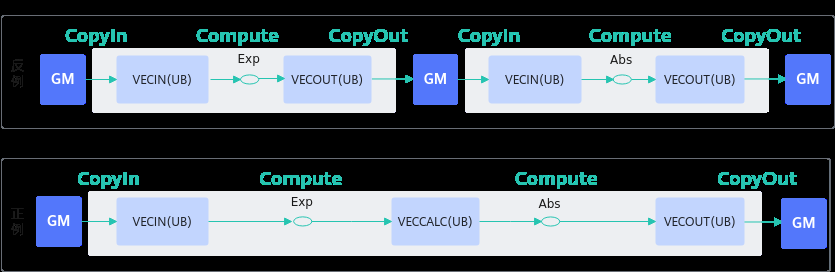

# 通过Unified Buffer融合实现连续vector计算

> **Section**: 3.8.6.1  
> **PDF Pages**: 616–617  

---

<!-- page 616 -->

```cpp
__aicore__ inline void CopyOut()    {        LocalTensor<half> yLocal = inQueueY.DeQue<half>();
        DataCopy(yGm, yLocal, BLOCK_LENGTH);
        inQueueY.FreeTensor(yLocal);    }}...
```

extern "C" __global__ __aicore__ void simple_kernel(__gm__ uint8_t* srcGm, __gm__ uint8_t* dstGm){    AscendC::KernelSample op;    // 输入数据均等切分成2份数据进行计算    for (int32_t i = 0; i < TILE_NUM; i++) {        op.Init(srcGm, dstGm, i);        op.Process();    }}...

更多完整样例请参考L2 Cache切分的算子样例。

## 3.8.6 矢量计算

## 3.8.6.1 通过Unified Buffer 融合实现连续vector 计算

【优先级】高

【描述】算子实现中涉及多次vector计算，且前一次计算输出是后一次计算输入的情况下，可将前一次计算输出暂存在UB（Unified Buffer）上直接作为下一次计算的输入，不需要将前一次的计算输出从UB搬运到GM后再从GM搬运到UB。这种UB Buffer融合的方式可以减少搬入搬出次数，实现连续vector计算，提升内存使用效率。数据流图对比如下：

图3-118数据流图对比



【反例】

该算子的计算逻辑为进行Exp计算后再进行Abs计算。计算过程中先把源操作数从GM搬运到UB进行Exp计算，Exp计算完成后将Exp的结果从UB搬运到GM；再从GM中把Exp的结果搬运到UB上作为Abs计算的输入，Abs计算完成后将目的操作数结果从UB搬运到GM。整个过程从GM搬进搬出共4次。当需要进行的vector计算为n次时，从GM搬进搬出共需要2n次。

```cpp
class KernelSample {public:    __aicore__ inline KernelSample() {}    __aicore__ inline void Init(__gm__ uint8_t* src0Gm, __gm__ uint8_t* dstGm)
```

<!-- page 617 -->

```cpp
{        src0Global.SetGlobalBuffer((__gm__ float*)src0Gm);
        dstGlobal.SetGlobalBuffer((__gm__ float*)dstGm);
        pipe.InitBuffer(inQueueSrc0, 1, 1024 * sizeof(float));
        pipe.InitBuffer(outQueueDst, 1, 1024 * sizeof(float));    }    __aicore__ inline void Process()    {        CopyIn();
        Compute();
        CopyOut();
        CopyIn1();
        Compute1();
        CopyOut1();    }
private:    __aicore__ inline void CopyIn()    {        LocalTensor<float> src0Local = inQueueSrc0.AllocTensor<float>();
        DataCopy(src0Local, src0Global, 1024);
        inQueueSrc0.EnQue(src0Local);    }    __aicore__ inline void Compute()    {        LocalTensor<float> src0Local = inQueueSrc0.DeQue<float>();
        LocalTensor<float> dstLocal = outQueueDst.AllocTensor<float>();
        Exp(dstLocal, src0Local, 1024);
        outQueueDst.EnQue<float>(dstLocal);
        inQueueSrc0.FreeTensor(src0Local);    }    __aicore__ inline void CopyOut()    {        LocalTensor<float> dstLocal = outQueueDst.DeQue<float>();
        DataCopy(dstGlobal, dstLocal, 1024);
        outQueueDst.FreeTensor(dstLocal);    }    __aicore__ inline void CopyIn1()    {        LocalTensor<float> src0Local = inQueueSrc0.AllocTensor<float>();
        DataCopy(src0Local, dstGlobal, 1024);
        inQueueSrc0.EnQue(src0Local);    }    __aicore__ inline void Compute1()    {        LocalTensor<float> src0Local = inQueueSrc0.DeQue<float>();
        LocalTensor<float> dstLocal = outQueueDst.AllocTensor<float>();
        Abs(dstLocal, src0Local, 1024);
        outQueueDst.EnQue<float>(dstLocal);
        inQueueSrc0.FreeTensor(src0Local);    }    __aicore__ inline void CopyOut1()    {        LocalTensor<float> dstLocal = outQueueDst.DeQue<float>();
        DataCopy(dstGlobal, dstLocal, 1024);
        outQueueDst.FreeTensor(dstLocal);    }
private:    TPipe pipe;
    TQue<TPosition::VECIN, 1> inQueueSrc0;
    TQue<TPosition::VECOUT, 1> outQueueDst;
    GlobalTensor<float> src0Global, dstGlobal;};
```

【正例】

使用UB Buffer融合方式后，在UB上进行连续vector计算时，前一次的结果可直接作为后一次计算的输入，继续在UB上进行计算，不需要中间的搬进搬出，只需在开始计算
