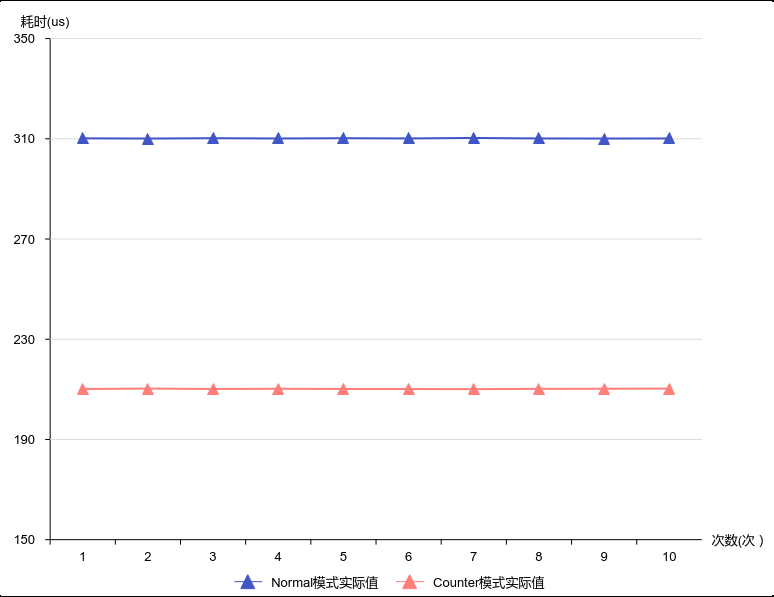
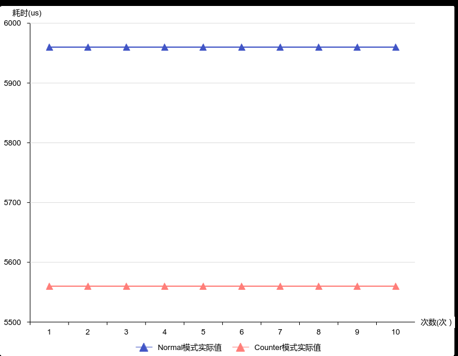

# Vector算子灵活运用Counter模式

> **Section**: 3.8.6.2  
> **PDF Pages**: 618–620  

---

<!-- page 618 -->

时将源操作数搬运到UB，以及全部计算结束后将最终结果从UB搬运到GM，共2次搬进搬出。

```cpp
class KernelSample {public:    __aicore__ inline KernelSample() {}    __aicore__ inline void Init(__gm__ uint8_t* src0Gm, __gm__ uint8_t* dstGm)    {        src0Global.SetGlobalBuffer((__gm__ float*)src0Gm);
        dstGlobal.SetGlobalBuffer((__gm__ float*)dstGm);
        pipe.InitBuffer(inQueueSrc0, 1, 1024 * sizeof(float));
        pipe.InitBuffer(outQueueDst, 1, 1024 * sizeof(float));    }    __aicore__ inline void Process()    {        CopyIn();
        Compute();
        CopyOut();    }
private:    __aicore__ inline void CopyIn()    {        LocalTensor<float> src0Local = inQueueSrc0.AllocTensor<float>();
        DataCopy(src0Local, src0Global, 1024);
        inQueueSrc0.EnQue(src0Local);    }    __aicore__ inline void Compute()    {        LocalTensor<float> src0Local = inQueueSrc0.DeQue<float>();
        LocalTensor<float> dstLocal = outQueueDst.AllocTensor<float>();
        Exp(dstLocal, src0Local, 1024);
        Abs(dstLocal, dstLocal, 1024);
        outQueueDst.EnQue<float>(dstLocal);
        inQueueSrc0.FreeTensor(src0Local);    }    __aicore__ inline void CopyOut()    {        LocalTensor<float> dstLocal = outQueueDst.DeQue<float>();
        DataCopy(dstGlobal, dstLocal, 1024);
        outQueueDst.FreeTensor(dstLocal);    }
private:    TPipe pipe;
    TQue<TPosition::VECIN, 1> inQueueSrc0;
    TQue<TPosition::VECOUT, 1> outQueueDst;
    GlobalTensor<float> src0Global, dstGlobal;};
```

## 3.8.6.2 Vector 算子灵活运用Counter 模式

【优先级】高

【描述】Normal模式下，通过迭代次数repeatTimes和掩码mask，控制Vector算子中矢量计算API的计算数据量；当用户想要指定API计算的总元素个数时，首先需要自行判断是否存在不同的主块和尾块，主块需要将mask设置为全部元素参与计算，并且计算主块所需迭代次数，然后根据尾块中剩余元素个数重置mask，再进行尾块的运算，在此过程中涉及大量Scalar计算。

Counter模式下，用户不需要计算迭代次数以及判断是否存在尾块，将mask模式设置为Counter模式后，只需要设置mask为{0, 总元素个数}，然后调用相应的API，处理逻辑更简便，减少了指令数量和Scalar计算量，同时更加高效地利用了指令单次执行的并发能力，进而提升性能。

<!-- page 619 -->

提示：Normal模式和Counter模式、掩码的介绍可参考2.5.2.3.1 如何使用掩码操作API。

以下反例和正例中的代码均以AddCustom算子为例，修改其中Add接口的调用代码，以说明Counter模式的优势。

```cpp
AscendC::Add(zLocal, xLocal, yLocal, this->tileLength);
```

【反例】

输入数据类型为half的xLocal, yLocal，数据量均为15000。Normal模式下，每个迭代内参与计算的元素个数最多为256B/sizeof(half)=128个，所以15000次Add计算会被分为：主块计算15000/128=117次迭代，每次迭代128个元素参与计算；尾块计算1次迭代，该迭代15000-117*128=24个元素参与计算。从代码角度，需要计算主块的repeatTimes、尾块元素个数；主块计算时，设置mask值为128，尾块计算时，需要设置mask值为尾块元素个数24；这些过程均涉及Scalar计算。

```cpp
uint32_t ELE_SIZE = 15000;AscendC::BinaryRepeatParams binaryParams;
```

uint32_t numPerRepeat = 256 / sizeof(DTYPE_X);  // DTYPE_X为half数据类型uint32_t mainRepeatTimes = ELE_SIZE / numPerRepeat;uint32_t tailEleNum = ELE_SIZE % numPerRepeat;

AscendC::SetMaskNorm();AscendC::SetVectorMask<DTYPE_X, AscendC::MaskMode::NORMAL>(numPerRepeat); // 设置normal模式mask，使每个迭代计算128个数AscendC::Add<DTYPE_X, false>(zLocal, xLocal, yLocal, AscendC::MASK_PLACEHOLDER, mainRepeatTimes, binaryParams);   // MASK_PLACEHOLDER值为0，此处为mask占位，实际mask值以SetVectorMask设置的为准if (tailEleNum > 0) {     AscendC::SetVectorMask<DTYPE_X, AscendC::MaskMode::NORMAL>(tailEleNum); // 设置normal模式mask，使每个迭代计算24个数     // 偏移tensor的起始地址，在xLocal和yLocal的14976个元素处，进行尾块计算     AscendC::Add<DTYPE_X, false>(zLocal[mainRepeatTimes * numPerRepeat], xLocal[mainRepeatTimes * numPerRepeat],            yLocal[mainRepeatTimes * numPerRepeat], AscendC::MASK_PLACEHOLDER, 1, binaryParams);  }AscendC::ResetMask();  // 还原mask值

【正例】

输入数据类型为half的xLocal, yLocal，数据量均为15000。Counter模式下，只需要设置mask为所有参与计算的元素个数15000，然后直接调用Add指令，即可完成所有计算，不需要繁琐的主尾块计算，代码较为简练。

当要处理多达15000个元素的矢量计算时，Counter模式的优势更明显，不需要反复修改主块和尾块不同的mask值，减少了指令条数以及Scalar计算量，并充分利用了指令单次执行的并发能力。

uint32_t ELE_SIZE = 15000;AscendC::BinaryRepeatParams binaryParams;AscendC::SetMaskCount();AscendC::SetVectorMask<DTYPE_X, AscendC::MaskMode::COUNTER>(ELE_SIZE);  // 设置counter模式mask，总共计算15000个数AscendC::Add<DTYPE_X, false>(zLocal, xLocal, yLocal, AscendC::MASK_PLACEHOLDER, 1, binaryParams);                // MASK_PLACEHOLDER值为0，此处为mask占位，实际mask值以SetVectorMask设置的为准AscendC::ResetMask();  // 还原mask值

【性能对比】

<!-- page 620 -->

图3-119 Normal 模式和Counter 模式下的Scalar 执行时间对比



图3-120 Normal 模式和Counter 模式下的Vector 执行时间对比



