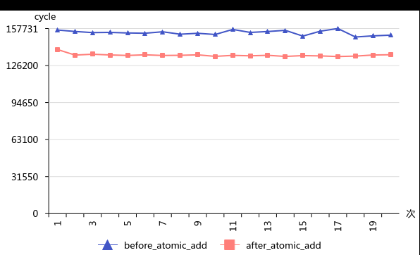
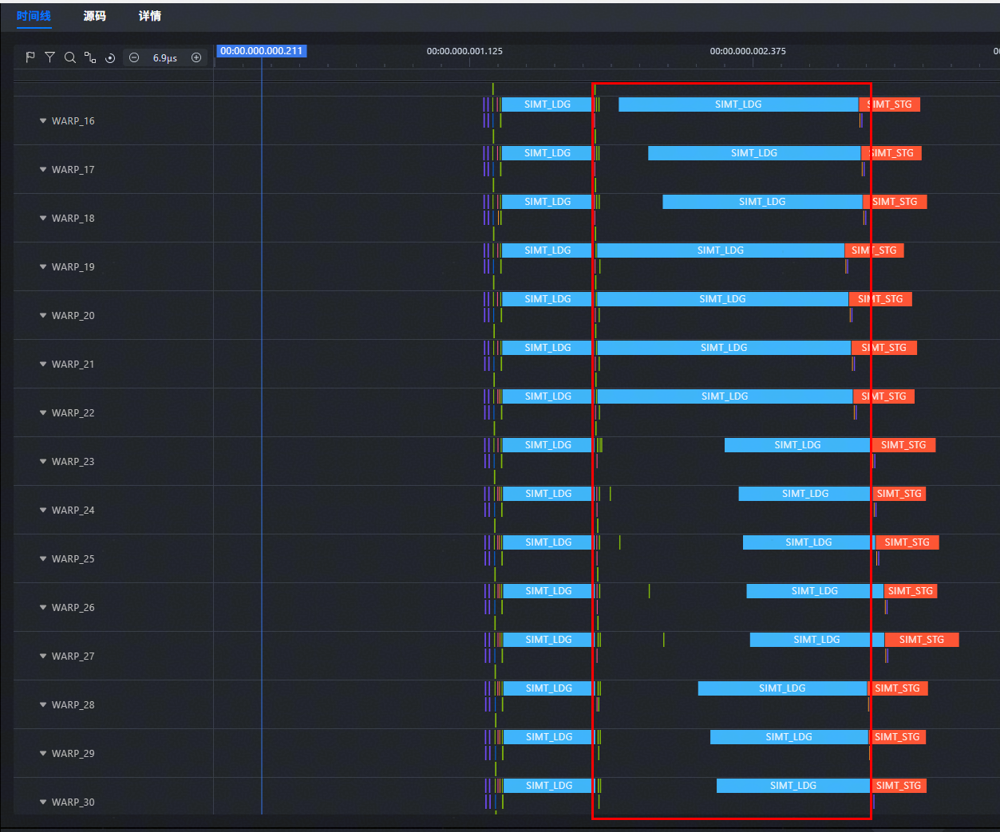
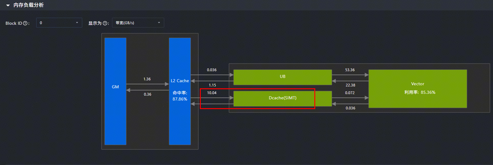
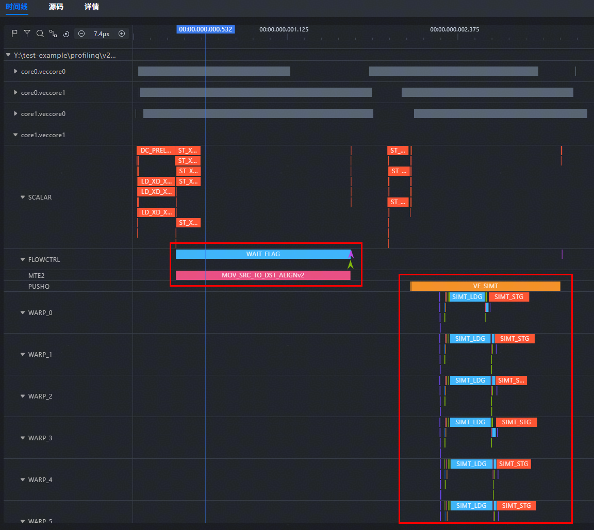
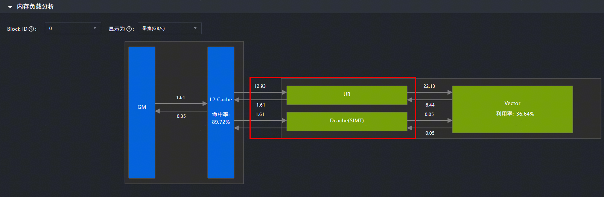

# 使用Unified Buffer提升内存访问效率

> **Section**: 3.9.1.1  
> **PDF Pages**: 661–665  

---

<!-- page 661 -->

图3-135 Matmul 使能AtomicAdd 选项前后性能对比



以矩阵维度M=64，N=256，K=256，矩阵D为(64, 256)为例，Matmul使能AtomicAdd选项前后的性能对比如上图所示，平均cycle数从开启AtomicAdd选项前的154181变为开启后的135054，性能优化12.4%。因此在这种场景下，使能AtomicAdd选项能获取更优的性能。

## 3.9 SIMD 与SIMT 混合算子性能优化

## 3.9.1 内存访问

## 3.9.1.1 使用Unified Buffer 提升内存访问效率

说明

该性能优化建议适用于如下型号：

●Atlas 350 加速卡

【优先级】高

【描述】SIMT访问Global Memory的粒度为128B，在随机访问Global Memory中的数据时，访存效率较低。当所需访问的数据量远小于最大可用Unified Buffer空间（256KB - 系统预留8KB - 最小Dcache 32KB）时，可以使用SIMD搬运接口将数据从Global Memory搬运到Unified Buffer，使SIMT编程能够直接从Unified Buffer读取数据，从而提高内存访问效率，提升算子的整体性能。

【样例介绍】以SIMD与SIMT混合编程方式实现的gather算子为例，该算子从长度为8192的一维向量中获取指定索引的65536个数据。通过将输入数据预先搬运到UnifiedBuffer中，提高离散内存访问的效率，从而提升算子的整体性能。

<!-- page 662 -->

表3-27算子规格

名称nameshapedata typeformat

算子输入input8192floatND

index65536uint32_tND

算子输出output65536floatND

SIMT线程层次结构为：

●线程块数：64

●单个线程块中线程数：1024

完整样例请参考SIMD与SIMT混合编程使用UB提高内存访问效率。

【反例】

SIMT随机访问Global Memory上的input数据，触发数据加载到Dcache，随机访存效率低，代码如下。namespace {    constexpr uint32_t THREAD_COUNT = 1024;    constexpr uint32_t INPUT_SIZE = 8192;    constexpr uint32_t INDEX_SIZE = 65536;}

__simt_vf__ __launch_bounds__(THREAD_COUNT) inline void simt_gather(__gm__ float* input,    __gm__ uint32_t* index,    __gm__ float* output){    int32_t idx = blockIdx.x * blockDim.x + threadIdx.x;

```cpp
if (idx >= INDEX_SIZE) {        return;    }
uint32_t gather_idx = index[idx];
    if (gather_idx > INPUT_SIZE) {        return;    }
```

output[idx] = input[gather_idx];}

```cpp
__global__ __vector__ void gather_kernel(__gm__ float* input, __gm__ uint32_t* index, __gm__ float* output){    asc_vf_call<simt_gather>(dim3(THREAD_COUNT), input, index, output);}
```

【正例】

使用SIMD接口将数据从Global Memory搬运到Unified Buffer，基于SIMT编程方式直接从Unified Buffer读取数据，访存效率远高于读取Global Memory上的数据，代码如下。namespace {    constexpr uint32_t THREAD_COUNT = 1024;    constexpr uint32_t INPUT_SIZE = 8192;    constexpr uint32_t INDEX_SIZE = 65536;}

<!-- page 663 -->

__simt_vf__ __launch_bounds__(THREAD_COUNT) inline void simt_gather(__ubuf__ float* input,    __gm__ uint32_t* index,    __gm__ float* output){    int32_t idx = blockIdx.x * blockDim.x + threadIdx.x;

```cpp
if (idx >= INDEX_SIZE) {        return;    }
uint32_t gather_idx = index[idx];
    if (gather_idx >= INPUT_SIZE) {        return;    }
```

output[idx] = input[gather_idx];}

__global__ __vector__ void gather_kernel(__gm__ float* input, __gm__ uint32_t* index, __gm__ float* output){    __ubuf__ float input_buf[INPUT_SIZE];    uint32_t blk_length = INPUT_SIZE * sizeof(float);    asc_copy_gm2ub_align(input_buf, input, 1, blk_length, 0, 0, false, 0, 0, 0);

```cpp
if ASC_IS_AIV {        asc_sync_notify(PIPE_MTE2, PIPE_V, EVENT_ID0);
        asc_sync_wait(PIPE_MTE2, PIPE_V, EVENT_ID0);    }
```

asc_vf_call<simt_gather>(dim3(THREAD_COUNT), input_buf, index, output);}

【性能对比】

下图为反例的流水图，线程中有两条SIMT_LDG指令，对应表示从Global Memory上加载数据，其中第二条指令占用区间分布不均，指令启动时间差异明显，同一个线程块中随机访问输入数据input，单次访存加载128B数据，而针对单精度浮点数，实际有效数据仅为4B，导致访存效率低。

<!-- page 664 -->

图3-136反例指令流水图（仿真数据）



下图为反例的内存负载分析图，L2 Cache到Dcache数据传输带宽为10.04GB/s。

图3-137反例内存负载分析（上板数据）



下图为正例的流水图，只有一条占用大区间的SIMT_LDG指令，MTE2流水新增搬运指令MOV_SRC_TO_DST_ALIGNv2。

<!-- page 665 -->

图3-138正例指令流水图（仿真数据）



下图为正例的内存负载分析图，L2 Cache到Dcache数据传输带宽降低为1.61GB/s，L2Cache到Unified Buffer数据传输带宽提升至12.93GB/s。

图3-139正例内存负载分析（上板数据）



对比算子运行时间，反例约为4.56us，正例约为3.57us，整体性能提升约21.71%。
