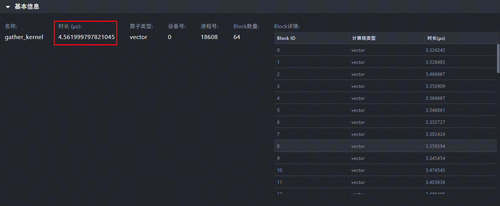
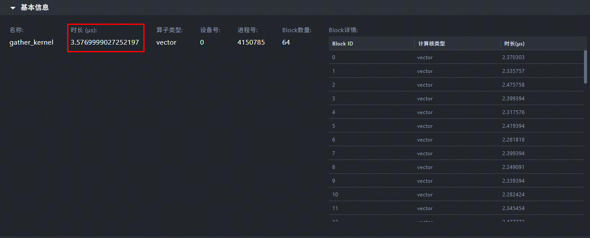

# 通过SIMT实现分支判断

> **Section**: 3.9.2.1  
> **PDF Pages**: 666–667  

---

<!-- page 666 -->

图3-140反例算子运行时间（上板数据）



图3-141正例算子运行时间（上板数据）



## 3.9.2 计算优化

## 3.9.2.1 通过SIMT 实现分支判断

说明

该性能优化建议适用于如下型号：

●Atlas 350 加速卡

【优先级】高

【描述】基于SIMD编程模型实现的批量数据计算性能很高，但在算子实现逻辑中涉及分支判断时，基于SIMD的计算操作会变得相对复杂，导致性能下降。此时，可以考虑采用SIMT方式，因为SIMT编程更为灵活，更适合处理分支判断的场景。

【样例介绍】以floor_mod算子为例，算子功能为将输入self的每个元素除以输入other的对应元素，获取余数。该余数应与除数other具有相同的符号，且其绝对值应小于other的绝对值。在计算过程中，需要判断other中每个元素的符号以及余数与该元素绝对值的大小关系。

【反例】

<!-- page 667 -->

基于SIMD的floor_mod算子实现：由于SIMD无法直接实现分支判断逻辑，因此需要使用多个Reg矢量计算API来完成分支判断，相关代码如下。

```cpp
template <typename T>__simd_vf__ inline void floor_mod_int_simd(__ubuf__ T* dstAddr, __ubuf__ T* input1Addr, __ubuf__ T* input2Addr,    __ubuf__ T* divAddr, const uint32_t count){    uint32_t vecLen = VECTOR_LENGTH / sizeof(T);
    uint16_t loopTimes = (count + vecLen - 1) / vecLen;
    AscendC::Reg::RegTensor<T> zeroValue;
    AscendC::Reg::RegTensor<T> defaultValue;
    AscendC::Reg::RegTensor<T> signValue;
    AscendC::Reg::RegTensor<T> input1Value;
    AscendC::Reg::RegTensor<T> input2Value;
    AscendC::Reg::RegTensor<T> divValue;
    AscendC::Reg::RegTensor<T> mulValue;
    AscendC::Reg::RegTensor<T> subValue;
    AscendC::Reg::RegTensor<T> modValue;
    AscendC::Reg::RegTensor<T> modSignValue;
    AscendC::Reg::RegTensor<T> addValue;
    AscendC::Reg::RegTensor<T> input2SignValue;
    AscendC::Reg::RegTensor<T> resValue;
    AscendC::Reg::MaskReg preg;
    AscendC::Reg::MaskReg cmpValue;
    AscendC::Reg::MaskReg negValue;
    AscendC::Reg::MaskReg signNegValue;
    AscendC::Reg::MaskReg resMaskValue;
    uint32_t sregMask = count;
    AscendC::Reg::Duplicate(zeroValue, T(0));
    AscendC::Reg::Duplicate(defaultValue, T(-1));
    AscendC::Reg::Duplicate(signValue, FMOD_B32_SIGN);
    for (uint16_t j = 0;
 j < loopTimes;
 j++) {        // handel -1        preg = AscendC::Reg::UpdateMask<T>(sregMask);
        AscendC::Reg::DataCopy<T, AscendC::Reg::LoadDist::DIST_NORM>(input2Value, input2Addr + vecLen * j);
        AscendC::Reg::DataCopy<T, AscendC::Reg::LoadDist::DIST_NORM>(divValue, divAddr + vecLen * j);
        AscendC::Reg::Mul(mulValue, input2Value, divValue, preg);
        AscendC::Reg::DataCopy<T, AscendC::Reg::LoadDist::DIST_NORM>(input1Value, input1Addr + vecLen * j);
        AscendC::Reg::Sub(subValue, input1Value, mulValue, preg);
        AscendC::Reg::Compare<T, AscendC::CMPMODE::NE>(cmpValue, input2Value, zeroValue, preg);
        AscendC::Reg::Select(modValue, subValue, defaultValue, cmpValue);        // post handel        AscendC::Reg::Add(addValue, modValue, input2Value, preg);
        AscendC::Reg::Compare<T, AscendC::CMPMODE::NE>(negValue, modValue, zeroValue, preg);
        AscendC::Reg::And(input2SignValue, input2Value, signValue, preg);
        AscendC::Reg::And(modSignValue, modValue, signValue, preg);
        AscendC::Reg::Compare<T, AscendC::CMPMODE::NE>(signNegValue, modSignValue, input2SignValue, preg);
        AscendC::Reg::MaskAnd(resMaskValue, signNegValue, negValue, preg);
        AscendC::Reg::Select(resValue, addValue, modValue, resMaskValue);
        AscendC::Reg::DataCopy<T, AscendC::Reg::StoreDist::DIST_NORM>(dstAddr + vecLen * j, resValue, preg);    }}
```

【正例】

基于SIMT的floor_mod算子实现：采用SIMT编程方式实现计算过程，通过if else语句完成分支判断，代码如下所示，代码简洁且易于实现。完整的算子实现代码请参考floor_mod算子样例。

```cpp
template <typename T>__simt_vf__ inline void floor_mod_simt(    __ubuf__ T* self,    __ubuf__ T* other,    __ubuf__ T* out,    uint32_t input_total_length)
```
