# FlashAttention算子性能调优案例

> **Section**: 3.10.1  
> **PDF Pages**: 668–677  

---

<!-- page 668 -->

```cpp
{    uint32_t index = threadIdx.x;
    auto rem = self[index] % other[index];
    bool signs_differ = ((rem < 0) != (other[index] < 0));
    if (signs_differ && (rem != 0)) {        out[index] = rem + other[index];    } else {        out[index] = rem;    }}
```

【性能对比】

如下图所示，基于SIMD实现的floor_mod算子的Kernel执行耗时为4.03us。

图3-142 SIMD 实现floor_mod 的耗时

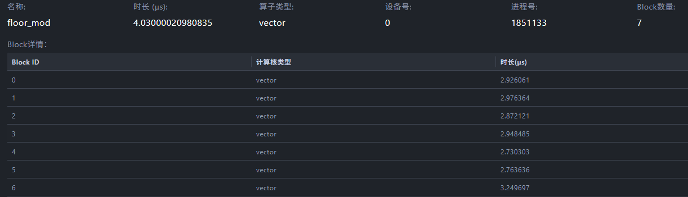

如下图所示，基于SIMT实现的floor_mod算子的Kernel执行耗时为3.444us。

图3-143 SIMT 实现floor_mod 的耗时

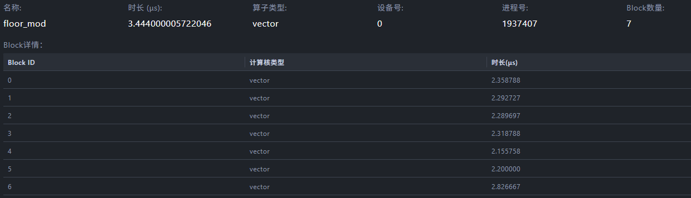

在核数不变、每个核处理的数据量相同且数据统一搬运到Unified Buffer上进行计算的情况下，使用SIMT实现分支判断的性能比使用SIMD实现的性能提升了14.6%。

## 3.10 优秀实践

## 3.10.1 FlashAttention 算子性能调优案例

案例介绍

本案例中的算子FlashAttentionScoreGrad，用于训练场景下计算注意力的反向输出，即FlashAttentionScore算子的反向计算。

已知注意力的正向计算公式为：

<!-- page 669 -->


为方便表达，以变量S和P表示计算公式：


则注意力的反向计算公式为：


计算流程图如下：

<!-- page 670 -->

图3-144算子计算流程

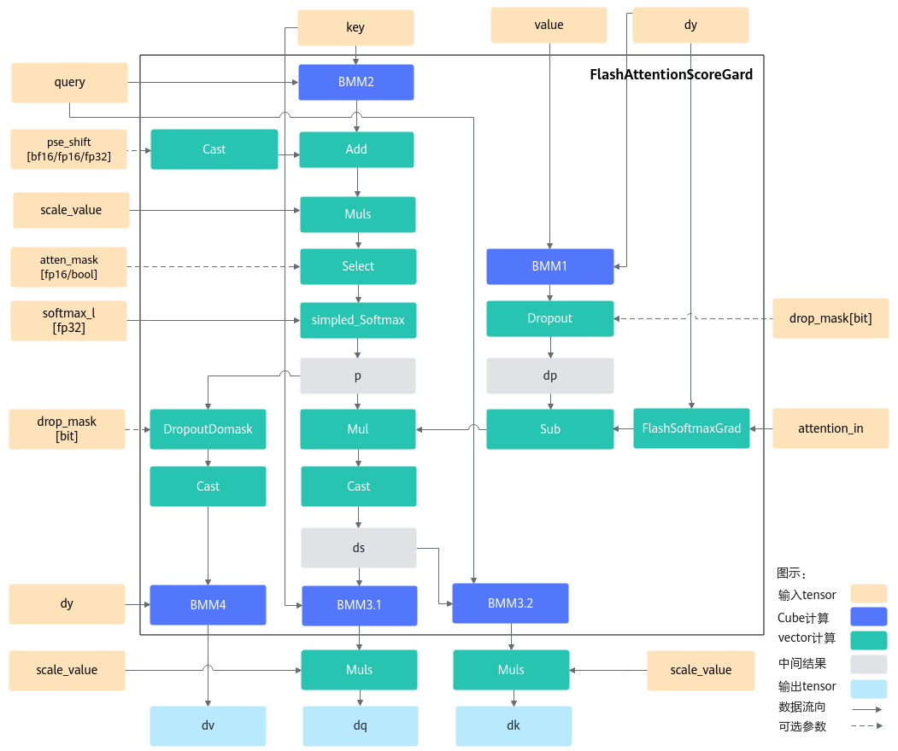

按照FlashAttention反向计算流程的实现，简介整体计算流程如下。对本算子的算法感兴趣的用户可简单了解，无需重点关注。

1.重计算p，本步骤重计算了FlashAttention流程中的softmax结果p，计算结果保存在ub中。


2.计算dp，该计算包含matmul计算和dropout计算，matmul计算中，左矩阵为dy，右矩阵为转置后的value。


3.计算ds，本计算中，FlashSoftmaxGrad计算的入参为dy、正向输出attention_in，该结果与dp做减操作，最终的结果与p相乘得到结果ds。


4.计算dq，本计算将ds结果与key做matmul计算，并将结果与scale相乘得到结果dq。


5.计算dk，本计算将转置后的ds结果与query做matmul计算，并将结果与scale相乘得到结果dk。

<!-- page 671 -->


6.计算dv，本计算将p的结果做drop计算，转置后与dy做matmul计算。


本案例的验证平台为Atlas A2 训练系列产品/Atlas A2 推理系列产品，以两个场景为例，第一个场景的输入维度信息为：B=1，N1=12，N2=12，S1=6144，S2=6144，D=128，causal场景，即atten_mask的形状为下三角，如图3-145。第二个场景的输入维度信息为：B=24，N1=5，N2=5，S1=9216，S2=9216，D=64，不带atten_mask和drop_mask输入。主要涉及的优化手段包括tiling基本块大小调整，核间负载均衡，CV流水并行，MTE2流水优化以及FixPipe流水优化等优化手段。

图3-145 causal 场景atten_mask 形状

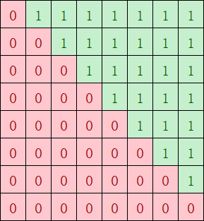

获取性能数据

流水优化分析工具包括CAModel和Profiling工具，分别从两个方面分析：第一个是从Profiling工具生成的Profiling数据中分析各项流水的占比，第二个是从CAModel工具生成的打点图分析各流水并行情况。

分析主要瓶颈点

通过观察分析流水图和Profiling数据，结合优化经验来判断性能瓶颈点。在优化过程中不同阶段可能会出现不同的瓶颈点，需要不断优化以达到最佳性能。

●根据优化经验，循环间会存在一些不必要的性能开销，循环越多性能可能越差；满足UB最大空间限制的情况下，UB切分的基本块越大，循环越少。算子中通过InitBuffer接口分配UB buffer大小。pipe->InitBuffer(ubBuffer, 120 * 1024);  pipe->InitBuffer(tmpBuffer, 30 * 1024);  pipe->InitBuffer(vecClc3, 8 * 1024);

<!-- page 672 -->

如上代码所示，InitBuffer接口的第二个参数表示buffer占用的大小，所有buffer大小的和即为占用的总空间。这里120 * 1024 + 30 * 1024 + 8 * 1024 = 158KB <UB Size，没有充分利用UB空间。

●观察如下流水图，绿色为Vector侧的流水，橙色为Cube侧的流水，可以看出两侧的流水都存在大段的空隙，CV之间流水很大程度上未并行，需要考虑CV流水优化。

图3-146优化前算子流水

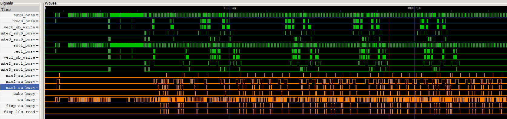

●对于上述场景一，causal场景下可能存在核间分布不均匀的情况，如下图经过atten_mask掩码后，红色部分是算子需要计算的部分，绿色无需计算；如果不按照基本块的个数来分核，按照第一根轴的大小8（行）来分核，假设平均分到9个核上，每个核做ceil(8 / 9) = 1行，则第1个核只需做1个基本块，但是第8个核需要做8个基本块的计算，出现明显的负载不均衡。因此需要考虑将红色块均匀分到多个核上计算。

图3-147 causal 场景atten_mask 形状

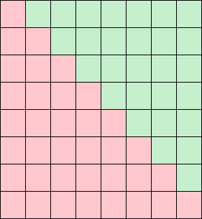

●场景一的Profiling数据如下，aic_fixpipe_ratio占比极高，可能存在FixPipebound。

图3-148场景一Profiling 数据


●场景二的Profiling数据如下，mte2_ratio占比高，可能存在MTE2 bound。

<!-- page 673 -->

图3-149场景二Profiling 数据


设计优化方案

●优化点一：调整tiling基本块

在满足UB空间大小限制的前提下，tiling基本块的切分应尽可能大。如下图为优化前按照(64, 128)切分计算，总共需要循环计算32次。

图3-150优化前计算基本块及次数

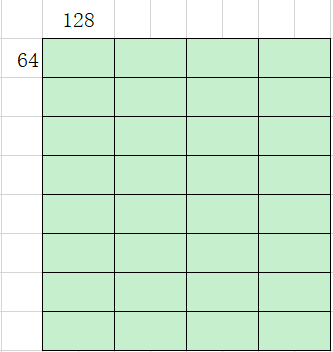

考虑到UB空间没有用满，基本块调整到(128, 128)，如下图优化后只需循环计算16次，切分后算子性能提升一倍。

<!-- page 674 -->

图3-151优化后计算基本块及次数

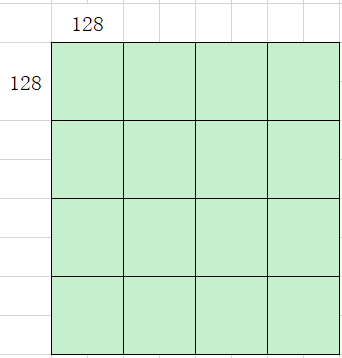

●优化点二：CV流水并行

由于FAG算子中Cube计算比Vector计算快且存在依赖性，同时为了减少CV之间的通信次数，通过缓存机制使matmul提前计算多块，这里的缓存机制指的是将mm一次性计算多个基本块缓存到GM上。如下代码中，SetTail设置的singleCoreM和singleCoreN大小分别为BaseM，BaseN的倍数，即matmul一次发起多个基本块的计算，实现matmul结果的缓存，Vector侧分多次取matmul的结果。

```cpp
mm3.SetTail(s2CvExtend, -1, preS1Extend);
  mm3.SetTensorA(mulWorkSpaceGm[pingpongIdx * coreNum * cubeBaseMN + cBlockIdx * cubeBaseMN], true);
 mm3.SetTensorB(queryGm[mm2aTensorOffsetCv]);
  mm3.template IterateAll<false>(dkWorkSpaceGm[bTensorOffsetCv], true);
```

图3-152完成mm1/mm2/mm3 缓存的流水

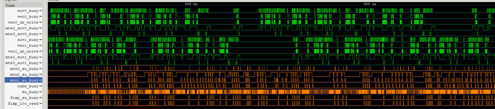

如上图是实现mm1、mm2和mm3缓存的流水图，并行度提高，CV的间隔减小，提升了算子性能。

<!-- page 675 -->

图3-153 Vector 等Cube 流水的间隔插入Vector 计算

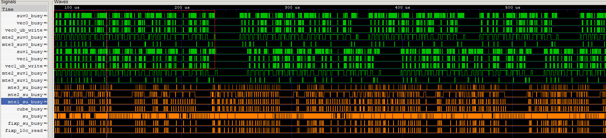

基于缓存mm1/mm2/mm3的优化后，在本轮Vector计算等Cube流水的间隔，插入下一轮循环的Vector计算，如上图所示，这样使Vector流水与Cube流水之间的并行度更高，反映到流水图中为Vector计算更密集。原计算过程伪代码与在CV间隔中插入下一轮Vector计算的伪代码，分别如以下两段所示。

// 原计算过程伪代码// mm1计算;dropout();Sub();// mm2计算;Softmax();AttenMask();...// 在Vector等Cube流水的间隔中，插入下一轮循环的Vector计算伪代码// mm1计算;dropout();Sub();dropout(); // 下一轮循环的Vector计算Sub();  // 下一轮循环的Vector计算// mm2计算;Softmax();AttenMask();...

●优化点三：每个核负载均衡

图3-154 causal 场景优化前每个核计算量

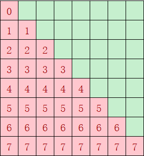

<!-- page 676 -->

图3-155 causal 场景优化后每个核计算量

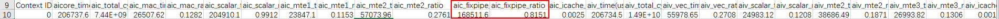

尽量实现每个核的计算量均匀，负载均衡。优化前的分核及每个核的计算量如图11 causal场景优化前每个核计算量所示，按照第一根轴的大小8（行）来分核，平均分到9个核上，每个核计算ceil(8/9)=1行，第1个核只计算1个基本块，但是第8个核计算8个基本块。优化后如图12 causal场景优化后每个核计算量所示，红色块总共36个基本块，均分到每个核上，每个核的计算量为4个基本块，性能提升一倍。

●优化点四： FIXPIPE优化

从采集的Profiling数据来看，Cube FixPipe占比高达81%，出现了很严重的bound（达到上限）。CAModel工具打印发现存在很多异常的128B搬运，排查代码，发现workspace地址未512B对齐。

图3-156场景一优化前Profiling 数据

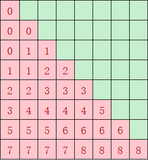

代码实现中使用SetGlobalBuffer接口设置workspace的起始地址，如果起始地址不是按照512B对齐，搬运效率会很低，可以强制GM地址512Byte对齐来避免这个情况。下面代码中ADDR_ALIGN_SIZE即为512。

```cpp
// init workspace address  syncGlobal.SetGlobalBuffer((__gm__ int32_t*)workspace);
  uint64_t workspaceOffsets = SYNC_GLOBAL_WORKSPACE_SIZE;
  dqWorkSpaceGm.SetGlobalBuffer((__gm__ float*)workspace + workspaceOffsets / sizeof(T2));
  workspaceOffsets = (workspaceOffsets + qPostBlockTotal * sizeof(float) + ADDR_ALIGN_SIZE) / ADDR_ALIGN_SIZE * ADDR_ALIGN_SIZE;
  dkWorkSpaceGm.SetGlobalBuffer((__gm__ float*)workspace + workspaceOffsets / sizeof(T2));
  workspaceOffsets = (workspaceOffsets + kvPostBlockTotal * sizeof(float) + ADDR_ALIGN_SIZE) / ADDR_ALIGN_SIZE * ADDR_ALIGN_SIZE;
  dvWorkSpaceGm.SetGlobalBuffer((__gm__ float*)workspace + workspaceOffsets / sizeof(T2));
  workspaceOffsets = (workspaceOffsets + kvPostBlockTotal * sizeof(float) + ADDR_ALIGN_SIZE) / ADDR_ALIGN_SIZE * ADDR_ALIGN_SIZE; // matmul1 and matmul2 workspace size  matmulWorkspaceSize = cubeBaseMN * sizeof(float);
 mm1WorkspaceGm.SetGlobalBuffer((__gm__ T2*)(workspace + workspaceOffsets + cBlockIdx * matmulWorkspaceSize));
  mm2WorkspaceGm.SetGlobalBuffer((__gm__ T2*)(workspace + workspaceOffsets + coreNum * matmulWorkspaceSize + cBlockIdx * matmulWorkspaceSize));   // drop
```

<!-- page 677 -->

```cpp
workspace offset  workspaceOffsets = (workspaceOffsets + coreNum * cubeBaseMN * sizeof(float) * INPUT_NUMS + ADDR_ALIGN_SIZE) / ADDR_ALIGN_SIZE * ADDR_ALIGN_SIZE;
  dropWorkSpaceGm.SetGlobalBuffer((__gm__ T1*)workspace + workspaceOffsets / sizeof(T1));   // mul workspace offset  workspaceOffsets = (workspaceOffsets + coreNum * cubeBaseMN * sizeof(half) * 2 + ADDR_ALIGN_SIZE) / ADDR_ALIGN_SIZE * ADDR_ALIGN_SIZE;
  mulWorkSpaceGm.SetGlobalBuffer((__gm__ T1*)workspace + workspaceOffsets / sizeof(T1));
```

修改代码，workspace地址经过512B对齐后，FixPipe时间减半。

图3-157场景一优化后Profiling 数据

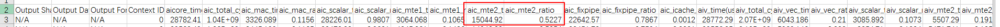

●优化点五：MTE2优化

结合如下的Profiling数据和流水图，可以看出MTE2 bound，且部分MTE2搬运时间异常。

图3-158场景二Profiling 数据

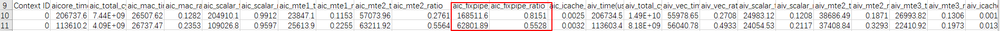

图3-159场景二流水图

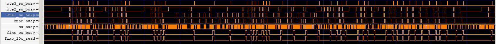

将输入数据排布格式从BSH更改为BNSD后，数据搬运连续，不需要跳地址读取数据，搬运效率提升一倍，部分异常搬运时长降低了一半。

验证优化方案性能收益

●调整tiling基本块：理论评估Vector切块越大，计算和搬运循环次数越少，同时能够充分利用搬运带宽和Vector算力。基本块大小从(64, 128)增大到(128, 128)后，性能提升一倍，实测与理论分析一致。

●CV流水并行：CV流水掩盖的时间即为提升的性能，符合预期的收益。

●核间负载均衡：优化前负载最多的核计算量减少的倍数，即为预期提升的性能；案例中优化前负载最多的核的计算量大小为8块，优化后为4块，实际性能提升一倍，符合预期的收益。

●FixPipe优化：从Profiling数据看出FixPipe占比0.8，优化后占比0.55，实测算子性能提升45%，与理论分析一致。

●MTE2优化：从Profiling数据看出MTE2占比0.52，优化后占比减少一半，实测算子性能提升30%，与理论分析一致。

总结

融合算子场景，可参考此优化。
