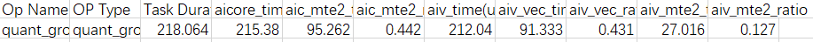
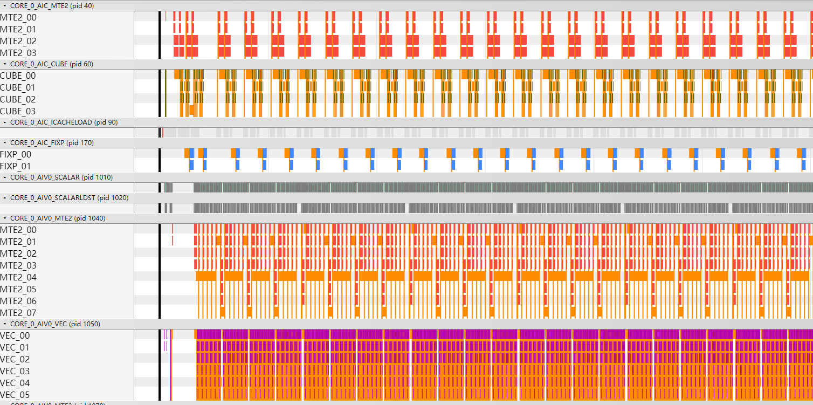
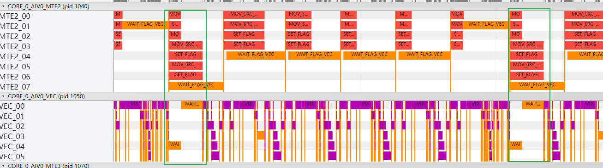
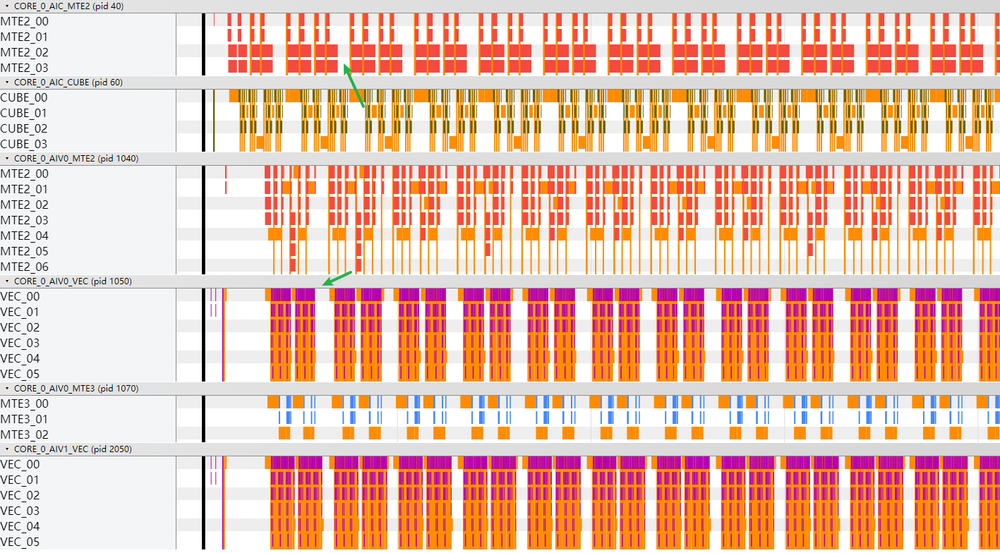
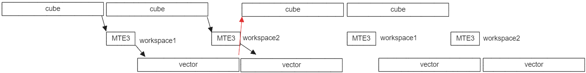
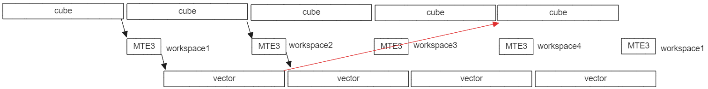
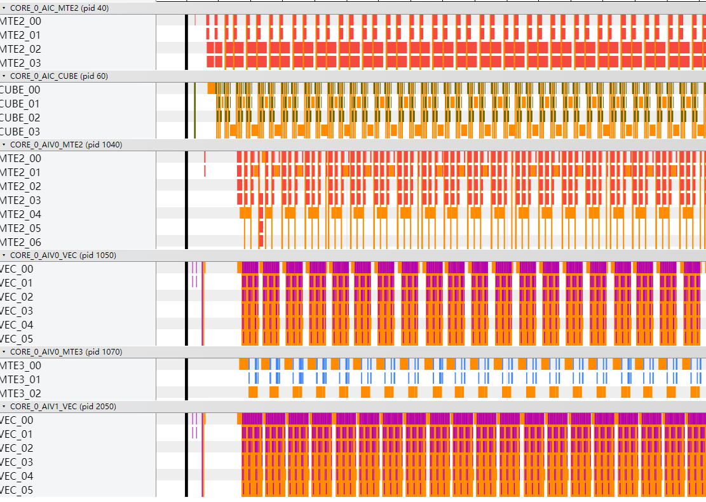
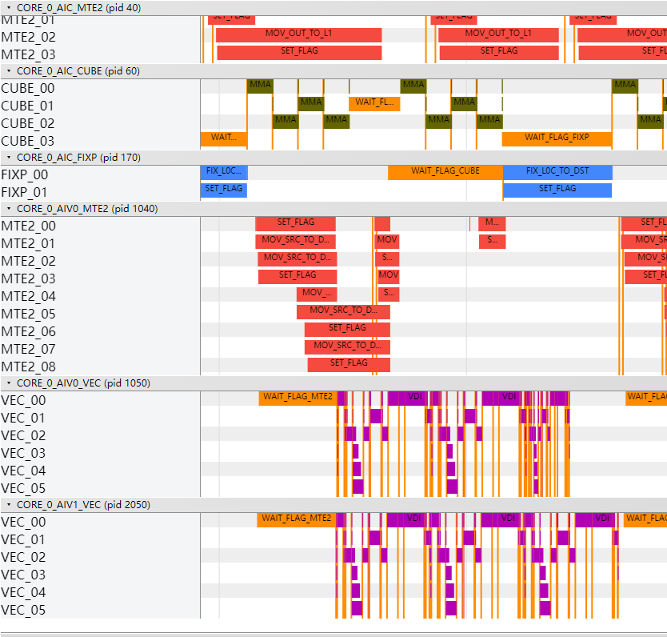

# GroupedMatmul算子性能调优案例

> **Section**: 3.10.2  
> **PDF Pages**: 678–682  

---

<!-- page 678 -->

## 3.10.2 GroupedMatmul 算子性能调优案例

案例介绍

本案例对分组Matmul即GroupedMatmul算子的per-token量化场景进行性能分析和优化，GroupedMatmul算子计算过程（通过python代码表达）为：

```cpp
offset = 0for i in range(g):    mmOut = x[offset:offset + groupList[i]] * weight[i] + bias[i]    y[offset:offset + groupList[i]] = Gelu(mmOut * scale[i] * pertokenScale[offset:offset + groupList[i]])    offset += groupList[i]
```

验证平台为Atlas A2 训练系列产品/Atlas A2 推理系列产品。

优化分析以如下算子规格为例：

表3-28算子规格

**inputshapedata typeformat**

x(1024,1024)int8ND

weight(8,1024,8192)int8NZ

bias(8,8192)int32ND

groupList8int64ND

scale(8,8192)floatND

pertokenScale1024floatND

y(1024,8192)float16ND

主要介绍以下优化方法：

●对于Vector计算占比较高（Vector Bound）的场景，将AI Core中的AIC核和AIV核启动比例设置为1:2；

●优化CV并行流水，减少Cube和Vector计算间的空闲等待时间；

●优化Vector计算流水，提高Vector并行计算速度。

获取性能数据

固定8核测试，即当前性能和后续优化tiling中numBlocks固定设置为8。

通过msProf算子调优工具获取算子性能数据：

●获取真实环境执行的性能数据（指令的cycle占比数据ArithmeticUtilization.csv），包含各个流水的占比情况；

●获取仿真性能数据（指令流水图），包含各个流水的占用区间，可观察流水间依赖情况，从而优化并行效率。

<!-- page 679 -->

分析主要瓶颈点

固定8核进行测试的情况下，通过msprof op命令获取指令的cycle占比数据如下：

图3-160指令的cycle 占比数据ArithmeticUtilization.csv（性能总耗时为218.1us）



通过msprof op simulator获取到的指令流水图如下图所示：

图3-161指令流水图



结合上述两种数据（真实数据和仿真数据）进行性能分析：

●Vector计算bound，当前为减少核启动开销设置为1:1；

●实际优化过程中，对上述问题进行优化、Vector计算占比下降后，Cube和Vector计算各自都有间隙，相互之间都有等待耗时；


●Vector计算没有开启double buffer，计算和数据搬运部分没有并行。

<!-- page 680 -->



设计优化方案

●将AI Core中的AIC核和AIV核启动比例设置为1:2。每次AIC输出的数据，由两个AIV并行计算对应的反量化和激活函数；在Vector侧代码的循环里，AIV0和AIV1交替进行计算（前提条件，循环次数不为1）。代码示例如下：uint32_t vecCount = 0;uint32_t taskRation = GetTaskRatio();for (uint32_t offsetN = 0; offsetN < curCubeSingleN; offsetN += mnConfig.baseN) {    if (unlikely(offsetN + mnConfig.baseN >= curCubeSingleN)) {        curVecBaseN = curCubeSingleN - offsetN;    }    uint32_t alignBaseN = Ceil(curVecBaseN, uint32_t(8)) * 8;    DataCopyScale(curVecBaseN, alignBaseN, scaleOffset + offsetN);    uint32_t curVecBaseM = vecBaseM;    uint64_t mmOutOffset = mnConfig.workSpaceOffset + offsetN * mnConfig.baseM;    CrossCoreWaitFlag(SYNC_AIC_TO_AIV);    for (uint32_t offsetM = 0; offsetM < curCubeSingleM; offsetM += vecBaseM) { vecCount++;        if (vecCount % taskRation != subBlockIdx) {            continue;// AIV0和AIV1交替进行计算        }        if (unlikely(offsetM + vecBaseM >= curCubeSingleM)) {             curVecBaseM = curCubeSingleM - offsetM;         }        // 使用AscendDequant接口做perchannel反量化        LocalTensor<cT::T> mmOutLocal = vecInQueue.AllocTensor<cT::T>();        DataCopyPad2D(mmOutLocal, mmOutGm[mmOutOffset + offsetM * curVecBaseN],                      curVecBaseM, curVecBaseN, curVecBaseN);        vecInQueue.EnQue(mmOutLocal);        ComputeDequantAndActivate(mnConfig, curVecBaseM, alignBaseN, curVecBaseN, offsetM);        LocalTensor<DTYPE_Y> yLocal = vecOutQueue.DeQue<DTYPE_Y>();        DataCopyPad2D(yGm[outOffset + offsetM * tiling->n + offsetN], yLocal,                      curVecBaseM, curVecBaseN, alignBaseN, tiling->n);        vecOutQueue.FreeTensor(yLocal);    }    ...}

●AIC和AIV启动比例设置为1:2后，出现Cube和Vector计算各自都有间隙、相互之间都有等待耗时的情况。分析原因是因为Vector和Cube计算存在使用一份workspace进行数据传递的场景，通过4份workspace的方案进行优化：host按4倍baseM * baseN申请workspace，Cube侧代码在计算前可以跳过前4轮的等待。if ASCEND_IS_AIC {    if (cubeCount >= tiling->parallNum) {  // tiling->parallNum设置为4        CrossCoreWaitFlag(SYNC_AIV_TO_AIC);    }    mm.SetOrgShape(mnConfig.m, tiling->n, tiling->k);    mm.SetSingleShape(curSingleM, curSingleN, tiling->k);    mm.SetTensorA(xGm[xOffset]);    auto weightSlice = weightGm[weightOffset];    if (mnConfig.numBlocksM == 1) {        weightSlice.SetL2CacheHint(CacheMode::CACHE_MODE_DISABLE);    }    mm.SetTensorB(weightSlice);    uint64_t workspaceOffset = mnConfig.workSpaceOffset;

<!-- page 681 -->

```cpp
while (mm.Iterate()) {        mm.GetTensorC(mmOutGm[workspaceOffset], 0, true);
        CrossCoreSetFlag<2, PIPE_FIX>(SYNC_AIC_TO_AIV);
        workspaceOffset += (mnConfig.baseM * mnConfig.baseN);    }}cubeCount++;
```

●Vector计算开启double buffer，InitBuffer指定分配内存块个数为2。pipe->InitBuffer(scaleInQueue, 2, tiling->mmTilingData.baseN * sizeof(DTYPE_SCALE));pipe->InitBuffer(perTokenScaleInQueue, 2, tiling->mmTilingData.baseM * sizeof(float));pipe->InitBuffer(vecInQueue, 2, tiling->ubCalSize * sizeof(cT::T));pipe->InitBuffer(vecOutQueue, 2, tiling->ubCalSize * sizeof(DTYPE_Y));

验证优化方案性能收益

●将AI Core中的AIC和AIV启动比例设置为1:2后，执行总耗时从218.1us下降为154.2us。指令流水图显示Cube计算间等待变小。



●如上图所示，Vector计算已经不处于bound状态，但Cube和Vector计算都有间隙，未被充分利用（上述两个箭头的位置）。分析原因如下：

Vector计算在等Cube计算输出的数据，Cube侧需要等Vector计算完释放workspace以存放下一轮的计算结果，当前为了让Cube、Vector计算流水并行，workspace使用了两份空间：



因为Vector和Cube计算存在使用一份workspace进行数据传递的场景，存在数据依赖，所以会有等待的间隔。

可以采用4份workspace进行优化：



优化后，总耗时由154.2us下降为131.8us。指令流水图显示Vector、Cube计算各自间隙明显减小。

<!-- page 682 -->



●Vector计算开启double buffer，优化后执行总耗时从131.8us下降为128.1us。



