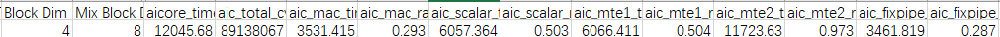
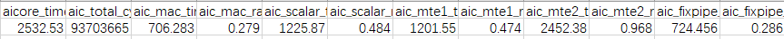
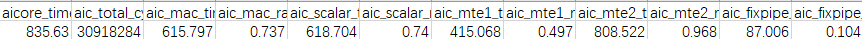
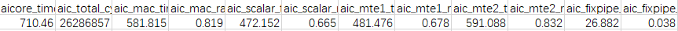

# Matmul算子优化Tiling策略

> **Section**: 3.10.4.2  
> **PDF Pages**: 690–693  

---

<!-- page 690 -->

分类适用场景相关案例

相较于MIX模式，没有矢量计算，只有矩阵计算的场景。

纯Cube模式：减少消息处理机制带来额外的Scalar开销。

**Matmul高阶API使能纯Cube模式**

●搬运优化

表3-33搬运优化策略总览

分类适用场景相关案例

1.MTE2循环搬运次数多的大shape场景。

1.Matmul 高阶API

搬运吞吐量优化：通过合理控制搬运数据块的大小，提升带宽利用效率，实现搬运效率的提升。

使能MDL模板

2.输入和输出的数据量超过L2Cache大小的场景。

2.Matmul高阶API

使能L2 Cache切分

MTE2流水间隙较大，且M或N数值较大的场景。

**Matmul高阶API使能MTE2 Preload**

预加载搬运：预加载需要搬运的数据块，减少流水之间的间隙。

## 3.10.4.2 Matmul 算子优化Tiling 策略

案例介绍

本案例对Matmul算子进行性能分析和优化。Matmul算子实现的功能是矩阵乘法，其中主要包含数据搬入和搬出流水，Cube计算流水。

以矩阵维度M = 4096，N = 5120，K = 4096，输入数据类型half，输出数据类型float，输出格式是ND为例，性能验证平台为Atlas A2 训练系列产品/Atlas A2 推理系列产品，介绍针对Matmul算子的优化手段，包括优化分核逻辑、优化基本块、使能大包搬运。

●分核逻辑：开启尽量多的Cube核使能并行计算。

●优化基本块，选择最优的baseM、baseN、baseK参数，其中baseM、baseN、baseK为Matmul Tiling中的参数。

●使能大包搬运：从GM搬运数据到L1时，对于A矩阵，一次搬入depthA1个基本块，基本块大小为baseM * baseK，对于B矩阵，一次搬入depthB1个基本块，基本块大小为baseN * baseK。使能大包搬运后，一次搬入的数据量变大，从而提升MTE2搬运效率。

获取性能数据

使用msProf工具获取算子的Profiling数据，重点分析MTE2，Cube，Scalar pipeline的流水情况。

<!-- page 691 -->

分析主要瓶颈点

图3-164优化前Profiling 数据



由以上Profiling数据，可以看出MTE2耗时占比较大，当前性能瓶颈点在于MTE2流水。

●Profiling数据的Block Dim可见分核未分满，考虑分核逻辑的优化。设CurrentCore是未优化前分核的Cube核数，MaxCore为最大Cube核数，当开启全部核并行做当前shape数据量的计算时，预估性能收益为MaxCore / CurrentCore的倍数。

●优化基本块切分，将影响搬运数据的效率，算子搬运的总数据量为搬运的左矩阵和右矩阵数据量之和。在Matmul计算K方向不能全载的场景下，根据矩阵乘法的算法，搬运左矩阵的次数为N / baseN，搬运右矩阵的次数为M / baseM，即搬运总数据量totalCnt = (N / baseN) * M * K + (M / baseM) * K * N。预估性能收益为搬运数据量的比值，优化前搬运数据量totalCnt0/优化后搬运数据量totalCnt1，化简后结果为(1 / baseM0 + 1 / baseN0) / (1 / baseM1 + 1 /baseN1)，其中，baseM0, baseN0为优化前基本块参数，baseM1, baseN1为优化后基本块参数。

●使能大包搬运后，指令条数变化、地址对齐等因素会影响性能，按照经验预估，对于MTE2为性能瓶颈的场景，会有20%以上的MTE2性能收益。

设计优化方案

●优化点一：优化分核逻辑

由Profiling数据看出分核数为4，启动更多的核同时计算，可以提高计算并行度。当前案例使用的AI处理器共20个核，每个核中包含1个Cube Core和2个VectorCore。NPU调用程序中设置numBlocks为实际使用的核数20。

// 代码片段uint32_t numBlocks = 20; // 优化前numBlocks为4CHECK_ACL(aclInit(nullptr));int32_t deviceId = 0;CHECK_ACL(aclrtSetDevice(deviceId));aclrtStream stream = nullptr;CHECK_ACL(aclrtCreateStream(&stream));

```cpp
uint8_t *aHost;uint8_t *aDevice;CHECK_ACL(aclrtMallocHost((void **)(&aHost), aFileSize));CHECK_ACL(  aclrtMalloc((void **)&aDevice, aFileSize, ACL_MEM_MALLOC_HUGE_FIRST));ReadFile("./input/x1_gm.bin", aFileSize, aHost, aFileSize);// PrintData(aHost, 16, printDataType::HALF);CHECK_ACL(aclrtMemcpy(aDevice, aFileSize, aHost, aFileSize,                    ACL_MEMCPY_HOST_TO_DEVICE));
uint8_t *bHost;uint8_t *bDevice;CHECK_ACL(aclrtMallocHost((void **)(&bHost), bFileSize));CHECK_ACL(  aclrtMalloc((void **)&bDevice, bFileSize, ACL_MEM_MALLOC_HUGE_FIRST));ReadFile("./input/x2_gm.bin", bFileSize, bHost, bFileSize);// PrintData(bHost, 16, printDataType::HALF);CHECK_ACL(aclrtMemcpy(bDevice, bFileSize, bHost, bFileSize,                    ACL_MEMCPY_HOST_TO_DEVICE));
uint8_t *workspaceHost;
```

<!-- page 692 -->

```cpp
uint8_t *workspaceDevice;CHECK_ACL(aclrtMallocHost((void **)(&workspaceHost), workspaceSize));CHECK_ACL(aclrtMalloc((void **)&workspaceDevice, workspaceSize,                    ACL_MEM_MALLOC_HUGE_FIRST));
uint8_t *tilingHost;uint8_t *tilingDevice;CHECK_ACL(aclrtMallocHost((void **)(&tilingHost), tilingFileSize));CHECK_ACL(aclrtMalloc((void **)&tilingDevice, tilingFileSize,                    ACL_MEM_MALLOC_HUGE_FIRST));CHECK_ACL(aclrtMemcpy(tilingHost, tilingFileSize, GenerateTiling(),                    tilingFileSize, ACL_MEMCPY_HOST_TO_HOST));// PrintData(tilingHost, 16, printDataType::UINT32_T);CHECK_ACL(aclrtMemcpy(tilingDevice, tilingFileSize, tilingHost,                    tilingFileSize, ACL_MEMCPY_HOST_TO_DEVICE));
uint8_t *cHost;uint8_t *cDevice;CHECK_ACL(aclrtMallocHost((void **)(&cHost), cFileSize));CHECK_ACL(  aclrtMalloc((void **)&cDevice, cFileSize, ACL_MEM_MALLOC_HUGE_FIRST));
```

// ACLRT_LAUNCH_KERNEL(matmul_custom)// (numBlocks, stream, aDevice, bDevice, cDevice, workspaceDevice, tilingDevice);matmul_custom_do(numBlocks, stream, aDevice, bDevice, cDevice, workspaceDevice, tilingDevice);由于Matmul API都是从Vector侧发起的，当前案例使用的AI处理器中Cube Core和Vector Core的配比为1 : 2，所以在Matmul tiling计算中需要按照2倍的numBlocks数切分，即Vector Core数。NPU调用程序中设置的实际运行核数是20核，所以Tiling代码中设置Tiling API按照40个核进行数据切分，如下代码所示。

int usedCoreNum = 40; // 优化前usedCoreNum是8int runMode = 1;int32_t baseM = 64; // 64int32_t baseN = 64; // 64optiling::TCubeTiling tilingData;MultiCoreMatmulTiling tilingApi;tilingApi.SetDim(usedCoreNum);

图3-165优化分核逻辑后Profiling 数据



修改代码后，算子执行时间从12045us下降到2532us，约等于(20核 / 4核) = 5倍的性能提升。

●优化点二：优化基本块

当前Tiling中设置的base块为 [baseM, baseN, baseK] = [64, 64, 256]，这种基本块Cube计算cycle少，计算访存比（即计算量与需要数据量的比值）低；搬出一次Matmul结果到GM的base块是64 * 64，由于输出格式是ND，数据类型是float，搬出下一次Matmul结果的起始地址需要偏移一个baseN的大小，即64 * 4 = 256字节，导致fixpipe搬出时GM地址非512byte对齐，那么需要设置更优的基本块。

针对当前shape较大的场景，基本块的选择原则为计算访存比最大，即在Cube计算量最大的情况下，访存的数据量最小。在输入为fp16类型的情况下，Cube执行单元1 cycle能算16 * 16 * 16个数。根据经验，[baseM, baseN, baseK] = [128,256, 64]和[128, 128, 128]两种切分方案均满足搬出时GM地址512Byte对齐（每搬出一次Matmul结果时，地址分别偏移256 * 4byte和128 * 4byte），Cube计算cycle数一致，为(128 * 64 * 256) / (16 * 16 * 16) = (128 * 128 * 128) / (16 * 16* 16) = 512cycle。针对[baseM, baseN, baseK] = [128, 256, 64]，计算访存比为512cycle / (128 * 64 * 2 + 256 * 64 * 2) = 512cycle / 48KB；针对[baseM,baseN, baseK] = [128, 128, 128]，计算访存比为512cycle / (128 * 128 * 2 + 128* 128 * 2) = 512cycle / 64KB；可见[128, 256, 64]基本块方案的计算访存比更

<!-- page 693 -->

高，计算密度更大，同样的计算量，需要的数据量最小，最大限度提高Cube单元的计算量。

修改Tiling代码，通过SetFixSplit()接口设置baseM和baseN，tiling函数会自动计算出最优baseK，这里得到64。

int32_t baseM = 128; // 优化前baseM是64int32_t baseN = 256; // 优化前baseN是64

```cpp
optiling::TCubeTiling tilingData;MultiCoreMatmulTiling tilingApi;tilingApi.SetDim(usedCoreNum);tilingApi.SetAType(leftPos, leftFormat, leftDtype, bool(transposeA));tilingApi.SetBType(rightPos, rightFormat, rightDtype, bool(transposeB));tilingApi.SetCType(resPos, resFormat, resDtype);tilingApi.SetBiasType(biasPos, biasFormat, biasDtype);
```

tilingApi.SetOrgShape(M, N, K);tilingApi.SetShape(M, N, K);tilingApi.SetFixSplit(baseM, baseN, -1);

使能这组基本块后，MTE2耗时（对应aic_mte2_time）从2452us降低到808us，MTE2性能提升3倍。

图3-166优化基本块后Profiling 数据



●优化点三：使能大包搬运

当前带宽利用率为：totalSize / mte2Time = totalCnt * dtype / mte2Time，代入数据计算为2491GB/s。未使能大包搬运的情况下，矩阵从GM搬运到L1一次只搬运1个基本块。通过模板参数使能大包搬运，一次搬运多个基本块，提高MTE2带宽利用率。

// 原始matmul对象定义:  Matmul<AscendC::MatmulType<TPosition::GM, CubeFormat::ND, A_T>,         AscendC::MatmulType<TPosition::GM, CubeFormat::ND, B_T>,         AscendC::MatmulType<TPosition::GM, CubeFormat::ND, C_T>,         AscendC::MatmulType<TPosition::GM, CubeFormat::ND, BiasT>>>      mm; // 通过在定义matmul对象的模板参数里加上CFG_MDL参数使能大包搬运功能：  Matmul<AscendC::MatmulType<TPosition::GM, CubeFormat::ND, A_T>,         AscendC::MatmulType<TPosition::GM, CubeFormat::ND, B_T>,         AscendC::MatmulType<TPosition::GM, CubeFormat::ND, C_T>,         AscendC::MatmulType<TPosition::GM, CubeFormat::ND, BiasT>, CFG_MDL>>      mm;

从下图可以看到，使能大包搬运后，MTE2耗时从808us下降到591us，带宽利用率代入数据计算为3406GB/s，利用率提升36%+，Cube利用率达到80%+。

图3-167使能大包搬运后Profiling 数据



验证优化方案性能收益

●优化分核逻辑，实际收益4.75倍，约等于(20核 / 4核) = 5倍收益，并且考虑到核的启动开销，可以认为收益一致。

●优化基本块，实际收益约3倍，理论评估代入上述分析公式，收益为(1 / 64 + 1 /64) / (1 / 128 + 1 / 256)，约等于2.7倍，考虑到cache缓存的影响，认为收益一致。

●大包搬运，实际收益25%+，与经验值一致。
