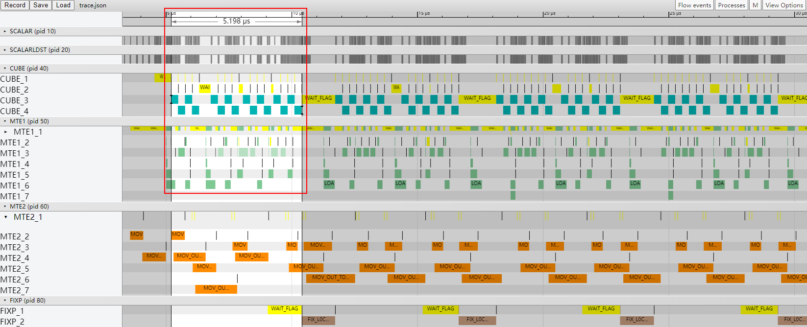
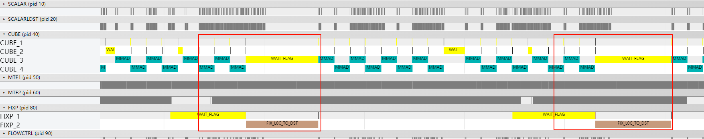
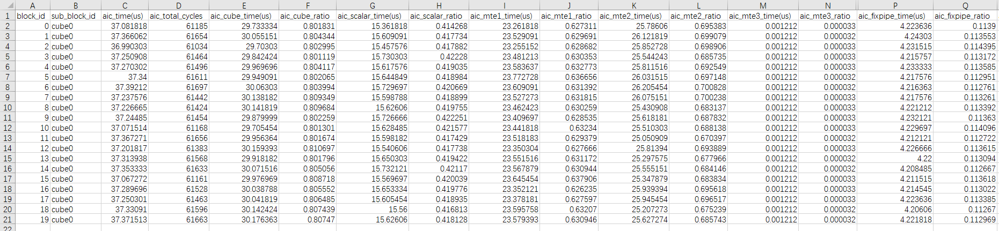
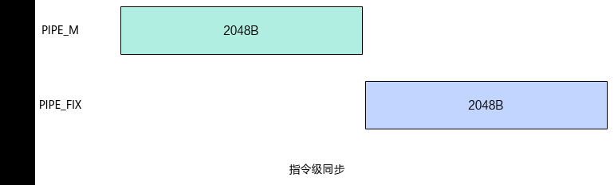
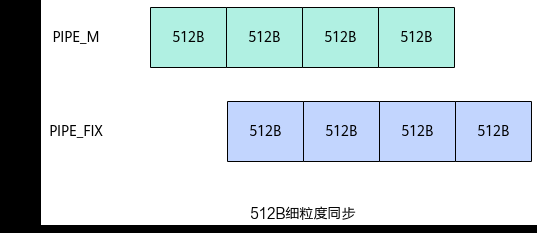

# Matmul高阶API使能UnitFlag

> **Section**: 3.10.4.5  
> **PDF Pages**: 701–703  

---

<!-- page 701 -->



总结

大Shape输入、MTE2搬运次数多，且MTE1流水等MTE2流水的同步等待耗时较长的场景下，可以使能MDL模板。通过实现MTE2从Global Memory一次性搬入多个基本块到A1或B1，使后续的MTE1流水能尽量复用A1/B1的缓存数据，减少MTE2的搬运次数，从而提升算子性能。

## 3.10.4.5 Matmul 高阶API 使能UnitFlag

案例介绍

本案例呈现了在矩阵乘算子场景中，使用Matmul高阶API进行矩阵乘法计算，使能UnitFlag功能对算子性能的提升效果。UnitFlag功能为AIC核中MMAD计算指令和FIXPIPE数据搬运指令提供了基于内存访问的细粒度同步，使计算与搬运流水并行。使能UnitFlag功能的方式为将MatmulConfig中的enUnitFlag参数设置为true。enUnitFlag参数的详细介绍请参考MatmulConfig。

●使能UnitFlag的适用场景

算子的MMAD流水和FIXPIPE流水之间串行执行，FIXPIPE等待MMAD计算完成才搬出结果，这个指令同步等待的时间在算子整体执行耗时中占比较高。这种场景可以使能UnitFlag功能，以获得MMAD和FIXPIPE流水并行的性能收益。如果算子原本的MMAD、FIXPIPE流水可以被其他流水掩盖（比如MTE2 Bound），这时使能UnitFlag功能总体收益很小。

●使能UnitFlag的约束条件

–UnitFlag功能仅支持Norm、IBShare、MDL三个模板。

–使能UnitFlag功能时，不支持算子内同时存在CO1(L0C)搬出到GlobalMemory和A1(L1)搬出到Global Memory的两种流水。

–使能UnitFlag功能时，若同时使能L0C累加功能，不支持多次Iterate计算、一次GetTensorC输出。

本案例的算子规格如下：

表3-36算子规格

输入ShapeData typeFormat

a128, 64float16ND

<!-- page 702 -->

输入ShapeData typeFormat

b64, 30720float16ND

当前案例使用的AI处理器共20个核，每个核包含1个AIC核和2个AIV核。

算子的Tiling参数如下：

●原始shape：M=128, N=30720, K=64。

●单核shape：按20个AIC核进行切分，singleCoreM=128，singleCoreN=1536，singleCoreK=64。

对于B矩阵，沿着N轴进行切分，切分成20份singleCoreN，单核上处理K *SingleCoreN大小的数据。对于A矩阵，M轴不进行切分即singleCoreM=M，单核上处理singleCoreM * K大小的数据。总共20个核参与计算。

●基本块shape：baseM=128，baseN=256，baseK=64。

●L1相关Tiling参数：stepM=1，stepN=1，stepKa=4，stepKb=4，depthA1=8，depthB1=8。

获取性能数据

使用msProf工具获取算子仿真流水图和上板Profiling数据。因为UnitFlag功能主要优化MMAD和FIXPIPE流水串行问题，所以获取性能数据后重点分析Cube、FIXPIPE的流水情况。

分析主要瓶颈点

●优化前的流水图如下。如下图中红框所示，每一轮MMAD计算流水和FIXPIPE数据搬出流水之间都是串行执行的，完成MMAD计算后才开始FIXPIPE数据搬出，考虑实现MMAD与FIXPIPE之间流水并行来优化算子性能。



●优化前的Profiling数据如下，从C列的aic_time数据可以看出，多个核中最大算子执行耗时为37.39us。



设计优化方案

如下图所示，未开启UnitFlag功能时，MMAD和FIXPIPE是指令级别的同步，FIXPIPE指令需要等MMAD指令执行完成才进行结果搬出，MMAD和FIXPIPE之间流水串行。

<!-- page 703 -->

图3-172未开启UnitFlag 功能



如下图所示，开启UnitFlag功能时，MMAD和FIXPIPE指令是512B大小的细粒度同步。在一条MMAD指令执行过程中，每当完成一个512B数据结果的计算，FIXPIPE立即开始搬出该512B的数据，从而实现MMAD和FIXPIPE之间的流水并行，提升算子性能。

图3-173开启UnitFlag 功能



Matmul API使能UnitFlag功能的完整样例请参考Matmul API性能优化样例。使能UnitFlag功能的主要步骤如下：

步骤1自定义MatmulConfig模板参数，将其中的enUnitFlag参数设置为true，使能UnitFlag功能。

```cpp
__aicore__ inline constexpr MatmulConfig GetCustomMDLCFG(){    auto mmCfg = CFG_MDL;
    mmCfg.enUnitFlag = true;
    return mmCfg;}constexpr static MatmulConfig CUSTOM_CFG_MDL = GetCustomMDLCFG();
```

步骤2基于自定义的MatmulConfig模板参数，创建Matmul对象。

```cpp
using A_TYPE = AscendC::MatmulType<AscendC::TPosition::GM, CubeFormat::ND, AType>;using B_TYPE = AscendC::MatmulType<AscendC::TPosition::GM, CubeFormat::ND, BType>;using C_TYPE = AscendC::MatmulType<AscendC::TPosition::GM, CubeFormat::ND, CType>;using BIAS_TYPE =  AscendC::MatmulType<AscendC::TPosition::GM, CubeFormat::ND, BiasType>;AscendC::Matmul<A_TYPE, B_TYPE, C_TYPE, BIAS_TYPE, CUSTOM_CFG_MDL > matmulObj;
```

**----结束**
