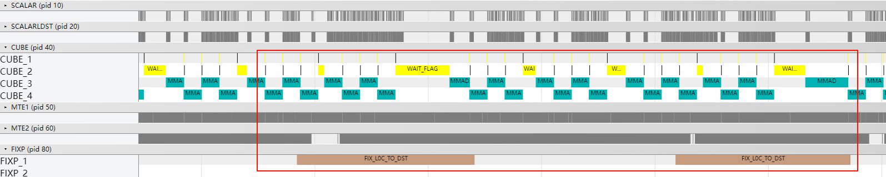
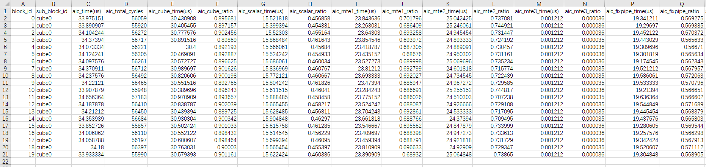
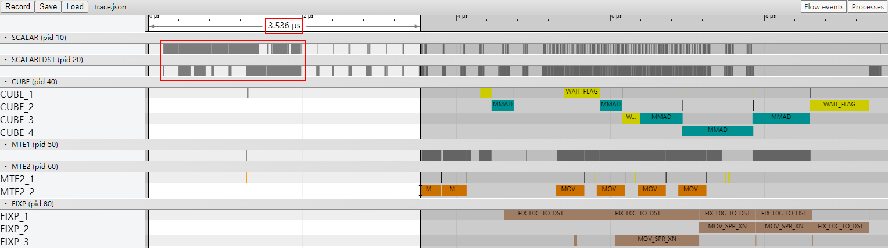
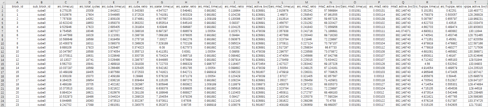
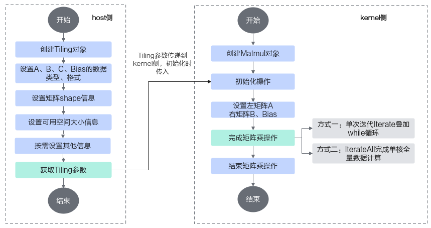
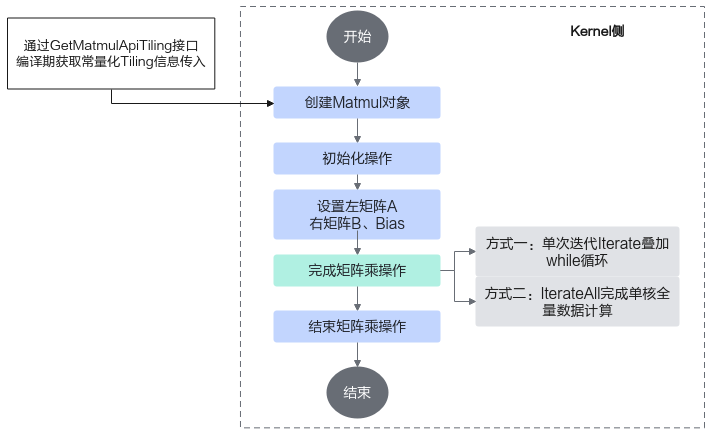
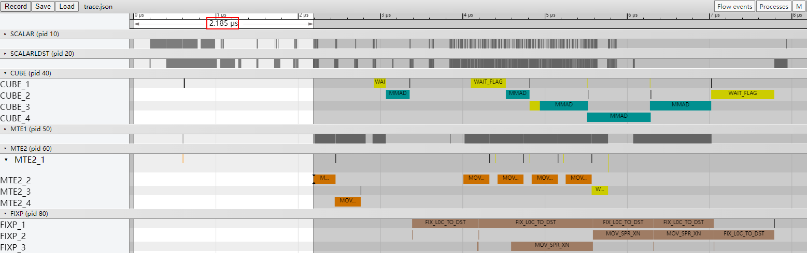

# Matmul高阶API使能Tiling全量常量化

> **Section**: 3.10.4.6  
> **PDF Pages**: 704–707  

---

<!-- page 704 -->

验证优化方案性能收益

●优化后的流水图如下，MMAD计算流水和FIXPIPE数据搬出流水之间实现了流水并行。



●优化后的Profiling数据如下，从C列的aic_time数据可以看出，多个核中最大算子执行耗时为34.66us，较优化前的37.39us有约7.3%的性能提升。



总结

在算子的MMAD计算流水和FIXPIPE数据搬出流水串行且未被其他流水掩盖（比如MTE2 Bound）时，考虑使能UnitFlag功能，实现MMAD计算流水和FIXPIPE数据搬出流水的流水并行，提升算子性能。

## 3.10.4.6 Matmul 高阶API 使能Tiling 全量常量化

案例介绍

本案例呈现了在使用Matmul高阶API进行矩阵乘法计算时，使能Matmul Tiling全量常量化对算子性能的提升效果。Matmul API在初始化和迭代过程中有大量Scalar计算，Matmul初始化时的Scalar计算影响指令头开销，Matmul迭代间的Scalar计算可能阻塞MTE2流水。在调用Matmul API实现矩阵乘法时，使用MatmulApiStaticTiling参数替代TCubeTiling变量参数，将Scalar计算提前到编译期进行，以减少运行时的Scalar计算开销，实现算子性能的提升。

●Matmul Tiling常量化的适用场景：

–Matmul初始化时的Scalar计算较多，影响指令头开销。

–Matmul迭代之间的Scalar计算较多，阻塞MTE2流水。

●Matmul Tiling常量化需要在编译期确定部分Tiling参数，根据确定参数的不同，分为全量常量化和部分常量化两种场景，使用Matmul Tiling常量化需要满足两种场景中任一场景的条件：

–全量常量化：能够确定常量singleCore Shape（singleCoreM/singleCoreN/singleCoreK）和常量base Shape（basicM/basicN/basicK，也称baseM/baseN/baseK）。

–部分常量化：能够确定常量base Shape（basicM/basicN/basicK，也称baseM/baseN/baseK）。

其中，全量常量化场景比部分常量化场景可以减少更多的Scalar计算开销。

<!-- page 705 -->

本案例的算子规格如下：

表3-37算子规格

输入ShapeData typeFormat

a128, 64float16ND

b64, 30720float16ND

当前案例使用的AI处理器共24个核，每个核中包含1个AIC核和2个AIV核。

Tiling参数如下：

●原始shape：M=128, N=30720, K=64。

●单核shape：按24个AIC核进行切分，singleCoreM=128，singleCoreN=1280，singleCoreK=64。对于B矩阵，沿着N轴进行切分，切分成24份的singleCoreN，单核上处理K *singleCoreN大小的数据。对于A矩阵，M轴不进行切分即singleCoreM=M，单核上处理singleCoreM * K大小的数据。总共24个核参与计算。

●基本块shape：baseM=128，baseN=256，baseK=64。

●L1相关Tiling参数：stepM=1，stepN=1，stepKa=4，stepKb=4，depthA1=8，depthB1=8。

获取性能数据

使用msProf工具获取算子仿真流水图和上板Profiling数据。相较于基础场景，Tiling常量化在编译期期间将部分或全部Tiling参数由变量转化为常数值，在算子执行时直接使用常量化的Tiling参数，可以减少Scalar性能开销，所以重点分析Scalar流水。

分析主要瓶颈点

●优化前的流水图如下，默认不使能Tiling常量化，Tiling参数需要从Host侧拷贝到Kernel侧，导致Matmul初始化时的Scalar计算较多，第一个MTE2指令开始于3.536us左右，MTE2前的指令头开销在算子整个流水中占比较大，因此需要优化Scalar计算。



●优化前的Profiling数据如下，从C列的aic_time数据来看，多个核中最大算子执行耗时为10.62us，从G列的aic_scalar_time数据来看，Scalar平均耗时6.32us。



<!-- page 706 -->

设计优化方案

如下图所示，默认不使能Tiling常量化功能时，开发者在host侧创建Tiling对象，通过调用API自动获取Tiling参数。然后将Tiling参数从Host侧传递到Kernel侧，在Kernel侧初始化操作时传入。在算子执行时，使用Tiling变量参数完成矩阵乘操作。

图3-174默认不使能Tiling 常量化的Matmul 计算流程示意图



如下图所示，使能Tiling常量化功能时，开发者只需要在Kernel侧创建Matmul对象时，调用GetMatmulApiTiling接口在编译期获取常量化Tiling信息，即可完成Tiling常量化。在算子执行时，使用常量化的Tiling参数完成矩阵乘操作，减少Scalar计算开销。

图3-175使能Tiling 常量化的Matmul 计算流程示意图



<!-- page 707 -->

Matmul API使能Tiling全量常量化的完整样例请参考Matmul Tiling常量化的算子样例。使能Tiling全量常量化功能的步骤如下：

步骤1调用获取MatmulConfig模板的接口GetMMConfig时，使用常数值设置MatmulShapeParams，得到带有常量化参数的自定义MatmulConfig模板CUSTOM_CFG。

```cpp
constexpr int32_t MAX_M = 10000; // custom matmul kernel support max value of M Dim shapeconstexpr int32_t MAX_N = 10000; // custom matmul kernel support max value of N Dim shapeconstexpr int32_t MAX_K = 10000; // custom matmul kernel support max value of K Dim shapeconstexpr int32_t BASE_M = 128;  // BASE_M * BASE_K * sizeof(typeA) <=L0A sizeconstexpr int32_t BASE_N = 256;  // BASE_N * BASE_K * sizeof(typeB) <=L0B sizeconstexpr int32_t BASE_K = 64;   // BASE_M * BASE_N * sizeof(typeC) <=L0C sizeconstexpr MatmulShapeParams shapeParams = { MAX_M,                                            MAX_N,                                            MAX_K,                                            BASE_M,                                            BASE_N,                                            BASE_K };constexpr MatmulConfig CUSTOM_CFG = GetMMConfig<MatmulConfigMode::CONFIG_MDL>(shapeParams);
```

步骤2创建Matmul对象。首先调用GetMatmulApiTiling接口，将Tiling信息常量化，得到常量化模板参数CONSTANT_CFG，包括常量化的Matmul Tiling信息和MatmulConfig模板。创建Matmul对象时，使用常量化模板参数CONSTANT_CFG。

```cpp
using A_TYPE = AscendC::MatmulType<AscendC::TPosition::GM, CubeFormat::ND, aType>;using B_TYPE = AscendC::MatmulType<AscendC::TPosition::GM, CubeFormat::ND, bType>;using C_TYPE = AscendC::MatmulType<AscendC::TPosition::GM, CubeFormat::ND, cType>;using BIAS_TYPE = AscendC::MatmulType<AscendC::TPosition::GM, CubeFormat::ND, biasType>;constexpr static auto CONSTANT_CFG = AscendC::GetMatmulApiTiling<A_TYPE, B_TYPE, C_TYPE, BIAS_TYPE>(CUSTOM_CFG);AscendC::Matmul<A_TYPE, B_TYPE, C_TYPE, BIAS_TYPE, CONSTANT_CFG> matmulObj;
```

步骤3初始化操作。全量常量化时，可以在REGIST_MATMUL_OBJ接口的入参传递Tiling参数的位置，使用空指针替代。部分常量化时，在Kernel侧使用REGIST_MATMUL_OBJ接口初始化Matmul对象时，仍需要使用Tiling。

// 全量常量化场景，初始化操作示例REGIST_MATMUL_OBJ(&pipe, GetSysWorkSpacePtr(), matmulObj, (TCubeTiling*)nullptr);

// 部分常量化场景，初始化操作示例REGIST_MATMUL_OBJ(&pipe, GetSysWorkSpacePtr(), matmulObj, &tiling);

**----结束**

验证优化方案性能收益

●优化后的流水图如下，通过使能Tiling全量常量化，无需将Tiling参数从Host侧拷贝到Kernel侧，在编译期完成Tiling常量化，减少了Matmul初始化时的Scalar计算。从0us起到第一个MTE2指令发起，这之间的时间为Matmul初始化时间，Matmul初始化时间从优化前的3.536us减少到2.185us，性能有所提升。



