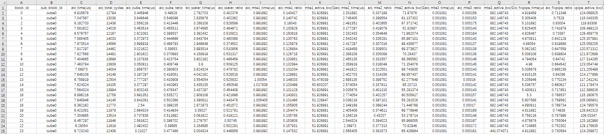
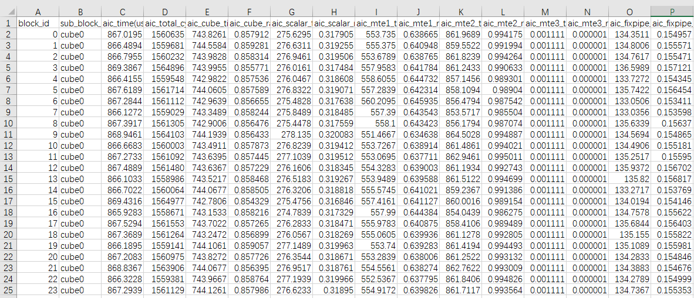
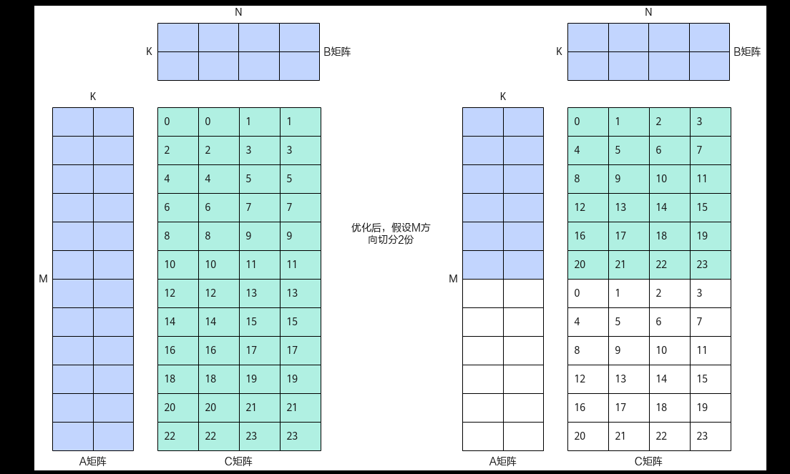
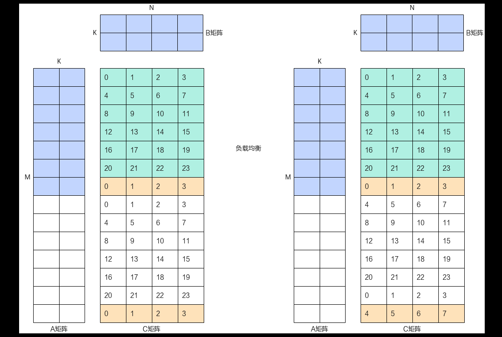
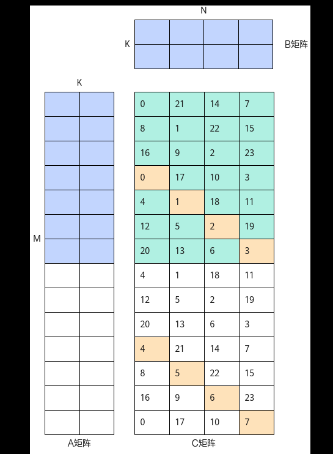

# Matmul高阶API使能L2 Cache切分

> **Section**: 3.10.4.7  
> **PDF Pages**: 708–712  

---

<!-- page 708 -->

●优化后的Profiling数据如下，从C列的aic_time数据来看，多个核中最大算子执行耗时为7.87us，相较于优化前的10.62us提升了25.9%。从G列的aic_scalar_time数据来看，Scalar平均耗时3.38us，相较于优化前的6.32us提升了46.5%。



总结

算子在调用Matmul API完成矩阵乘计算时，若Matmul初始化时的Scalar计算较多，影响了指令头开销，或Matmul迭代间的Scalar计算较多，阻塞了MTE2流水。在这两类场景下，满足上文提及的Tiling常量化使能条件（全量常量化或部分常量化），可以考虑使能Tiling常量化，减少Scalar计算开销，提升算子性能。

## 3.10.4.7 Matmul 高阶API 使能L2 Cache 切分

案例介绍

本案例呈现了在Matmul计算过程中，输入和输出的数据总量超过L2 Cache大小时，通过L2 Cache数据切分对算子性能的提升效果。使能L2 Cache切分的完整样例请参考L2Cache切分的算子样例。

本案例使用的AI处理器的L2 Cache大小为192MB，L2 Cache纯读带宽约为GM的3到4倍，两者之间存在较大差距。在搬入或搬出相同数据量的情况下，访问L2 Cache内的数据比访问GM更快。若数据无法命中L2 Cache，即需要访问的数据不在L2 Cache内，导致需要访问GM进行读写，带宽利用效率较低，最终算子搬入或搬出数据成为算子整个运行过程的性能瓶颈。

●使能L2 Cache切分的适用场景

输入和输出的数据量超过L2 Cache的大小。

本案例的算子规格如下：

表3-38算子规格

输入ShapeData typeFormat

a30720, 1024float16ND

b4096, 1024float16ND

获取性能数据

使用msProf工具获取算子仿真流水图和上板Profiling数据。因为L2 Cache切分功能主要利用带宽更大的L2 Cache，减少MTE2数据搬运开销，所以重点分析MTE2的流水。

<!-- page 709 -->

分析主要瓶颈点

当前案例基于Tiling全量常量化进一步优化，Tiling全量常量化请参考3.10.4.6Matmul高阶API使能Tiling全量常量化案例。优化前的Profiling数据如下，C列的aic_time是867us，K列的aic_mte2_time是861.9us，MTE2占比为99%，MTE2数据搬运是当前算子性能的瓶颈。



设计优化方案

●优化点一：调整切块大小和计算次数

–优化前，输入数据不进行切分，所有核一次计算全部数据。如下图所示，图中数字表示核id，24个核一次计算A和B矩阵的所有数据。

–优化后，输入数据被切分多次，所有核分多次计算，每个核单次计算只依赖切分后的数据量。L2 Cache切分方案确保单次计算的数据都在L2 Cache缓存中，搬运输入数据的效率更高。

图3-176优化点一示意图



●优化点二：选择拖尾较小的L2 Cache切分方案

结合3.8.2.1 核间负载均衡的原理，AI处理器的物理核数固定，当数据进行L2Cache切分之后，可能出现部分核有计算拖尾的情况，即每次所有核总计算量除以

<!-- page 710 -->

每个核单次处理的数据量不能被核数整除，导致每次计算的最后需要部分尾核计算剩余数据。而在尾核计算时，部分核始终处于空闲状态，导致算子的整体性能变差。下图中标黄的数据块就是尾块数据，左边方案由于拖尾，每次计算中0、1、2、3核多执行一次处理剩余数据。为达到全局负载最优，调整拖尾核的位置，如右边方案所示，完成所有计算时，0到7核均多一次数据块的计算。

在实际场景中，满足切分后的数据量小于L2 Cache大小的前提下，拖尾越小越好。基于这个原则可以确定L2 Cache切分块数。

图3-177优化点二示意图



●优化点三：错位分核，减少左右矩阵同地址冲突问题

同地址冲突：多核并发执行Matmul计算时，如果多核同时访问输入矩阵的相同地址，会导致地址冲突，影响性能。

在M和N方向，将矩阵数据L2 Cache切分为大数据块，然后在数据块间错位分核，即将每个数据块依次沿对角线分配给不同的核处理，从而有效减少同地址冲突的问题。比如，在处理同一行的尾块数据0，1，2，3时，如果顺序分配执行的核，多核会同时读同一行左矩阵数据，导致读读冲突。若按照对角线方式分配执行的核，在对角线上的尾块数据被分配给核0，1，2，3计算，多核访问不同行的左矩阵数据，将减少同地址冲突的次数。

<!-- page 711 -->

图3-178优化点三示意图



Matmul API使能L2 Cache切分的完整样例请参考L2 Cache切分的算子样例。实现L2Cache切分的关键步骤如下：

步骤1判断是否需要进行L2 Cache切分。如果数据总量超过设定的L2 Cache大小，则计算L2Cache切分数目。

bool smallDim = mTileNum_ < L1_MIN_UST_DIM && nTileNum_ < L1_MIN_UST_DIM; if (smallDim || (!EnableL2Tile())) { // 判断计算数据总量是否小于L2Cache阈值    mL2TileNum_ = mTileNum_;    nL2TileNum_ = nTileNum_;    mL2BlockNum_ = 1;    nL2BlockNum_ = 1;    return; // 不需要切分，提前返回

<!-- page 712 -->

} InitL2TileTail(); // 计算L2切分

步骤2基于负载均衡原则，计算L2 Cache切分的份数，m方向L2 Cache切分数：mL2TileNum_，n方向L2 Cache切分数：nL2TileNum_。

int64_t mConflict = INT64_MAX; int64_t nConflict = INT64_MAX; constexpr bool isNMajor = l1N > l1M; // 根据shape大小，判断主维度for (int64_t i = maxMajor; i >= L1_MIN_UST_DIM; i--) {         for (int64_t j = maxMinor; j >= minMinor; j--) {                 if (GetTotalSize(j * l1M, i * l1N, k_) <= L2_TILE_THRESHOLD) { // 确保分块小于L2Cache阈值            uint64_t mConflictTmp = AscendC::Ceil(blockNum_, mL2TileNumTailTmp); // 计算负载冲突值            uint64_t nConflictTmp = AscendC::Ceil(blockNum_, nL2TileNumTailTmp);                        if (mConflict >= mConflictTmp && nConflict >= nConflictTmp) { // 若冲突值更小，更新分块数量                mConflict = mConflictTmp;                              nConflict = nConflictTmp;                         mL2TileNum_ = curMajorDim;                                 nL2TileNum_ = curMinorDim;                 }                }        } }

步骤3错位分核。输入当前数据块的下标，获取按对角线分配的核的下标。

```cpp
__aicore__ inline BlockCoord GetBlockCoord(int64_t tileIdx)    {      GetCommonTileIndex(tileIdx);
     int64_t mTileIdx = newBlockIdx_ % mL2TileNumTmp_;
    mTileIdx = mTileIdx + mL2Idx_ * mL2TileNum_;
    int64_t nTileIdx = 0;
         if (mL2TileNumTmp_ != 0 && nL2TileNumTmp_ != 0) {          int64_t tmp = newBlockIdx_ /CalcLcm(mL2TileNumTmp_, nL2TileNumTmp_);
        nTileIdx = (newBlockIdx_ + tmp) % nL2TileNumTmp_;    }          nTileIdx = nTileIdx + nL2Idx_ * nL2TileNum_;
         return {mTileIdx * l1M, nTileIdx * l1N, 0};}
```

步骤4设置左右矩阵，根据前序步骤计算的L2 Cache切分数和执行核的下标，循环多次计算Matmul。

L2CacheOpt l2Opt(shapes, blockNum); matmulObj.SetOrgShape(shapes.m, shapes.n, shapes.k);for (int64_t tileIdx = curBlockIdx; tileIdx < l2Opt.GetTileNum(); tileIdx += blockNum) {     auto blockShape = l2Opt.GetBlockShape(tileIdx);  // 获取单次计算L2切分块大小    if (Get<0>(blockShape) <= 0 ||        Get<1>(blockShape) <= 0){        return;    }    auto blockCoord = l2Opt.GetBlockCoord(tileIdx);     // 获取当前执行计算的核的下标blockCoord        matmulObj.SetTail(Get<0>(blockShape), Get<1>(blockShape), Get<2>(blockShape));     const auto& offsetCoord = CalcOffset(shapes, blockCoord); // 基于下标计算矩阵偏移    int64_t offsetA = Get<0>(offsetCoord);    int64_t offsetB = Get<1>(offsetCoord);       int64_t offsetC = Get<2>(offsetCoord);    matmulObj.SetTensorA(aGlobal[offsetA], false);      matmulObj.SetTensorB(bGlobal[offsetB], false);      if (shapes.isBias) {                  matmulObj.SetBias(biasGlobal);        }      matmulObj.IterateAll(cGlobal[offsetC]);  // 计算L2切分块} matmulObj.End();

**----结束**
