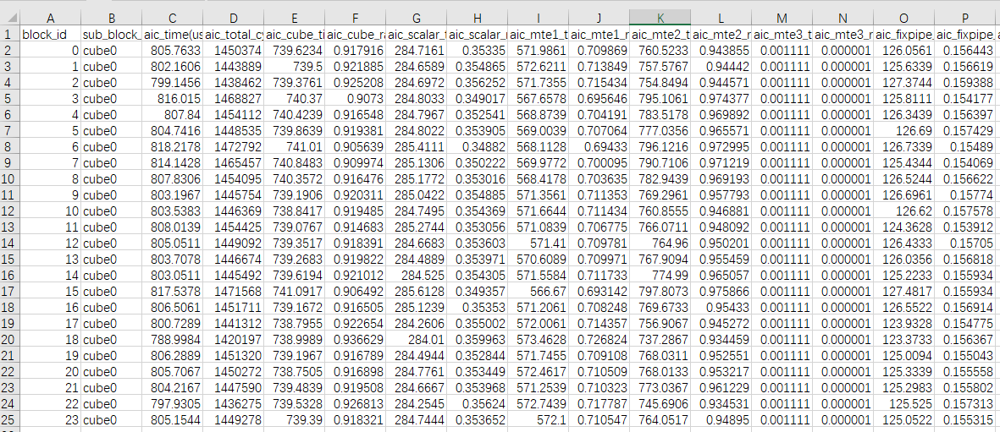
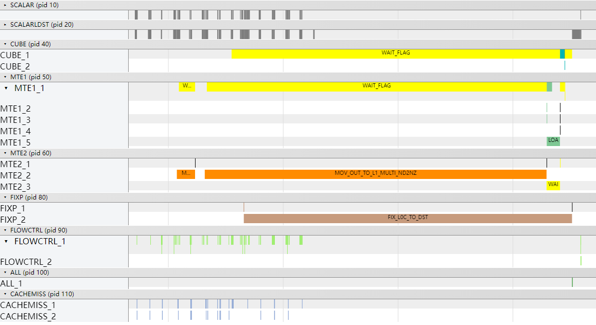
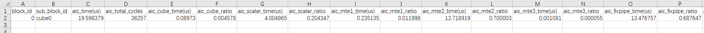
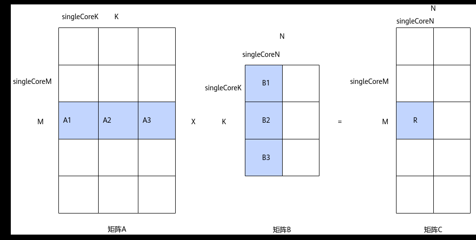

# Matmul高阶API使能多核切K

> **Section**: 3.10.4.8  
> **PDF Pages**: 713–715  

---

<!-- page 713 -->

验证优化方案性能收益

优化后的Profiling数据如下，C列的aic_time为805.6us，相比于优化前，总执行时间降低了约7.1%，MTE2搬运时间降低了约10.7%。

总结

在Matmul计算数据量超过L2 Cache大小的场景下，可以考虑使能L2 Cache切分，提高L2 Cache命中率，利用L2 Cache高带宽特性提升算子性能。

## 3.10.4.8 Matmul 高阶API 使能多核切K

案例介绍

本案例呈现了在矩阵乘算子场景中，使用Matmul高阶API进行矩阵乘法计算，使能多核切K功能对算子性能的提升效果。为了实现算子在多核上并行执行，提升计算效率，需要将矩阵数据进行切分，切分后的数据块被分配到不同的核上处理。通常情况下，切分矩阵数据时仅切分M、N轴，不切分K轴。若M和N较小，切分M和N轴较困难，此时需要考虑K轴切分；使能多核切K功能后，该场景下可以对矩阵的K轴进行切分，从而使算子在多核上并行执行。由于K轴较大，在该场景下不切分K轴通常会导致单核的输入数据量过大，使能K轴切分后，切分策略能够更有效地平衡输出带宽和输入带宽。

●使能多核切K的适用场景

–矩阵的K轴较大，M轴和N轴相比K轴较小，可以在K轴进行切分，使算子并行执行的核数更多。

–矩阵的M轴、N轴和K轴均较大时，可以在K轴进行切分，使切分策略更好地平衡输入和输出带宽。

●使能多核切K的约束条件

–使能多核切K的场景，获取C矩阵结果时仅支持输出到Global Memory。

–使能多核切K的场景，需在Kernel侧代码中首次将C矩阵分片的结果写入Global Memory之前，先对Global Memory进行清零，在获取C矩阵分片的结果时，开启AtomicAdd累加。如果不预先清零Global Memory，可能会因为累加Global Memory中的原始无效数据而产生精度问题。

–使能多核切K的场景，不支持Bias参与矩阵乘计算。

本案例的算子规格如下：

<!-- page 714 -->

表3-39算子规格

输入ShapeData typeFormat

a16, 1024float16ND

b1024, 16float16ND

当前案例使用的AI处理器共24个核，算子中使能高阶API Matmul的纯Cube模式。Tiling参数如下：

●原始shape：M=16, N= 16, K=1024。

●单核shape：未开启多核切K时，singleCoreM=16，singleCoreN=16，singleCoreK=1024；开启多核切K后，singleCoreM=16，singleCoreN=16，singleCoreK=512。

获取性能数据

使用msProf工具获取算子仿真流水图和上板Profiling数据。

分析主要瓶颈点

●优化前的流水图如下，由于未使能多核切K，且M和N非常小，原始矩阵数据未进行切分，所有数据在单核上进行计算。

●优化前的Profiling数据如下，可以看到算子只在单核上执行，aic_time耗时约19.60us，其中aic_mte2_time的平均耗时约为13.72us，aic_mte2_ratio占比较高。

设计优化方案

使能多核切K后，矩阵的K方向数据可以进行切分。如下图所示，C矩阵中的R矩阵块，是通过A1*B1+A2*B2+A3*B3累加得到的，其中，A1*B1、A2*B2、A3*B3可在多个核上并行计算。

<!-- page 715 -->

图3-179开启多核切K

使能多核切K功能的方式为：在GetTiling接口前调用EnableMultiCoreSplitK接口，使能多核切K，并在Kernel实现中，对C矩阵的Global Memory地址清零后开启AtomicAdd。使能多核切K的完整样例请参考多核切K场景的算子样例。具体步骤如下：

●Tiling实现

通过GetTiling接口获取TCubeTiling结构体前，调用EnableMultiCoreSplitK接口且入参为true，使能多核切K。cubeTiling.SetOrgShape(M, N, K);cubeTiling.SetShape(M, N, K);cubeTiling.EnableBias(isBias);cubeTiling.SetBufferSpace(-1, -1, -1);// tiling enable split KcubeTiling.EnableMultiCoreSplitK(true);if (cubeTiling.GetTiling(tilingData) == -1) {    std::cout << "gen tiling failed." << std::endl;    return {};}

●Kernel实现

调用Fill接口，对C矩阵的Global Memory地址清零。cGlobal.SetGlobalBuffer(reinterpret_cast<__gm__ cType*>(c), tiling.M * tiling.N);// clear gmFill(cGlobal, tiling.M * tiling.N, (cType)0);

调用IterateAll接口，开启AtomicAdd累加，完成矩阵乘操作。// set AtomicAdduint8_t enAtomic = 1;matmulObj.IterateAll(cGlobal, enAtomic);

验证优化方案性能收益

●优化后的流水图如下，开启多核切K后，切分原始矩阵的K方向，单核处理K方向的数据量由原来的1024变为512，单核处理的数据量减半，MTE2流水变短。
