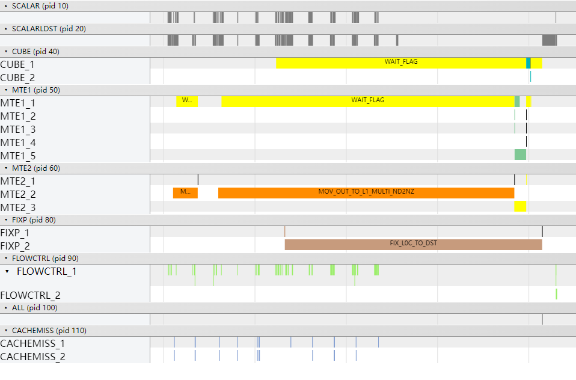
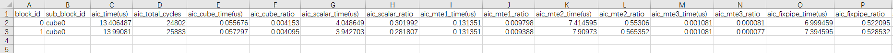
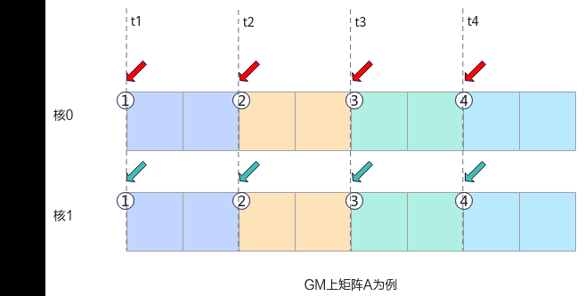
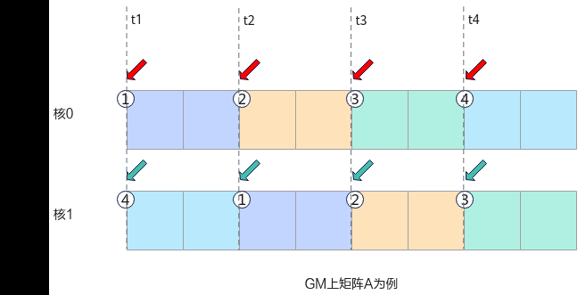
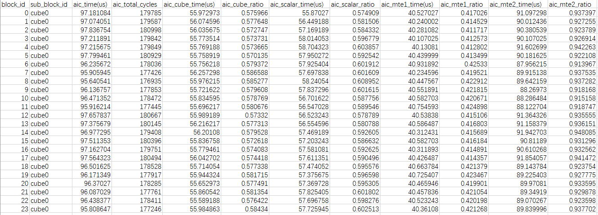
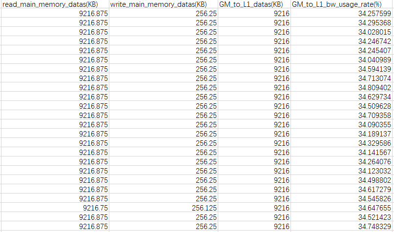
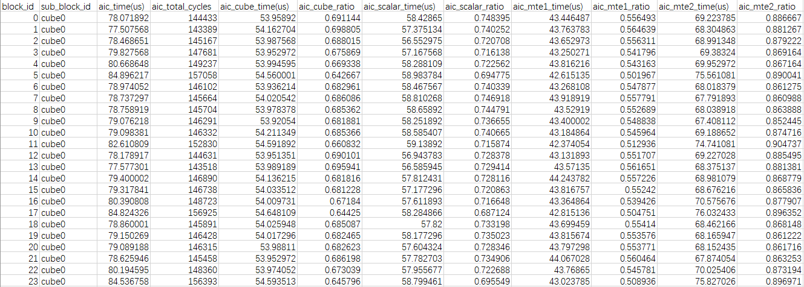

# Matmul高阶API使能多核K轴错峰访问内存

> **Section**: 3.10.4.9  
> **PDF Pages**: 716–719  

---

<!-- page 716 -->



●优化后的Profiling数据如下，可以看到算子在两个核上执行，aic_time平均耗时约为13.70us，较优化前的19.60us有较大提升。



总结

当算子使用Matmul API完成矩阵计算时，原始矩阵的M和N方向无法进行有效切分，且结果输出到Global Memory时，可以考虑使能多核切K功能，实现多核并行，提升计算效率。

## 3.10.4.9 Matmul 高阶API 使能多核K 轴错峰访问内存

案例介绍

本案例呈现在矩阵乘算子场景中，使用Matmul高阶API进行矩阵乘法计算，使能多核K轴错峰访问Device内存对算子性能的提升效果。在多核并行执行Matmul计算时，如果输入矩阵A或B的内存位置位于GM，并且参与多核计算的矩阵相同，那么将出现多核同时访问相同GM地址的情况，导致地址访问冲突，从而影响算子性能。若使能多核K轴错峰访问Device内存，切分的矩阵K轴方向对应的不同核将尽量从不同的GM起始地址开始访问和搬运数据，缓解地址访问冲突，提升算子性能。

<!-- page 717 -->

图3-180访问地址冲突示意图



图3-181缓解地址冲突示意图



●使能多核K轴错峰访问内存的适用场景：

多核执行Matmul，且输入矩阵的K轴较大。

●使能多核K轴错峰访问内存的约束条件：

–输入矩阵的K轴非全载，K轴非全载即矩阵的K方向数据不能同时搬入及保持在L1 Buffer中。

–仅支持MDL模板。

–在多核上执行Matmul计算。

–A矩阵或B矩阵的内存位置位于GM。

本案例的算子规格如下：

<!-- page 718 -->

表3-40算子用例规格

输入ShapeData typeFormat

a768, 6144float16ND

b6144, 2048float16ND

获取性能数据

使用msProf工具获取算子仿真流水图和上板Profiling数据，重点分析MTE2的流水。

分析主要瓶颈点

优化前的Profiling数据（PipeUtilization.csv）如下所示，aic_mte2_ratio平均达到0.93，MTE2在算子整体执行时长中占比较高，算子当前为MTE2 Bound。本案例中，矩阵按M和N方向切分，单核shape[singleCoreM，singleCoreN，singleCoreK]为[128, 512, 6144]，基本块shape[baseM，baseN，baseK]为[128, 256, 64]，每次加载A矩阵的数据时，多核有概率同时访问同一GM地址，引发地址冲突，导致MTE2搬运效率降低，MTE2执行耗时增加。



MTE2的搬运效率还可以通过查看其带宽利用率进行验证，如下图所示，通过分析Memory.csv，发现MTE2平均带宽利用率只有34.4%。



<!-- page 719 -->

查看OpBasicInfo.csv文件，优化前算子整体耗时为98.72us。

设计优化方案

使能K轴错峰访问内存：在创建Matmul对象时，将MatmulConfig中的enableKdimReorderLoad参数设置为true。enableKdimReorderLoad参数的详细介绍请参考MatmulConfig。

使能K轴错峰访问内存的完整样例请参考K轴错峰加载数据的算子样例。使能该功能的主要步骤如下：

步骤1配置MDL模板参数，将其中的enableKdimReorderLoad参数设置为true，使能多核K轴错峰访问Device内存。

```cpp
constexpr MatmulConfig GetMDLKDimReorderConfig(){    auto CFG = CFG_MDL;
    CFG.enableKdimReorderLoad = true;
    return CFG;}constexpr static MatmulConfig MM_CFG = GetMDLKDimReorderConfig();
```

步骤2基于自定义的MatmulConfig模板参数，创建Matmul对象。

```cpp
AscendC::Matmul<AscendC::MatmulType<AscendC::TPosition::GM, CubeFormat::ND, aType>,    AscendC::MatmulType<AscendC::TPosition::GM, CubeFormat::ND, bType>,    AscendC::MatmulType<AscendC::TPosition::GM, CubeFormat::ND, cType>,    AscendC::MatmulType<AscendC::TPosition::GM, CubeFormat::ND, biasType>, MM_CFG> matmulObj;
```

**----结束**

验证优化方案性能收益

算子Tiling参数不变，优化后的Profiling数据（PipeUtilization.csv）如下所示。可以看到，MTE2耗时显著降低，MTE2的平均耗时从90us降低到69.87us，最大耗时从91.94us降低到75.82us。



MTE2的带宽利用率（Memory.csv）如下所示，平均带宽利用率提升到41.7%。
