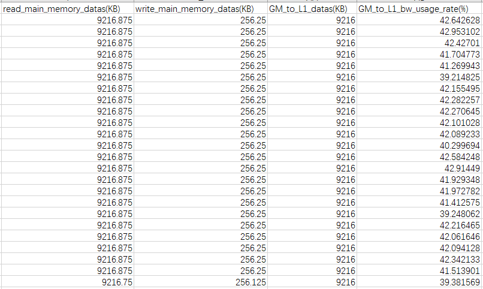
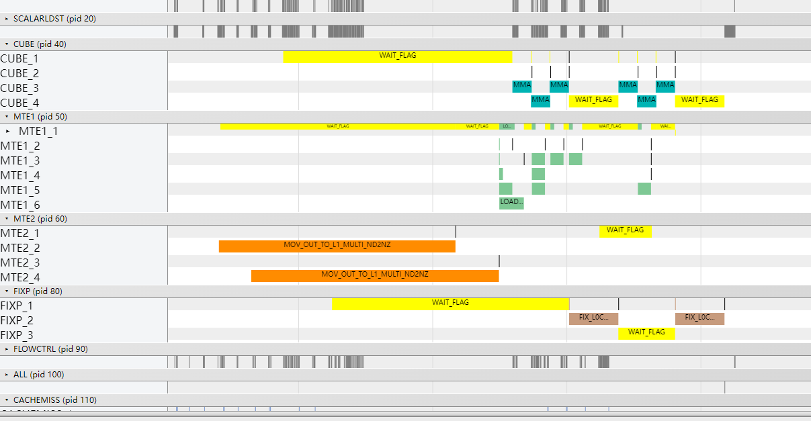
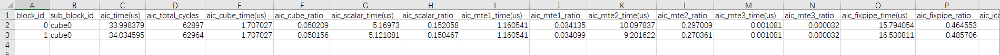
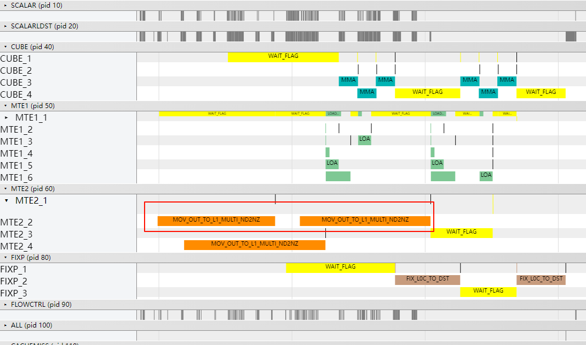
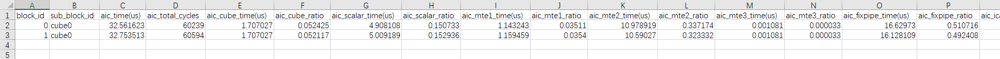

# Matmul高阶API使能NBuffer33模板

> **Section**: 3.10.4.10  
> **PDF Pages**: 720–722  

---

<!-- page 720 -->

查看OpBasicInfo.csv文件，优化后算子整体耗时为85.68us，耗时从98.72us降低到85.68us，性能提升13.2%。

总结

在多核执行Matmul的场景，当输入矩阵K轴较大（一般大于4096）时，可以尝试使用MDL模板并开启K轴错峰访问内存的功能，缓解地址访问冲突，提升MTE2搬运效率，进而优化算子性能。

## 3.10.4.10 Matmul 高阶API 使能NBuffer33 模板

案例介绍

本案例呈现了在矩阵乘算子场景中，使用Matmul高阶API进行矩阵乘法计算，使能NBuffer33模板对算子性能的提升效果。NBuffer33模板的实现为单核计算的A矩阵切分为3x3个基本块，该3x3个A矩阵的基本块全载和保持在L1 Buffer中，每次与3x1个B矩阵的基本块计算矩阵乘，同时DoubleBuffer并行搬入下次计算所需的3x1个B矩阵基本块，直到singleCoreN方向的矩阵乘计算完成。针对MTE2 Bound场景，通过NBuffer33算法的切分数据方式，错开搬运流水，减少单次搬运的数据量，平衡MTE2和FixPipe的数据流量，让两者带宽均匀分布。NBuffer33模板的详细介绍请参考MatmulPolicy。

●使能NBuffer33模板的适用场景

MTE2 Bound的场景，Tiling参数满足约束条件时，可以使能NBuffer33模板。

●使能NBuffer33模板的约束条件

–仅支持MatmulConfig为MDL模板。

–A矩阵、B矩阵的内存逻辑位置只支持TPosition::GM。

–仅支持纯Cube模式（只有矩阵计算），暂不支持MIX模式（包含矩阵计算和矢量计算）。

–仅支持通过IterateAll接口获取Matmul的计算结果C矩阵。

<!-- page 721 -->

–stepM、stepKa、stepKb小于等于3，且满足：stepKa=stepKb=Ceil(singleCoreK/baseK)。

–A矩阵全载的基本块大小与B矩阵载入的基本块大小之和不超过L1 Buffer的大小。

本案例的算子规格如下：

表3-41算子规格

输入ShapeData typeFormat

a256, 192float16ND

b192, 512float16ND

当前案例使用的AI处理器共24个核，算子中使能高阶API Matmul的纯Cube模式，使用MDL模板，Tiling参数如下：

●原始shape：M=256, N=512, K=192。

●单核shape：singleCoreM=256，singleCoreN=256，singleCoreK=192。

●基本块shape：baseM=128，baseN=256，baseK=64。

●L1缓存相关Tiling参数：stepM=2，stepN=1，stepKa=3，stepKb=3。

获取性能数据

使用msProf工具获取算子仿真流水图和上板Profiling数据，重点分析Cube、Fixpipe的流水情况。

分析主要瓶颈点

●优化前的流水图如下，MatmulPolicy的默认模板下A、B矩阵全载，A、B矩阵都只搬运一次。此时MTE2执行时间较长，且流水整体呈串行。

●优化前的Profiling数据如下，aic_time平均耗时34.01us。

<!-- page 722 -->

设计优化方案

使能NBuffer33模板：在GetTiling接口前，调用SetMatmulConfigParams接口开启NBuffer33模式，使获取的Tiling满足要求；Kernel侧在创建Matmul对象时使能NBuffer33模板。使能NBuffer33模板的完整样例请参考使能NBuffer33模板策略的样例。具体步骤如下：

●Tiling实现

调用GetTiling接口获取TCubeTiling结构体前，开启NBuffer33模式。matmul_tiling::MatmulConfigParams matmulConfigParams(1, false,    matmul_tiling::ScheduleType::N_BUFFER_33, /* NBuffer33模式 */    matmul_tiling::MatrixTraverse::NOSET, false);cubeTiling.SetMatmulConfigParams(matmulConfigParams);if (cubeTiling.GetTiling(tilingData) == -1) {    std::cout << "Generate tiling failed." << std::endl;    return {};}

●Kernel实现

设置模板参数MatmulPolicy为NBuffer33模板策略，创建Matmul对象。AscendC::MatmulImpl<    AscendC::MatmulType<AscendC::TPosition::GM, CubeFormat::ND, aType>,    AscendC::MatmulType<AscendC::TPosition::GM, CubeFormat::ND, bType>,    AscendC::MatmulType<AscendC::TPosition::GM, CubeFormat::ND, cType>,    AscendC::MatmulType<AscendC::TPosition::GM, CubeFormat::ND, biasType>, CFG_MDL,    AscendC::MatmulCallBackFunc<nullptr, nullptr, nullptr>,    AscendC::Impl::Detail::NBuffer33MatmulPolicy> matmulObj;

验证优化方案性能收益

●优化后的流水图如下，Tiling参数不变，但由于stepM为2，NBuffer33模式会将左矩阵数据的搬运拆分为两次。可以看到，第一次MTE2结束后的计算过程（包括MTE1、MMAD和FIXPIPE）可以和第二次MTE2并行。分块搬运数据可以减少一次搬运数据导致的部分头开销，优化加载数据的性能。

●优化后的Profiling数据如下，aic_time平均耗时32.66us，较优化前的34.01us有所提升。

