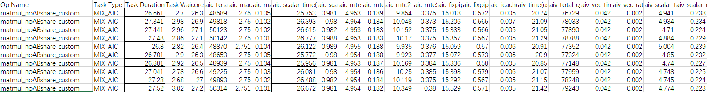
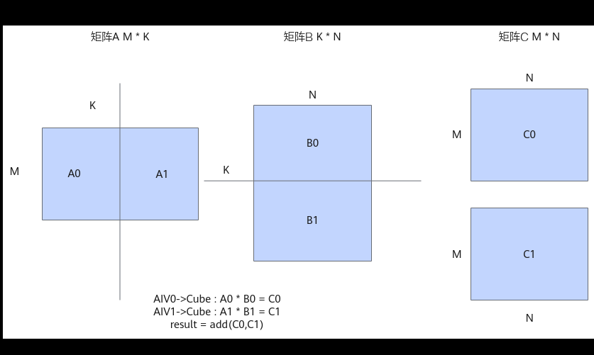
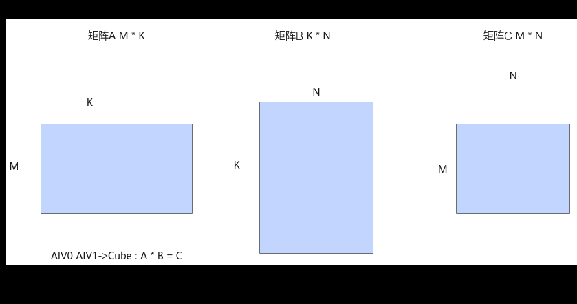
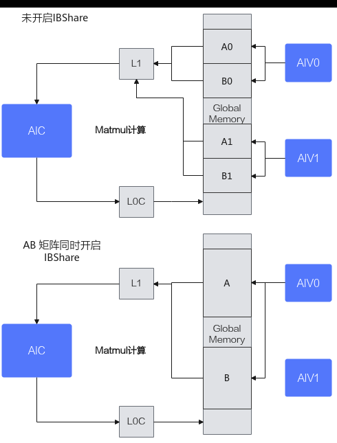

# Matmul高阶API使能IBShare模板共享A和B矩阵数据

> **Section**: 3.10.4.12  
> **PDF Pages**: 726–728  

---

<!-- page 726 -->

总结

MIX场景（包含矩阵计算和矢量计算）下，若多个AIV的A矩阵或B矩阵GM地址相同，且多个AIV复用的A矩阵/B矩阵在L1 Buffer上全载。可以考虑使能IBShare模板，通过共享L1 Buffer上相同的A矩阵或B矩阵数据，减少重复的MTE2数据搬运开销，提升算子性能。

## 3.10.4.12 Matmul 高阶API 使能IBShare 模板共享A 和B 矩阵数据

案例介绍

本案例呈现了在融合算子场景中，使用Matmul高阶API进行矩阵乘法计算时，A矩阵和B矩阵同时启用IBShare对性能的提升效果。

该案例的关键优化措施包括：

●分核逻辑：以Cube核视角分核，Matmul计算结果输出到GM，提供给Vector核进行后续计算。

●开启IBShare：A矩阵和B矩阵同时开启IBShare。

本案例的算子规格如下：

表3-43算子规格

输入ShapeData typeFormat

x128,384float16ND

y384,256float16ND

开启IBShare和未开启IBShare的完整样例请参考A、B矩阵均使能IBShare样例和MatmulNoABshare样例。

获取性能数据

使用msProf工具获取算子的Profiling的数据，重点分析MTE2，Cube，Scalar的流水情况。

分析主要瓶颈点

图3-184优化前Profiling 数据



通过分析以上Profiling数据可以看出，算子执行多次的平均耗时为27.11us，aic_scalar_time的平均耗时为26.27us，当前性能瓶颈点为Cube的Scalar流水。

<!-- page 727 -->

设计优化方案

A矩阵和B矩阵均未开启IBShare时，数据需要根据K轴、M轴或N轴进行切分计算。这里以K轴切分为例，未开启IBShare之前，算子以AIV Block为视角进行tiling切分，AIV0发起A0*B0的计算，AIV1发起A1*B1的计算。

图3-185未开启IBShare



当A矩阵和B矩阵都启用IBShare时，可以一次性加载到L1 Buffer上，省去了切分，分开搬运的过程，同时Cube计算单元完全由AIV0单核驱动，发起一次计算，计算的结果由AIV0和AIV1共享，从而减少Cube响应的次数，减少Scalar计算。

图3-186开启IBShare



开启IBShare和不开启IBShare的数据交互对比示意图如下：

<!-- page 728 -->



通过设置A和B矩阵MatmulType的IBShare均为true，开启该优化，具体代码如下：

```cpp
constexpr bool isABshare = true;template <typename aType, typename bType, typename cType> class MatmulABshareKernel {public:    __aicore__ inline MatmulABshareKernel(){};
    __aicore__ inline void Init(GM_ADDR a, GM_ADDR b, GM_ADDR c, GM_ADDR workspace,                                const TCubeTiling &tiling, AscendC::TPipe *pipe);
    __aicore__ inline void Process(AscendC::TPipe *pipe);
    __aicore__ inline void CalcOffset(int32_t blockIdx, const TCubeTiling &tiling, int32_t &offsetA, int32_t &offsetB,                                      int32_t &offsetC);
    AscendC::Matmul<AscendC::MatmulType<AscendC::TPosition::GM, CubeFormat::ND, aType, false, LayoutMode::NONE, isABshare>,            AscendC::MatmulType<AscendC::TPosition::GM, CubeFormat::ND, bType, false, LayoutMode::NONE, isABshare>,           AscendC::MatmulType<AscendC::TPosition::VECIN, CubeFormat::ND, cType>>        matmulObj;
```
