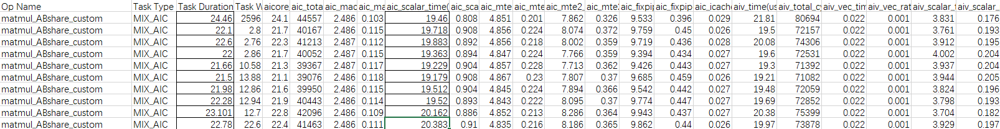
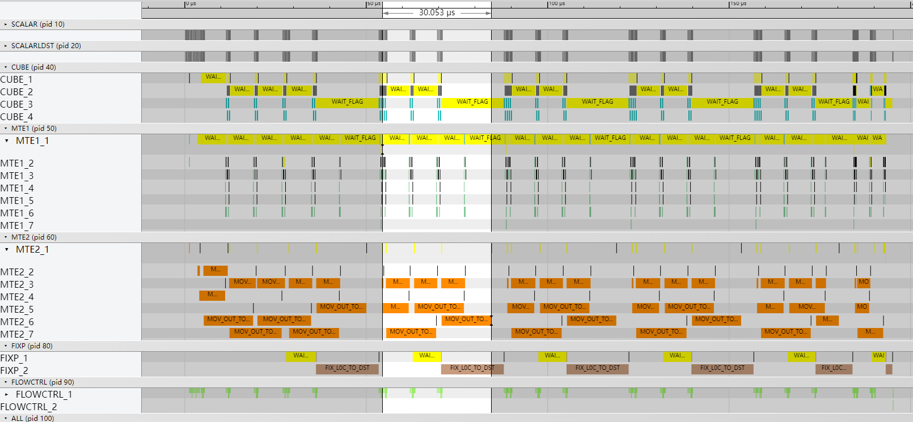
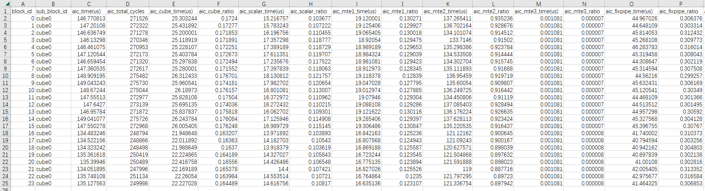
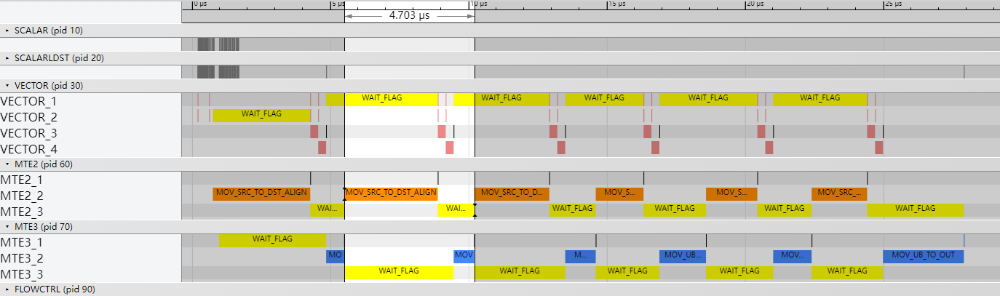
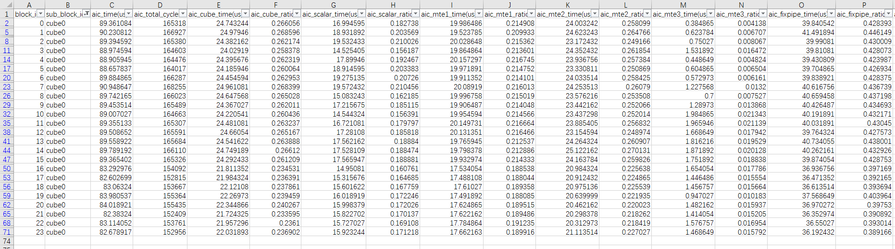
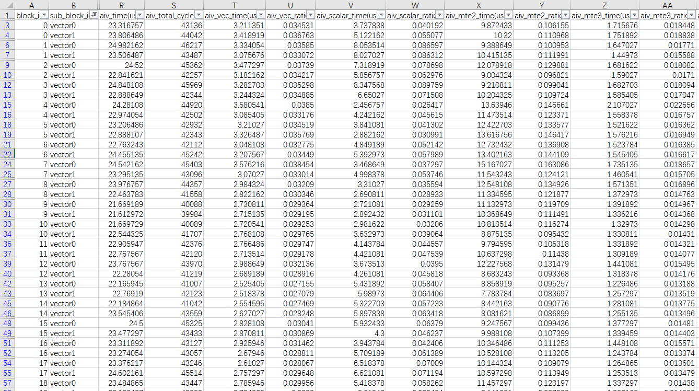

# AIV核上的ND2NZ格式转换

> **Section**: 3.10.4.13  
> **PDF Pages**: 729–732  

---

<!-- page 729 -->

```cpp
AscendC::GlobalTensor<aType> aGlobal;
    AscendC::GlobalTensor<bType> bGlobal;
    AscendC::GlobalTensor<cType> cGlobal;
    TCubeTiling tiling;};template <typename aType, typename bType, typename cType>__aicore__ inline void MatmulABshareKernel<aType, bType, cType>::Init(GM_ADDR a, GM_ADDR b, GM_ADDR c,                                                                 GM_ADDR workspace,const TCubeTiling &tiling, AscendC::TPipe *pipe){    this->tiling = tiling;
    aGlobal.SetGlobalBuffer(reinterpret_cast<__gm__ aType *>(a), tiling.M * tiling.Ka);
    bGlobal.SetGlobalBuffer(reinterpret_cast<__gm__ bType *>(b), tiling.Kb * tiling.N);
    cGlobal.SetGlobalBuffer(reinterpret_cast<__gm__ cType *>(c), tiling.M * tiling.N);
    int32_t offsetA, offsetB, offsetC;
    CalcOffset(AscendC::GetBlockIdx(), tiling, offsetA, offsetB, offsetC); // calculate offset    aGlobal = aGlobal[offsetA];
    bGlobal = bGlobal[offsetB];
    cGlobal = cGlobal[offsetC];}template <typename aType, typename bType, typename cType>__aicore__ inline voidMatmulABshareKernel<aType, bType, cType>::CalcOffset(int32_t blockIdx, const TCubeTiling &tiling,                                                             int32_t &offsetA, int32_t &offsetB, int32_t &offsetC){    offsetA = 0;
    offsetB = 0;
    offsetC = 0;}
```

验证优化方案性能收益

优化后执行多次的平均耗时：22.44us，较优化前有较大提升。

图3-187优化后Profiling 数据



总结

融合算子场景下，Matmul A矩阵和B矩阵同时开启IBShare，以Cube核视角分核，可以有效减少Cube侧的Scalar开销，提升性能。

## 3.10.4.13 AIV 核上的ND2NZ 格式转换

案例介绍

本案例展示了在矩阵乘算子场景中，使用Matmul高阶API进行计算，对内轴（内轴即矩阵的行方向）非256字节对齐的输入矩阵，在AIV核上进行ND2NZ格式转换对算子性能提升的效果。为提升Cube单元的计算效率，ND格式的输入矩阵在执行Cube计算前会先转换为NZ格式，ND格式和NZ格式的具体内容可参考数据格式。Matmul API内部使用随路ND2NZ指令同时进行格式转换以及数据搬运。但在数据非256字节对齐时，随路ND2NZ指令存在带宽利用率低的问题。因此输入矩阵的内轴非256字节对齐时，在进行Matmul计算前，利用AIV核上Vector计算单元完成ND格式到NZ格式的转换，可以避免随路非对齐数据搬运存在的效率低的问题，从而提升算子性能。

<!-- page 730 -->

●AIV核上的ND2NZ格式转换的适用场景

输入矩阵内轴非256字节对齐，且数据量较大影响随路格式转换的效率。

本案例的算子规格如下：

表3-44算子规格

输入ShapeData typeFormat

a1024, 1024float16ND

b1024, 4095float16ND

当前案例使用的AI处理器共24个核，算子中使能高阶API Matmul的纯Cube模式。使用MDL模板，Tiling参数如下：

●原始shape：M=1024, N= 4095, K=1024。

●单核shape：singleCoreM=128，singleCoreN=1408，singleCoreK=1024。

●基本块shape：baseM=128，baseN=256，baseK=64。

●L1缓存相关Tiling参数：stepM=1，stepN=1，stepKa=4，stepKb=4。

获取性能数据

使用msProf工具获取算子仿真流水图和上板Profiling数据，重点分析MTE2的流水。

分析主要瓶颈点

●优化前的Cube流水图如下，由于使用了随路ND2NZ指令，在MTE2数据搬运过程中进行数据格式的转换，导致MTE2整体占比较高。



●优化前的Profiling数据如下，可以看到只使用Cube单元执行计算，aic_time最大耗时149.04us，其中aic_mte2_ratio占比很高。



<!-- page 731 -->

设计优化方案

对于ND格式的输入矩阵，不再使用随路ND2NZ指令进行格式转换，而是利用Vector计算单元的能力完成数据格式转换。首先使用DataCopyPad接口，将非对齐的矩阵数据搬入Unified Buffer，使用Duplicate接口填充需要补为对齐位置的数据，再逐行调用Copy接口实现数据从ND到NZ格式的重排，将重排后的NZ数据写入workspace内存，最后直接读取workspace上的NZ数据，进行Matmul计算。

AIV核上的ND2NZ格式转换的完整样例请参考Matmul输入矩阵ND到NZ格式转换的算子样例。实现AIV核上的ND2NZ格式转换的主要步骤如下：

步骤1创建Matmul对象时，定义内轴非256字节对齐的B矩阵的Format为NZ格式。

using A_TYPE = AscendC::MatmulType<AscendC::TPosition::GM, CubeFormat::ND, ATYPE, true>;// 使用CubeFormat::NZ定义矩阵B的类型信息using B_TYPE = AscendC::MatmulType<AscendC::TPosition::GM, AscendC::TPosition::GM, CubeFormat::NZ, BType, true>;using C_TYPE = AscendC::MatmulType<AscendC::TPosition::GM, CubeFormat::ND, CType>;using BIAS_TYPE =  AscendC::MatmulType<AscendC::TPosition::GM, CubeFormat::ND, BiasType>;AscendC::Matmul<A_TYPE, B_TYPE, C_TYPE, BIAS_TYPE, CFG_MDL> matmulObj;

步骤2利用Vector计算单元实现ND2NZ格式转换。如下代码中MatrixBtoNZ为将B矩阵的ND格式转换为NZ格式的函数，该函数的具体实现请参考完整样例代码。

// Vector ND2NZif ASCEND_IS_AIV {    pipe->InitBuffer(ubBuf, TOTAL_UB_SIZE);    MatrixBtoNZ<typename B_TYPE::T>(tempGM, bGMNZ, tiling, isTransB, ubBuf, tiling.baseK,        tiling.baseN); // ND2NZ格式转换函数    SyncAll();    // CV SYNC    NotifyEvent<PIPE_MTE3>(4);    return;}if ASCEND_IS_AIC {    WaitEvent(4); // 等待Vector完成ND2NZ格式转换}

步骤3设置左矩阵A、右矩阵B、Bias，完成矩阵乘操作。

```cpp
matmulObj.SetTail(tailM, tailN, shapes.k);matmulObj.SetTensorA(aGlobal, false);matmulObj.SetTensorB(bGlobal, false);if (shapes.isBias) {    matmulObj.SetBias(biasGlobal);}matmulObj.IterateAll(cGlobal);
```

**----结束**

验证优化方案性能收益

●优化后的Vector流水图如下所示，利用Vector计算单元的能力，完成B矩阵的数据格式转换。



<!-- page 732 -->

●优化后的Cube流水图如下所示，不使用随路ND2NZ指令对B矩阵进行格式转换后，MTE2的占比明显下降。


●优化后的Profiling数据如下，可以看到同时使用Cube单元和Vector单元，aic_time最大耗时90.95us，其中aic_mte2_ratio占比明显降低。





