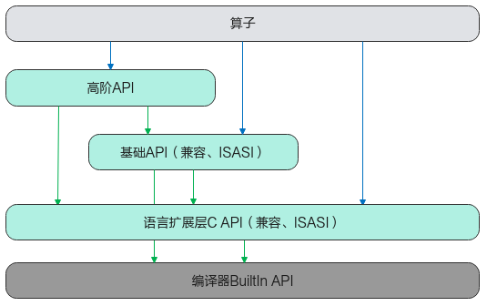

# 兼容性说明

> **Section**: 4.1  
> **PDF Pages**: 736–736  

---

<!-- page 736 -->

## 4兼容性迁移指南

兼容性说明

351x架构迁移指导

## 4.1 兼容性说明

本兼容性说明仅适用于Ascend C算子开发的兼容性迁移指导。总体兼容性策略见表4-1，兼容性范围不包含编译器BuiltIn API、Ascend C内部实现接口等。文档中涉及的兼容性分为两类：一是功能兼容，包括数据类型兼容、接口原型兼容和常量兼容；二是性能兼容，指对于同等数据量，新架构上执行API耗时不高于旧架构。

若开发者希望在351x架构下运行原本在220x架构上开发的Ascend C程序，需在351x架构上重新编译并运行，并可能需要根据迁移指导进行代码调整。

图4-1 Ascend C API 层次结构

