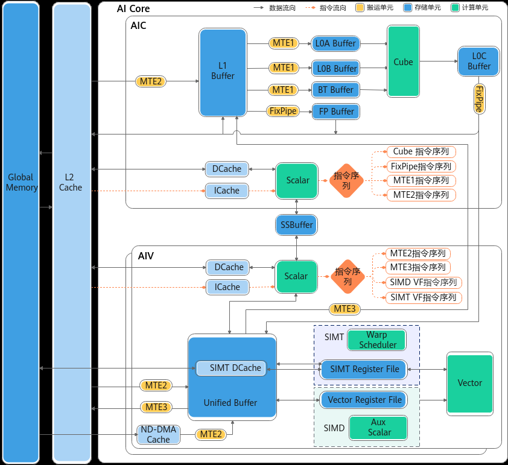

# 220x到351x架构变更

> **Section**: 4.2.1  
> **PDF Pages**: 737–740  

---

<!-- page 737 -->

表4-1 Ascend C API 兼容策略

**API层级兼容策略**

高阶API高阶API在所有架构上均兼容。

基础API基础API分为可兼容的基础API和ISASI基础API；兼容的API在所有架构上均能兼容；ISASI API为体系架构相关的API，不保证跨架构版本的兼容性，例如CUBE侧的计算接口LoadData、Mmad等。

框架API框架API为软件实现API，跨架构版本兼容。

编译器BuiltIn API

不保证兼容。

## 4.2 351x 架构迁移指导

## 4.2.1 220x 到351x 架构变更

351x架构图如图1所示，总体来看，351x架构新增了以下特性：

●新增多条数据通路。

●AI Core核数增加。

●UB容量提升。

●新增SSBuffer核内存储单元，支持AIC核和AIV核通过Scalar访问。

●SIMD编程基础上，支持SIMT编程、SIMD与SIMT混合编程。

●AIV核采用Regbase架构，与220x的Membase架构相比，可以直接对芯片的Vector寄存器Register进行操作，实现更大的灵活性和更好的性能。

<!-- page 738 -->

图4-2 351x 架构图

具体来说，351x架构的主要变更如下各表所示。除此之外，351x架构还扩展了支持的数据类型，具体可参考数据类型介绍。

●搬运单元

表4-2搬运单元变更

**351x变更产生的影响影响的API接口**

删除L1 Buffer到GM的数据通路。

现有接口不支持从L1 Buffer直接搬运数据到GM。开发者需要在L1 Buffer分配一块空间存放单位矩阵，利用MMAD矩阵乘法计算输出到L0C Buffer，从L0C Buffer通过FixPipe将数据搬运到GM。

DataCopy/DumpTensor

<!-- page 739 -->

**351x变更产生的影响影响的API接口**

原GM到L0A Buffer和L0BBuffer的数据搬运需要拆分为两步，即从GM到L1 Buffer的数据搬运和从L1 Buffer到L0ABuffer、L0B Buffer的数据搬运。

LoadData

删除GM到L0ABuffer、L0B Buffer的数据通路。

DataCopy

新增UB到L1 Buffer的数据通路。

支持将数据直接从UB搬运到L1Buffer，而无需先从UB搬运到GM，再从GM搬运到L1Buffer，使用方式具体可参考基础数据搬运。

DataCopy

新增ND-DMA指令。扩展DataCopy数据搬运接口的能力，相比基础数据搬运接口，可更加自由地配置搬入数据的维度信息及Stride，使用方式具体可参考多维数据搬运（ISASI）。

Fixpipe

新增L0C Buffer到UB的单向数据通路。

支持将数据直接从L0C Buffer搬运到UB，而无需先从L0CBuffer搬运到GM，再从GM搬运到UB，使用方式具体可参考Fixpipe。

LoadData

扩展LoadData搬运指令。

新增支持MicroScaling（MX）场景的数据搬运，使用方式具体可参考 LoadData。

新增DN分型、L1Buffer->L0A Buffer不再支持transpose。

LoadDataWithTranspose

使用新特性具体可参考LoadDataWithTranspose。

Fixpipe新增NZ2DN随路转换（实现NZ到DN数据格式的随路变换）。

Fixpipe

使用方式具体可参考Fixpipe。

DataCopy搬运维度增强。

DataCopy支持L1 Buffer与GM之间，GM与UB之间通路的loop模式搬运，使用方式具体可参考6.2.3.1.5SetLoopModePara。

DataCopy

351x架构版本中删除了与L0A Buffer和L0BBuffer初始化相关的硬件指令。

使用基础API InitConstValue将特定存储位置的LocalTensor初始化为某一具体数值，不支持直接初始化L0A Buffer、L0BBuffer上的LocalTensor。

InitConstValue

●计算单元

<!-- page 740 -->

表4-3计算单元变更

**351x变更产生的影响影响的API接口**

Mmad

Cube计算单元不支持s4类型。

对于int4b_t数据类型的矩阵乘计算，开发者需要先将int4b_t的数据Cast转换为int8_t类型，再进行Cube计算。

L0A切分场景下，矩阵乘需要重新计算左矩阵的L0A地址。

Cube计算单元不支持L0A上ZZ到ZN的分形变化。

LoadData/LoadDataWithTranspose

Vector Core Membase架构切换到Regbase架构。

基础API部分场景性能降低。基础API高维切分模式

开发者需要通过设置config模板参数来配置Subnormal计算模式，具体请参考5.2.1-矢量计算。

Ln/Sqrt/Rsqrt/Div/Reciprocal/Exp

硬件不支持Subnormal功能，当前使用软仿实现的Subnormal功能。

LoadDataWithSparse/MmadWithSparse

不支持4:2稀疏矩阵的计算。

开发者需要利用Vector Core的能力，进行矩阵稠密转稀疏操作。

●存储单元

表4-4存储单元变更

**351x变更产生的影响影响的API接口**

SetLoadDataBoundary

删除L1 Buffer空间的边界值设定。

351x架构硬件删除了L1 Buffer的边界值设定相关寄存器，不再支持SetLoadDataBoundary接口，具体请参考兼容方案。

UB结构变化。220x架构的UB结构和351x架构的UB结构对比请参考bank结构对比。

220x架构上UB分为16个bankgroup，每个bank group包含3个bank，每个bank大小为4KB。351x架构上UB分为8个bank group，每个bank group包含2个bank，每个bank大小为16KB。若发生UB冲突，开发者可参考避免Unified Buffer的bank冲突解决UB冲突。

/

●同步
