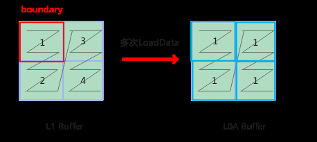
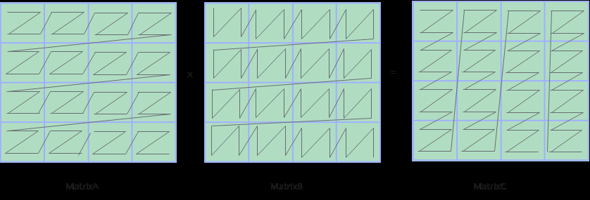
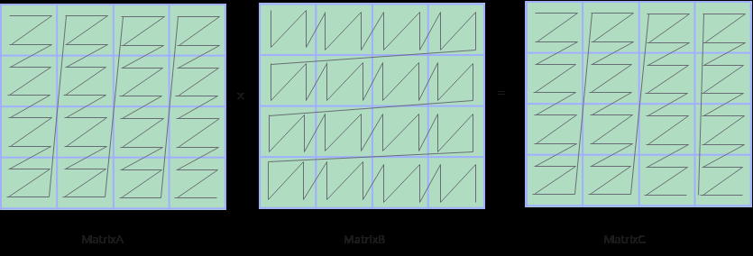
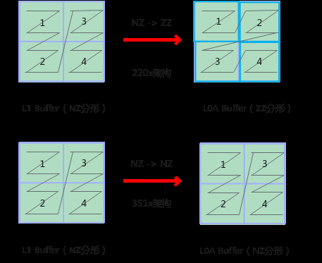

# 基础API迁移指导

> **Section**: 4.2.2.1  
> **PDF Pages**: 741–748  

---

<!-- page 741 -->

表4-5同步变更

**351x变更产生的影响影响的API接口**

新增Mutex能力。Mutex用于核内异步流水指令之间的同步处理，其功能类似于传统CPU中的锁机制。通过锁定指定流水再释放流水来完成流水间的同步依赖，使用方式具体可参考 Mutex（ISASI）。

Mutex

CrossCoreSetFlag/CrossCoreWaitFlag

对于AI Core内部的同步控制，AIV0与AIV1可单独触发AIC等待，使用方式具体可参考CrossCoreSetFlag(ISASI)。

新增核间同步控制模式。

●其它

表4-6其它变更

**351x变更产生的影响影响的API接口**

AIPP接口性能可能有所下降。SetAippFunctions/LoadImageToLocal

删除AIPP硬件级指令，采用软仿实现AIPP功能。

由于351x架构版本中相关寄存器的删除，UB异常调试接口也被移除。

调测接口对功能无影响。CheckLocalMemoryIA

## 4.2.2 220x 迁移351x 指导

## 4.2.2.1 基础API 迁移指导

本节针对351x架构芯片变更对基础API兼容性产生的影响进行说明，并提供基础API的兼容性适配方案。

矢量计算

●351x架构默认不支持Subnormal功能。

说明：SubNormal浮点数指的是指数位全为0、尾数不为0的浮点数，用于表示比最小正常数更小的值，避免“下溢为0”。351x版本默认不支持Subnormal，Subnormal浮点数在计算中被视为0。

兼容方案：通过设置config模板参数来配置Subnormal计算模式。软件模拟对Subnormal数据的处理，通过精度扩展等处理方式来避免Subnormal浮点数下溢为0。

<!-- page 742 -->

表4-7涉及Subnormal 的API 和config 参数说明

**Ascend C 基础API兼容说明**

以Ln接口为例来进行说明。

Exp、Ln、Reciprocal、Sqrt、Rsqrt、Div

通过LnConfig结构体的参数algo来配置Subnormal计算模式。algo取值如下：

●LnAlgo::INTRINSIC、LnAlgo::PRECISION_1ULP_FTZ_TRUE，使用单指令计算得出结果，所有Subnormal被近似为0。

●LnAlgo::PRECISION_1ULP_FTZ_FALSE，支持Subnormal数据计算。

该参数默认值DEFAULT_LN_CONFIG的取值如下：constexpr LnConfig DEFAULT_LN_CONFIG = { LnAlgo::INTRINSIC };

可以参考以下代码片段：

// 定义模板参数constexpr AscendC::LnConfig CONFIG = {    AscendC::LnAlgo::PRECISION_1ULP_FTZ_FALSE};template <typename T>__aicore__ inline void Compute(GM_ADDR dst, GM_ADDR src, uint32_t count){    AscendC::TPipe pipe;    AscendC::GlobalTensor<T> srcGlobal;    AscendC::GlobalTensor<T> dstGlobal;    srcGlobal.SetGlobalBuffer((__gm__ T*)src);    dstGlobal.SetGlobalBuffer((__gm__ T*)dst);    AscendC::TQue<AscendC::TPosition::VECIN, 1> inQueue;    AscendC::TQue<AscendC::TPosition::VECOUT, 1> outQueue;    pipe.InitBuffer(inQueue, 1, count * sizeof(T));    pipe.InitBuffer(outQueue, 1, count * sizeof(T));    AscendC::LocalTensor<T> dstLocal = outQueue.AllocTensor<T>();    AscendC::LocalTensor<T> srcLocal = inQueue.AllocTensor<T>();    AscendC::DataCopy(srcLocal, srcGlobal, count);    AscendC::SetFlag<AscendC::HardEvent::MTE2_V>(EVENT_ID0);    AscendC::WaitFlag<AscendC::HardEvent::MTE2_V>(EVENT_ID0);    // 调用基础API Ln，传入模板参数    AscendC::Ln<T, CONFIG>(dstLocal, srcLocal, count);    AscendC::SetFlag<AscendC::HardEvent::V_MTE3>(EVENT_ID1);    AscendC::WaitFlag<AscendC::HardEvent::V_MTE3>(EVENT_ID1);    AscendC::DataCopy(dstGlobal, dstLocal, count);    inQueue.FreeTensor(srcLocal);}

数据搬运

●DataCopy接口不支持L1 Buffer -> GM通路。

说明：硬件删除L1 Buffer到GM的通路，无法将数据从L1 Buffer直接搬运到GM中。现有接口不支持L1 Buffer到GM的直接搬运。

兼容方案：对于纯Cube计算场景：在GM多分配一个单位矩阵，通过Mmad矩阵乘法计算输出到L0C Buffer，再从L0C Buffer通过Fixpipe搬运到GM。对于Vector和Cube计算融合场景，可以通过L1 Buffer搬运到UB，再搬运到GM。以下以纯Cube计算场景为例进行说明，介绍算子核心流程。

a.将矩阵A从GM搬运到L1 Buffer。__aicore__ inline void CopyGmToA1(){

<!-- page 743 -->

```cpp
AscendC::LocalTensor<T> leftMatrix = inQueueA1.AllocTensor<T>();
    AscendC::Nd2NzParams intriParams1{1, 64, 128, 0, 128, 64, 1, 0};
    AscendC::DataCopy(leftMatrix, aGlobal, intriParams1);
    inQueueA1.EnQue(leftMatrix);}
```

b.将矩阵B（矩阵B为单位矩阵）从GM搬运到L1 Buffer。__aicore__ inline void CopyGmToB1(){    AscendC::LocalTensor<U> rightMatrix = inQueueB1.AllocTensor<U>();    AscendC::Nd2NzParams intriParams2{1, 128, 128, 0, 128, 128, 1, 0};    AscendC::DataCopy(rightMatrix, bGlobal, intriParams2);    inQueueB1.EnQue(rightMatrix);}

c.将矩阵A从L1 Buffer搬运到L0A Buffer。__aicore__ inline void Load2DA1ToL0A(){    AscendC::LocalTensor<T> a1 = inQueueA1.DeQue<T>();    AscendC::LocalTensor<T> a2 = inQueueA2.AllocTensor<T>();    AscendC::LoadData2DParamsV2 loadDataParams;    ...    AscendC::LoadData(a2, a1, loadDataParams);    ...}

d.将矩阵B从L1 Buffer搬运到L0B Buffer。__aicore__ inline void Load2DA1ToL0B(){    AscendC::LocalTensor<U> b1 = inQueueB1.DeQue<U>();    AscendC::LocalTensor<U> b2 = inQueueB2.AllocTensor<U>();    ...    AscendC::LoadData2DParamsV2 loadDataParams;    ...    AscendC::LoadData(b2, b1, loadDataParams);    ...}

e.进行Mmad矩阵计算，结果输出到L0C Buffer。__aicore__ inline void Compute(){    AscendC::MmadParams mmadParams;    ...    AscendC::LocalTensor<S> co1Local = inQueueCO1.AllocTensor<S>();    AscendC::LocalTensor<T> a2 = inQueueA2.DeQue<T>();    AscendC::LocalTensor<U> b2 = inQueueB2.DeQue<U>();    AscendC::Mmad(co1Local, a2, b2, mmadParams);    ...}

f.通过FixPipe将矩阵C从L0C Buffer拷贝到GM。__aicore__ inline void CopyL0CToGm(){    AscendC::LocalTensor<S> co1Local = inQueueCO1.DeQue<S>();    AscendC::FixpipeParamsV220 fixpipeParams;    ...    AscendC::Fixpipe<S, S, AscendC::CFG_ROW_MAJOR>(cGlobal, co1Local, fixpipeParams);    ...}

●不支持SetLoadDataBoundary接口。

说明：351x架构硬件删除了L1 Buffer的边界值设定相关寄存器，不再支持SetLoadDataBoundary接口。该接口用于设置Load3D时L1 Buffer的边界值。如果指令在处理源操作数时，源操作数在L1 Buffer上的地址超出设置的边界，则会从L1 Buffer的起始地址开始读取数据。设置为0表示无边界，可以使用整个L1Buffer。

兼容方案：

<!-- page 744 -->

–220x架构版本的接口参数boundaryValue设置为0时与351x架构版本等价。

–如果需要在L1 Buffer上循环读取操作数，需要将对应的Load3D接口手动拆分成多条指令，手动绕回。



如上图所示，以L1 Buffer到L0A Buffer的搬运为例。矩阵A为half数据类型，大小为32 * 32的矩阵，假设边界为512B，可以重复搬运数据到L0A Buffer，在每次搬运时设置目的操作数的地址偏移量。

a.将矩阵A从GM搬运到L1 Buffer。__aicore__ inline void CopyGmToA1Nd2Nz(){    AscendC::LocalTensor<T> leftMatrix = qidA1_.template AllocTensor<T>();    AscendC::Nd2NzParams nd2nzParams;    ...    AscendC::DataCopy(leftMatrix, aGlobal_, nd2nzParams);    ...}

b.将矩阵B从GM搬运到L1 Buffer。__aicore__ inline void CopyGmToB1Nd2Nz(){    AscendC::LocalTensor<U> rightMatrix = qidB1_.template AllocTensor<U>();    AscendC::Nd2NzParams nd2nzParams;    ...    AscendC::DataCopy(rightMatrix, bGlobal_, nd2nzParams);    ...}

c.将矩阵A从L1 Buffer搬运到L0A Buffer。__aicore__ inline void Load3DA1ToL0A(){    auto leftMatrix = qidA1_.template DeQue<T>();    AscendC::LocalTensor<T> a2 = qidA2_.AllocTensor<T>();    ...    AscendC::LoadData3DParamsV2Pro loadData3dParamsPro;    ...    // 多次调用LoadData进行手动绕回    AscendC::LoadData(a2, leftMatrix, loadData3dParamsPro);    AscendC::LocalTensor<T> a3 = a2[256];    AscendC::LoadData(a3, leftMatrix, loadData3dParamsPro);    AscendC::LocalTensor<T> a4 = a2[512];    AscendC::LoadData(a4,  leftMatrix, loadData3dParamsPro);    AscendC::LocalTensor<T> a5 = a2[768];    AscendC::LoadData(a5,  leftMatrix, loadData3dParamsPro);    ...}

d.将矩阵B从L1 Buffer搬运到L0B Buffer。__aicore__ inline void Load3DB1ToL0B(){    ...    AscendC::SetLoadDataRepeat({0, 1, 0, dstStride});

<!-- page 745 -->

```cpp
...}
```

e.矩阵计算。__aicore__ inline void Compute(){    AscendC::MmadParams mmadParams;    ...    auto co1Local = qidCO1_.AllocTensor<V>();    auto a2 = qidA2_.DeQue<T>();    auto b2 = qidB2_.DeQue<U>();    AscendC::Mmad(co1Local, a2, b2, mmadParams);    ...}

f.将矩阵C从L0C Buffer搬运到GM。__aicore__ inline void CopyL0CToGm(const AscendC::GlobalTensor<S>& gm){    auto co1Local = qidCO1_.DeQue<V>();    AscendC::FixpipeParamsV220 fixpipeParams(nLength, static_cast<uint16_t>(mLength),                                    AscendC::DivCeil(mLength, AscendC::BLOCK_CUBE) * AscendC::BLOCK_CUBE, static_cast<uint16_t>(nLength), 0);    ...    AscendC::Fixpipe<S, V, AscendC::CFG_ROW_MAJOR>(gm, co1Local, fixpipeParams);    qidCO1_.FreeTensor(co1Local);}

矩阵计算

●Cube计算单元删除int4b_t数据类型。

说明：相较于220x架构版本，351x架构版本的Cube计算单元不支持int4b_t。相关的基础API有LoadData、Mmad和LoadDataWithTranspose，这些接口不再支持int4b_t。

兼容方案：算子侧通过编写CV融合算子在Vector Core进行int4b_t到int8_t的Cast转换，再通过UB搬运到L1后进行Mmad计算。图层面可以在该算子前增加Cast节点进行int4b_t到int8_t的转换。

a.在Vector Core进行int4b_t到int8_t的Cast转换，转换后的数据保存到新的GM空间中。__aicore__ inline void Unzip(AscendC::GlobalTensor<int8_t>& dstGlobalTensor,                             AscendC::GlobalTensor<int8_t>& srcGlobalTensor, uint32_t count,                             AscendC::TQue<AscendC::TPosition::VECIN, 1>& q1,                             AscendC::TQue<AscendC::TPosition::VECOUT, 1>& q2,                             AscendC::TQue<AscendC::TPosition::VECOUT, 1>& q3){    AscendC::LocalTensor<int8_t> srcLocalTensor = q1.AllocTensor<int8_t>();    AscendC::LocalTensor<half> tmpTensor = q2.AllocTensor<half>();    AscendC::LocalTensor<int8_t> dstLocalTensor = q3.AllocTensor<int8_t>();    AscendC::DataCopy(srcLocalTensor, srcGlobalTensor, count);    AscendC::LocalTensor<AscendC::int4b_t> int4SrcLocalTensor = srcLocalTensor.ReinterpretCast<AscendC::int4b_t>();    uint32_t mask = count / sizeof(half);    AscendC::SetFlag<AscendC::HardEvent::MTE2_V>(EVENT_ID0);    AscendC::WaitFlag<AscendC::HardEvent::MTE2_V>(EVENT_ID0);    AscendC::Cast<half, AscendC::int4b_t>(tmpTensor, int4SrcLocalTensor, AscendC::RoundMode::CAST_NONE, count * 2);    AscendC::Cast<int8_t, half>(dstLocalTensor, tmpTensor, AscendC::RoundMode::CAST_CEIL, count * 2);    AscendC::SetFlag<AscendC::HardEvent::V_MTE3>(EVENT_ID1);    AscendC::WaitFlag<AscendC::HardEvent::V_MTE3>(EVENT_ID1);    AscendC::DataCopy(dstGlobalTensor, dstLocalTensor, count * 2);    q1.FreeTensor(srcLocalTensor);    q2.FreeTensor(tmpTensor);    q3.FreeTensor(dstLocalTensor);}

<!-- page 746 -->

b.进行int8_t数据类型的矩阵计算。template <class A_TYPE, class B_TYPE, class C_TYPE, class BIAS_TYPE>__aicore__ inline void MatMulKernel(AscendC::GlobalTensor<int8_t>& aGlobal, AscendC::GlobalTensor<int8_t>& bGlobal,                                    AscendC::GlobalTensor<int32_t>& cGlobal, GM_ADDR tilingGM, GM_ADDR workspaceGM,                                    int32_t isTransposeAIn, int32_t isTransposeBIn, AscendC::TPipe& que){    using A_T = typename A_TYPE::T;    using B_T = typename B_TYPE::T;    using C_T = typename C_TYPE::T;    using BiasT = typename BIAS_TYPE::T;    ...    int offsetA = 0;    int offsetB = 0;    int offsetC = 0;    int offsetBias = 0;    ...    auto gmA = aGlobal[offsetA];    auto gmB = bGlobal[offsetB];    auto gmC = cGlobal[offsetC];    AscendC::MatmulImpl<A_TYPE, B_TYPE, C_TYPE, BIAS_TYPE, CFG_MDL> mm;    mm.SetSubBlockIdx(0);    mm.Init(&tiling, &que);    mm.SetTensorA(gmA, isTransposeA);    mm.SetTensorB(gmB, isTransposeB);    mm.IterateAll(gmC);}

●L0A Buffer分形改变，从ZZ转换为ZN格式。

说明：涉及的API有LoadData、Mmad和LoadDataWithTranspose。

–220x架构版本，参与矩阵乘计算（A * B = C）时， ABC矩阵的数据排布格式分别为ZZ，ZN，NZ。A、B、C矩阵分别位于L0A Buffer、L0B Buffer、L0CBuffer。

矩阵A：每个分形矩阵内部是行主序，分形矩阵之间是行主序。分形Shape为16 x (32B/sizeof(AType))，大小为512Byte。

矩阵B：每个分形矩阵内部是列主序，分形矩阵之间是行主序。分形Shape为(32B/sizeof(BType)) x 16，大小为512Byte。

矩阵C：每个分形矩阵内部是行主序，分形矩阵之间是列主序。分形Shape为16 x 16，大小为256个元素。



–351x架构版本，参与矩阵乘计算（A * B = C）时， ABC矩阵的数据排布格式分别为NZ，ZN，NZ。

矩阵A：每个分形矩阵内部是行主序，分形矩阵之间是列主序。其Shape为16x (32B/sizeof(AType))，大小为512Byte。

矩阵B：每个分形矩阵内部是列主序，分形矩阵之间是行主序。其Shape为(32B/sizeof(BType)) x 16，大小为512Byte。

矩阵C：每个分形矩阵内部是行主序，分形矩阵之间是列主序。其Shape为16x 16，大小为256个元素。

<!-- page 747 -->



兼容方案：非L0A Buffer切分的场景兼容220x版本，L0A Buffer切分的场景需要根据新的分形重新适配。

在220x架构中，矩阵计算要求左矩阵为ZZ分形（350x中为NZ），右矩阵为ZN分形，由于L1 Buffer的数据分形为NZ，所以220x架构下将左矩阵从L1 Buffer搬运到L0A Buffer需要额外做NZ分形到ZZ分形的转换，351x架构下则不用转换分形。



分形变化带来的变动主要体现在L1 Buffer到L0A Buffer的搬运过程，以下代码片段进行展示：

__aicore__ inline void SplitA(){    int srcOffset = 0;    int dstOffset = 0;    AscendC::LocalTensor<half> a1Local = inQueueA1.DeQue<half>();    AscendC::LocalTensor<half> a2Local = inQueueA2.AllocTensor<half>();    // 220x架构下LoadData时做Nz2Zz的分形转换    // for (int i = 0; i < mBlocks; ++i) {    //     AscendC::LoadData2DParams loadDataParams;    //     loadDataParams.repeatTimes = kBlocks; //  kBlocks表示列方向上有几个宽为16的half类型矩阵    //     loadDataParams.srcStride = mBlocks; //  mBlocks表示行方向上有几个高为16的half类型矩阵    //     loadDataParams.ifTranspose = false;    //     AscendC::LoadData(a2Local[dstOffset], a1Local[srcOffset], loadDataParams);    //     srcOffset += 16 * 16;    //     dstOffset += k * 16;    // }

<!-- page 748 -->

// 350x架构下LoadData时不需要做Nz2Zz的分形转换，对应搬运参数需要修改    AscendC::LoadData2DParams loadDataParams;    loadDataParams.repeatTimes = m * k / 512; // 小z矩阵的个数    loadDataParams.srcStride = 1; // 小z矩阵之间的间隔    loadDataParams.dstGap = 0;    loadDataParams.ifTranspose = false;    AscendC::LoadData(a2Local, a1Local, loadDataParams);    inQueueA2.EnQue<half>(a2Local);    inQueueA1.FreeTensor(a1Local);}

●351x架构版本硬件架构删除4：2结构化稀疏功能。

说明：LoadDataWithSparse用于将存储在L1 Buffer中的512B稠密权重矩阵搬运到L0B buffer，并同时读取128B的索引矩阵以实现稠密矩阵的稀疏化。由于351x架构版本不支持结构化稀疏功能，因此LoadDataWithSparse在此版本中并不适用。另一方面，MmadWithSparse负责执行矩阵乘加操作，其中右矩阵B为稠密矩阵，需要通过调用LoadDataWithSparse进行载入。由于351x架构不支持LoadDataWithSparse，因此MmadWithSparse也无法在351x架构版本中使用。

兼容方案：在算子侧可以不调用LoadDatawithSparse进行矩阵稠密转稀疏操作，然后使用Mmad进行正常的稠密矩阵计算。稀疏矩阵相关算法可参考MmadWithSparse中的介绍。

●351x架构版本删除GM-> L0A Buffer/L0B Buffer 通路

说明：硬件删除GM-> L0A Buffer/L0B Buffer通路，调用LoadData时，不再支持这些通路。

兼容方案：实现GM-> L0A Buffer/L0B Buffer搬运需拆分成两步进行，先从GM搬运到L1 Buffer，再从L1 Buffer搬运到L0A Buffer、L0B Buffer。

以GM -> L1 Buffer -> L0A Buffer通路为例可以参考以下步骤：

a.将矩阵A从GM搬运到L1 Buffer。__aicore__ inline void CopyGmToA1(){    AscendC::LocalTensor<T> leftMatrix = inQueueA1.AllocTensor<T>();    AscendC::Nd2NzParams intriParams1{1, 64, 128, 0, 128, 64, 1, 0};    AscendC::DataCopy(leftMatrix, aGlobal, intriParams1);    inQueueA1.EnQue(leftMatrix);}b.将矩阵A从L1 Buffer搬运到L0A Buffer。__aicore__ inline void Load2DA1ToL0A(){    AscendC::LocalTensor<T> a1 = inQueueA1.DeQue<T>();    AscendC::LocalTensor<T> a2 = inQueueA2.AllocTensor<T>();    AscendC::LoadData2DParamsV2 loadDataParams;    ...    AscendC::LoadData(a2, a1, loadDataParams);    ...}

●351x架构版本删除L0A Buffer/L0B Buffer初始化的相关硬件指令。

说明：InitConstValue将特定存储位置的LocalTensor初始化为某一具体数值，不支持直接初始化L0A Buffer、L0B Buffer。

兼容方案：先初始化L1 Buffer，再通过LoadData接口将L1 Buffer上的数据搬运到L0A Buffer、L0B Buffer。

以 GM -> L1 Buffer -> L0A Buffer的数据通路为例：

a.初始化L1 Buffer。__aicore__ inline void InitConstA1(){    AscendC::LocalTensor<T> leftMatrix = inQueueA1.AllocTensor<T>();    AscendC::InitConstValue(leftMatrix, {1, static_cast<uint16_t>(m * k * sizeof(T) / 32), 0, 1});
