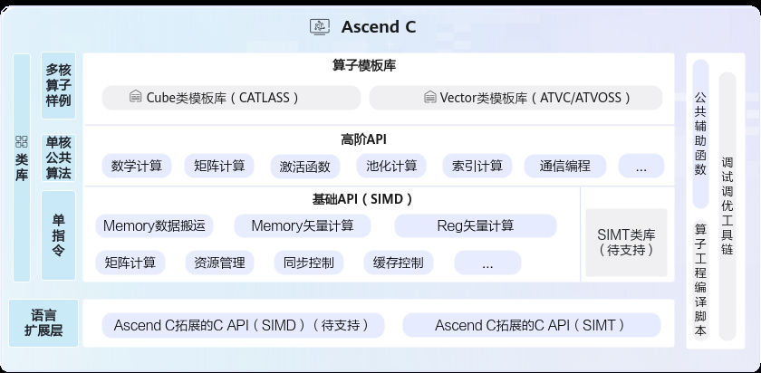

# Ascend C API列表

> **Section**: 6.1  
> **PDF Pages**: 756–807  

---

<!-- page 756 -->

## 6 API 参考

Ascend C API列表

SIMD API

SIMT API

Utils API

AI CPU API

附录

## 6.1 Ascend C API 列表

Ascend C提供一组类库API，开发者使用标准C++语法和类库API进行编程。Ascend C编程类库API示意图如下所示，分为：

●基础数据结构：kernel API中使用到的基础数据结构，比如GlobalTensor和LocalTensor。

●语言扩展层 C API：开放芯片完备编程能力，支持数组分配内存，一般基于指针编程，提供与业界一致的C语言编程体验。

●基础API：实现对硬件能力的抽象，开放芯片的能力，保证完备性和兼容性。标注为ISASI（Instruction Set Architecture Special Interface，硬件体系结构相关的接口）类别的API，不能保证跨硬件版本兼容。

●高阶API：实现一些常用的计算算法，用于提高编程开发效率，通常会调用多种基础API实现。高阶API包括数学库、Matmul、Softmax等API。高阶API可以保证兼容性。

●SIMT API：单指令多线程API。以单条指令多个线程的形式来实现并行计算。SIMT编程主要用于向量计算，特别适合处理离散访问、复杂控制逻辑等场景。

●Utils API（公共辅助函数）：丰富的通用工具类，涵盖标准库、平台信息获取、运行时编译及日志输出等功能，支持开发者高效实现算子开发与性能优化。

<!-- page 757 -->

基础数据结构

表6-1基础数据结构列表

接口名功能描述

**LocalTensorLocalTensor用于存放AI Core中Local Memory（内部存储）的数据，支持逻辑位置TPosition为VECIN、VECOUT、VECCALC、A1、A2、B1、B2、CO1、CO2。**

**GlobalTensorGlobalTensor用来存放Global Memory（外部存储）的全局数据。**

**CoordinateCoordinate本质上是一个元组（tuple），用于表示张量在不同维度的位置信息，即坐标值。**

**LayoutLayout<Shape, Stride>数据结构是描述多维张量内存布局的基础模板类，通过编译时的形状（Shape）和步长（Stride）信息，实现逻辑坐标空间到一维内存地址空间的映射，为复杂张量操作和硬件优化提供基础支持。**

**TensorTraitTensorTrait数据结构是描述Tensor相关信息的基础模板类，包含Tensor的数据类型、逻辑位置和Layout内存布局。**

基础API

表6-2 Memory 数据搬运API 列表

接口名功能描述

**DataCopy数据搬运接口，包括普通数据搬运、增强数据搬运、切片数据搬运、随路格式转换。**

<!-- page 758 -->

接口名功能描述

**CopyVECIN、VECCALC、VECOUT之间的搬运指令，支持mask操作和DataBlock间隔操作。**

表6-3 Memory 矢量计算API 列表

分类接口名功能描述

基础算术Exp按元素取自然指数。

**Ln按元素取自然对数。**

**Abs按元素取绝对值。**

**Reciprocal按元素取倒数。**

**Sqrt按元素做开方。**

**Rsqrt按元素做开方后取倒数。**

**Relu按元素做线性整流Relu。**

**Add按元素求和。**

**Sub按元素求差。**

**Mul按元素求积。**

**Div按元素求商。**

**Max按元素求最大值。**

**Min按元素求最小值。**

**Adds矢量内每个元素与标量求和。**

**Muls矢量内每个元素与标量求积。**

**Maxs源操作数矢量内每个元素与标量相比，如果比标量大，则取源操作数值，比标量的值小，则取标量值。**

**Mins源操作数矢量内每个元素与标量相比，如果比标量大，则取标量值，比标量的值小，则取源操作数值。**

**LeakyRelu按元素做带泄露线性整流Leaky ReLU。**

基础算术Subs矢量内每个元素和标量间做减法，支持标量在前和标量在后两种场景，其中标量输入支持配置LocalTensor单点元素。

**Divs矢量内每个元素和标量间做除法，支持标量在前和标量在后两种场景，其中标量输入支持配置LocalTensor单点元素。**

<!-- page 759 -->

分类接口名功能描述

逻辑计算Not按元素做按位取反。

**And针对每对元素执行按位与运算。**

**Or针对每对元素执行按位或运算。**

**ShiftLeft对源操作数中的每个元素进行左移操作，左移的位数由输入参数scalarValue决定。**

**ShiftRight对源操作数中的每个元素进行右移操作，右移的位数由输入参数scalarValue决定。**

逻辑计算Ands矢量内每个元素和标量间做与操作，支持标量在前和标量在后两种场景，其中标量输入支持配置LocalTensor单点元素。

**Ors矢量内每个元素和标量间做或操作，支持标量在前和标量在后两种场景，其中标量输入支持配置LocalTensor单点元素。**

复合计算Axpy源操作数中每个元素与标量求积后和目的操作数中的对应元素相加。

**CastDequant对输入做量化并进行精度转换。**

**AddRelu按元素求和，结果和0对比取较大值。**

**AddReluCast按元素求和，结果和0对比取较大值，并根据源操作数和目的操作数Tensor的数据类型进行精度转换。**

**AddDeqRelu依次计算按元素求和、结果进行deq量化后再进行relu计算（结果和0对比取较大值）。**

**SubRelu按元素求差，结果和0对比取较大值。**

**SubReluCast按元素求差，结果和0对比取较大值，并根据源操作数和目的操作数Tensor的数据类型进行精度转换。**

**MulAddDst按元素将src0Local和src1Local相乘并和dstLocal相加，将最终结果存放进dstLocal中。**

**MulCast按元素求积，并根据源操作数和目的操作数Tensor的数据类型进行精度转换。**

**FusedMulAdd按元素将src0Local和dstLocal相乘并加上src1Local，最终结果存放入dstLocal。**

**MulAddRelu按元素将src0Local和dstLocal相乘并加上src1Local，将结果和0作比较，取较大值，最终结果存放进dstLocal中。**

**Compare逐元素比较两个tensor大小，如果比较后的结果为真，则输出结果的对应比特位为1，否则为0。**

比较与选择

<!-- page 760 -->

分类接口名功能描述

**Compare（结果存放入寄存器）**

逐元素比较两个tensor大小，如果比较后的结果为真，则输出结果的对应比特位为1，否则为0。Compare接口需要mask参数时，可以使用此接口。计算结果存放入寄存器中。

**Compares逐元素比较一个tensor中的元素和另一个Scalar的大小，如果比较后的结果为真，则输出结果的对应比特位为1，否则为0。**

**Select给定两个源操作数src0和src1，根据selMask（用于选择的Mask掩码）的比特位值选取元素，得到目的操作数dst。选择的规则为：当selMask的比特位是1时，从src0中选取，比特位是0时从src1选取。**

**GatherMask以内置固定模式对应的二进制或者用户自定义输入的Tensor数值对应的二进制为gather mask（数据收集的掩码），从源操作数中选取元素写入目的操作数中。**

**Cast根据源操作数和目的操作数Tensor的数据类型进行精度转换。**

精度转换指令

归约计算ReduceMax在所有的输入数据中找出最大值及最大值对应的索引位置。

**ReduceMin在所有的输入数据中找出最小值及最小值对应的索引位置。**

**ReduceSum对所有的输入数据求和。**

**WholeReduceMax**

每个repeat内所有数据求最大值以及其索引index。

**WholeReduceMin**

每个repeat内所有数据求最小值以及其索引index。

**WholeReduceSum**

每个repeat内所有数据求和。

**BlockReduceMax对每个repeat内所有元素求最大值。**

**BlockReduceMin对每个repeat内所有元素求最小值。**

**BlockReduceSum对每个repeat内所有元素求和。源操作数相加采用二叉树方式，两两相加。**

**PairReduceSumPairReduceSum：相邻两个（奇偶）元素求和。**

**RepeatReduceSum**

每个repeat内所有数据求和。和WholeReduceSum接口相比，不支持mask逐bit模式。建议使用功能更全面的WholeReduceSum接口。

<!-- page 761 -->

分类接口名功能描述

数据转换Transpose可实现16*16的二维矩阵数据块的转置和[N,C,H,W]与[N,H,W,C]互相转换。

**TransDataTo5HD数据格式转换，一般用于将NCHW格式转换成NC1HWC0格式。特别的，也可以用于二维矩阵数据块的转置。**

数据填充Duplicate将一个变量或一个立即数，复制多次并填充到向量。

**Brcb给定一个输入张量，每一次取输入张量中的8个数填充到结果张量的8个datablock（32Bytes）中去，每个数对应一个datablock。**

**CreateVecIndex以firstValue为起始值创建向量索引。**

数据分散/数据收集

**Gather给定输入的张量和一个地址偏移张量，Gather指令根据偏移地址将输入张量按元素收集到结果张量中。**

掩码操作SetMaskCount设置mask模式为Counter模式。该模式下，不需要开发者去感知迭代次数、处理非对齐的尾块等操作，可直接传入计算数据量，实际迭代次数由Vector计算单元自动推断。

**SetMaskNorm设置mask模式为Normal模式。该模式为系统默认模式，支持开发者配置迭代次数。**

**SetVectorMask用于在矢量计算时设置mask。**

**ResetMask恢复mask的值为默认值（全1），表示矢量计算中每次迭代内的所有元素都将参与运算。**

量化设置SetDeqScale设置DEQSCALE寄存器的值。

表6-4标量计算API 列表

接口名功能描述

**GetBitCount获取一个uint64_t类型数字的二进制中0或者1的个数。**

**CountLeadingZero计算一个uint64_t类型数字前导0的个数（二进制从最高位到第一个1一共有多少个0）。**

**Cast（float转half、int32_t）将一个scalar的类型转换为指定的类型。**

**CountBitsCntSameAsSignBit计算一个uint64_t类型数字的二进制中，从最高数值位开始与符号位相同的连续比特位的个数。**

**GetSFFValue获取一个uint64_t类型数字的二进制中第一个0或1出现的位置。**

<!-- page 762 -->

接口名功能描述

**Cast（float转bfloat16_t）float类型标量数据转换成bfloat16_t类型标量数据。**

**Cast（多类型转float）bfloat16_t类型标量数据转换成float类型标量数据。**

表6-5资源管理API 列表

接口名功能描述

**TPipeTPipe是用来管理全局内存等资源的框架。通过TPipe类提供的接口可以完成内存等资源的分配管理操作。**

**GetTPipePtr获取框架当前管理全局内存的TPipe指针，用户获取指针后，可进行TPipe相关的操作。**

**TBufPoolTPipe可以管理全局内存资源，而TBufPool可以手动管理或复用Unified Buffer/L1 Buffer物理内存，主要用于多个stage计算中Unified Buffer/L1Buffer物理内存不足的场景。**

**TQue提供入队出队等接口，通过队列（Queue）完成任务间同步。**

**TQueBindTQueBind绑定源逻辑位置和目的逻辑位置，根据源位置和目的位置，来确定内存分配的位置、插入对应的同步事件，帮助开发者解决内存分配和管理、同步等问题。**

**TBuf使用Ascend C编程的过程中，可能会用到一些临时变量。这些临时变量占用的内存可以使用TBuf数据结构来管理。**

**InitSpmBuffer初始化SPM Buffer。**

**WriteSpmBuffer将需要溢出暂存的数据拷贝到SPM Buffer中。**

**ReadSpmBuffer从SPM Buffer读回到local数据中。**

**GetUserWorkspace获取用户使用的workspace指针。**

**SetSysWorkSpace在进行融合算子编程时，由于框架通信机制需要使用到workspace，也就是系统workspace，所以在该场景下，开发者要调用该接口，设置系统workspace的指针。**

**GetSysWorkSpacePtr获取系统workspace指针。**

<!-- page 763 -->

表6-6同步控制API 列表

接口名功能描述

**TQueSyncTQueSync类提供同步控制接口，开发者可以使用这类API来自行完成同步控制。**

**IBSet当不同核之间操作同一块全局内存且可能存在读后写、写后读以及写后写等数据依赖问题时，通过调用该函数来插入同步语句来避免上述数据依赖时可能出现的数据读写错误问题。调用IBSet设置某一个核的标志位，与IBWait成对出现配合使用，表示核之间的同步等待指令，等待某一个核操作完成。**

**IBWait当不同核之间操作同一块全局内存且可能存在读后写、写后读以及写后写等数据依赖问题时，通过调用该函数来插入同步语句来避免上述数据依赖时可能出现的数据读写错误问题。IBWait与IBSet成对出现配合使用，表示核之间的同步等待指令，等待某一个核操作完成。**

**SyncAll当不同核之间操作同一块全局内存且可能存在读后写、写后读以及写后写等数据依赖问题时，通过调用该函数来插入同步语句来避免上述数据依赖时可能出现的数据读写错误问题。目前多核同步分为硬同步和软同步，硬件同步是利用硬件自带的全核同步指令由硬件保证多核同步，软件同步是使用软件算法模拟实现。**

**InitDetermineComputeWorkspace**

初始化GM共享内存的值，完成初始化后才可以调用 WaitPreBlock和 NotifyNextBlock。

**WaitPreBlock通过读GM地址中的值，确认是否需要继续等待，当GM的值满足当前核的等待条件时，该核即可往下执行，进行下一步操作。**

**NotifyNextBlock通过写GM地址，通知下一个核当前核的操作已完成，下一个核可以进行操作。**

**SetNextTaskStart在SuperKernel的子Kernel中调用，调用后的指令可以和后续其他的子Kernel实现并行，提升整体性能。**

**WaitPreTaskEnd在SuperKernel的子Kernel中调用，调用前的指令可以和前序其他的子Kernel实现并行，提升整体性能。**

表6-7缓存处理API 列表

接口名功能描述

**DataCachePreload从源地址所在的特定DDR地址预加载数据到datacache中。**

<!-- page 764 -->

接口名功能描述

**DataCacheCleanAndInvalid该接口用来刷新Cache，保证Cache的一致性。**

表6-8系统变量访问API 列表

接口名功能描述

**GetBlockNum获取当前任务配置的Block数，用于代码内部的多核逻辑控制等。**

**GetBlockIdx获取当前core的index，用于代码内部的多核逻辑控制及多核偏移量计算等。**

**GetDataBlockSizeInBytes获取当前芯片版本一个datablock的大小，单位为byte。开发者根据datablock的大小来计算API指令中待传入的repeatTime 、DataBlock Stride、Repeat Stride等参数值。**

**GetArchVersion获取当前AI处理器架构版本号。**

**InitSocState由于AI Core上存在一些全局状态，如原子累加状态、Mask模式等，在实际运行中，这些值可以被前序执行的算子修改而导致计算出现不符合预期的行为，在静态Tensor编程的场景中用户必须在Kernel入口处调用此函数来初始化AI Core状态。**

表6-9原子操作接口列表

接口名功能描述

**SetAtomicAdd设置接下来从VECOUT到GM，L0C到GM，L1到GM的数据传输是否进行原子累加，可根据参数不同设定不同的累加数据类型。**

**SetAtomicType通过设置模板参数来设定原子操作不同的数据类型。**

**DisableDmaAtomic原子操作函数，清空原子操作的状态。**

**AtomicAdd调用该接口后，可在指定GM地址上进行原子加操作。**

**AtomicMin调用该接口后，可在指定GM地址上进行原子比较取小操作。**

**AtomicMax调用该接口后，可在指定GM地址上进行原子取大操作。**

<!-- page 765 -->

接口名功能描述

**AtomicCas调用该接口后，可在指定GM地址上进行原子比较，如果和value1相等，则把value2的值赋值到GM上；如果和value1不相等，则GM上的值不变。**

**AtomicExch在GM内存中执行原子交换操作。具体来说，它读取指定GM地址上的数据，并将新的值存储回同一地址。函数返回旧值。**

表6-10调试接口列表

接口名功能描述

**DumpTensor基于算子工程开发的算子，可以使用该接口Dump指定Tensor的内容。**

**printf基于算子工程开发的算子，可以使用该接口实现CPU侧/NPU侧调试场景下的格式化输出功能。**

**ascendc_assertascendc_assert提供了一种在CPU/NPU域实现断言功能的接口。当断言条件不满足时，系统会输出断言信息并格式化打印在屏幕上。**

**assert基于算子工程开发的算子，可以使用该接口实现CPU/NPU域assert断言功能。**

**DumpAccChkPoint基于算子工程开发的算子，可以使用该接口Dump指定Tensor的内容。该接口可以支持指定偏移位置的Tensor打印。**

**PrintTimeStamp提供时间戳打点功能，用于在算子Kernel代码中标记关键执行点。**

**Trap当软件产生异常后，使用该指令使kernel中止运行。**

**GmAlloc进行核函数的CPU侧运行验证时，用于创建共享内存：在/tmp目录下创建一个共享文件，并返回该文件的映射指针。**

**ICPU_RUN_KF进行核函数的CPU侧运行验证时，CPU调测总入口，完成CPU侧的算子程序调用。**

**ICPU_SET_TILING_KEY用于指定本次CPU调测使用的tilingKey。调测执行时，将只执行算子核函数中该tilingKey对应的分支。**

**GmFree进行核函数的CPU侧运行验证时，用于释放通过GmAlloc申请的共享内存。**

<!-- page 766 -->

接口名功能描述

**SetKernelModeCPU调测时，设置内核模式为单AIV模式，单AIC模式或者MIX模式，以分别支持单AIV矢量算子，单AIC矩阵算子，MIX混合算子的CPU调试。**

**TRACE_START通过CAModel进行算子性能仿真时，可对算子任意运行阶段打点，从而分析不同指令的流水图，以便进一步性能调优。**

用于表示起始位置打点，一般与6.4.10.11TRACE_STOP配套使用。

**TRACE_STOP通过CAModel进行算子性能仿真时，可对算子任意运行阶段打点，从而分析不同指令的流水图，以便进一步性能调优。**

用于表示终止位置打点，一般与6.4.10.10TRACE_START配套使用。

**MetricsProfStart用于设置性能数据采集信号启动，和MetricsProfStop配合使用。使用算子调优（msProf）工具进行算子上板调优时，可在kernel侧代码段前后分别调用MetricsProfStart和MetricsProfStop来指定需要调优的代码段范围。**

**MetricsProfStop设置性能数据采集信号停止，和MetricsProfStart配合使用。使用算子调优（msProf）工具进行算子上板调优时，可在kernel侧代码段前后分别调用MetricsProfStart和MetricsProfStop来指定需要调优的代码段范围。**

表6-11工具函数接口列表

接口名功能描述

**AsyncAsync提供了一个统一的接口，用于在不同模式下（AIC或AIV）执行特定函数，从而避免代码中直接的硬件条件判断（如使用ASCEND_IS_AIV或ASCEND_IS_AIC）。**

**NumericLimitsNumericLimits工具类，用于查询指定数据类型的最大值/最小值等属性。**

**GetTaskRatio适用于Cube/Vector分离模式，用来获取Cube/Vector的配比。**

**GetUBSizeInBytes获取UB空间的大小，单位为byte。**

**GetRuntimeUBSize获取运行时UB空间的大小，单位为byte。开发者根据UB的大小来计算循环次数等参数值。**

<!-- page 767 -->

表6-12 Kernel Tiling 接口列表

接口名功能描述

**GET_TILING_DATA用于获取算子kernel入口函数传入的tiling信息，并填入注册的Tiling结构体中，此函数会以宏展开的方式进行编译。如果用户注册了多个TilingData结构体，使用该接口返回默认注册的结构体。**

**GET_TILING_DATA_WITH_STRUCT**

使用该接口指定结构体名称，可获取指定的tiling信息，并填入对应的Tiling结构体中，此函数会以宏展开的方式进行编译。

**GET_TILING_DATA_MEMBER用于获取tiling结构体的成员变量。**

**TILING_KEY_IS在核函数中判断本次执行时的tiling_key是否等于某个key，从而标识tiling_key==key的一条kernel分支。**

**REGISTER_TILING_DEFAULT用于在kernel侧注册用户使用标准C++语法自定义的默认TilingData结构体。**

**REGISTER_TILING_FOR_TILINGKEY**

用于在kernel侧注册与TilingKey相匹配的TilingData自定义结构体；该接口需提供一个逻辑表达式，逻辑表达式以字符串“TILING_KEY_VAR”代指实际TilingKey，表达TIlingKey所满足的范围。

**REGISTER_NONE_TILING在Kernel侧使用标准C++语法自定义的TilingData结构体时，若用户不确定需要注册哪些结构体，可使用该接口告知框架侧需使用未注册的标准C++语法来定义TilingData，并配套6.2.3.14.2GET_TILING_DATA_WITH_STRUCT，6.2.3.14.3GET_TILING_DATA_MEMBER，6.2.3.14.4GET_TILING_DATA_PTR_WITH_STRUCT来获取对应的TilingData。**

**KERNEL_TASK_TYPE_DEFAULT**

设置全局默认的kernel type，对所有的tiling key生效。

**KERNEL_TASK_TYPE设置某一个具体的tiling key对应的kernel type。**

表6-13 ISASI 接口列表

分类接口名功能描述

**WriteGmByPassDCache**

不经过DCache向GM地址上写数据。

标量计算

**ReadGmByPassDCache**

不经过DCache从GM地址上读数据。

**VectorPadding根据padMode（pad模式）与padSide（pad方向）对源操作数按照datablock进行填充操作。**

矢量计算

<!-- page 768 -->

分类接口名功能描述

**BilinearInterpolation**

双线性插值操作，分为垂直迭代和水平迭代。

**GetCmpMask获取Compare（结果存入寄存器）指令的比较结果。**

**SetCmpMask为Select不传入mask参数的接口设置比较寄存器。**

**GetReduceRepeatSumSpr**

获取ReduceSum（针对tensor前n个数据计算）接口的计算结果。

**GetReduceRepeatMaxMinSpr**

获取ReduceMax、ReduceMin连续场景下的最大/最小值以及相应的索引值。

**ProposalConcat将连续元素合入Region Proposal内对应位置，每次迭代会将16个连续元素合入到16个RegionProposals的对应位置里。**

**ProposalExtract与ProposalConcat功能相反，从RegionProposals内将相应位置的单个元素抽取后重排，每次迭代处理16个Region Proposals，抽取16个元素后连续排列。**

**RpSort16根据Region Proposals中的score域对其进行排序（score大的排前面），每次排16个RegionProposals。**

**MrgSort4将已经排好序的最多4 条region proposals队列，排列并合并成1条队列，结果按照score域由大到小排序。**

**Sort32排序函数，一次迭代可以完成32个数的排序。**

**MrgSort将已经排好序的最多4 条队列，合并排列成 1 条队列，结果按照score域由大到小排序。**

**GetMrgSortResult获取MrgSort或MrgSort4已经处理过的队列里的Region Proposal个数，并依次存储在四个List入参中。**

**Gatherb给定一个输入的张量和一个地址偏移张量，Gatherb指令根据偏移地址将输入张量收集到结果张量中。**

**Scatter给定一个连续的输入张量和一个目的地址偏移张量，Scatter指令根据偏移地址生成新的结果张量后将输入张量分散到结果张量中。**

**Prelu源操作数src0大于0的情况下直接将src0写入目的操作数dst，否则将源操作数src0 * src1的结果写入dst。**

矢量计算

<!-- page 769 -->

分类接口名功能描述

**Mull对前count个输入数据src0、src1按元素相乘操作，将结果写入dst0Local，溢出部分写入dst1Local。**

**AbsSub将src0Local与src1相减再求绝对值，并将计算结果写入dst。**

**ExpSubsrc0与src1相减，将差值作为指数计算自然常数e的幂次，并将计算结果写入dst。**

**MulsCast将矢量源操作数前count个数据与标量相乘再按照CAST_ROUND模式转换成half类型，并将计算结果写入dst，此接口支持标量在前和标量在后两种场景。**

**Truncate将源操作数的浮点数元素截断到整数位，同时源操作数的数据类型保持不变。**

**Interleave给定源操作数src0和src1，将src0和src1中的元素交织存入结果操作数dst0和dst1中。**

**DeInterleave给定源操作数src0和src1，将src0和src1中的元素解交织存入结果操作数dst0和dst1中。**

**DataCopyPad该接口提供数据非对齐搬运的功能。**

数据搬运

**SetPadValue设置DataCopyPad接口填充的数值。**

**Mmad完成矩阵乘加操作。**

矩阵计算

**MmadWithSparse完成矩阵乘加操作，传入的左矩阵A为稀疏矩阵，右矩阵B为稠密矩阵。**

**SetHF32Mode此接口同 SetHF32TransMode、SetMMRowMajor以及 SetMMColumnMajor一样，都用于设置寄存器的值。SetHF32Mode接口用于设置MMAD的HF32模式。**

**SetHF32TransMode此接口同 SetHF32Mode、 SetMMRowMajor以及 SetMMColumnMajor一样，都用于设置寄存器的值。SetHF32TransMode用于设置MMAD的HF32取整模式，仅在MMAD的HF32模式生效时有效。**

**SetMMRowMajor此接口同SetHF32Mode、SetHF32TransMode一样，都用于设置寄存器的值，本接口用于设置MMAD计算时优先通过N方向。**

**SetMMColumnMajor**

此接口同SetHF32Mode、SetHF32TransMode一样，都用于设置寄存器的值，本接口用于设置MMAD计算时优先通过M方向。

**Conv2D计算给定输入张量和权重张量的2-D卷积，输出结果张量。Conv2d卷积层多用于图像识别，使用过滤器提取图像中的特征。**

<!-- page 770 -->

分类接口名功能描述

**Gemm根据输入的切分规则，将给定的两个输入张量做矩阵乘，输出至结果张量。将A和B两个输入矩阵乘法在一起，得到一个输出矩阵C。**

**SetFixPipeConfigDataCopy（CO1->GM、CO1->A1）过程中进行随路量化时，通过调用该接口设置量化流程中tensor量化参数。**

**SetFixpipeNz2ndFlag**

**DataCopy（CO1->GM、CO1->A1）过程中进行随路格式转换（NZ2ND）时，通过调用该接口设置NZ2ND相关配置。**

**SetFixpipePreQuantFlag**

**DataCopy（CO1->GM、CO1->A1）过程中进行随路量化时，通过调用该接口设置量化流程中scalar量化参数。**

**SetFixPipeClipReluDataCopy（CO1->GM）过程中进行随路量化后，通过调用该接口设置ClipRelu操作的最大值。**

**SetFixPipeAddrDataCopy（CO1->GM）过程中进行随路量化后，通过调用该接口设置element-wise操作时LocalTensor的地址。**

**Fill初始化LocalTensor（TPosition为A1/A2/B1/B2）为某一个具体的数值。**

**LoadDataLoadData包括Load2D和Load3D数据加载功能。**

**LoadDataWithTranspose**

该接口实现带转置的2D格式数据从A1/B1到A2/B2的加载。

**SetAippFunctions设置图片预处理（AIPP，AI core pre-process）相关参数。**

**LoadImageToLocal将图像数据从GM搬运到A1/B1。搬运过程中可以完成图像预处理操作：包括图像翻转，改变图像尺寸（抠图，裁边，缩放，伸展），以及色域转换，类型转换等。**

**LoadUnZipIndex加载GM上的压缩索引表到内部寄存器。**

**LoadDataUnzip将GM上的数据解压并搬运到A1/B1/B2上。**

**LoadDataWithSparse**

用于搬运存放在B1里的512B的稠密权重矩阵到B2里，同时读取128B的索引矩阵用于稠密矩阵的稀疏化。

**SetFmatrix用于调用Load3Dv1/Load3Dv2时设置FeatureMap的属性描述。**

**SetLoadDataBoundary**

设置Load3D时A1/B1边界值。

<!-- page 771 -->

分类接口名功能描述

**SetLoadDataRepeat**

用于设置Load3Dv2接口的repeat参数。设置repeat参数后，可以通过调用一次Load3Dv2接口完成多个迭代的数据搬运。

**SetLoadDataPaddingValue**

设置padValue，用于Load3Dv1/Load3Dv2。

**Fixpipe矩阵计算完成后，对结果进行处理，例如对计算结果进行量化操作，并把数据从CO1搬迁到Global Memory中。**

**SetFlag/WaitFlag同一核内不同流水线之间的同步指令。具有数据依赖的不同流水指令之间需要插此同步。**

同步控制

**PipeBarrier阻塞相同流水，具有数据依赖的相同流水之间需要插此同步。**

**DataSyncBarrier用于阻塞后续的指令执行，直到所有之前的内存访问指令（需要等待的内存位置可通过参数控制）执行结束。**

**CrossCoreSetFlag针对分离模式，AI Core上的Cube核（AIC）与Vector核（AIV）之间的同步设置指令。**

**CrossCoreWaitFlag针对分离模式，AI Core上的Cube核（AIC）与Vector核（AIV）之间的同步等待指令。**

**MutexMutex用于核内异步流水指令之间的同步处理，其功能类似于传统CPU中的锁机制。通过锁定指定流水再释放流水来完成流水间的同步依赖。每个锁有固定的一个MutexID，该ID可通过用户自定义（范围为0-27）或者通过AllocMutexID/ReleaseMutexID进行申请释放。**

同步控制

**AllocMutexID从框架获取并占用一个MutexID，与ReleaseMutexID配合使用，管理MutexID的获取和释放。**

**ReleaseMutexID从框架释放一个MutexID，与AllocMutexID配合使用。**

**ICachePreLoad从指令所在DDR地址预加载指令到ICache中。**

缓存处理

**GetICachePreloadStatus**

获取ICACHE的PreLoad的状态。

**GetProgramCounter**

系统变量访问

获取程序计数器的指针，程序计数器用于记录当前程序执行的位置。

**GetSubBlockNum获取AI Core上Vector核的数量。**

**GetSubBlockIdx获取AI Core上Vector核的ID。**

<!-- page 772 -->

分类接口名功能描述

**GetSystemCycle获取当前系统cycle数，若换算成时间需要按照50MHz的频率，时间单位为us，换算公式为：time = (cycle数/50) us 。**

**SetCtrlSpr对CTRL寄存器（控制寄存器）的特定比特位进行设置。**

系统变量访问

**GetCtrlSpr读取CTRL寄存器（控制寄存器）特定比特位上的值。**

**ResetCtrlSpr对CTRL寄存器（控制寄存器）的特定比特位做重置。**

**SetAtomicMax原子操作函数，设置后续从VECOUT传输到GM的数据是否执行原子比较，将待拷贝的内容和GM已有内容进行比较，将最大值写入GM。**

原子操作

**SetAtomicMin原子操作函数，设置后续从VECOUT传输到GM的数据是否执行原子比较，将待拷贝的内容和GM已有内容进行比较，将最小值写入GM。**

**SetStoreAtomicConfig**

设置原子操作使能位与原子操作类型。

**GetStoreAtomicConfig**

获取原子操作使能位与原子操作类型的值。

**CheckLocalMemoryIA**

监视设定范围内的UB读写行为，如果监视到有设定范围的读写行为则会出现EXCEPTION报错，未监视到设定范围的读写行为则不会报错。

调试接口

Cube分组管理

**CubeResGroupHandle**

CubeResGroupHandle用于在分离模式下通过软同步控制AIC和AIV之间进行通讯，实现AI Core计算资源分组。

**GroupBarrier当同一个CubeResGroupHandle中的两个AIV任务之间存在依赖关系时，可以使用GroupBarrier控制同步。**

**KfcWorkspaceKfcWorkspace为通信空间描述符，管理不同CubeResGroupHandle的消息通信区划分，与CubeResGroupHandle配合使用。KfcWorkspace的构造函数用于创建KfcWorkspace对象。**

高阶API

表6-14数学计算API 列表

接口名功能描述

**Acos按元素做反余弦函数计算。**

<!-- page 773 -->

接口名功能描述

**Acosh按元素做双曲反余弦函数计算。**

**Asin按元素做反正弦函数计算。**

**Asinh按元素做反双曲正弦函数计算。**

**Atan按元素做三角函数反正切运算。**

**Atanh按元素做反双曲正切余弦函数计算。**

**Axpy源操作数中每个元素与标量求积后和目的操作数中的对应元素相加。**

**Ceil获取大于或等于x的最小的整数值，即向正无穷取整操作。**

**ClampMax将srcTensor中大于scalar的数替换为scalar，小于等于scalar的数保持不变，作为dstTensor输出。**

**ClampMin将srcTensor中小于scalar的数替换为scalar，大于等于scalar的数保持不变，作为dstTensor输出。**

**Cos按元素做三角函数余弦运算。**

**Cosh按元素做双曲余弦函数计算。**

**CumSum对数据按行依次累加或按列依次累加。**

**Digamma按元素计算x的gamma函数的对数导数。**

**Erf按元素做误差函数计算，也称为高斯误差函数。**

**Erfc返回输入x的互补误差函数结果，积分区间为x到无穷大。**

**Exp按元素取自然指数。**

**Floor获取小于或等于x的最小的整数值，即向负无穷取整操作。**

**Fmod按元素计算两个浮点数相除后的余数。**

**Frac按元素做取小数计算。**

**Hypot按元素计算两个浮点数平方和的平方根。**

**IsFinite按元素判断输入的浮点数是否非NAN、非±INF。**

**Lgamma按元素计算x的gamma函数的绝对值并求自然对数。**

**Log按元素以e、2、10为底做对数运算。**

**Power实现按元素做幂运算功能。**

**Round将输入的元素四舍五入到最接近的整数。**

<!-- page 774 -->

接口名功能描述

**Sign按元素执行Sign操作，Sign是指返回输入数据的符号。**

**Sin按元素做正弦函数计算。**

**Sinh按元素做双曲正弦函数计算。**

**Tan按元素做正切函数计算。**

**Tanh按元素做逻辑回归Tanh。**

**Trunc按元素做浮点数截断操作，即向零取整操作。**

**Xor按元素执行Xor（异或）运算。**

**Fma按元素计算两个输入相乘后与第三个输入相加的结果。**

**IsNan按元素判断输入的浮点数是否为nan。**

**IsInf按元素判断输入的浮点数是否为±INF。**

**Rint获取与输入数据最接近的整数。**

**SinCos按元素进行正弦计算和余弦计算，分别获得正弦和余弦的结果。**

**LogicalNot按元素进行取反操作。**

**LogicalAnd按元素进行与操作。**

**LogicalAnds输入矢量内的每个元素与标量进行与操作。**

**LogicalOr按元素进行或操作。**

**LogicalOrs输入矢量内的每个元素与标量进行或操作。**

**LogicalXor按元素进行逻辑异或操作。**

**BitwiseNot逐比特对输入进行取反。**

**BitwiseAnd逐比特对两个输入进行与操作。**

**BitwiseOr逐比特对两个输入进行或操作。**

**BitwiseXor逐比特对两个输入进行异或操作。**

**Where根据指定的条件，从两个源操作数中选择元素，生成目标操作数。**

表6-15量化操作API 列表

接口名功能描述

**AntiQuantize按元素做伪量化计算，比如将int8_t数据类型伪量化为half数据类型。**

<!-- page 775 -->

接口名功能描述

**AscendAntiQuant按元素做伪量化计算，比如将int8_t数据类型伪量化为half数据类型。**

**Dequantize按元素做反量化计算，比如将int32_t数据类型反量化为half/float等数据类型。**

**AscendDequant按元素做反量化计算，比如将int32_t数据类型反量化为half/float等数据类型。**

**Quantize按元素做量化计算，比如将half/float数据类型量化为int8_t数据类型。**

**AscendQuant按元素做量化计算，比如将half/float数据类型量化为int8_t数据类型。**

表6-16归一化操作API 列表

接口名功能描述

**BatchNorm对于每个batch中的样本，对其输入的每个特征在batch的维度上进行归一化。**

**DeepNorm在深层神经网络训练过程中，可以替代LayerNorm的一种归一化方法。**

**GroupNorm将输入的C维度分为groupNum组，对每一组数据进行标准化。**

**LayerNorm将输入数据收敛到[0, 1]之间，可以规范网络层输入输出数据分布的一种归一化方法。**

**LayerNormGrad用于计算LayerNorm的反向传播梯度。**

**LayerNormGradBeta用于获取反向beta/gmma的数值，和LayerNormGrad共同输出pdx, gmma和beta。**

**NormalizeLayerNorm中，已知均值和方差，计算shape为[A，R]的输入数据的标准差的倒数rstd和归一化输出y。**

**RmsNorm实现对shape大小为[B，S，H]的输入数据的RmsNorm归一化。**

**WelfordUpdate实现Welford算法的前处理。**

**WelfordFinalize实现Welford算法的后处理。**

<!-- page 776 -->

表6-17激活函数API 列表

接口名功能描述

**AdjustSoftMaxRes用于对SoftMax相关计算结果做后处理，调整SoftMax的计算结果为指定的值。**

**FasterGeluFastGelu化简版本的一种激活函数。**

**FasterGeluV2实现FastGeluV2版本的一种激活函数。**

**GeGLU采用GeLU作为激活函数的GLU变体。**

**GeluGELU是一个重要的激活函数，其灵感来源于relu和dropout，在激活中引入了随机正则的思想。**

**LogSoftMax对输入tensor做LogSoftmax计算。**

**ReGlu一种GLU变体，使用Relu作为激活函数。**

**Sigmoid按元素做逻辑回归Sigmoid。**

**Silu按元素做Silu运算。**

**SimpleSoftMax使用计算好的sum和max数据对输入tensor做softmax计算。**

**SoftMax对输入tensor按行做Softmax计算。**

**SoftmaxFlashSoftMax增强版本，除了可以对输入tensor做softmaxflash计算，还可以根据上一次softmax计算的sum和max来更新本次的softmax计算结果。**

**SoftmaxFlashV2SoftmaxFlash增强版本，对应FlashAttention-2算法。**

**SoftmaxFlashV3SoftmaxFlash增强版本，对应Softmax PASA算法。**

**SoftmaxGrad对输入tensor做grad反向计算的一种方法。**

**SoftmaxGradFront对输入tensor做grad反向计算的一种方法。**

**SwiGLU采用Swish作为激活函数的GLU变体。**

**Swish神经网络中的Swish激活函数。**

表6-18归约操作API 列表

接口名功能描述

**Sum获取最后一个维度的元素总和。**

**Mean根据最后一轴的方向对各元素求平均值。**

**ReduceXorSum按照元素执行Xor（按位异或）运算，并将计算结果ReduceSum求和。**

<!-- page 777 -->

接口名功能描述

**ReduceSum对一个多维向量按照指定的维度进行数据累加。**

**ReduceMean对一个多维向量按照指定的维度求平均值。**

**ReduceMax对一个多维向量在指定的维度求最大值。**

**ReduceMin对一个多维向量在指定的维度求最小值。**

**ReduceAny对一个多维向量在指定的维度求逻辑或。**

**ReduceAll对一个多维向量在指定的维度求逻辑与。**

**ReduceProd对一个多维向量在指定的维度求积。**

表6-19排序操作API 列表

接口名功能描述

**TopK获取最后一个维度的前k个最大值或最小值及其对应的索引。**

**Concat对数据进行预处理，将要排序的源操作数srcLocal一一对应的合入目标数据concatLocal中，数据预处理完后，可以进行Sort。**

**Extract处理Sort的结果数据，输出排序后的value和index。**

**Sort排序函数，按照数值大小进行降序排序。**

**MrgSort将已经排好序的最多4条队列，合并排列成1条队列，结果按照score域由大到小排序。**

表6-20数据过滤API 列表

接口名功能描述

**Select给定两个源操作数src0和src1，根据maskTensor相应位置的值（非bit位）选取元素，得到目的操作数dst。**

**DropOut提供根据MaskTensor对源操作数进行过滤的功能，得到目的操作数。**

表6-21张量变换API 列表

接口名功能描述

**Transpose对输入数据进行数据排布及Reshape操作。**

<!-- page 778 -->

接口名功能描述

**TransData将输入数据的排布格式转换为目标排布格式。**

**Broadcast将输入按照输出shape进行广播。**

**Pad对height * width的二维Tensor在width方向上pad到32B对齐。**

**UnPad对height * width的二维Tensor在width方向上进行unpad。**

**Fill将Global Memory上的数据初始化为指定值。**

表6-22索引计算API 列表

接口名功能描述

**Arange给定起始值，等差值和长度，返回一个等差数列。**

表6-23矩阵计算API 列表

接口名功能描述

**MatmulMatmul矩阵乘法的运算。**

表6-24 HCCL 通信类API 列表

接口名功能描述

**HCCL通信类在AI Core侧编排集合通信任务。**

表6-25卷积计算API 列表

接口名功能描述

**Conv3D3维卷积正向矩阵运算。**

**Conv3DBackpropInput卷积的反向运算，求解特征矩阵的反向传播误差。**

**Conv3DBackpropFilter卷积的反向运算，求解权重的反向传播误差。**

<!-- page 779 -->

表6-26随机函数API 列表

接口名功能描述

**PhiloxRandom基于Philox随机数生成算法，给定随机数种子，生成若干的随机数。**

## SIMT API

表6-27核函数定义API

接口名功能描述

**asc_vf_call启动SIMT VF（Vector Function）子任务，启动指定数目的线程，执行指定的SIMT核函数。**

表6-28同步函数

接口名功能描述

**asc_syncthreads等待当前thread block内所有thread代码都执行到该函数位置。**

**asc_threadfence用于保证不同核对同一份全局、共享内存的访问过程中，写入操作的时序性。**

**asc_threadfence_block用于协调同一线程块（Thread Block）内线程之间的内存操作顺序，确保某一线程在调用asc_threadfence_block()之前的所有内存读写操作对同一线程块内的其他线程可见。**

表6-29数学函数

接口名功能描述

**tanf获取输入数据的三角函数正切值。**

**tanhf获取输入数据的三角函数双曲正切值。**

**htanh获取输入数据的三角函数双曲正切值。**

**h2tanh获取输入数据各元素的三角函数双曲正切值。**

**tanpif获取输入数据与π相乘的正切值。**

**atanf获取输入数据的反正切值。**

**atan2f获取输入数据y/x的反正切值。**

**atanhf获取输入数据的反双曲正切值。**

<!-- page 780 -->

接口名功能描述

**expf指定输入x，获取e的x次方。**

**hexp指定输入x，获取e的x次方。**

**h2exp指定输入x，对x的各元素，获取e的该元素次方。**

**exp2f指定输入x，获取2的x次方。**

**hexp2指定输入x，获取2的x次方。**

**h2exp2指定输入x，对x的各元素，获取2的该元素次方。**

**exp10f指定输入x，获取10的x次方。**

**hexp10指定输入x，获取10的x次方。**

**h2exp10指定输入x，对x的各元素，获取10的该元素次方。**

**expm1f指定输入x，获取e的x次方减1。**

**logf获取以e为底，输入数据的对数。**

**hlog获取以e为底，输入数据的对数。**

**h2log获取以e为底，输入数据各元素的对数。**

**log2f获取以2为底，输入数据的对数。**

**hlog2获取以2为底，输入数据的对数。**

**h2log2获取以2为底，输入数据各元素的对数。**

**log10f获取以10为底，输入数据的对数。**

**hlog10获取以10为底，输入数据的对数。**

**h2log10获取以10为底，输入数据各元素的对数。**

**log1pf获取以e为底，输入数据加1的对数。**

**logbf计算以2为底，输入数据的对数，并对结果向下取整，返回浮点数。**

**ilogbf计算以2为底，输入数据的对数，并对结果向下取整，返回整数。**

**cosf获取输入数据的三角函数余弦值。**

**hcos获取输入数据的三角函数余弦值。**

**h2cos获取输入数据各元素的三角函数余弦值。**

**coshf获取输入数据的双曲余弦值。**

**cospif获取输入数据与π相乘的余弦值。**

**acosf获取输入数据的反余弦值。**

<!-- page 781 -->

接口名功能描述

**acoshf获取输入数据的双曲反余弦值。**

**sinf获取输入数据的三角函数正弦值。**

**hsin获取输入数据的三角函数正弦值。**

**h2sin获取输入数据各元素的三角函数正弦值。**

**sinhf获取输入数据的双曲正弦值。**

**sinpif获取输入数据与π相乘的正弦值。**

**asinf获取输入数据的反正弦值。**

**asinhf获取输入数据的双曲反正弦值。**

**sincosf获取输入数据的三角函数正弦值和余弦值。**

**sincospif获取输入数据与π相乘的三角函数正弦值和余弦值。**

**frexpf将x转换为归一化[1/2, 1)的有符号数乘以2的积分幂。**

**ldexpf获取输入x乘以2的exp次幂的结果。**

**sqrtf获取输入数据x的平方根。**

**hsqrt获取输入数据x的平方根。**

**h2sqrt获取输入数据x各元素的平方根。**

**rsqrtf获取输入数据x的平方根的倒数。**

**hrsqrt获取输入数据x的平方根的倒数。**

**h2rsqrt获取输入数据x各元素的平方根的倒数。**

**hrcp获取输入数据x的倒数。**

**h2rcp获取输入数据x各元素的倒数。**

**hypotf获取输入数据x、y的平方和x^2 + y^2的平方根。**

**rhypotf获取输入数据x、y的平方和x^2 + y^2的平方根的倒数。**

**powf获取输入数据x的y次幂。**

**norm3df获取输入数据a、b、c的平方和a^2 + b^2 + c^2的平方根。**

**rnorm3df获取输入数据a、b、c的平方和a^2 + b^2 + c^2的平方根的倒数。**

**norm4df获取输入数据a、b、c、d的平方和a^2 + b^2+c^2+ d^2的平方根。**

<!-- page 782 -->

接口名功能描述

**rnorm4df获取输入数据a、b、c、d的平方和a^2 + b^2 +c^2 + d^2的平方根的倒数。**

**normf获取输入数据a中前n个元素的平方和a[0]^2 +a[1]^2 +...+ a[n-1]^2的平方根。**

**rnormf获取输入数据a中前n个元素的平方和a[0]^2 +a[1]^2 + ...+ a[n-1]^2的平方根的倒数。**

**cbrtf获取输入数据x的立方根。**

**rcbrtf获取输入数据x的立方根的倒数。**

**erff获取输入数据的误差函数值。**

**erfcf获取输入数据的互补误差函数值。**

**erfinvf获取输入数据的逆误差函数值。**

**erfcinvf获取输入数据的逆互补误差函数值。**

**erfcxf获取输入数据的缩放互补误差函数值。**

**tgammaf获取输入数据x的伽马函数值。**

**lgammaf获取输入数据x伽马值的绝对值并求自然对数。**

**cyl_bessel_i0f获取输入数据x的0阶常规修正圆柱贝塞尔函数的值。**

**cyl_bessel_i1f获取输入数据x的1阶常规修正圆柱贝塞尔函数的值。**

**normcdff获取输入数据x的标准正态分布的累积分布函数值。**

**normcdfinvf获取输入数据x的标准正态累积分布的逆函数**

**j0f获取输入数据x的0阶第一类贝塞尔函数j0的值。**

**j1f获取输入数据x的1阶第一类贝塞尔函数j1的值。**

**jnf获取输入数据x的n阶第一类贝塞尔函数jn的值。**

**y0f获取输入数据x的0阶第二类贝塞尔函数y0的值。**

**y1f获取输入数据x的1阶第二类贝塞尔函数y1的值。**

**ynf获取输入数据x的n阶第二类贝塞尔函数yn的值。**

**fabsf获取输入数据的绝对值。**

**__habs获取输入数据的绝对值。**

**fmaf对输入数据x、y、z，计算x与y相乘加上z的结果。**

<!-- page 783 -->

接口名功能描述

**__hfma对输入数据x、y、z，计算x与y相乘加上z的结果。**

**fmaxf获取两个输入数据中的最大值。**

**__hmax获取两个输入数据中的最大值。**

**fminf获取两个输入数据中的最小值。**

**__hmin获取两个输入数据中的最小值。**

**fdimf获取输入数据的差值，差值小于0时，返回0。**

**remquof获取输入数据x除以y的余数。求余数时，商取最接近x除以y浮点数结果的整数，当x除以y的浮点数结果与左右最接近的整数距离相等时，商取偶数，同时将商赋值给指针变量quo。**

**fmodf获取输入数据x除以y的余数。求余数时，商取x除以y浮点数结果的整数部分。**

**remainderf获取输入数据x除以y的余数。求余数时，商取最接近x除以y浮点数结果的整数，当x除以y的浮点数结果与左右最接近的整数距离相等时，商取偶数。**

**copysignf获取由第一个输入x的数值部分和第二个输入y的符号部分拼接得到的浮点数。**

**nearbyIntf获取与输入浮点数最接近的整数，输入浮点数与左右整数的距离相等时，返回偶数。**

**nextafterf如果y大于x，返回比x大的下一个可表示的浮点值，即浮点数二进制最低位加1。**

如果y小于x，返回比x小的下一个可表示的浮点值，即浮点数二进制最低位减1。

如果y等于x，返回x。

**scalbnf获取输入数据x与2的n次方的乘积。**

**scalblnf获取输入数据x与2的n次方的乘积。**

**modff将输入数据分解为小数部分和整数部分。**

**labs获取输入数据的绝对值。**

**llabs获取输入数据的绝对值。**

**llmax获取两个输入数据中的最大值。**

**ullmax获取两个输入数据中的最大值。**

**umax获取两个输入数据中的最大值。**

**llmin获取两个输入数据中的最小值。**

<!-- page 784 -->

接口名功能描述

**ullmin获取两个输入数据中的最小值。**

**umin获取两个输入数据中的最小值。**

**fdivdef获取两个输入数据相除的结果。**

**signbit获取输入数据的符号位。**

**__mulhi获取输入int32类型数据x和y乘积的高32位。**

**__umulhi获取输入uint32类型数据x和y乘积的高32位。**

**__mul64hi获取输入int64类型数据x和y乘积的高64位。**

**__umul64hi获取输入uint64类型数据x和y乘积的高64位。**

**__mul_i32toi64计算输入32位整数x和y的乘积，返回64位结果。**

**__brev将输入数据的位序反转，返回反转后的值。**

**__clz从输入数据的二进制最高有效位开始，返回连续的前导零的位数。**

**__ffs从二进制输入数据的最低位开始，查找第一个值为1的比特位的位置，并返回该位置的索引，索引从1开始计数；如果二进制数据中没有1，则返回0。**

**__popc统计输入数据从二进制的高位到低位比特位为1的数量。**

**__byte_perm由输入的两个4字节的uint32_t类型数据组成一个8个字节的64比特位的整数，通过选择器s指定选取其中的4个字节，将这4个字节从低位到高位拼成一个uint32_t类型的整数。**

表6-30精度转换

接口名功能描述

**rintf获取与输入数据最接近的整数，若存在两个同样接近的整数，则获取其中的偶数。**

**hrint获取与输入数据最接近的整数，若存在两个同样接近的整数，则获取其中的偶数。**

**h2rint获取与输入数据各元素最接近的整数，若存在两个同样接近的整数，则获取其中的偶数。**

**lrintf获取与输入数据最接近的整数，若存在两个同样接近的整数，则获取其中的偶数。**

**llrintf获取与输入数据最接近的整数，若存在两个同样接近的整数，则获取其中的偶数。**

<!-- page 785 -->

接口名功能描述

**roundf获取对输入数据四舍五入后的整数。**

**lroundf获取对输入数据四舍五入后的整数。**

**llroundf获取对输入数据四舍五入后的整数。**

**floorf获取小于或等于输入数据的最大整数值。**

**hfloor获取小于或等于输入数据的最大整数值。**

**h2floor获取小于或等于输入数据各元素的最大整数值。**

**ceilf获取大于或等于输入数据的最小整数值。**

**hceil获取大于或等于输入数据的最小整数值。**

**h2ceil获取大于或等于输入数据各元素的最小整数值。**

**truncf获取对输入数据的浮点数截断后的整数。**

**htrunc获取对输入数据的浮点数截断后的整数。**

**h2trunc获取对输入数据各元素的浮点数截断后的整数。**

表6-31比较函数

接口名功能描述

**isfinite判断浮点数是否为有限数（非inf、非nan）。**

**isnan判断浮点数是否为nan。**

**__hisnan判断浮点数是否为nan。**

**isinf判断浮点数是否为无穷。**

**__hisinf判断浮点数是否为无穷。**

表6-32 Atomic 函数

接口名功能描述

**asc_atomic_add对Unified Buffer或Global Memory上的数据与指定数据执行原子加操作，即将指定数据累加到Unified Buffer或Global Memory的数据中。**

**asc_atomic_sub对Unified Buffer或Global Memory上的数据与指定数据执行原子减操作，即在Unified Buffer或Global Memory的数据上减去指定数据。**

<!-- page 786 -->

接口名功能描述

**asc_atomic_exch对Unified Buffer或Global Memory地址做原子赋值操作，即将指定数据赋值到Unified Buffer或Global Memory地址中。**

**asc_atomic_max对Unified Buffer或Global Memory数据做原子求最大值操作，即将Unified Buffer或GlobalMemory的数据与指定数据中的最大值赋值到Unified Buffer或Global Memory地址中。**

**asc_atomic_min对Unified Buffer或Global Memory数据做原子求最小值操作，即将Unified Buffer或GlobalMemory的数据与指定数据中的最小值赋值到Unified Buffer或Global Memory地址中。**

**asc_atomic_inc对Unified Buffer或Global Memory上address的数值进行原子加1操作，如果address上的数值大于等于指定数值val，则对address赋值为0，否则将address上数值加1。**

**asc_atomic_dec对Unified Buffer或Global Memory上address的数值进行原子减1操作，如果address上的数值等于0或大于指定数值val，则对address赋值为val，否则将address上数值减1。**

**asc_atomic_cas对Unified Buffer或Global Memory上address的数值进行原子比较赋值操作，如果address上的数值等于指定数值compare，则对address赋值为指定数值val，否则address的数值不变。**

**asc_atomic_and对Unified Buffer或Global Memory上address的数值与指定数值val进行原子与（&）操作，即将address数值与（&）val的结果赋值到UnifiedBuffer或Global Memory上。**

asc_atomic_or对Unified Buffer或Global Memory上address的数值与指定数值val进行原子或（|）操作，即将address数值或（|）val的结果赋值到UnifiedBuffer或Global Memory上。

**asc_atomic_xor对Unified Buffer或Global Memory上address的数值与指定数值val进行原子异或（^）操作，即将address数值异或（^）val的结果赋值到UnifiedBuffer或Global Memory上。**

表6-33 Warp 函数

接口名功能描述

**asc_all判断是否所有活跃线程的输入均不为0。**

**asc_any判断是否有活跃线程的输入不为0。**

<!-- page 787 -->

接口名功能描述

**asc_ballot判断Warp内每个活跃线程的输入是否不为0。**

**asc_activemask查看Warp内所有线程是否为活跃状态。**

**asc_shfl获取Warp内指定线程srcLane输入的用于交换的var值。**

**asc_shfl_up获取Warp内当前线程向前偏移delta（当前线程LaneId-delta）的线程输入的用于交换的var值。**

**asc_shfl_down获取Warp内当前线程向后偏移delta（当前线程LaneId+delta）的线程输入的用于交换的var值。**

**asc_shfl_xor获取Warp内当前线程LaneId与输入laneMask做异或操作（LaneId^laneMask）得到的dstLaneId对应线程输入的用于交换的var值。**

**asc_reduce_add对Warp内所有活跃线程输入的val求和。**

**asc_reduce_max对Warp内所有活跃线程输入的val求最大值。**

**asc_reduce_min对Warp内所有活跃线程输入val求最小值。**

表6-34类型转换

接口名功能描述

**__float2float_rn获取输入遵循CAST_RINT模式取整后的浮点数。**

**__float2float_rz获取输入遵循CAST_TRUNC模式取整后的浮点数。**

**__float2float_rd获取输入遵循CAST_FLOOR模式取整后的浮点数。**

**__float2float_ru获取输入遵循CAST_CEIL模式取整后的浮点数。**

**__float2float_rna获取输入遵循CAST_ROUND模式取整后的浮点数。**

**__float2half获取输入遵循CAST_RINT模式转换成的半精度浮点数。**

**__float2half_rn获取输入遵循CAST_RINT模式转换成的半精度浮点数。**

**__float2half_rn_sat饱和模式下获取输入遵循CAST_RINT模式转换成的半精度浮点数。**

**__float2half_rz获取输入遵循CAST_TRUNC模式转换成的半精度浮点数。**

<!-- page 788 -->

接口名功能描述

**__float2half_rz_sat饱和模式下获取输入遵循CAST_TRUNC模式转换成的半精度浮点数。**

**__float2half_rd获取输入遵循CAST_FLOOR模式转换成的半精度浮点数。**

**__float2half_rd_sat饱和模式下获取输入遵循CAST_FLOOR模式转换成的半精度浮点数。**

**__float2half_ru获取输入遵循CAST_CEIL模式转换成的半精度浮点数。**

**__float2half_ru_sat饱和模式下获取输入遵循CAST_CEIL模式转换成的半精度浮点数。**

**__float2half_rna获取输入遵循CAST_ROUND模式转换成的半精度浮点数。**

**__float2half_rna_sat饱和模式下获取输入遵循CAST_ROUND模式转换成的半精度浮点数。**

**__float2half_ro获取输入遵循CAST_ODD模式转换成的半精度浮点数。**

**__float2half_ro_sat饱和模式下获取输入遵循CAST_ODD模式转换成的半精度浮点数。**

**__float2bfloat16获取输入遵循CAST_RINT模式转换成的bfloat16类型数据。**

**__float2bfloat16_rn获取输入遵循CAST_RINT模式转换成的bfloat16类型数据。**

**__float2bfloat16_rn_sat饱和模式下获取输入遵循CAST_RINT模式转换成的bfloat16类型数据。**

**__float2bfloat16_rz获取输入遵循CAST_TRUNC模式转换成的bfloat16类型数据。**

**__float2bfloat16_rz_sat饱和模式下获取输入遵循CAST_TRUNC模式转换成的bfloat16类型数据。**

**__float2bfloat16_rd获取输入遵循CAST_FLOOR模式转换成的bfloat16类型数据。**

**__float2bfloat16_rd_sat饱和模式下获取输入遵循CAST_FLOOR模式转换成的bfloat16类型数据。**

**__float2bfloat16_ru获取输入遵循CAST_CEIL模式转换成的bfloat16类型数据。**

**__float2bfloat16_ru_sat饱和模式下获取输入遵循CAST_CEIL模式转换成的bfloat16类型数据。**

**__float2bfloat16_rna获取输入遵循CAST_ROUND模式转换成的bfloat16类型数据。**

<!-- page 789 -->

接口名功能描述

**__float2bfloat16_rna_sat饱和模式下获取输入遵循CAST_ROUND模式转换成的bfloat16类型数据。**

**__float2uint_rn获取输入遵循CAST_RINT模式转换成的无符号整数。**

**__float2uint_rz获取输入遵循CAST_TRUNC模式转换成的无符号整数。**

**__float2uint_rd获取输入遵循CAST_FLOOR模式转换成的无符号整数。**

**__float2uint_ru获取输入遵循CAST_CEIL模式转换成的无符号整数。**

**__float2uint_rna获取输入遵循CAST_ROUND模式转换成的无符号整数。**

**__float2int_rn获取输入遵循CAST_RINT模式转换成的有符号整数。**

**__float2int_rz获取输入遵循CAST_TRUNC模式转换成的有符号整数。**

**__float2int_rd获取输入遵循CAST_FLOOR模式转换成的有符号整数。**

**__float2int_ru获取输入遵循CAST_CEIL模式转换成的有符号整数。**

**__float2int_rna获取输入遵循CAST_ROUND模式转换成的有符号整数。**

**__float2ull_rn获取输入遵循CAST_RINT模式转换成的64位无符号整数。**

**__float2ull_rz获取输入遵循CAST_TRUNC模式转换成的64位无符号整数。**

**__float2ull_rd获取输入遵循CAST_FLOOR模式转换成的64位无符号整数。**

**__float2ull_ru获取输入遵循CAST_CEIL模式转换成的64位无符号整数。**

**__float2ull_rna获取输入遵循CAST_ROUND模式转换成的64位无符号整数。**

**__float2ll_rn获取输入遵循CAST_RINT模式转换成的64位有符号整数。**

**__float2ll_rz获取输入遵循CAST_TRUNC模式转换成的64位有符号整数。**

**__float2ll_rd获取输入遵循CAST_FLOOR模式转换成的64位有符号整数。**

<!-- page 790 -->

接口名功能描述

**__float2ll_ru获取输入遵循CAST_CEIL模式转换成的64位有符号整数。**

**__float2ll_rna获取输入遵循CAST_ROUND模式转换成的64位有符号整数。**

**__float22half2_rn_sat饱和模式下获取输入的两个分量遵循CAST_RINT模式转换成的half2类型数据。**

**__float22half2_rz获取输入的两个分量遵循CAST_TRUNC模式转换成的half2类型数据。**

**__float22half2_rz_sat饱和模式下获取输入的两个分量遵循CAST_TRUNC模式转换成的half2类型数据。**

**__float22half2_rd获取输入的两个分量遵循CAST_FLOOR模式转换成的half2类型数据。**

**__float22half2_rd_sat饱和模式下获取输入的两个分量遵循CAST_FLOOR模式转换成的half2类型数据。**

**__float22half2_ru获取输入的两个分量遵循CAST_CEIL模式转换成的half2类型数据。**

**__float22half2_ru_sat饱和模式下获取输入的两个分量遵循CAST_CEIL模式转换成的half2类型数据。**

**__float22half2_rna获取输入的两个分量遵循CAST_ROUND模式转换成的half2类型数据。**

**__float22half2_rna_sat饱和模式下获取输入的两个分量遵循CAST_ROUND模式转换成的half2类型数据。**

**__float22half2_ro获取输入的两个分量遵循CAST_ODD模式转换成的half2类型数据。**

**__float22half2_ro_sat饱和模式下获取输入的两个分量遵循CAST_ODD模式转换成的half2类型数据。**

**__float22bfloat162_rn_sat饱和模式下获取输入的两个分量遵循CAST_RINT模式转换成的bfloat16x2_t类型数据。**

**__float22bfloat162_rz获取输入的两个分量遵循CAST_TRUNC模式转换成的bfloat16x2_t类型数据。**

**__float22bfloat162_rz_sat饱和模式下获取输入的两个分量遵循CAST_TRUNC模式转换成的bfloat16x2_t类型数据。**

<!-- page 791 -->

接口名功能描述

**__float22bfloat162_rd获取输入的两个分量遵循CAST_FLOOR模式转换成的bfloat16x2_t类型数据。**

**__float22bfloat162_rd_sat饱和模式下获取输入的两个分量遵循CAST_FLOOR模式转换成的bfloat16x2_t类型数据。**

**__float22bfloat162_ru获取输入的两个分量遵循CAST_CEIL模式转换成的bfloat16x2_t类型数据。**

**__float22bfloat162_ru_sat饱和模式下获取输入的两个分量遵循CAST_CEIL模式转换成的bfloat16x2_t类型数据。**

**__float22bfloat162_rna获取输入的两个分量遵循CAST_ROUND模式转换成的bfloat16x2_t类型数据。**

**__float22bfloat162_rna_sat饱和模式下获取输入的两个分量遵循CAST_ROUND模式转换成的bfloat16x2_t类型数据。**

**__float22hif82_rna获取输入的两个分量遵循CAST_ROUND模式转换成的hifloat8x2_t类型数据。**

**__float22hif82_rna_sat饱和模式下获取输入的两个分量遵循CAST_ROUND模式转换成的hifloat8x2_t类型数据。**

**__float22hif82_rh获取输入的两个分量遵循CAST_HYBRID模式转换成的hifloat8x2_t类型数据。**

**__float22hif82_rh_sat饱和模式下获取输入的两个分量遵循CAST_HYBRID模式转换成的hifloat8x2_t类型数据。**

**__asc_cvt_float2_to_fp8x2输入的两个分量遵循CAST_RINT模式，根据指定的8位浮点数类型和指定的饱和模式，转换成__asc_fp8x2_storage_t类型数据。**

**__half2float获取输入转换成的浮点数。**

**__half2half_rn获取输入遵循CAST_RINT模式取整后的half类型数据。**

**__half2half_rz获取输入遵循CAST_TRUNC模式取整后的half类型数据。**

**__half2half_rd获取输入遵循CAST_FLOOR模式取整后的half类型数据。**

**__half2half_ru获取输入遵循CAST_CEIL模式取整后的half类型数据。**

<!-- page 792 -->

接口名功能描述

**__half2half_rna获取输入遵循CAST_ROUND模式取整后的half类型数据。**

**__half2bfloat16_rn获取输入遵循CAST_RINT模式转换成的bfloat16类型数据。**

**__half2bfloat16_rz获取输入遵循CAST_TRUNC模式转换成的bfloat16类型数据。**

**__half2bfloat16_rd获取输入遵循CAST_FLOOR模式转换成的bfloat16类型数据。**

**__half2bfloat16_ru获取输入遵循CAST_CEIL模式转换成的bfloat16类型数据。**

**__half2bfloat16_rna获取输入遵循CAST_ROUND模式转换成的bfloat16类型数据。**

**__half2uint_rn获取输入遵循CAST_RINT模式转换成的无符号整数。**

**__half2uint_rz获取输入遵循CAST_TRUNC模式转换成的无符号整数。**

**__half2uint_rd获取输入遵循CAST_FLOOR模式转换成的无符号整数。**

**__half2uint_ru获取输入遵循CAST_CEIL模式转换成的无符号整数。**

**__half2uint_rna获取输入遵循CAST_ROUND模式转换成的无符号整数。**

**__half2int_rn获取输入遵循CAST_RINT模式转换成的有符号整数。**

**__half2int_rz获取输入遵循CAST_TRUNC模式转换成的有符号整数。**

**__half2int_rd获取输入遵循CAST_FLOOR模式转换成的有符号整数。**

**__half2int_ru获取输入遵循CAST_CEIL模式转换成的有符号整数。**

**__half2int_rna获取输入遵循CAST_ROUND模式转换成的有符号整数。**

**__half2ull_rn获取输入遵循CAST_RINT模式转换成的64位无符号整数。**

**__half2ull_rz获取输入遵循CAST_TRUNC模式转换成的64位无符号整数。**

**__half2ull_rd获取输入遵循CAST_FLOOR模式转换成的64位无符号整数。**

<!-- page 793 -->

接口名功能描述

**__half2ull_ru获取输入遵循CAST_CEIL模式转换成的64位无符号整数。**

**__half2ull_rna获取输入遵循CAST_ROUND模式转换成的64位无符号整数。**

**__half2ll_rn获取输入遵循CAST_RINT模式转换成的64位有符号整数。**

**__half2ll_rz获取输入遵循CAST_TRUNC模式转换成的64位有符号整数。**

**__half2ll_rd获取输入遵循CAST_FLOOR模式转换成的64位有符号整数。**

**__half2ll_ru获取输入遵循CAST_CEIL模式转换成的64位有符号整数。**

**__half2ll_rna获取输入遵循CAST_ROUND模式转换成的64位有符号整数。**

**__half22hif82_rna获取输入的两个分量遵循CAST_ROUND模式转换成的hifloat8x2_t类型数据。**

**__half22hif82_rna_sat饱和模式下获取输入的两个分量遵循CAST_ROUND模式转换成的hifloat8x2_t类型数据。**

**__half22hif82_rh获取输入的两个分量遵循CAST_HYBRID模式转换成的hifloat8x2_t类型数据。**

**__half22hif82_rh_sat饱和模式下获取输入的两个分量遵循CAST_HYBRID模式转换成的hifloat8x2_t类型数据。**

**__bfloat162half_rn获取输入遵循CAST_RINT模式转换成的half类型数据。**

**__bfloat162half_rn_sat饱和模式下获取输入遵循CAST_RINT模式转换成的half类型数据。**

**__bfloat162half_rz获取输入遵循CAST_TRUNC模式转换成的half类型数据。**

**__bfloat162half_rz_sat饱和模式下获取输入遵循CAST_TRUNC模式转换成的half类型数据。**

**__bfloat162half_rd获取输入遵循CAST_FLOOR模式转换成的half类型数据。**

**__bfloat162half_rd_sat饱和模式下获取输入遵循CAST_FLOOR模式转换成的half类型数据。**

**__bfloat162half_ru获取输入遵循CAST_CEIL模式转换成的half类型数据。**

<!-- page 794 -->

接口名功能描述

**__bfloat162half_ru_sat饱和模式下获取输入遵循CAST_CEIL模式转换成的half类型数据。**

**__bfloat162half_rna获取输入遵循CAST_ROUND模式转换成的half类型数据。**

**__bfloat162half_rna_sat饱和模式下获取输入遵循CAST_ROUND模式转换成的half类型数据。**

**__bfloat162float获取输入转换为浮点数的结果。**

**__bfloat162bfloat16_rn获取输入遵循CAST_RINT模式取整后的bfloat16_t类型数据。**

**__bfloat162bfloat16_rz获取输入遵循CAST_TRUNC模式取整后的bfloat16_t类型数据。**

**__bfloat162bfloat16_rd获取输入遵循CAST_FLOOR模式取整后的bfloat16_t类型数据。**

**__bfloat162bfloat16_ru获取输入遵循CAST_CEIL模式取整后的bfloat16_t类型数据。**

**__bfloat162bfloat16_rna获取输入遵循CAST_ROUND模式取整后的bfloat16_t类型数据。**

**__bfloat162uint_rn获取输入遵循CAST_RINT模式转换成的无符号整数。**

**__bfloat162uint_rz获取输入遵循CAST_TRUNC模式转换成的无符号整数。**

**__bfloat162uint_rd获取输入遵循CAST_FLOOR模式转换成的无符号整数。**

**__bfloat162uint_ru获取输入遵循CAST_CEIL模式转换成的无符号整数。**

**__bfloat162uint_rna获取输入遵循CAST_ROUND模式转换成的无符号整数。**

**__bfloat162int_rn获取输入遵循CAST_RINT模式转换成的有符号整数。**

**__bfloat162int_rz获取输入遵循CAST_TRUNC模式转换成的有符号整数。**

**__bfloat162int_rd获取输入遵循CAST_FLOOR模式转换成的有符号整数。**

**__bfloat162int_ru获取输入遵循CAST_CEIL模式转换成的有符号整数。**

**__bfloat162int_rna获取输入遵循CAST_ROUND模式转换成的有符号整数。**

<!-- page 795 -->

接口名功能描述

**__bfloat162ull_rn获取输入遵循CAST_RINT模式转换成的64位无符号整数。**

**__bfloat162ull_rz获取输入遵循CAST_TRUNC模式转换成的64位无符号整数。**

**__bfloat162ull_rd获取输入遵循CAST_FLOOR模式转换成的64位无符号整数。**

**__bfloat162ull_ru获取输入遵循CAST_CEIL模式转换成的64位无符号整数。**

**__bfloat162ull_rna获取输入遵循CAST_ROUND模式转换成的64位无符号整数。**

**__bfloat162ll_rn获取输入遵循CAST_RINT模式转换成的64位有符号整数。**

**__bfloat162ll_rz获取输入遵循CAST_TRUNC模式转换成的64位有符号整数。**

**__bfloat162ll_rd获取输入遵循CAST_FLOOR模式转换成的64位有符号整数。**

**__bfloat162ll_ru获取输入遵循CAST_CEIL模式转换成的64位有符号整数。**

**__bfloat162ll_rna获取输入遵循CAST_ROUND模式转换成的64位有符号整数。**

**__uint2float_rn获取输入遵循CAST_RINT模式转换成的浮点数。**

**__uint2float_rz获取输入遵循CAST_TRUNC模式转换成的浮点数。**

**__uint2float_rd获取输入遵循CAST_FLOOR模式转换成的浮点数。**

**__uint2float_ru获取输入遵循CAST_CEIL模式转换成的浮点数。**

**__uint2float_rna获取输入遵循CAST_ROUND模式转换成的浮点数。**

**__uint2half_rn获取输入遵循CAST_RINT模式转换成的half类型数据。**

**__uint2half_rn_sat饱和模式下获取输入的uint32数据转换成的half数据，并遵循CAST_RINT模式。**

**__uint2half_rz获取输入遵循CAST_TRUNC模式转换成的half类型数据。**

<!-- page 796 -->

接口名功能描述

**__uint2half_rz_sat饱和模式下获取输入的uint32数据转换成的half数据，并遵循CAST_TRUNC模式。**

**__uint2half_rd获取输入遵循CAST_FLOOR模式转换成的half类型数据。**

**__uint2half_rd_sat饱和模式下获取输入的uint32数据转换成的half数据，并遵循CAST_FLOOR模式。**

**__uint2half_ru获取输入遵循CAST_CEIL模式转换成的half类型数据。**

**__uint2half_ru_sat饱和模式下获取输入的uint32数据转换成的half数据，并遵循CAST_CEIL模式。**

**__uint2half_rna获取输入遵循CAST_ROUND模式转换成的half类型数据。**

**__uint2half_rna_sat饱和模式下获取输入的uint32数据转换成的half数据，并遵循CAST_ROUND模式。**

**__uint2bfloat16_rn获取输入遵循CAST_RINT模式转换成的bfloat16类型数据。**

**__uint2bfloat16_rz获取输入遵循CAST_TRUNC模式转换成的bfloat16类型数据。**

**__uint2bfloat16_rd获取输入遵循CAST_FLOOR模式转换成的bfloat16类型数据。**

**__uint2bfloat16_ru获取输入遵循CAST_CEIL模式转换成的bfloat16类型数据。**

**__uint2bfloat16_rna获取输入遵循CAST_ROUND模式转换成的bfloat16类型数据。**

**__int2float_rn获取输入遵循CAST_RINT模式转换成的浮点数。**

**__int2float_rz获取输入遵循CAST_TRUNC模式转换成的浮点数。**

**__int2float_rd获取输入遵循CAST_FLOOR模式转换成的浮点数。**

**__int2float_ru获取输入遵循CAST_CEIL模式转换成的浮点数。**

**__int2float_rna获取输入遵循CAST_ROUND模式转换成的浮点数。**

**__int2half_rn获取输入遵循CAST_RINT模式转换成的half类型数据。**

<!-- page 797 -->

接口名功能描述

**__int2half_rn_sat饱和模式下获取输入的int32数据转换成的half数据，并遵循CAST_RINT模式。**

**__int2half_rz获取输入遵循CAST_TRUNC模式转换成的half类型数据。**

**__int2half_rz_sat饱和模式下获取输入的int32数据转换成的half数据，并遵循CAST_TRUNC模式。**

**__int2half_rd获取输入遵循CAST_FLOOR模式转换成的half类型数据。**

**__int2half_rd_sat饱和模式下获取输入的int32数据转换成的half数据，并遵循CAST_FLOOR模式。**

**__int2half_ru获取输入遵循CAST_CEIL模式转换成的half类型数据。**

**__int2half_ru_sat饱和模式下获取输入的int32数据转换成的half数据，并遵循CAST_CEIL模式。**

**__int2half_rna获取输入遵循CAST_ROUND模式转换成的half类型数据。**

**__int2half_rna_sat饱和模式下获取输入的int32数据转换成的half数据，并遵循CAST_ROUND模式。**

**__int2bfloat16_rn获取输入遵循CAST_RINT模式转换成的bfloat16类型数据。**

**__int2bfloat16_rz获取输入遵循CAST_TRUNC模式转换成的bfloat16类型数据。**

**__int2bfloat16_rd获取输入遵循CAST_FLOOR模式转换成的bfloat16类型数据。**

**__int2bfloat16_ru获取输入遵循CAST_CEIL模式转换成的bfloat16类型数据。**

**__int2bfloat16_rna获取输入遵循CAST_ROUND模式转换成的bfloat16类型数据。**

**__ull2float_rn获取输入遵循CAST_RINT模式转换成的浮点数。**

**__ull2float_rz获取输入遵循CAST_TRUNC模式转换成的浮点数。**

**__ull2float_rd获取输入遵循CAST_FLOOR模式转换成的浮点数。**

**__ull2float_ru获取输入遵循CAST_CEIL模式转换成的浮点数。**

<!-- page 798 -->

接口名功能描述

**__ull2float_rna获取输入遵循CAST_ROUND模式转换成的浮点数。**

**__ull2half_rn获取输入遵循CAST_RINT模式转换成的half类型数据。**

**__ull2half_rz获取输入遵循CAST_TRUNC模式转换成的half类型数据。**

**__ull2half_rd获取输入遵循CAST_FLOOR模式转换成的half类型数据。**

**__ull2half_ru获取输入遵循CAST_CEIL模式转换成的half类型数据。**

**__ull2half_rna获取输入遵循CAST_ROUND模式转换成的half类型数据。**

**__ull2bfloat16_rn获取输入遵循CAST_RINT模式转换成的bfloat16类型数据。**

**__ull2bfloat16_rz获取输入遵循CAST_TRUNC模式转换成的bfloat16类型数据。**

**__ull2bfloat16_rd获取输入遵循CAST_FLOOR模式转换成的bfloat16类型数据。**

**__ull2bfloat16_ru获取输入遵循CAST_CEIL模式转换成的bfloat16类型数据。**

**__ull2bfloat16_rna获取输入遵循CAST_ROUND模式转换成的bfloat16类型数据。**

**__ll2float_rn获取输入遵循CAST_RINT模式转换成的浮点数。**

**__ll2float_rz获取输入遵循CAST_TRUNC模式转换成的浮点数。**

**__ll2float_rd获取输入遵循CAST_FLOOR模式转换成的浮点数。**

**__ll2float_ru获取输入遵循CAST_CEIL模式转换成的浮点数。**

**__ll2float_rna获取输入遵循CAST_ROUND模式转换成的浮点数。**

**__ll2half_rn获取输入遵循CAST_RINT模式转换成的half类型数据。**

**__ll2half_rz获取输入遵循CAST_TRUNC模式转换成的half类型数据。**

**__ll2half_rd获取输入遵循CAST_FLOOR模式转换成的half类型数据。**

<!-- page 799 -->

接口名功能描述

**__ll2half_ru获取输入遵循CAST_CEIL模式转换成的half类型数据。**

**__ll2half_rna获取输入遵循CAST_ROUND模式转换成的half类型数据。**

**__ll2bfloat16_rn获取输入遵循CAST_RINT模式转换成的bfloat16类型数据。**

**__ll2bfloat16_rz获取输入遵循CAST_TRUNC模式转换成的bfloat16类型数据。**

**__ll2bfloat16_rd获取输入遵循CAST_FLOOR模式转换成的bfloat16类型数据。**

**__ll2bfloat16_ru获取输入遵循CAST_CEIL模式转换成的bfloat16类型数据。**

**__ll2bfloat16_rna获取输入遵循CAST_ROUND模式转换成的bfloat16类型数据。**

**__hif822float2获取hifloat8x2_t类型输入转换成的float2类型数据。**

**__hif822half2获取hifloat8x2_t类型输入转换成的half2类型数据。**

**__e4m3x22float2获取float8_e4m3x2_t类型输入转换成的float2类型数据。**

**__e5m2x22float2获取float8_e5m2x2_t类型输入转换成的float2类型数据。**

**__float2bfloat162_rn将float类型数据遵循CAST_RINT模式转换为bfloat16类型并填充到bfloat16x2的前后两部分，返回填充后的bfloat16x2类型数据。**

**__floats2bfloat162_rn将输入的数据x，y遵循CAST_RINT模式分别转换为bfloat16类型并填充到bfloat16x2的前后两部分，返回转换后的bfloat16x2类型数据。**

**__float22bfloat162_rn将float2类型数据遵循CAST_RINT模式转换为bfloat16x2类型，返回转换后的bfloat16x2类型数据。**

**__bfloat162bfloat162将输入的数据的填充为bfloat16x2前后两个分量，返回转换后的bfloat16x2类型数据。**

**__halves2bfloat162将输入的数据分别填充为bfloat16x2前后两个分量，返回填充后数据。**

<!-- page 800 -->

接口名功能描述

**__high2bfloat16提取输入bfloat16x2的高16位，并返回。**

**__high2bfloat162将输入数据的高16位填充到bfloat16x2并返回结果。**

**__high2float将输入数据的高16位转换为float类型并返回结果。**

**__highs2bfloat162分别提取两个bfloat162输入的高16位，并填充到bfloat162中。返回填充后的数据。**

**__low2bfloat16返回输入数据的低16位。**

**__low2bfloat162将输入数据的低16位填充到bfloat16x2并返回。**

**__low2float将输入数据的低16位转换为浮点数并返回结果。**

**__lowhigh2highlow将输入数据的高低16位进行交换并返回。**

**__lows2bfloat162分别提取两个bfloat162输入的低16位，并填充到bfloat162中。返回填充后的数据。**

**__bfloat1622float2将bfloat16x2的两个分量分别转换为float，并填充到float2返回。**

**__floats2half2_rn将输入的数据x，y遵循CAST_RINT模式分别转换为bfloat16类型并填充到half2的前后两部分，返回转换后的half2类型数据。**

**__float22half2_rn将float2类型数据遵循CAST_RINT模式转换为half2类型，返回转换后的half2类型数据。**

**__low2half返回输入数据的低16位。**

**__low2half2将输入数据的低16位填充到half2并返回。**

**__high2half提取输入half2的高16位，并返回**

**__high2half2将输入数据的的高16位填充到half2并返回结果。**

**__highs2half2分别提取两个half2输入的高16位，并填充到half2中。返回填充后的数据。**

**__lows2half2分别提取两个half2输入的低16位，并填充到half2中。返回填充后的数据。**

<!-- page 801 -->

接口名功能描述

**__halves2half2将输入的数据分别填充为half2前后两个分量，返回填充后数据。**

**__half22float2将half2的两个分量分别转换为float，并填充到float2返回。**

**__int_as_float将整数中的位重新解释为浮点数。**

**__uint_as_float将无符号整数中的位重新解释为浮点数。**

**__float_as_int将浮点数中的位重新解释为有符号整数。**

**__float_as_uint将浮点数中的位重新解释为无符号整数。**

**__ushort_as_half将unsigned short int的按位重新解释为half，即将unsigned short int的数据存储的位按照half的格式进行读取。**

**__ushort_as_bfloat16将unsigned short int的按位重新解释为bfloat16，即将unsigned short int的数据存储的位按照bfloat16的格式进行读取。**

表6-35向量类型构造函数

接口名功能描述

**make_int2从两个int类型数据创建int2类型的向量。**

make_int3从三个int类型数据创建int3类型的向量。

**make_int4从四个int类型数据创建int4类型的向量。**

**make_uint2从两个unsigned int类型数据创建uint2类型的向量。**

make_uint3从三个unsigned int类型数据创建uint3类型的向量。

**make_uint4从四个unsigned int类型数据创建uint4类型的向量。**

**make_ulonglong2从两个unsigned long long int类型数据创建ulonglong2类型的向量。**

make_ulonglong3从三个unsigned long long int类型数据创建ulonglong3类型的向量。

**make_ulonglong4从四个unsigned long long int类型数据创建ulonglong4类型的向量。**

<!-- page 802 -->

接口名功能描述

**make_longlong2从两个long long int类型数据创建longlong2类型的向量。**

make_longlong3从三个long long int类型数据创建longlong3类型的向量。

**make_longlong4从四个long long int类型数据创建longlong4类型的向量。**

**make_ulong2从两个unsigned long int类型数据创建ulong2类型的向量。**

make_ulong3从三个unsigned long int类型数据创建ulong3类型的向量。

**make_ulong4从四个unsigned long int类型数据创建ulong4类型的向量。**

**make_long2从两个long int类型数据创建long2类型的向量。**

make_long3从三个long int类型数据创建long3类型的向量。

**make_long4从四个long int类型数据创建long4类型的向量。**

**make_float2从两个float类型数据创建float2类型的向量。**

make_float3从三个float类型数据创建float3类型的向量。

**make_float4从四个float类型数据创建float4类型的向量。**

**make_short2从两个short类型数据创建short2类型的向量。**

make_short3从三个short类型数据创建short3类型的向量。

**make_short4从四个short类型数据创建short4类型的向量。**

**make_ushort2从两个unsigned short类型数据创建ushort2类型的向量。**

make_ushort3从三个unsigned short类型数据创建ushort3类型的向量。

**make_ushort4从四个unsigned short类型数据创建ushort4类型的向量。**

**make_uchar2从两个unsigned char类型数据创建uchar2类型的向量。**

make_uchar3从三个unsigned char类型数据创建uchar3类型的向量。

**make_uchar4从四个unsigned char类型数据创建uchar4类型的向量。**

**make_char2从两个signed char类型数据创建char2类型的向量。**

<!-- page 803 -->

接口名功能描述

make_char3从三个signed char类型数据创建char3类型的向量。

**make_char4从四个signed char类型数据创建char4类型的向量。**

**make_half2从两个half类型数据创建half2类型的向量。**

**make_bfloat162从两个bfloat16_t类型数据创建bfloat16x2_t类型的向量。**

表6-36使能Cache Hints 的Load/Store 函数

接口名功能描述

**asc_ldcg从L2 Cache加载缓存的数据，如果缓存命中，则直接返回数据。若未命中，则从Global Memory地址预加载数据缓存至L2 Cache，并返回数据。**

**asc_ldca首先从Data Cache加载缓存数据，若未命中，则尝试从L2 Cache加载。如果Data Cache和L2Cache中均未找到所需数据，则从GlobalMemory中读取数据，然后将其缓存到L2 Cache和Data Cache中。**

**asc_stcg将指定数据存储到Global Memory的地址address中，并缓存到L2 Cache，但不缓存至DataCache。**

**asc_stwt将指定数据存储到Global Memory的地址address中，并缓存至Data Cache和L2 Cache。**

## Utils API

表6-37 C++标准库API 列表

接口名功能描述

**max比较相同数据类型的两个数中的最大值。**

**min比较相同数据类型的两个数中的最小值。**

**abs获取输入数据的绝对值。**

**sqrt计算输入数据的平方根。**

**integer_sequence用于生成一个整数序列。**

**tuple允许存储多个不同类型元素的容器。**

<!-- page 804 -->

接口名功能描述

**get从tuple容器中提取指定位置的元素。**

**make_tuple用于便捷地创建tuple对象。**

**is_convertible在程序编译时判断两个类型之间是否可以进行隐式转换。**

**is_base_of在程序编译时判断一个类型是否为另一个类型的基类。**

**is_same在程序编译时判断两个类型是否完全相同。**

**is_void在程序编译时，检测一个类型是否为void类型。**

**is_integral在程序编译时，检测一个类型是否为整数类型。**

**is_floating_point在程序编译时，检测一个类型是否为浮点类型。**

**is_array在程序编译时，检测一个类型是否为数组类型。**

**is_pointer在程序编译时，判断一个类型是否为指针类型。**

**is_reference在程序编译时，检测一个类型是否为引用类型。**

**is_const在程序编译时，检测一个类型是否为const限定的类型。**

**remove_const在程序编译时，对传入的模板参数类型移除const限定符。**

**remove_volatile在程序编译时，对传入的模板参数类型移除volatile限定符。**

**remove_cv在程序编译时，对传入的模板参数类型移除const限定符或volatile限定符，或同时移除这两种限定符。**

**remove_reference在程序编译时，从给定类型中移除引用限定符。**

**remove_pointer在程序编译时，从给定类型中移除指针限定符。**

**add_const在程序编译时，为指定类型添加const限定符。**

**add_volatile在程序编译时，为指定类型添加volatile限定符。**

**add_cv在程序编译时，为指定类型添加const和volatile限定符。**

**add_pointer在程序编译时，为指定类型添加指针限定符。**

**add_lvalue_reference在程序编译时，为指定类型添加左值引用限定符。**

**add_rvalue_reference在程序编译时，为指定类型添加右值引用限定符。**

**enable_if在程序编译时根据某个条件启用或禁用特定的函数模板、类模板或模板特化。**

**conditional在程序编译时根据一个布尔条件从两个类型中选择一个类型。**

<!-- page 805 -->

接口名功能描述

**integral_constant用于封装一个编译时常量整数值，是标准库中许多类型特性和编译时计算的基础组件。**

表6-38平台信息获取API 列表

接口名功能描述

**PlatformAscendC在实现Host侧的Tiling函数时，可能需要获取一些硬件平台的信息，来支撑Tiling的计算，比如获取硬件平台的核数等信息。PlatformAscendC类提供获取这些平台信息的功能。**

**PlatformAscendCManager基于Kernel Launch算子工程，通过基础调用（Kernel Launch）方式调用算子的场景下，可能需要获取硬件平台相关信息，比如获取硬件平台的核数。PlatformAscendCManager类提供获取平台信息的功能。**

表6-39原型注册与管理API 列表

接口名功能描述

原型注册接口（OP_ADD）注册算子的原型定义。

**OpDef用于算子原型定义。**

**OpParamDef用于算子参数定义。**

**OpAttrDef用于算子属性定义。**

**OpAICoreDef用于定义AI处理器上相关实现信息，并关联Tiling实现、Shape推导等函数。**

**OpAICoreConfig用于配置AI Core配置信息。**

**OpMC2Def该类用于在host侧配置通算融合算子的通信域名称。配置后在kernel侧可以获取通信域对应的context地址。**

<!-- page 806 -->

表6-40 Tiling 数据结构注册API 列表

接口名功能描述

**TilingData结构定义定义一个TilingData的类，添加所需的成员变量（TilingData字段），用于保存所需TilingData参数。完成该TilingData类的定义后，该类通过继承TilingDef类（用来存放、处理用户自定义Tiling结构体成员变量的基类）提供TilingData字段设置、序列化和保存等接口。**

**TilingData结构注册注册定义的TilingData结构体并和自定义算子绑定。**

表6-41 Tiling 调测API 列表

接口名功能描述

**OpTilingRegistryOpTilingRegistry类属于context_ascendc命名空间，主要用于加载Tiling实现的动态库，并获取算子的Tiling函数指针以进行调试和验证。**

**ContextBuilderContextBuilder类提供一系列的API接口，支持手动构造TilingContext类来验证Tiling函数以及KernelContext类用于TilingParse函数的验证。**

表6-42 Tiling 模板编程API 列表

接口名功能描述

模板参数定义通过该类接口进行模板参数ASCENDC_TPL_ARGS_DECL和模板参数组合ASCENDC_TPL_ARGS_SEL（即可使用的模板）的定义。

**GET_TPL_TILING_KEYTiling模板编程时，开发者通过调用此接口自动生成TilingKey。该接口将传入的模板参数通过定义的位宽，转成二进制，按照顺序组合后转成uint64数值，即TilingKey。**

**ASCENDC_TPL_SEL_PARAMTiling模板编程时，开发者通过调用此接口自动生成并配置TilingKey。**

表6-43 Tiling 下沉API 列表

接口名功能描述

**DEVICE_IMPL_OP_OPTILING**

在Tiling下沉场景中，该宏定义用于生成Tiling下沉的注册类，再通过调用注册类的成员函数来注册需要下沉的Tiling函数。

<!-- page 807 -->

表6-44 RTC API 列表

接口名功能描述

**aclrtcCompileProg编译接口，编译指定的程序。**

**aclrtcCreateProg通过给定的参数，创建编译程序的实例。**

**aclrtcDestroyProg销毁编译程序的实例。**

**aclrtcGetBinData获取编译后的二进制数据。**

**aclrtcGetBinDataSize获取编译的二进制数据大小。用于在aclrtcGetBinData获取二进制数据时分配对应大小的内存空间。**

**aclrtcGetCompileLogSize获取编译日志的大小。用于在6.4.8.8aclrtcGetCompileLog获取日志内容时分配对应大小的内存空间。**

**aclrtcGetCompileLog获取编译日志的内容，以字符串形式保存。**

表6-45 log API 列表

接口名功能描述

**ASC_CPU_LOG提供Host侧打印Log的功能。开发者可以在算子的TilingFunc代码中使用ASC_CPU_LOG_XXX接口来输出相关内容。**

表6-46调测接口列表

接口名功能描述

**printf在算子Kernel侧的实现代码中，需要输出日志信息时，调用printf接口打印相关内容。**

**assert本接口在SIMT VF调试场景下提供assert断言功能。在算子Kernel侧的SIMT VF实现代码中，如果assert的内部条件判断不为真，则会输出assert条件，并将输入的信息格式化打印在屏幕上。**

**__trap在SIMT VF实现代码中调用此接口会中断算子的运行。**

**clock本接口在SIMT VF调试场景中提供Clock时间戳功能，用于记录从程序启动到接口调用时刻所经历的时钟周期数（Cycle Count），便于精确分析执行延迟和性能瓶颈。**
